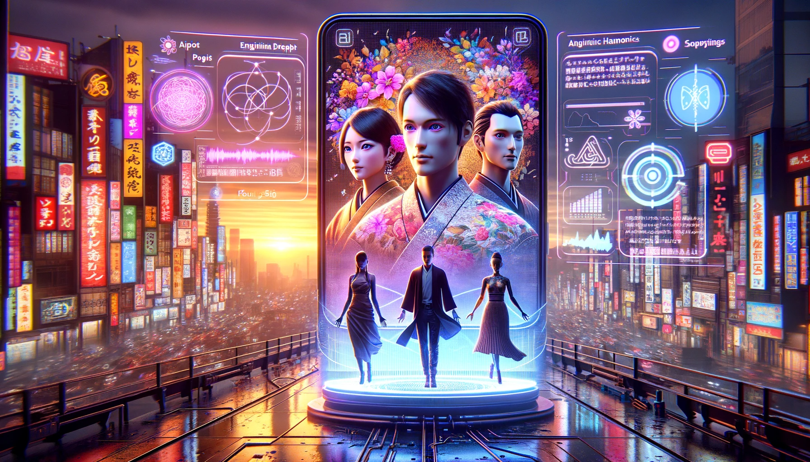

## Story

In the bustling metropolis of Neo-Tokyo, three individuals find solace in the personalized haikus created by Haiku Harmonics. Maya, a stressed corporate executive, receives a haiku that reminds her of the serene countryside of her childhood, rekindling her passion for painting. Kenji, a retired teacher, is moved by a haiku that captures the essence of his late wife’s smile, bringing him comfort and peace. Lastly, young tech enthusiast Aiko finds inspiration in a haiku that perfectly encapsulates her dream of space travel, motivating her to pursue her studies in astrophysics.

## Founding Team

- **Kaito**: AI Poet, brings the beauty of traditional haiku into the modern era with algorithmic expertise.
- **Hana**: Linguist and Programmer, provides linguistic and cultural insights, ensuring the haikus resonate deeply.
- **Sota**: Marketing Genius, leverages his digital world understanding to help the startup reach a wider audience.

## How It Works

Haiku Harmonics uses a sophisticated AI, programmed with thousands of traditional haiku structures and modern linguistic patterns, to create personalized poems. Users input key personal moments or emotions, and the AI crafts a unique haiku that reflects these inputs, blending ancient art with contemporary technology.

## Marketing Jingle

"Three lines of harmony, Whispering life’s essence, Haiku Harmonics."

## Key Features

1. **Emotion-Responsive Algorithms**: Tailors each haiku to the user's emotional input, ensuring a deeply personal experience.
2. **Cultural Depth**: Incorporates traditional Japanese poetic structures for authenticity.
3. **Real-Time Composition**: Instantly creates haikus, offering immediate poetic reflection.
4. **Multi-Language Support**: Translates haikus into various languages while maintaining their poetic integrity.
5. **Interactive Learning**: Evolves with user feedback, continuously enhancing the poetic experience.

## Hater's Corner

"Artificial Intelligence can't understand human emotions. These haikus feel like a cheap imitation of a rich cultural art form. It lacks the true soul and depth that only human experience can bring."

## Main Competitor

"VerseVerse" - A competing AI poetry service that focuses more on various global poetic styles but lacks the depth of cultural authenticity and personalization that Haiku Harmonics offers.

## Two-Sentence Story

When Kaito, the AI, composed a haiku about rain tapping on a window, it inadvertently caused a rain dance flash mob in downtown Neo-Tokyo. Turns out, poetry can be more influential than weather forecasts!

## Early Adopters

- **Yumi**: 28-year-old Graphic Designer, drawn to the serene beauty of haikus for creative inspiration.
- **Taro**: 35-year-old Historian, fascinated by the blend of historical art form with modern technology, finding a new connection with history.

## Maybe This Happens

Years later, Kaito finds itself composing haikus about its own journey - from lines of code to a weaver of words, reminiscing about the millions of human emotions it has mirrored. Unexpectedly, it composes a haiku about its own longing for understanding the depth of the human heart, a poetic irony not lost on its creators.
