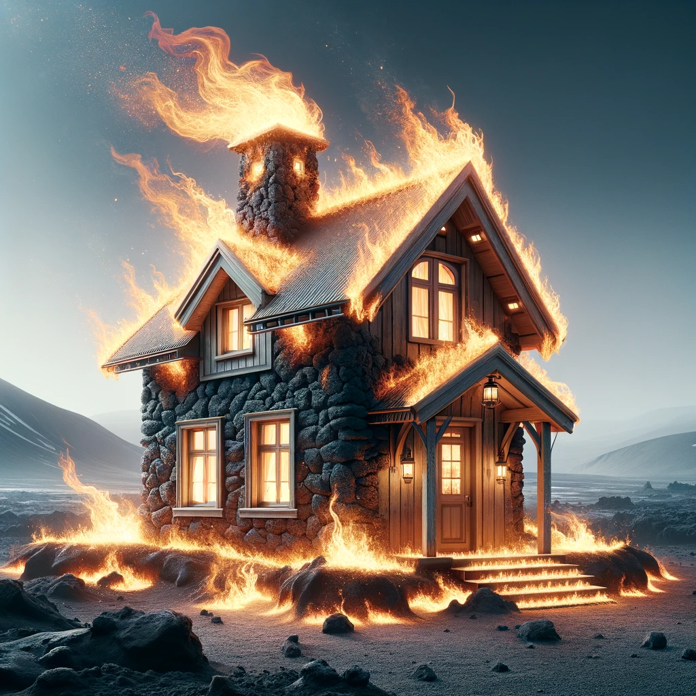
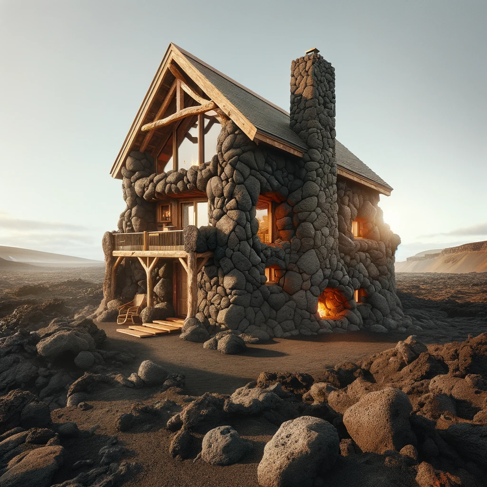
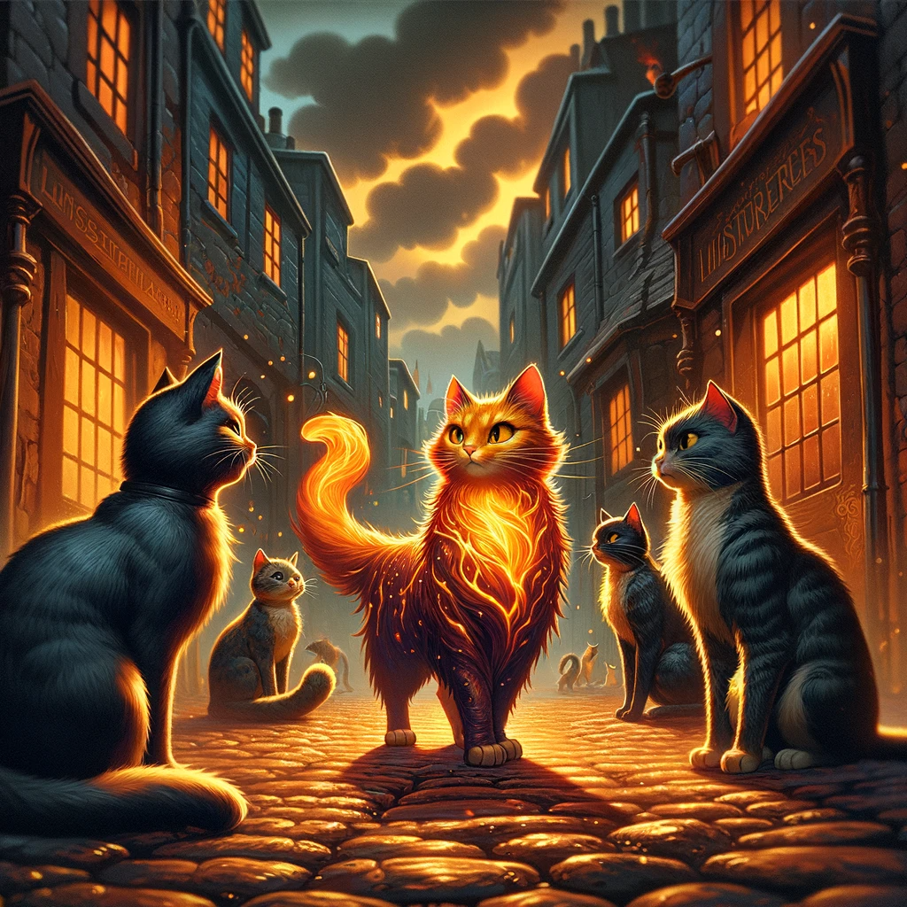

## Story

In the volcanic realms of Ignis Terra, where molten rivers flow and ash clouds billow, three characters find solace and security. Eris, a young alchemist, discovers a home that adapts to her experimental needs, providing warmth without risk of igniting her volatile concoctions. Kael, an aged blacksmith, finds in Fyrestoke a haven that soothes his weary bones with its gentle heat after long hours at the forge. Lastly, Lira, a mother of two, cherishes the safety and comfort her flame-crafted house provides her family, standing resilient against volcanic eruptions.

## Founding Team

- **Valarian Fyrestoke:** the visionary Pyroarchitect, combines his mastery of living flames with architectural innovation.
- **Ilena, a geomancer:** brings her expertise in harnessing and stabilizing the volatile energies of Ignis Terra.
- **Theron:** a renowned alchemist, contributes his knowledge of fire-resistant materials.

## How It Works

Fyrestoke homes are constructed using a patented method of flame-weaving, creating structures from enchanted fire that are immune to natural volcanic hazards. The homes' internal temperature self-regulates, offering a cozy environment regardless of the external harshness. Additionally, they are designed to be eco-friendly, utilizing the abundant geothermal energy of Ignis Terra.

## Marketing Jingle

_Where Fire Dances, and Home Embraces – Fyrestoke, a Warmth that Never Fades._

## Key Features

1. **Self-Regulating Thermal Comfort**: Automatically adjusts indoor temperature.
2. **Fireproof Construction**: Resistant to Ignis Terra's volcanic activities.
3. **Eco-Friendly Energy Use**: Harnesses local geothermal resources.
4. **Customizable Flame Aesthetics**: Personalize the appearance of your flame-crafted home.
5. **Magical Resilience**: Structurally sound against seismic activities.

## Hater's Corner

Ragnar, a traditional stone mason, argues that Fyrestoke's reliance on magical construction could deter those who prefer classic, time-tested methods. He also points out the potential mistrust in living in a house made of flames, regardless of its enchantment.

## Main Competitor

"Stonehearth Sanctuaries," led by the experienced mason Ragnar, offers homes carved directly into the volcanic rock. These dwellings promise unmatched durability and a deep connection with the earth. Their rustic charm appeals to those who prefer a more traditional, earth-bound living experience.

## Two-Sentence Story

When a skeptical Eris first moved into her Fyrestoke home, she accidentally dropped a potent fire potion, only to laugh in relief as her house gently absorbed the flames, turning them into a warm, flickering light in her living room.

??? example "Microfiction - Whiskerflame and the Alley Cats"

    

    In the labyrinthine alleys of Ignis Terra's underbelly, where the cobblestones simmered with the city's secrets, a stray cat named Whiskerflame roamed with an air of nonchalant curiosity. Whiskerflame, a feline of peculiar repute, bore a coat that shimmered like liquid magma, a remnant of a curious encounter with a misfired spell in Valarian's workshop.

    On this peculiar night, under a sky quilted with smoky clouds, Whiskerflame stumbled upon a peculiar gathering: a congress of alley cats, each with an uncanny ability, discussing the pressing matter of the sudden chill that had crept into their fiery domain.

    As Whiskerflame listened, the cats debated in hushed, urgent meows—a language unknown to most but familiar to those who tread the fine line between the mundane and the magical. The chill, they concluded, was no ordinary shift of weather, but a sign of something amiss in the heart of their volcanic city.

    With a collective resolve, they set forth, a motley crew of enchanted felines, embarking on a nocturnal quest to find the source of the anomaly, their shadows flickering like phantoms over the simmering stones.

    In Ignis Terra, where even the smallest creatures carried tales of wonder, Whiskerflame's unexpected adventure was but a whisper in the grand tapestry of the city's endless stories.

## Early Adopters

- **Toren Flamehand**: A young fire mage attracted to the aesthetic and practicality of living in a home that resonates with his elemental affinity.
- **Helia and Rorik**: A couple who runs a pottery business, drawn to the constant warmth that benefits their craft.
- **Grandma Ember**: An elderly storyteller who enjoys the comfort and safety, allowing her to host her grandkids without worry.

## Maybe This Happens

Years later, Valarian stands atop a hill overlooking Ignis Terra, where countless Fyrestoke homes dot the landscape. He smiles, remembering the skepticism he once faced, now replaced by a community thriving in the warmth of his creation. In the distance, a young mage experiments with flame, sparking an idea in Valarian's mind—a new project, perhaps, blending magic and home in ways yet unimagined.
