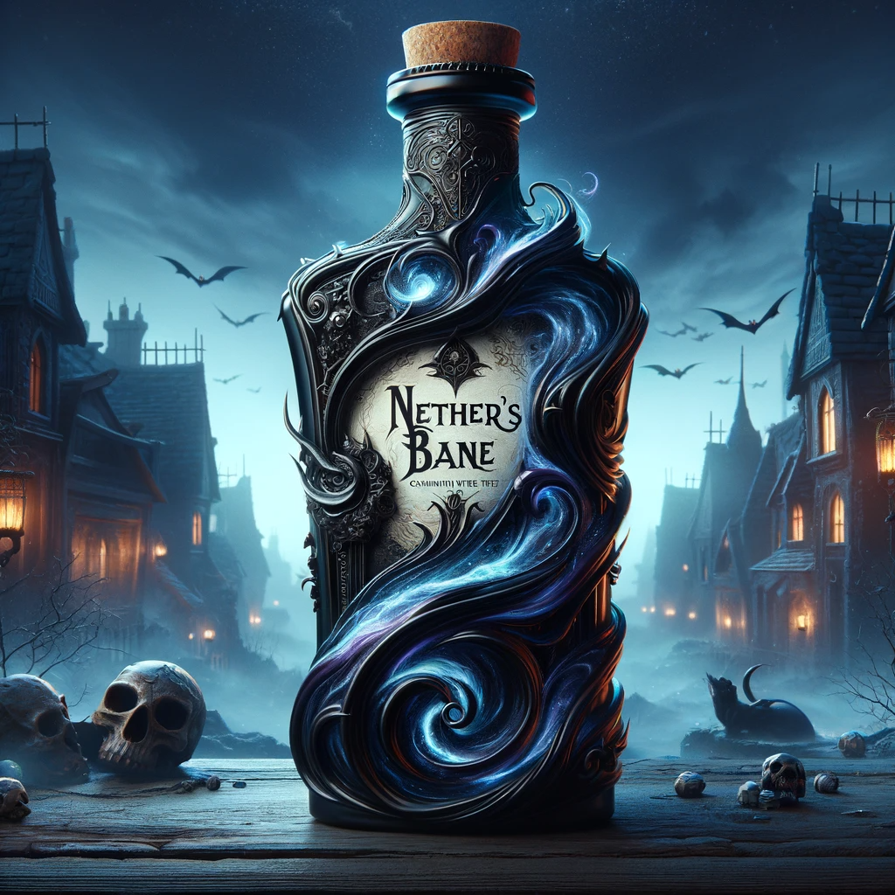
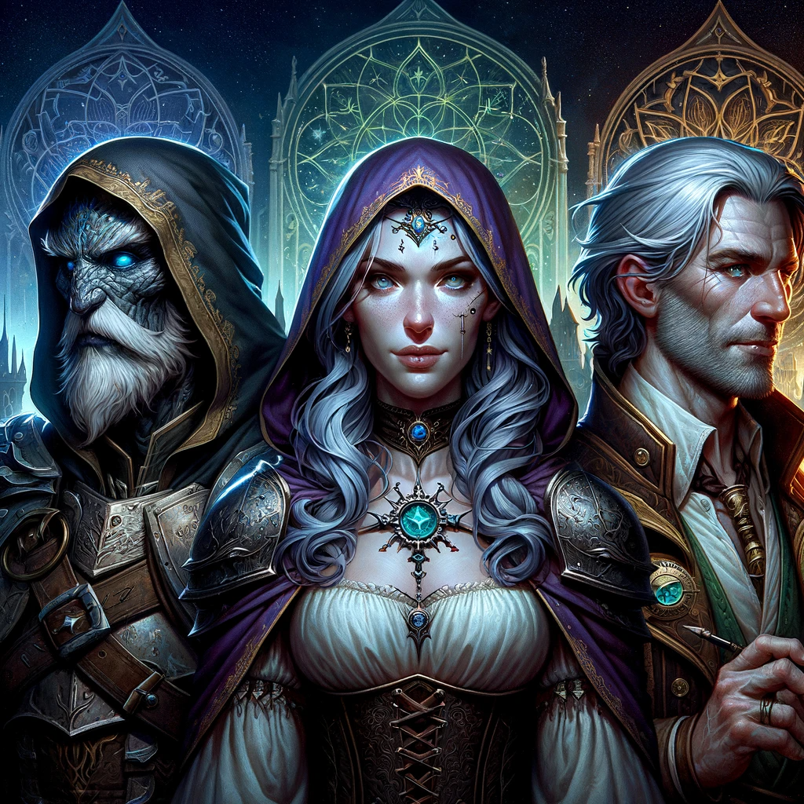
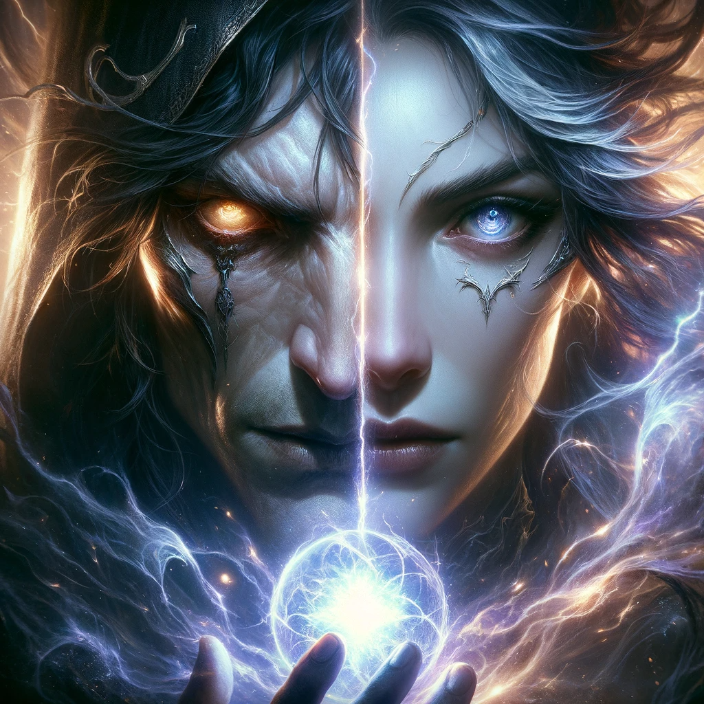
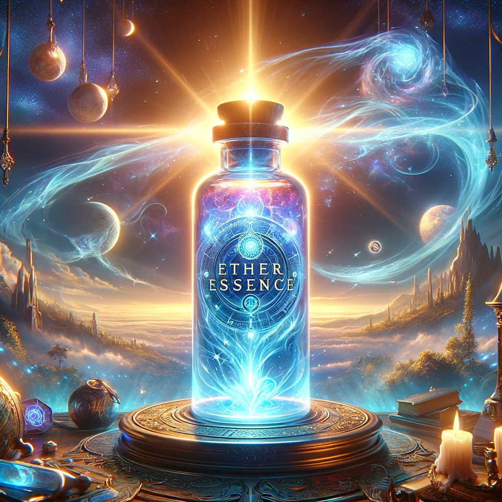

## Story

In a village cloaked in eternal dusk, three tormented souls discover Nether's Bane. Maribel, a healer haunted by those she couldn't save, finds each sip brings back their spectral presences, offering her both solace and sorrow. Orrin, once a jovial bard, now channels the anguish of lost souls into his music, creating melodies that are beautifully heartbreaking yet curse him with unending melancholy. Thalia, a scholar obsessed with the afterlife, drinks the brew to converse with the departed, but the voices she hears are filled with laments and regrets, trapping her in a cycle of never-ending grief. Nether's Bane, with its monkey's paw allure, binds them to the sorrows of the afterlife, a poignant reminder that some mysteries are better left untouched.

## Founding Team

- **Quorin the Bleakcraft**: His connection to the abyss inspired the creation of the elixir, but he remains tormented by the unintended consequences.
- **Alia of the Wind**: An alchemist whose skills bridge the living and the dead, now wrestling with the moral implications of her craft.
- **Joran the Chronicler**: A historian who sought to document the unknown, now burdened by the truths unveiled.

## How It Works

Nether's Bane is an elixir infused with the essence of the abyss. It allows drinkers to experience the presence and whispers of the dead. This connection, however, comes at a cost, imparting the drinker with the burdens and sorrows of those they commune with.

## Marketing Jingle

"Drink in the past, bear its weight, Nether's Bane, seals your fate."

## Key Features

1. **Spectral Communion**: Connects drinkers with the spirits of the departed.
2. **Emotional Echo**: Each sip brings a surge of the dead's unresolved emotions.
3. **Haunting Aroma**: An otherworldly scent, reminiscent of forgotten places and times.
4. **Bittersweet Taste**: A flavor that mirrors the complexity of life and the afterlife.

## Hater's Corner

"Inviting the dead into your life with every gulp? It's a curse in a bottle. No one should bear the weight of souls long gone. This brew is more a bane than a blessing."

??? example "Boss Battle"

    

    **Quorin**: "Lysandra, your Ether Essence? It's a joke. You're selling dreams, not reality."

    **Lysandra**: "Oh, and your Nether's Bane is better, Quorin? Drowning people in old sorrows instead of giving them a glimmer of hope?"

    **Quorin**: "Hope? You call those fleeting lies hope? My brew shows the hard truth, the real pain. Yours? Just pretty lies."

    **Lysandra**: "So, you think trapping folks in their grief is noble? My potion at least gives them a shot at something new, not just old ghosts."

    **Quorin**: "Grief is truth, Lysandra! Raw and real. Your ‘what ifs’? Fairy tales leading folks nowhere."

    **Lysandra**: "At least they get a choice, a chance. Your bitter brew? It's just a dead-end street of regrets. How’s that for help?"

    **Quorin**: "It's about facing the past, understanding it! Something your fleeting daydreams can't touch."

    **Lysandra**: "‘Deep’? Please. You're wallowing in death. It's a sick fascination, Quorin."

    **Quorin**: "And your prophecies? A wild goose chase, nothing more. Scared of facing reality, are you?"

    **Lysandra**: "Scared? No, Quorin, I deal with the real world, one that moves on, not one stuck in the past like you."

    **Quorin**: "And you? Peddling daydreams! My reality, tough as it is, sticks around when the sun's up!"

    **Lysandra**: "Keep lurking in those shadows, Quorin. I'll chase the light, even if it’s a gamble. Time will tell whose path is right."

    **Quorin**: "Yeah, we'll see, Lysandra. We'll see."

## Main Competitor

**Ether Essence**: A rival potion offering glimpses of possible futures. Crafted by Lysandra the Alchemist of the East, its luminescent formula promises insight but often leaves users with more questions than answers. Unlike Nether's Bane, it focuses on what could be, rather than what has been, presenting a lighter, though equally deceptive, allure.

## Two-Sentence Story

At the local tavern, Orrin played a tune after drinking Nether's Bane, and the audience wept uncontrollably, overwhelmed by the melancholy of his music. The tavern now stands empty, haunted by the echoes of Orrin's cursed melodies.

## Early Adopters

1. **Gideon the Wanderer**: Seeks the company of lost loved ones but is slowly consumed by their sadness.
2. **Selena the Mystic**: Desires knowledge from beyond but becomes ensnared in the sorrows she uncovers.
3. **Darius the Skeptic**: Initially doubtful, he now is haunted by the voices of the past, a believer burdened with regret.

## Maybe This Happens

Decades later, Quorin stands alone, gazing into the abyss. His creation, meant to bridge worlds, has instead deepened the chasm between them. Reflecting on the unintended anguish Nether's Bane has caused, he contemplates the fragile balance between curiosity and the sanctity of the afterlife.
