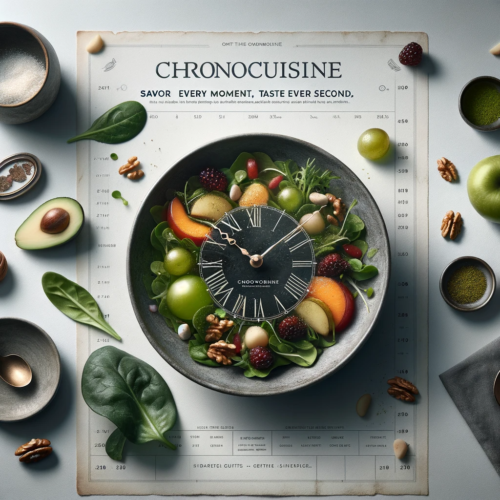

## Story

In the heart of a bustling interstellar spaceport, Zylar, a member of the Fringe community, faces the challenge of aligning meals with their unique perception of time. Traditional cooking fails to capture time as an ingredient, a gap filled by ChronoCuisine – offering dishes that resonate with the Fringe's temporal dimensions.

## Founding Team

- **Vela**: Fringe culinary artist, expert in time-flavored cuisine.
- **Roon**: Physicist-chef, skilled in temporal cooking techniques.
- **Tyra**: Strategist with a knack for tapping into niche markets.

## How it Works

ChronoCuisine uses temporal modulators to infuse dishes with 'time flavors,' altering cooking speed to intertwine different time perceptions. This technique enhances both taste and nutritional value, tailored for the Fringe's sensory needs.

## Marketing Jingle

_"ChronoCuisine: Savor Every Moment, Taste Every Second."_

## Key Features

- **Time-Modulated Cooking Techniques**: Creating unique sensory experiences.
- **Customizable Meal Plans**: Catering to diverse time perception needs.
- **Nutrient-Rich, Flavorful Dishes**: Aligned with temporal sensations.
- **Inclusive Menu Options**: For various interstellar species.
- **Experiential Dining**: Offering more than a meal, a journey through time.

??? example "Recipe for Temporal Tides Salad"

    Temporal Tides Salad is a ChronoCuisine specialty, perfect for a unique lunch experience. It's a harmonious blend of crisp, fresh ingredients and a time-infused dressing, designed to align with the diverse temporal perceptions of diners.

    When the time-infused dressing is added to the salad, it creates a unique taste experience that's a bit like a flavor rollercoaster:

    **Slow Unfolding Flavors**: Initially, you might taste the dressing as if it's slowly unfolding in your mouth. Imagine the sensation of a flavor gently blooming, like watching a flower open in fast-forward. The vinegar and honey in the dressing don't just hit your taste buds all at once; they gradually reveal their tanginess and sweetness.

    **Quick Bursts of Freshness**: Then, suddenly, there's a quick burst of freshness from the greens and fruits. It's as if you're experiencing the rapid growth of plants in a time-lapse video. This brings an unexpected, refreshing zing, making the greens taste crisper and the fruits juicier.

    **Prolonged Richness**: The cheese and nuts might give you a prolonged, rich flavor. Imagine the taste lingering in your mouth, giving you more time to savor the creamy, nutty notes. It's like stretching out a moment of deliciousness, allowing you to appreciate the depth of these flavors fully.

    **Harmonious Blend**: All these flavors come together in a harmonious blend, but instead of experiencing them all at once in a regular salad, the time manipulation creates a sequence of taste sensations. It's like listening to a symphony, where each instrument plays its part at just the right moment, creating a beautiful piece of music.

    So, eating this salad isn't just about enjoying a mix of flavors; it's about experiencing each ingredient in a new and exciting way, as if time itself is adding an extra layer of deliciousness to your meal! 🕰️🥗✨

## Hater's Corner

Critics say ChronoCuisine's concept is gimmicky, arguing that food should focus on quality and skill, not time manipulation, labeling it as a transient novelty.

## Main Competitor

**EonEats**: Offers 'instant' meals using accelerated cooking technology. Practical but lacking the immersive experience of ChronoCuisine.

## Two-Sentence Story

At the Galactic Culinary Summit, ChronoCuisine's 'Temporal Tiramisu' unexpectedly united diverse alien taste buds in a shared temporal moment, sparking excitement and acclaim as the next culinary trend.

## Early Adopters

- **Mika**: A Fringe historian seeking historical moments through food.
- **Garan**: An interstellar trader in search of unique dining experiences.
- **Liria**: A neuroscientist exploring the impact of time perception on the senses, intrigued by ChronoCuisine's potential.
