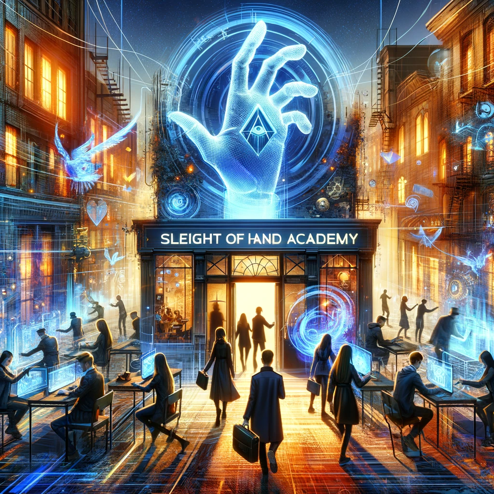

## Story

In the bustling alleys of New Arcadia, three young outcasts, Jax, Luna, and Milo, find their paths crossing at the Sleight of Hand Academy. Jax, a street performer, uses his new skills to escape the clutches of the city guards. Luna, once a struggling artist, now crafts illusions with her hands, mesmerizing audiences. Milo, the shy bookworm, finds confidence in his newfound dexterity, evading the scrutiny of the ever-watchful market enforcers.

## Founding Team

- **Moxie:** A master pickpocket with a heart of gold, leading with charm and a mischievous grin.
- **Rex:** A retired thief-turned-teacher, bringing decades of experience in stealth and strategy.
- **Zara:** A tech whiz, creating gadgets and tools for the modern-day pickpocket.
- **Eve:** A former street magician, specializing in distraction and illusion.

## How It Works

The academy offers courses in pickpocketing techniques, blending traditional sleight of hand with modern stealth technology. Students learn through interactive holographic simulations, real-world exercises, and lectures on the psychology of distraction.

## Marketing Jingle

"Quick hands, quick minds, escape the binds, at Sleight of Hand Academy!"

## Key Features

1. **Holographic Training Modules:** Lifelike simulations to practice in a risk-free environment.
2. **Customized Stealth Gear:** Tailored gadgets and clothing for seamless thievery.
3. **Psychological Manipulation Classes:** Understanding and exploiting human behavior.
4. **Real-World Application Tests:** Safely orchestrated pickpocketing scenarios in controlled settings.
5. **Network of Alumni:** A supportive community for job opportunities and mentorship.

## Hater's Corner

"A pickpocketing school? It's just glamorizing crime! Real jobs don't involve stealing wallets. What's next, a burglary bachelor's degree?"

## Main Competitor

"Shadow's Grasp" - A rival school that focuses on high-tech thievery, using advanced gadgets and cyber-tools. They claim a more 'modern' approach, appealing to those who prefer technology over traditional methods.

## Two-Sentence Story

When Moxie demonstrated the 'invisible wallet lift' during an open house, Mayor Johnson’s wallet somehow ended up on the academy's trophy shelf. The Mayor still can't figure out if he should be angry or impressed.

## Early Adopters

- **"Sneaky Pete"**: A small-time crook looking to refine his skills.
- **"Illusionist Izzy"**: A street magician seeking to add pickpocketing to her act.
- **"Nimble Nicky"**: A young runaway looking for a way to survive in the city.

## Maybe This Happens

Years later, Moxie, now a renowned figure in the underworld, quietly visits the academy. She smiles at the new generation, their hands as quick as whispers, and leaves a mysterious, unstealable coin on the doorstep – her legacy.
