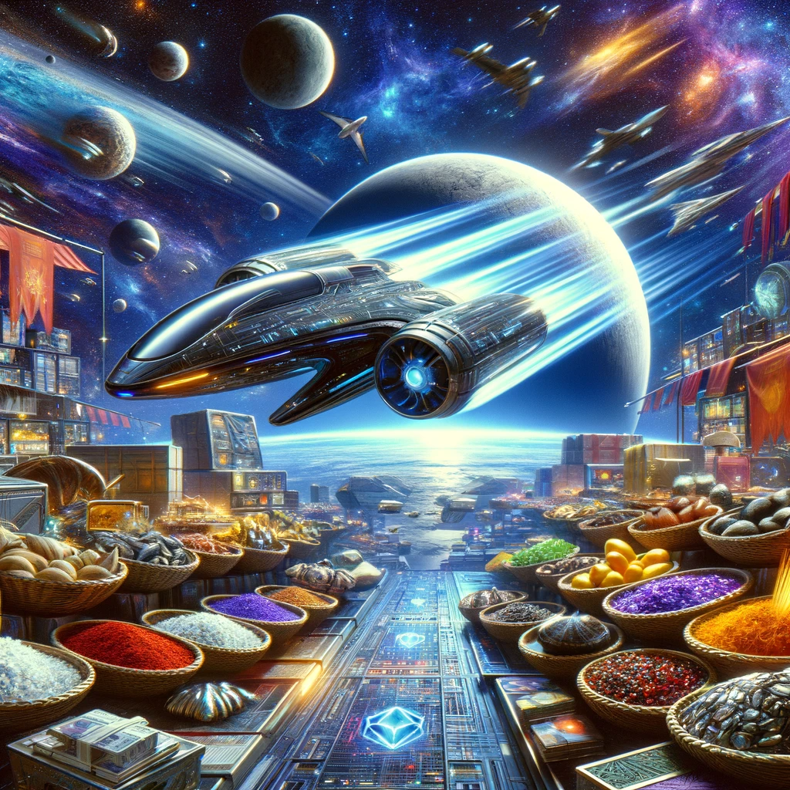
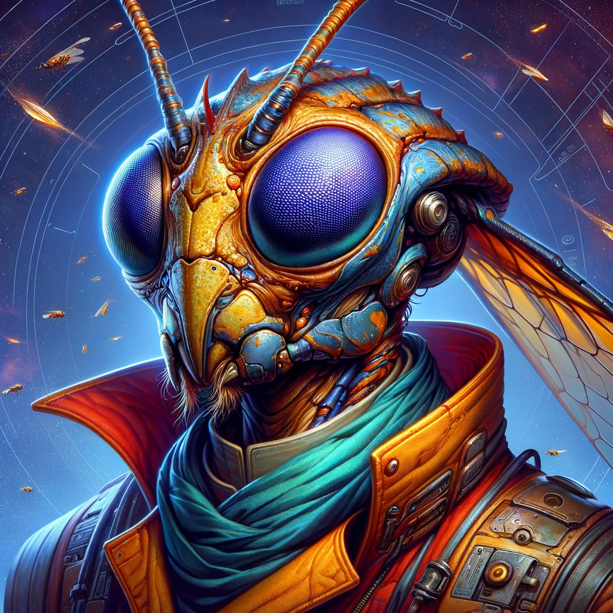
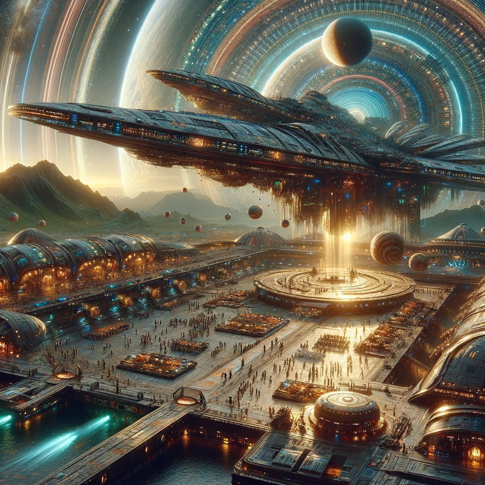
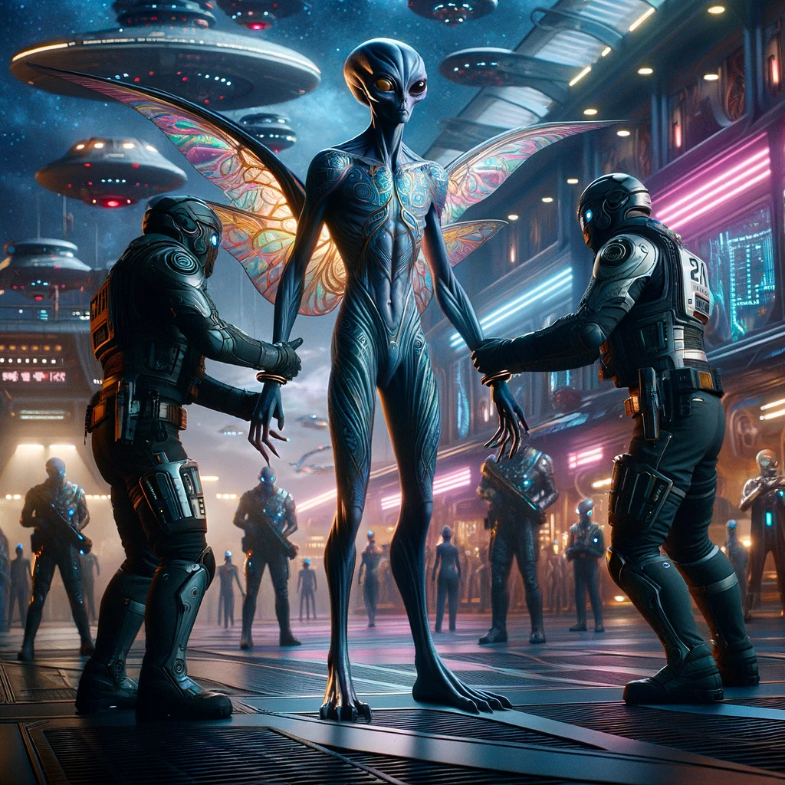

## Story

In the bustling trade hubs of Jorvax Prime, Grixel's SwiftTrade became a lifeline for three diverse characters: Tarna, a jewel-crafter seeking rare gemstones; Mivik, a chef in need of exotic spices; and Zoel, an engineer hunting for unique alloys. Each found SwiftTrade's rapid sourcing and delivery of these rarities not only boosted their trades but also brought new wonders to their worlds, changing their businesses and lives dramatically.

## Founding Team

- **Grixel**: The agile insectoid trader, whose keen eye for value and swift movements drive the business's core operations.
- **Varnex**: A seasoned navigator, expert in interstellar charting, ensuring efficient and safe transport routes.
- **Lunara**: A communication specialist, adept in multiple galactic languages, crucial for negotiating deals across cultures.

## How It Works

SwiftTrade utilizes advanced quantum computing for real-time market analysis, combined with Grixel's natural agility and Varnex's navigation skills, to identify and procure rare commodities swiftly. Lunara's communicative prowess then facilitates cross-cultural trade, ensuring a smooth transaction process.

## Marketing Jingle

"Across the stars, trade with ease; SwiftTrade, the galactic breeze!"

## Key Features

1. **Quantum Market Analysis**: Instantly scans intergalactic markets for rare items.
2. **Cultural Communication Protocol**: Ensures smooth interactions with diverse alien cultures.
3. **Rapid Transport Fleet**: Employs cutting-edge spacecraft for swift deliveries.
4. **Real-Time Tracking Interface**: Clients can track their orders across the stars.
5. **Customized Procurement Service**: Tailored sourcing for clients' unique needs.

## Hater's Corner

"Bah, SwiftTrade's too fast for their own good. They're missing out on the subtleties of the local markets. They'll never understand the true value of taking it slow and savoring the art of the deal," grumbles a traditional Xarthian merchant.

## 💲 Main Competitor 💲

**Cosmic Caravan**: A renowned interstellar trading company, known for its extensive network and established reputation. They challenge SwiftTrade with their deep-rooted connections and traditional approach to intergalactic commerce.

??? example "Caught Red Handed"

    **For Immediate Release**

    **Title:** Cosmic Caravan's Stunning Fall from Grace: Founder Arrested in Galactic Fraud Scandal

    **Date:** 21/01/2024

    

    In a shocking turn of events that has sent ripples across the interstellar trading community, the founder of the renowned Cosmic Caravan has been arrested in a major fraud scandal. The arrest occurred at a bustling spaceport, witnessed by a multitude of intergalactic bystanders.

    For years, Cosmic Caravan has been a titan in the world of interstellar commerce, known for its extensive network and traditional approach to galactic trade. However, recent investigations by a team of forensic accountants have unveiled a staggering financial deception. The company has been accused of inflating profits by trillions of dollars, deceitfully manipulating its financial records in what appears to be one of the largest frauds in galactic history.

    This revelation has not only tarnished the reputation of Cosmic Caravan but also raised serious questions about regulatory oversight in interstellar trade practices. The authorities acted swiftly, apprehending the company's elusive and non-humanoid founder amidst the daily hustle of the spaceport. The image of the founder, a sophisticated figure known for its iridescent wings and glowing eyes, being restrained by law enforcement officers marks a significant moment in galactic justice.

    As the legal proceedings unfold, this scandal promises to be a cautionary tale about the perils of unchecked corporate power and the importance of transparency in the increasingly complex world of interstellar commerce.

    For further information and continuous updates on this developing story, stay tuned to our galactic news feed.

    [Cargo List](assets/22.xlsx)

    [Fraud Analysis](assets/22a.xlsx)

## Two-Sentence Story

During a routine delivery, Grixel accidentally swapped a crate of fiery Baluvian chilli peppers with serene Zenonian meditation crystals. The result? The spiciest meditation session in the galaxy, and a surprisingly fiery culinary experiment!

## Early Adopters

- **Jazmin**: A collector of interstellar artifacts, drawn to SwiftTrade for its ability to find the rarest items.
- **Rax**: A high-tech inventor, always in search of unique materials for his next creation.
- **Eliara**: A botanist specializing in alien flora, attracted by SwiftTrade's access to obscure planetary ecosystems.

## Maybe This Happens

Years later, Grixel finds himself on a quiet planet, reminiscing about the wild interstellar adventures. Staring at the stars, he chuckles at the memory of the 'spicy meditation' incident, a small, unexpected twist in a journey filled with extraordinary trade tales.
