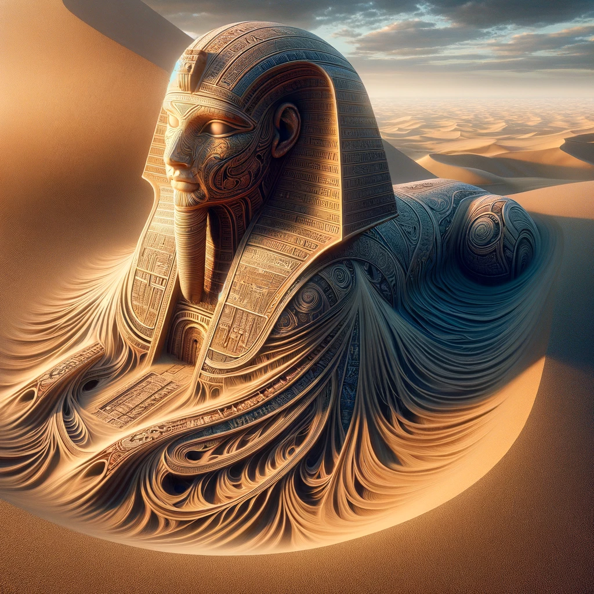
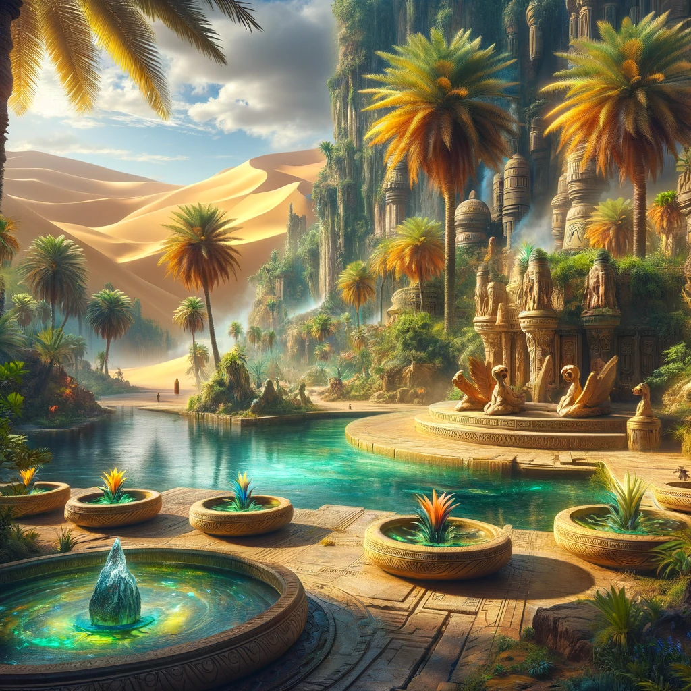
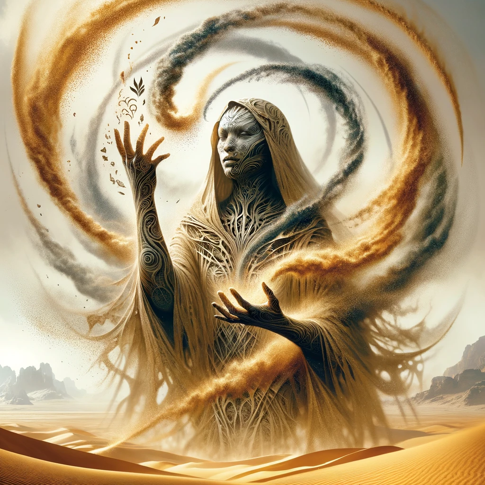
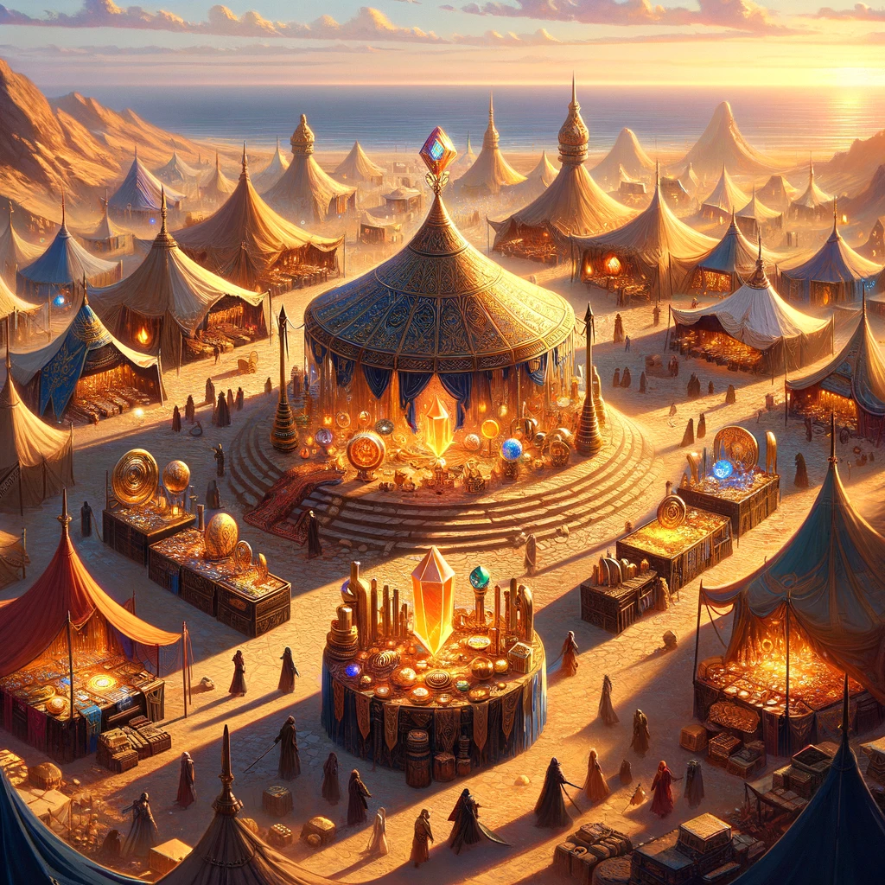
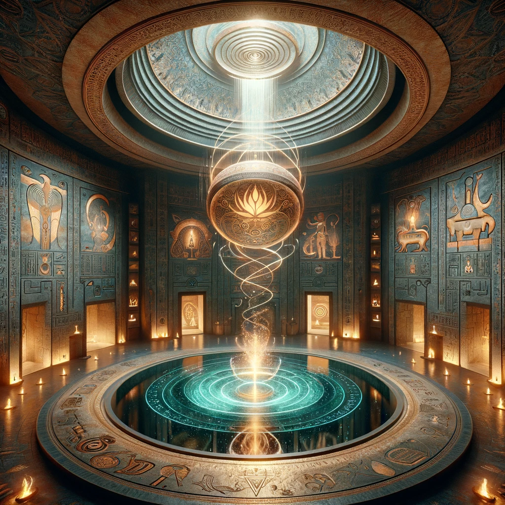

??? example "🪞 Mirrored Story 🪞"

    This is a mirrored story. It takes the base story and product idea from [Wisdom Keeper](25.md) with an additional prompt to convert it into a science fiction and fantasy setting.

## Story

In the shifting dunes near the Oasis of Khet, three Seshatian clans—led by their respective Sages of Sands, Anuket, Seker, and Nefer—stumble upon an ancient vault buried beneath the sands, shaped in the likeness of a grand Seshatian Sphinx. This vault, inspired by their own physiology and the sacred Nebu Leaf, promises prosperity and knowledge but requires unity and wisdom to unlock its secrets. Anuket, with her unparalleled skill in sand manipulation, seeks to harden the sand into keys. Seker, a master of illusions, proposes creating mirages to mislead potential thieves, while Nefer suggests using Sand Memory to uncover the vault's past and its true purpose. Their journey becomes a testament to their society's values: adaptation, cooperation, and the guarding of sacred secrets.

## Founding Team

- **Anuket**: A Sage of Sands known for her innovative use of sand-based technology, Anuket brings her deep understanding of the desert's magic and mechanics to the project, envisioning the Seshatian Vault as a beacon of prosperity.
- **Seker**: With his expertise in illusions and defensive magic, Seker focuses on protecting the vault and its contents from unwelcome intruders, ensuring that only the worthy can access its treasures.
- **Nefer**: A historian and master of Sand Memory, Nefer contributes by embedding the vault with the ability to record and share the collective memories of their people, making it a living repository of Seshatian culture and history.

## How It Works

The Seshatian Vault utilizes advanced desert magic and technology, blending seamlessly with the surrounding sands. Its locking mechanism requires a harmonious application of sand manipulation, illusion magic, and Sand Memory, ensuring that only Seshatians can access it. Inside, compartments made of hardened sandstone preserve valuable items and knowledge, each infused with Nebu Leaf extracts to maintain their condition and imbue them with magical properties. The vault also serves as a communal hub for the Seshatians, a place where clans can share resources, wisdom, and memories.

## Marketing Jingle

"In sands we trust, in secrets we thrive, the Seshatian Vault, where our fortunes revive."

## Key Features

- **Adaptive Architecture**: The vault's form can change, mirroring the Seshatians' ability to shape-shift, making it an evolving structure that reflects the needs and desires of its people.
- **Illusionary Defenses**: Utilizes Seker's illusion magic for protection, creating bewildering mirages that deter thieves and protect the vault's secrets.
- **Memory Chamber**: A central chamber where Seshatians can use Sand Memory to store and revisit the collective experiences of their race, preserving their history and wisdom for future generations.
- **Nebu Leaf Sanctum**: A sacred room that grows Nebu Leaf, providing a spiritual and physical heart to the vault, symbolizing the life-giving essence of their oasis.

## Hater's Corner

"Sure, the vault embodies our traditions and skills, but isn't its existence a beacon for those who would exploit us? And relying so heavily on our unique abilities might exclude valuable wisdom from the outside world. Could this isolationism be our downfall?"

## Main Competitor

**Mirage Traders**: A nomadic group skilled in creating powerful illusions to sell false visions of wealth and prosperity. They challenge the Seshatian Vault by tempting Seshatians away from their heritage and toward fleeting, illusory gains, undermining the value of true knowledge and unity.

## Two-Sentence Story

As Nefer attempted to embed a particularly tricky memory into the vault, the sands shifted unexpectedly, creating a perfect replica of the Oasis of Khet within the chamber. "Looks like the vault has a sense of humor," chuckled Anuket, as Seker's illusionary oasis mirage danced in agreement outside.

## Early Adopters

- **Khepri**: A young Seshatian with a keen interest in the preservation of their culture, drawn to the vault's ability to hold the collective memories of their people.
- **Merti**: An artisan specializing in sandstone carvings, intrigued by the vault's adaptive architecture and potential for showcasing Seshatian art.
- **Renen**: A scout who travels the desert's fringes, interested in the vault's defensive illusions as a means to protect Seshatian enclaves from external threats.

## Maybe This Happens

Decades later, as Anuket, Seker, and Nefer gather beneath the starlit sky of the Oasis of Khet, they share tales of the vault's influence on their society. It has become a legend, a symbol of unity and strength. As they scatter Nebu Leaves into the evening breeze, a young Seshatian approaches, her sand patterns swirling with excitement. She speaks of a vision, a new chamber emerging within the vault, one that promises to bridge their world with realms beyond the desert's edge.
