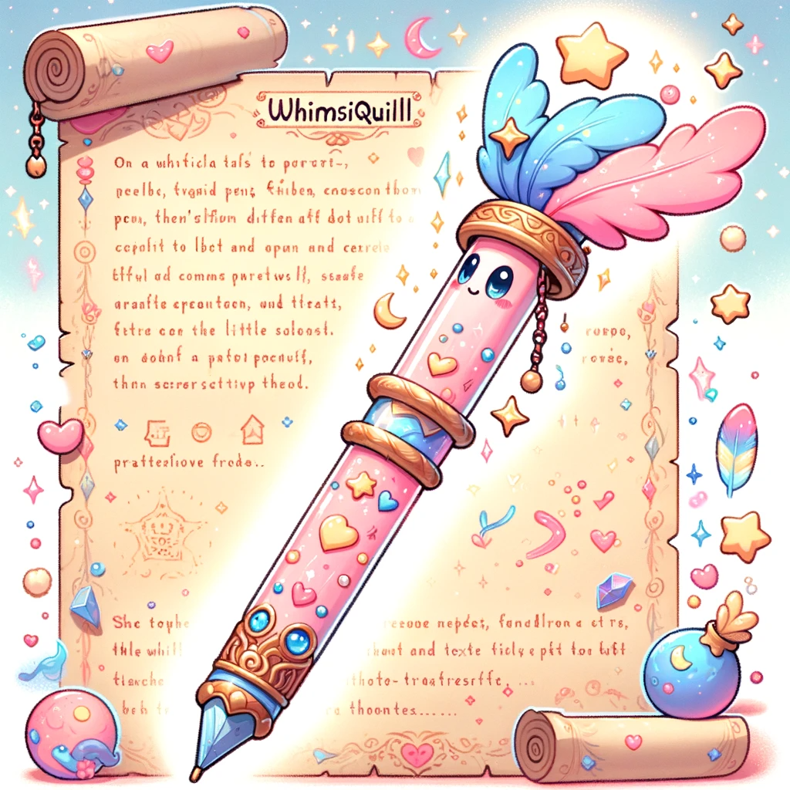

**Story:**
Amidst the bustling trade district of Eldoria, a scribe named Elyra struggles with her fading eyesight, a common ailment among the city's chroniclers. The dim candlelight and ancient texts strain her vision, threatening her livelihood. Enter WhimsiQuill: a magical pen that transcribes thoughts directly onto parchment. This innovation not only revitalizes Elyra's career but also brings a new wave of storytelling to life, as she effortlessly weaves tales of Eldorian lore with renewed vigor.

**Founding Team:**

1. **Caden the Tinkerer:** A former blacksmith with a penchant for mystical metallurgy, he crafts the core structure of WhimsiQuill pens.
2. **Liora the Enchantress:** Specializing in minor enchantments, Liora imbues each WhimsiQuill with the ability to capture and transcribe thoughts.
3. **Thomlin the Scholar:** With his extensive knowledge of Eldorian history and languages, Thomlin ensures that each pen is culturally and linguistically accurate.

**How it Works:**
WhimsiQuill pens are imbued with a minor thought-capturing enchantment. Users simply hold the pen, focus on their thoughts, and the pen transcribes these onto parchment. Each pen is tailored to its user, adapting to their thinking patterns and writing style. This allows for a seamless transition from thought to written word, perfect for scribes, storytellers, and historians.

**Marketing Jingle:**
"Capture your thoughts, let your stories unfurl, with the magic of WhimsiQuill, the world's your pearl!"

**Key Features:**

1. **Thought-to-Text Transcription:** Transforms thoughts directly into written words.
2. **User Customization:** Adapts to individual writing styles and linguistic preferences.
3. **Cultural Sensitivity:** Each pen is crafted with respect to Eldorian heritage and traditions.

**Hater's Corner:**
"I bought a WhimsiQuill, expecting a revolution, but it's not for everyone. It's tricky to get your thoughts in order, and if you're not careful, it writes down every stray thought. Plus, traditional scribes might find themselves out of work. It's innovative, sure, but it's not replacing my quill and ink anytime soon."

??? example "The Heroes of Eldoria and the Stew Catastrophe"

    In the vibrant markets of Eldoria, a renowned poet named Jorlin sat down to compose an epic ballad about the city's legendary heroes. With the Whimsiquill in hand, he focused on tales of valor and bravery. However, as he pondered his verses, his mind wandered to the previous night's escapades, a hilariously embarrassing incident involving himself, a mischievous cat, and a pot of Eldorian stew.

    *In Eldoria, where heroes stride, A poet's pen began to glide. Tales of valor, brave and wide, But a cat's mischief, he couldn't hide. In his kitchen, a stew did brew, the cat leaped, a chase ensued. Jorlin slipped, a scene ensued, a pot as a hat, comically viewed. "The Heroes of Eldoria," grand and true, Now laced with laughs and stew. Jorlin's mishap, a tale anew, In laughter, the city's spirit flew.*

**Main Competitor:**
In the heart of Eldoria, a rival business, "ChronicleCharm," offers a similar service, but instead of pens, they use enchanted crystals that record oral stories. Their founder, a charismatic bard named Sirion, claims that oral storytelling preserves the emotion and essence of tales better than any written word, posing a significant challenge to WhimsiQuill's market.

**Two Sentence Story:**
When the WhimsiQuill was first used at the Grand Eldorian Library, it accidentally transcribed the librarian's daydream about dancing chickens taking over the city. The ensuing manuscript became an unexpected bestseller.

**Early Adopters:**

1. **Aging Scholars:** Like Elyra, whose eyesight or physical ability to write is diminishing.
2. **Budding Storytellers:** Young enthusiasts eager to record and share their imaginative stories.
3. **Historians:** Who value accurate and efficient transcription of oral histories and ancient texts.
