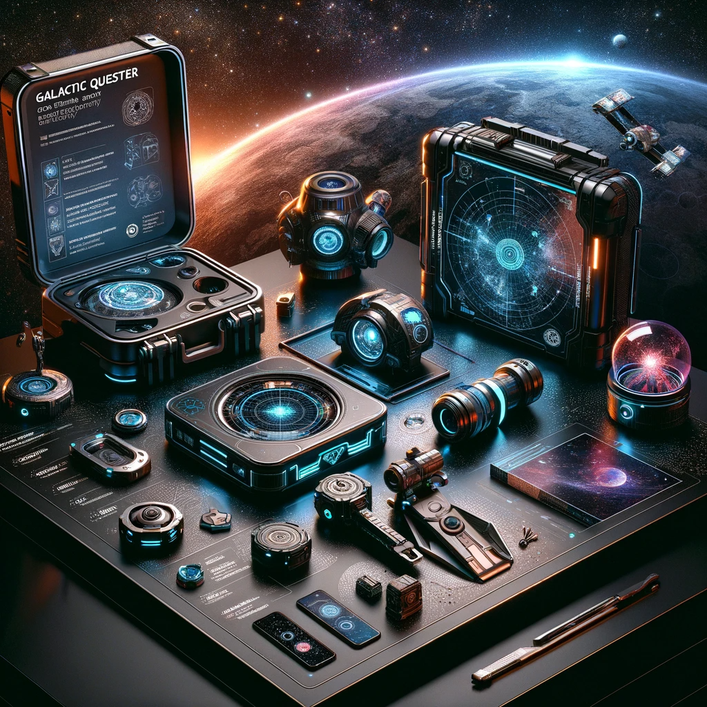

## Story

In the far reaches of the Andromeda Galaxy, three adventurers embark on a journey of a lifetime. Lyla, a young historian passionate about ancient alien civilizations, joins the quest to uncover the lost artifacts of the Zentari Empire. Next is Jax, a retired space marine seeking one last thrill, drawn by the promise of untold riches and perilous adventures. The final member is Elara, a gifted astro-navigator, whose personal mission is to chart undiscovered worlds. Together, they traverse through perilous asteroid fields and face cosmic anomalies, each step bringing them closer to unraveling the galaxy's deepest secrets through "Galactic Questers: The Stellar Treasure Odyssey."

## Founding Team

- **Captain Zara Nova**: The daring space pirate with unrivaled knowledge of hidden treasures and forgotten worlds.
- **Orbit, the AI Navigator**: A highly advanced AI, capable of calculating the safest and most efficient routes through the cosmos.
- **Rex Solaris**: A charismatic negotiator and former diplomat, adept at securing permits and navigating intergalactic politics.
- **T4-LO**: An alien mechanic with a knack for repairing and upgrading spaceships under any circumstances.

## How It Works

"Galactic Questers" offers clients a meticulously planned treasure hunt across the galaxy. Participants board the starship "Nova's Fortune," equipped with advanced navigation and survival gear. Each quest is tailored to the client's preferences, combining historical lore, astrophysical anomalies, and uncharted territories, ensuring an exhilarating and educational experience.

## Marketing Jingle

"Chart the stars, claim your prize, in Galactic Questers' cosmic skies!"

## Key Features

1. **Customized Star Maps**: Personalized routes based on historical data and current cosmic conditions.
2. **Adventure-Ready Gear**: High-tech survival and exploration equipment suited for different planetary environments.
3. **AI-Assisted Exploration**: Advanced AI systems provide real-time data and historical context during the journey.
4. **Intergalactic Diplomacy Support**: Expertise in navigating the political landscapes of various star systems.
5. **Eco-Friendly Spacecraft**: Environmentally conscious technology that respects the cosmic ecosystems.

## Hater's Corner

"I tried 'Galactic Questers' and sure, the views were great, but the risks? They don't tell you about dodging rogue comets or negotiating with temperamental space merchants. It's not for the faint-hearted, or those who prefer their feet on solid ground."

## Main Competitor

"Starborne Sagas," a rival company, offers virtual reality space adventures. While safer and more accessible, their simulated experiences lack the authenticity and adrenaline of real space travel, making "Galactic Questers" the choice for true adventure seekers.

## Two-Sentence Story

During a quest, Captain Nova accidentally activated an ancient alien device, causing her crew to speak in rhymes for 24 hours. It turned out to be the most poetic treasure hunt in the galaxy!

## Early Adopters

- **Sirius Vega**: A renowned galactic archaeologist, attracted to the historical authenticity and exploration aspects.
- **Luna Starwind**: A thrill-seeking influencer, drawn to the adrenaline-fueled adventures and unique photo ops across different worlds.
- **Professor Orion Nightshade**: An esteemed astrophysicist, intrigued by the opportunity to study cosmic phenomena firsthand.
