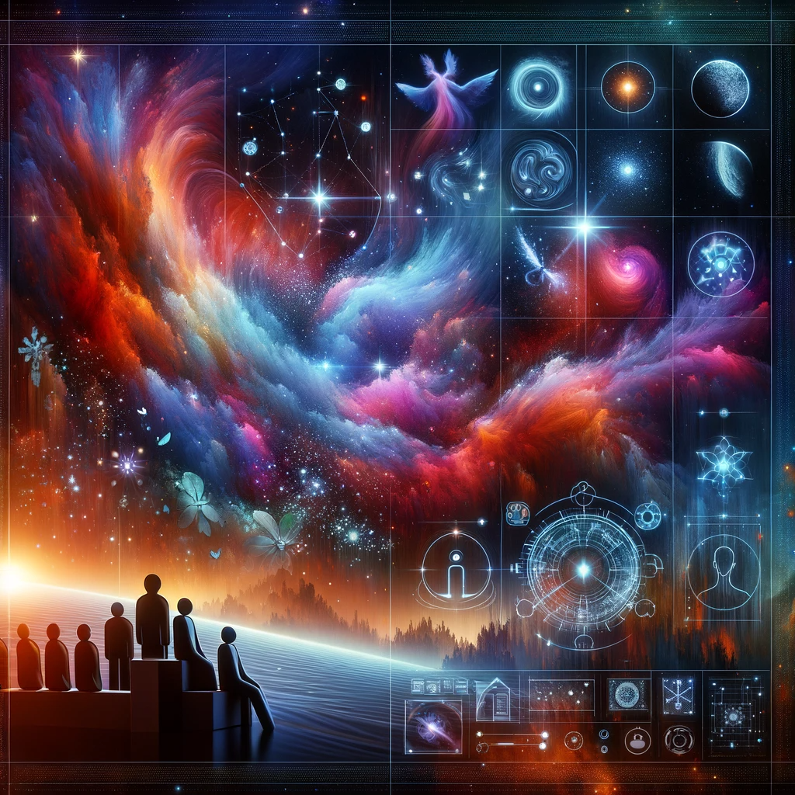

## Story

In a galaxy where starlight is the language of life, Nyx Astra's "Cosmos Canvas" becomes a beacon of expression. On planet Zolara, a young astronomer gazes in awe as her night sky is transformed into a shimmering tapestry of colors, narrating the ancient legends of her people. Elsewhere, a peace treaty is signed under a custom-designed aurora, symbolizing unity and harmony. On a distant space station, a child who has never seen a star up close, watches in wonder as a personal constellation tells their story, lighting up their eyes with dreams.

## Founding Team

- **Nyx Astra**: The visionary sentient nebula, capable of manipulating cosmic energy.
- **Kai Orion**: A human astrophysicist, bridging the gap between cosmic phenomena and human understanding.
- **Zel Lux**: An alien light artist, skilled in translating emotions into visual spectacles.
- **Riva Solari**: An interstellar diplomat, ensuring "Cosmos Canvas" resonates across cultures.

## How It Works

Using a combination of cosmic manipulation and advanced projection technology, "Cosmos Canvas" creates personalized celestial events. Nyx Astra harnesses her innate ability to shape nebulae and starlight, while the team translates clients' stories and emotions into stunning cosmic displays, viewable from specific locations or across entire planets.

## Marketing Jingle

"Lighting Your World with the Stories of the Stars"

## Key Features

- **Customizable Celestial Displays**: Tailored star formations and nebulae patterns.
- **Emotional Resonance Technology**: Translating emotions and stories into visual phenomena.
- **Interstellar Accessibility**: Viewable from various locations and environments.
- **Eco-Friendly Energy Usage**: Harnessing natural cosmic forces, ensuring no environmental impact.
- **Multicultural Adaptability**: Customization to fit diverse cultural narratives and symbols.

## Hater's Corner

"Sure, 'Cosmos Canvas' paints the sky, but can it really capture the complexity of our stories? It feels like just another flashy light show in the cosmos, lacking the depth of traditional storytelling methods."

## Main Competitor

"Galactic Wonders" - A well-established company offering large-scale holographic space shows. While visually impressive, their shows lack the personal touch and authenticity of "Cosmos Canvas," relying heavily on generic templates and artificial effects.

## Two-Sentence Story

At the annual Galactic Fools' Festival, "Cosmos Canvas" accidentally projects a comedy skit across a nebula, turning a solemn cosmic event into the universe's biggest light-hearted laugh. Even the stars seemed to twinkle in amusement.

## Early Adopters

**Elio, the Dreamy Space Poet**: Drawn to the poetic potential of the stars telling his verses.
**Luna, the Homesick Astronaut**: Seeking a connection to her home planet through familiar constellations.

## Maybe This Happens

Years later, Nyx Astra floats in a quiet corner of space, her form dimmed with age. She reflects on the countless stories she's shared, a faint smile in her cosmic aura. Suddenly, a new star ignites nearby - a thank you note from a galaxy she once brightened, reminding her that her art will live on in the stars.
