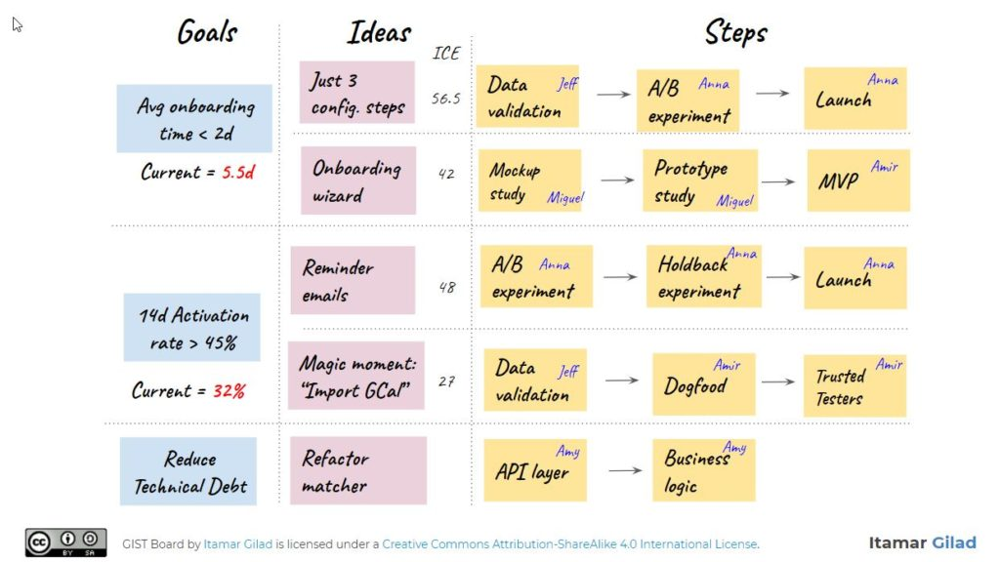

Where product managers end up is not where they start. _Build-measure-learn_ and _design thinking_ are two powerful ways to accelerate value creation and capture. I use these concepts - framed as loops and documents respectively - as foundational schemas in implementation.

## Loops

GIST is a modern approach to learning loops; it stands for **G**oals, **I**deas, **S**teps and **T**asks. The underlying theory advocates rapid experimentation to increase confidence that ideas deliver measurable value.

> goals define what we wish to achieve, ideas are hypothetical ways to achieve the goals, steps are mini-projects that implement an idea in parts while validating it, and tasks are the day-to-day activities that implement a step^[1](https://itamargilad.com/book-evidence-guided/)^

GIST has a variety of tools available - quantitative metrics, idea banks and ICE scores - to structure loops and is often depicted as a sequential whiteboard with sticky notes.

## Documents

Design thinking is a convenient way to categorise different stages of product planning and execution. I use a specific flavour of design thinking, assigning a single output document to each stage.

These documents are live and persistent artifacts with a dual purpose; they help product managers think better by themselves and communicate their thoughts more clearly to others throughout a loop.

## Workflows

The distinction between loops and documents is the difference between routes and maps. GIST is a specific execution loop against the map of design thinking documents.

My approach treats documents as a specialised, parallel step stage in the GIST loop.

!!! tip

    **Act quickly** with GIST loops and **plan persistently** with design thinking documents

My version of GIST is a specific instance of the generic workflow class. Workflows combine loops and documents to guide product management from concept to execution.

Marvin Minsky's **Search -> Pattern-Recognition -> Learning -> Planning -> Induction** or Andrew Ng's **Reflection -> Tool Use > Planning -> Multi-Agent Collaboration** are abstract examples of workflows that apply more directly to artificial intelligence.

## Agents

The near-term promise of AI agents is that given minimal input and supervision, they can semi-autonomously:

- decide what to do by stringing together workflow components, sequences and schedules
- get things done by implementing automations, accessing external tools and parallelising activity
- help product managers architect and orchestrate workflows that result in faster, cheaper and better quality outcomes

## :material-key-alert-outline: One Hour PM

One Hour PM is a library I'm building that uses generative AI to help product managers accelerate value creation and capture. It does this by exploring how agents and automations can improve **creative** and **productive** ways of working with product ideas and tasks.

Kiln's key features are:

- **Simple**: One input interface across all tasks
- **Multimodal**: Inputs and outputs work with many data types
- **Curated**: Modern product tools and templates selected with a bias for lean workflows
- **Contextual**: Add custom data sources for more specific and specialised outcomes
- **Connected**: Access to internal and external tools
- **Automatic**: Agents execute creative and directed tasks semi-autonomously
- **Fast**: Compressing cycle times to one hour product management sprints
- **Solo**: Get more done with only yourself-in-the-loop
