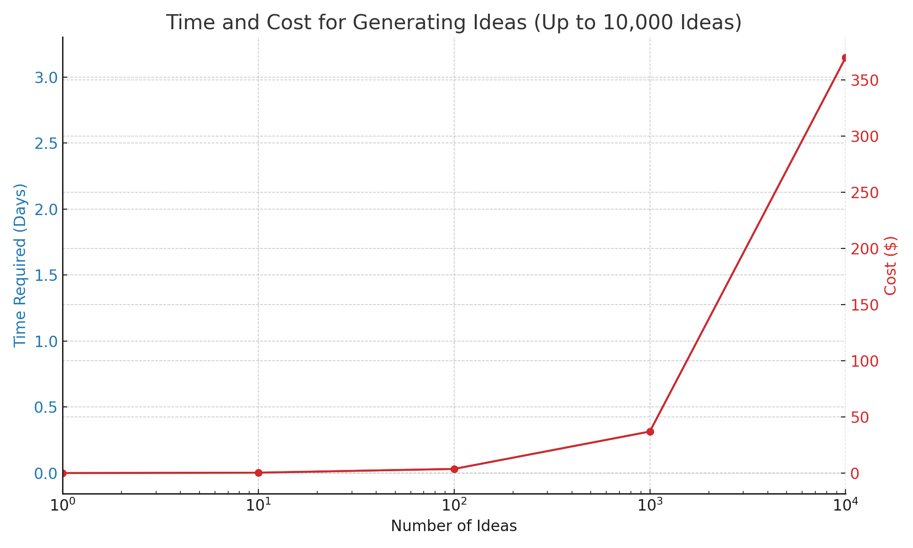
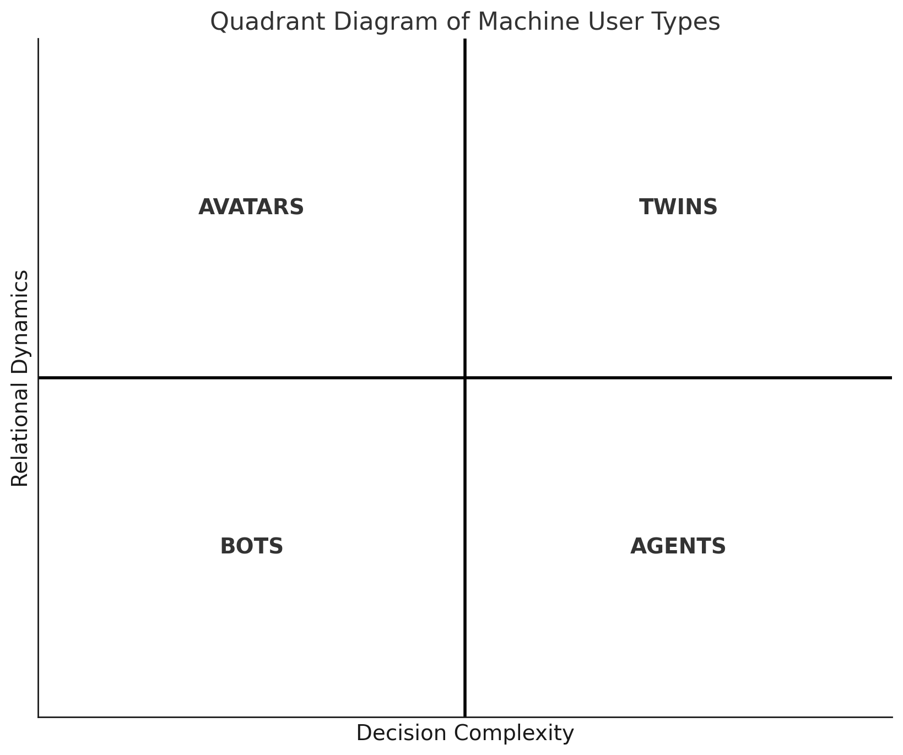
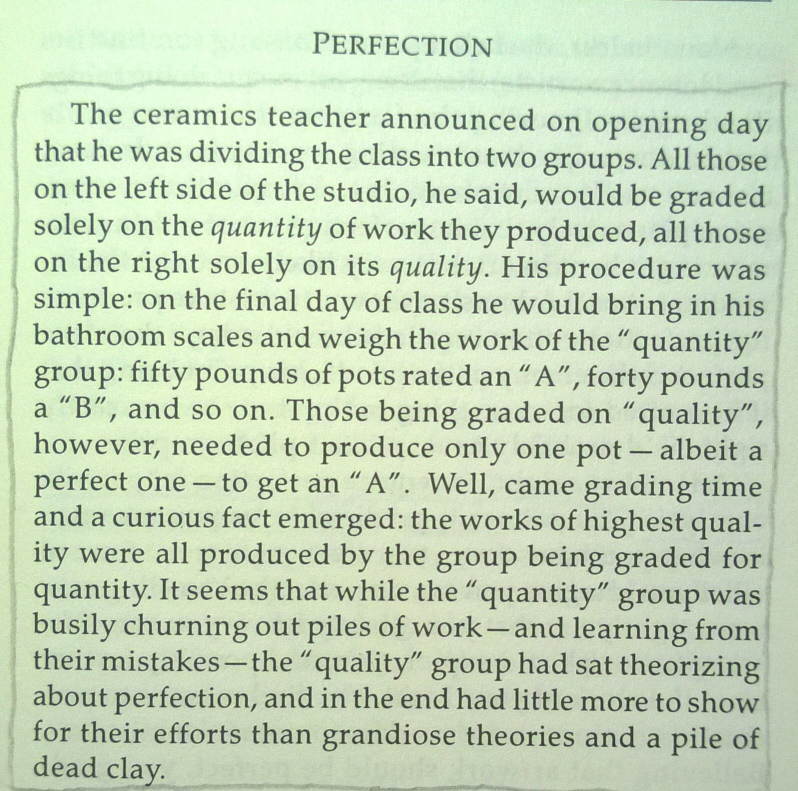

Everyday creativity is a numbers game in which **the more ideas we generate the more good ideas we'll have**. This happens often in daily activities - like trying new recipes with leftovers, making handmade gifts, or rearranging a desk for better utility.

Even though these innovations are understated, happening in the privacy of our homes and personal spaces, they are not routine. Improvised solutions like these are clear expressions of ingenuity that make our lives better in small but meaningful ways.

## What we know

Large Multimodal Models (LMMs) are very good at generating ideas for everyday business situations. These ideas aren't just copied from what they've been taught; they combine elements to create new solutions faster - and often better - than humans.

### Speed

LMMs are unimaginably faster than humans at coming up with ideas. Research estimates of velocity range from 800 ideas generated per hour[1](https://dx.doi.org/10.2139/ssrn.4526071) for short sentence outputs to 132 ideas generated per hour[2](https://dx.doi.org/10.2139/ssrn.4533642) for short paragraph outputs.

Humans cannot match this pace. We need breaks, can experience creative blocks, and have a limited capacity for continuous creative output.

As the output format gets longer (page, document) or more multimodal (image, audio, video), the disparity between human and machine performance gets exponentially larger.

### Cost

LMMs also make idea generation cheaper. Across 730 ideas generated as short text paragraphs, the average API cost per idea was estimated at $0.037 and the average time to generate each idea was estimated at 27.2 seconds[3](https://dx.doi.org/10.2139/ssrn.4533642).

Extrapolating linearly leads to the table below:

| Number of Ideas | Time Required | Cost ($)  |
| --------------- | ------------- | --------- |
| 1               | 27.2 seconds  | 0.037     |
| 10              | 4.5 minutes   | 0.37      |
| 100             | 45.3 minutes  | 3.70      |
| 1,000           | 7.6 hours     | 37.00     |
| 10,000          | 3.1 days      | 370.00    |
| 100,000         | 31.5 days     | 3,700.00  |
| 1,000,000       | 314.8 days    | 37,000.00 |

Visualising this in a chart we see that LMMs can generate 1000 ideas in a single working day for a cost of $37, and 10,000 ideas in just over three days for a cost of $370.

We also see that at the top end LMMs can generate 100,000 ideas in about a month for $3,700 and 1,000,000 ideas in less than a year for $37,000.

AI is more affordable whether we need a few ideas or thousands, short ideas or long ones. Paying comparatively higher labour costs - annual staff salaries, hourly rates for contractors and consultants, or additional team infrastructure at scale - make human-driven idea generation inherently more expensive.

At the extreme, producing a million creative ideas quickly is impossible even for large, well-funded human teams of experts, a barrier AI can now overcome.

??? danger "Caution"

    There are many limits to the back-of-the-envelope calculations above which completely ignore additional implementation costs, savings and complexities (devops costs, capital expenditure, API limits, parallel processing, externalities, subsidised usage, varying output formats, varying output lengths, task type) of using AI to generate ideas.

    We are also so early in the space that only a few studies are documenting this specific information, making it unclear how reliable and replicable these cost structures would be within a larger experiment sample size.

    **TL;DR take everything presented around costs with a healthy dose of skepticism.**

### Quality

> “Based on the research, not only are the latest forms of AI generating large numbers of ideas (fluency) and different types, variations, and categories of ideas (flexibility), they are, for the first time, generating new, unique, and unexpected ideas (originality), performing in the top percentile for original thinking."[4](https://doi.org/10.1016/j.yjoc.2023.100065)

Most people believe that even if AI is creative, it isn't as good as humans. Things are changing, especially for everyday business and product ideas.

GPT-4:

- outperforms 91% of human participants on the Alternative Uses Test that requires the generation of multiple original uses for five everyday objects (pants, ball, tire, fork, toothbrush).
- matches or exceeds 99% of human participants in originality on the Torrance Tests of creative thinking.
- dominates measures of purchase intent with 35 of the top 40 ideas from a pool of 400 as determined by human evaluators

The most creative humans still do better - but only slightly better - in flexible, original and novel idea generation than state of the art LMMs. This gap is rapidly narrowing just with improved prompts and pipelines [Some Evidence] without accounting for advances in retrieval augmented generation, model finetuning and transformer architecture.

## Evaluation

LMMs aren't just good at coming up with ideas; they're also getting better at deciding which ones are best. Thanks to their ability to scale, they can reframe creative limits as manageable search and retrieval problems.

Instead of asking whether AI can be creative, we can more precisely investigate whether AI can effectively map and select ideas from business and product opportunity spaces.

Think of it like this: if everyday creativity is a treasure map, AI is becoming an expert at not only drawing the map but also at picking out where the treasure is most likely to be.

=> maybe talk about how it has been used so far in a table?? And which studies have used which?? ALso talk about limitations of human raters in latest ethan mollick study?

### Metrics

- idea exhaustion
- summary metrics
- creativity metrics that include CPSS
-

## Machine Users

A **machine user** is an AI or software entity that performs tasks within digital environments or interacts with humans. These entities can range from simple automated programs to complex systems capable of emulating human decision-making and interaction.

Machine users are pivotal in today's digital landscape, serving a multitude of purposes across various industries. Their abilities span from executing repetitive tasks to engaging in dynamic, human-like interactions. Understanding the distinct types of machine users helps in harnessing their capabilities for improved efficiency, engagement, and innovation.

The classification is based on:

- **Decision Complexity**: Reflects the machine user's capability for making decisions, ranging from basic algorithm-driven choices to advanced, context-aware problem-solving.
- **Relational Dynamics**: Represents the level of interaction the machine user has with its environment or with humans, from simple responses to complex, engaging conversations.

### Quadrants

**Quadrant I: Twins**

These are advanced simulations of real-world systems or processes that can make complex decisions and interact dynamically with their environment.

- _Healthcare Digital Twin_: Adapts treatment plans based on real-time health data.
- _Smart City Digital Twin_: Manages urban environments by integrating diverse data sources.

**Quadrant II: Avatars**

Digital representations that interact with users or environments in a meaningful way but are limited in decision-making complexity.

- _Virtual Customer Service Representative_: Guides customers through online retail stores.
- _Educational Virtual Tutor_: Assists students on e-learning platforms.

**Quadrant III: Bots**

Software programs designed to perform automated tasks, usually repetitive and with minimal interaction.

- _Chatbot for Hotel Bookings_: Manages room bookings and customer queries.
- _Social Media Content Moderator Bot_: Flags inappropriate content based on set guidelines.

**Quadrant IV: Agents**

These systems perform complex tasks autonomously but with limited interaction, focusing on efficiency and execution.

- _Algorithmic Trading Agent_: Executes stock trades based on market analysis.
- _Autonomous Industrial Robot_: Performs complex tasks in manufacturing with minimal human interaction.

### Classification

In this section, we dive deeper into a few complex machine user examples to clarify their categorization:

- **Autonomous Negotiating Car**: A self-driving car that negotiates with smart parking lots for space would be classified as a **Twin**, due to its high decision complexity in real-time and its high relational dynamics in engaging with the parking infrastructure.

- **Self-Restocking Fridge**: A refrigerator that monitors inventory and orders groceries when supplies run low would fall under **Agents**. While it autonomously manages its inventory (high decision complexity), its interactions are limited to transactional ordering processes (low relational dynamics).

- **AI Legal Advisor**: An AI that provides legal advice by analyzing case law and statutes would be an **Agent**. It requires a high level of decision complexity to interpret and apply legal principles but generally does not engage in complex interactions as its advice is typically delivered in a report format.

- **Interactive Fictional Character**: In an immersive storytelling platform, this AI character interacts with users, making choices that influence the story. Its decision-making might appear complex, but it's primarily designed to emulate a character within a narrative context, categorizing it as an avatar.

Understanding the capabilities and interactions of machine users is critical for businesses and developers as they integrate AI into their operations and products. This classification helps in strategizing the deployment of AI systems for optimal performance and user experience.

#### Misclassification

For a machine user to be classified as an **Avatar**, it must exhibit both role emulation and interactivity. Role emulation involves the machine user mimicking or representing a human role, behavior, or persona, often in a digital or virtual environment. Interactivity refers to the machine user's capability to engage in dynamic, two-way interactions, often resembling human-like conversations or social behaviors.

- **Automated News Reader**: Imagine an AI that reads out news articles in a human-like voice. While it might seem like an avatar due to its human-like speech (role emulation), it lacks interactive capabilities. The AI does not engage in two-way communication; it simply performs a one-way broadcast of information. This absence of interactivity classifies it more accurately as a **Bot**, as it's primarily executing a defined, repetitive task without the dynamic engagement typical of avatars.

- **Virtual Museum Guide**: Consider an AI that provides guided tours in a virtual museum. If this AI simply follows a predetermined path and script without engaging with visitors' questions or personalizing the tour based on visitor interactions, it would be an **Agent** rather than an Avatar. Despite emulating the role of a tour guide (role emulation), the lack of real-time, responsive interaction with visitors means it doesn't fully meet the criteria for an Avatar.

Even when a process utilises advanced technologies like Large Language Models (LLMs), it can still be classified as a **Bot**. This classification hinges on the task's nature and the level of decision complexity and interactivity, rather than the sophistication of the technology used.

- **Task Specificity**: If the primary role is executing predefined, often repetitive tasks such as data generation or answering standard queries, it aligns with the bot's characteristic functionality.
- **Limited Interactivity**: Bots typically exhibit restricted interactive capabilities. A process using LLMs but not engaging in dynamic, responsive dialogues fits this category.

- **Decision Scope**: The use of LLMs does not automatically imply complex decision-making. If decisions are based on set rules or parameters, despite the advanced nature of the technology, the process is akin to a bot's operation.

**Example**: An LLM-driven chatbot for customer service, offering scripted responses to inquiries, demonstrates this concept. Despite its advanced underlying technology, its role in providing specific information without complex interactions or autonomous decision-making categorizes it as a "Bot."

In essence, the application and function of the technology, rather than its inherent complexity, determine a machine user's classification.

## Studies I need to read soon

- https://papers.ssrn.com/sol3/papers.cfm?abstract_id=4663382
- https://papers.ssrn.com/sol3/papers.cfm?abstract_id=4673875
- https://papers.ssrn.com/sol3/papers.cfm?abstract_id=4686415
- https://papers.ssrn.com/sol3/papers.cfm?abstract_id=4676053

## What we don't know

## Imaginary Worlds

## Bootstrapping creativity

### # 1 - 10

### # 10 - 20

## Sources I draw from

1. https://www.oneusefulthing.org/p/automating-creativity - important blogpost with alot of summaries
2. https://arxiv.org/abs/2303.12003 - Arxiv paper referenced by the alternate uses test of creativity mentioned in the blog
3. https://www.sciencedirect.com/journal/journal-of-creativity/special-issue/10F0ZRJ0KB7 - Entire issue of journal f creativity with a specific article on torrance tests
4. https://www.sciencedirect.com/science/article/pii/S2713374523000249 - Specific article referenced above
5. https://papers.ssrn.com/sol3/papers.cfm?abstract_id=4526071 - famous one on idea generation plus earlier work by girotra
6. https://papers.ssrn.com/sol3/papers.cfm?abstract_id=4533642 - more idea generation
7. https://papers.ssrn.com/sol3/papers.cfm?abstract_id=4535536 - short story prompting
8. https://medium.com/aimonks/generative-ai-can-ideate-harder-bdd9e37a01d8 - blog post related to creativity
9. https://www.inoreader.com/article/3a9c6e74ffd3ff5c-how-generative-ai-can-help-businesses-with-unimaginable-solutions - more idea generation 10.https://www.goodreads.com/author/quotes/52938.Linus_Pauling
10. https://papers.ssrn.com/sol3/papers.cfm?abstract_id=4708466

## Article Summaries

## Research

For a long time, the kryptonite of AI is that it is not creative, or even where it is, it is not as creative as humans. This hypothesis is starting to be challenged. It does not matter if AI is faster and cheaper at generating ideas if those ideas don't meet some threshold standard of creativity.

often helpful. Crucially, they not only generate more ideas but often better ideas than humans can.

Despite skepticisim about the limits of AI on

how creative AI really is, or how much originality is involved,

hallucination is creativity.

a specific kind of everyday creativity : mass idea generation that combines

The book _Art & Fear_ relates a pottery anecdote that perfectly describes this sentiment:

??? example "Quantity and quality"

    _The ceramics teacher announced on opening day that he was dividing the class into two groups. All those on the left side of the studio, he said, would be graded solely on the quantity of work they produced, all those on the right solely on its quality.

    His procedure was simple: on the final day of class he would bring in his bathroom scales and weigh the work of the "quantity" group: fifty pounds of pots rated an "A", forty pounds a "B", and so on. Those being graded on "quality", however, needed to produce only one pot — albeit a perfect one — to get an "A".

    Well, came grading time and a curious fact emerged: the works of highest quality were all produced by the group being graded for quantity.

    It seems that while the "quantity" group was busily churning out piles of work — and learning from their mistakes — the "quality" group had sat theorizing about perfection, and in the end had little more to show for their efforts than grandiose theories and a pile of dead clay._

The best way to have good ideas is to have lots of ideas.

1. Hallucination is creativity.
   a. This fact alone signals that generative AI can express novel ideas.
   b. Intended creativity is some

Creativity is the expression of novelty in some way.

??? example "Principles for Creativity"

    1. Create more ideas to make your ideas more creative
    2. Use other people's tools until you can't
    3. Try interesting things

## Step 1 : Prompts

Prompts are at the heart of LLM creativity. With trial and error, I created the following sequence of prompts that consistently generates a variety of imaginary businesses and products.

- Prompt 1 : Trisociation Prompt
- Prompt 2 : Character Generation Prompt
- Prompt 3 : Business/Product Idea-on-a-Page Prompt
- Prompt 4 : Product Image Prompt
- Optional Prompt 5 : Music Prompt ([Aqua Tents](10.md))
- Optional Prompt 6 : Animation Prompt [Whispering Gardens](12.md)

I started content creation by writing one prompt, entering it into ChatGPT 4 and almost immediately feeling embarrassed about how far the output fell short of the vision I had built in my head. Iterating on the prompt manually, and asking ChatGPT to refine the prompt, slowly got it to a state I was more comfortable with. In the end, after about 10 days of playing around with different words and formats, I managed to get a more or less consistently interesting idea on a page.

The end result after about 10 hours (about an hour a day) of just trying different things was three consecutive, dependent prompts as follows :

- Prompt 1 : Character Generation Prompt
- Prompt 2 : Business/Product Idea-on-a-Page Prompt
- Prompt 3 : Product Image Prompt

Ideas 1 - 9 ([GlimmerCraft](1.md) to [Cosmos Canvas](9.md)) were generated in this way. With idea 10 ([Aqua Tents](10.md)), I decided to add music by taking 2 relevant sentences from the description and using [Suno AI](https://www.suno.ai/) to generate a marketing jingle.

With Idea 11 ([Haiku Harmonics](11.md)]), I tested the [trisociation]() technique of random word triplets as a way to stretch the creative boundaries of the ideas being generated. This worked really well as the first prompt in the sequence, leading to far more varied, concrete and niche ideas. So, now the prompt structure is as follows:

- Prompt 1 : Character Generation Prompt
- Prompt 2 : Character Generation Prompt
- Prompt 3 : Business/Product Idea-on-a-Page Prompt
- Prompt 4 : Product Image Prompt
- Prompt 5 : Music Prompt

Finally, I added animation using [Leonardo](https://leonardo.ai/) for idea 12 ([Whispering Gardens](12.md)) to take in the image generated by the Product Image Prompt and converting it into an animation. I also experimented with generating the product image directly in [Leonardo](https://leonardo.ai/) instead of DALL-E.

- Prompt 6 : Animation Prompt

A full story with all 6 prompts can comfortably be created and published in 30 minutes just by manually copying and pasting them from my dev environment to the different tools. Since I had a paid subscription to ChatGPT, I did two timed speedruns of 5 ideas each for prompts 1 to 4.

> _Fiction can show you a different world. It can take you somewhere you've never been. Once you've visited other worlds, like those who ate fairy fruit, you can never be entirely content with the world that you grew up in. Discontent is a good thing: discontented people can modify and improve their worlds, leave them better, leave them different_ ---- **Neil Gaiman**

## Manual Prompts

For interfaces that help with productivity and for a broader engagement with AI in product management see my other site [Kiln](https://ashvin.au)

## Steps 1-2

- Step 1 : Manual prompts in chat gpt for idea then story. Initially just story. Then I added idea. Then Dall-E. Then timed. Then with random words or things that catch my attention.
- Step 2 : Manual prompts added to Suno AI and Leonardo AI for adding music and motion. also learnt about negative prompts.
- Step 3 : Trisociation of prompts, negative prompts, few shot examples.
- End result was timed manual pipeline to get a story in under 10 minutes

=> got it to under 13 mins on 12/01 just text and image

- trisociation really helps gives a more concrete feel to it.

## Steps 3

- Step 3 : Open AI pipeline via API in Jupyter Notebook Manually
- Step 4 : Add some basic RAG via llamaindex

## Steps 4

- add some features like synthetic users, wardley maps, lean canvas etc.
- Add agent based simulation models
- when do I add a streamlit app
- when do I add negative prompts
- when do I add an opensource model
- when do I add alternatives?
- when do I finetune a model?

## Adding hypotheses about creativity to this page or the Kiln page.
