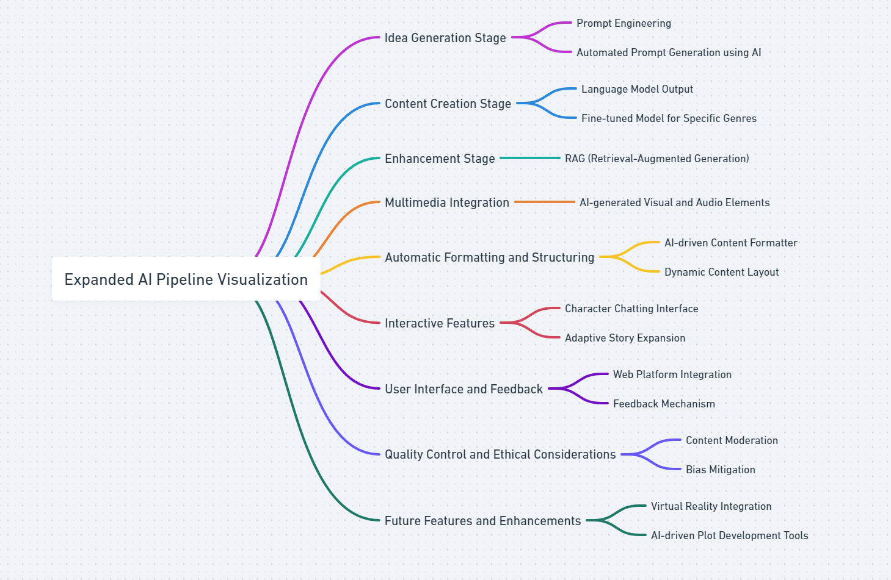

## Step 1 : Prompts

I started content creation by writing one prompt, entering it into ChatGPT 4 and almost immediately feeling embarrassed about how far the output fell short of the vision I had built in my head. Iterating on the prompt manually, and asking ChatGPT to refine the prompt, slowly got it to a state I was more comfortable with. In the end, after about 10 days of playing around with different words and formats, I managed to get a more or less consistently interesting idea on a page.

The end result after about 10 hours (about an hour a day) of just trying different things was three consecutive, dependent prompts as follows :

- Prompt 1 : Character Generation Prompt
- Prompt 2 : Business/Product Idea-on-a-Page Prompt
- Prompt 3 : Product Image Prompt

Ideas 1 - 9 ([GlimmerCraft](1.md) to [Cosmos Canvas](9.md)) were generated in this way. With idea 10 ([Aqua Tents](10.md)), I decided to add music by taking 2 relevant sentences from the description and using [Suno AI](https://www.suno.ai/) to generate a marketing jingle.

With Idea 11 ([Haiku Harmonics](11.md)]), I tested the [trisociation]() technique of random word triplets as a way to stretch the creative boundaries of the ideas being generated. This worked really well as the first prompt in the sequence, leading to far more varied, concrete and niche ideas. So, now the prompt structure is as follows:

- Prompt 1 : Character Generation Prompt
- Prompt 2 : Character Generation Prompt
- Prompt 3 : Business/Product Idea-on-a-Page Prompt
- Prompt 4 : Product Image Prompt
- Prompt 5 : Music Prompt

Finally, I added animation using [Leonardo](https://leonardo.ai/) for idea 12 ([Whispering Gardens](12.md)) to take in the image generated by the Product Image Prompt and converting it into an animation. I also experimented with generating the product image directly in [Leonardo](https://leonardo.ai/) instead of DALL-E.

- Prompt 6 : Animation Prompt

A full story with all 6 prompts can comfortably be created and published in 30 minutes just by manually copying and pasting them from my dev environment to the different tools. Since I had a paid subscription to ChatGPT, I did two timed speedruns of 5 ideas each for prompts 1 to 4.

> _Fiction can show you a different world. It can take you somewhere you've never been. Once you've visited other worlds, like those who ate fairy fruit, you can never be entirely content with the world that you grew up in. Discontent is a good thing: discontented people can modify and improve their worlds, leave them better, leave them different_ ---- **Neil Gaiman**

## Manual Prompts

For interfaces that help with productivity and for a broader engagement with AI in product management see my other site [Kiln](https://ashvin.au)

## Steps 1-2

- Step 1 : Manual prompts in chat gpt for idea then story. Initially just story. Then I added idea. Then Dall-E. Then timed. Then with random words or things that catch my attention.
- Step 2 : Manual prompts added to Suno AI and Leonardo AI for adding music and motion. also learnt about negative prompts.
- Step 3 : Trisociation of prompts, negative prompts, few shot examples.
- End result was timed manual pipeline to get a story in under 10 minutes

=> got it to under 13 mins on 12/01 just text and image

- trisociation really helps gives a more concrete feel to it.

## Steps 3

- Step 3 : Open AI pipeline via API in Jupyter Notebook Manually
- Step 4 : Add some basic RAG via llamaindex

## Steps 4

- add some features like synthetic users, wardley maps, lean canvas etc.
- Add agent based simulation models
- when do I add a streamlit app
- when do I add negative prompts
- when do I add an opensource model
- when do I add alternatives?
- when do I finetune a model?

## Adding hypotheses about creativity to this page or the Kiln page.
