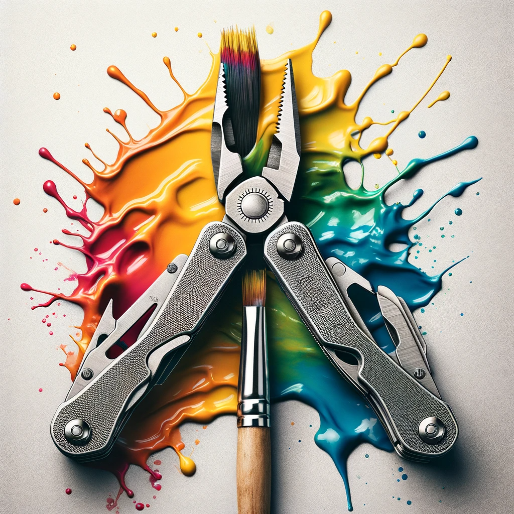

Everyday creativity is a numbers game in which **the more ideas we generate the more good ideas we'll have**. This happens often in daily activities - like trying new recipes with leftovers, making handmade gifts, or rearranging a desk for better utility.

Even though these innovations are understated, happening in the privacy of our homes and personal spaces, they are not routine. Improvised solutions like these are clear expressions of ingenuity that make our lives better in small but meaningful ways.

Large Multimodal Models (LMMs) are very good at generating ideas for everyday business situations. These ideas aren't just copied from what they've been taught; they combine elements to create new solutions faster - and often better - than humans.

## Speed

LMMs are unimaginably faster than humans at coming up with ideas. Research estimates of velocity range from 800 ideas generated per hour[1](https://dx.doi.org/10.2139/ssrn.4526071) for short sentence outputs to 132 ideas generated per hour[2](https://dx.doi.org/10.2139/ssrn.4533642) for short paragraph outputs.

Humans cannot match this pace. We need breaks, can experience creative blocks, and have a limited capacity for continuous creative output. As the output format gets longer (page, document) or more multimodal (image, audio, video), the disparity between human and machine performance gets exponentially larger.

## Cost

LMMs also make idea generation cheaper. Across 730 ideas generated as short text paragraphs, the average API cost per idea was estimated at $0.037 and the average time to generate each idea was estimated at 27.2 seconds[3](https://dx.doi.org/10.2139/ssrn.4533642).

Extrapolating linearly leads to the table below:

| Number of Ideas | Time Required | Cost ($)  |
| --------------- | ------------- | --------- |
| 1               | 27.2 seconds  | 0.037     |
| 10              | 4.5 minutes   | 0.37      |
| 100             | 45.3 minutes  | 3.70      |
| 1,000           | 7.6 hours     | 37.00     |
| 10,000          | 3.1 days      | 370.00    |
| 100,000         | 31.5 days     | 3,700.00  |
| 1,000,000       | 314.8 days    | 37,000.00 |

Visualising this in a chart we see that LMMs can generate 1000 ideas in a single working day for a cost of $37, and 10,000 ideas in just over three days for a cost of $370. We also see that at the top end LMMs can generate 100,000 ideas in about a month for $3,700 and 1,000,000 ideas in less than a year for $37,000.

AI is more affordable whether we need a few ideas or thousands, short ideas or long ones. Paying comparatively higher labour costs - annual staff salaries, hourly rates for contractors and consultants, or additional team infrastructure at scale - make human-driven idea generation inherently more expensive.

At the extreme, producing a million creative ideas quickly is impossible even for large, well-funded human teams of experts, a barrier AI can now overcome.

??? danger "Caution"

    There are many limits to the back-of-the-envelope calculations above which completely ignore additional implementation costs, savings and complexities (devops costs, varying model types, open source models, capital expenditure, API limits, parallel processing, externalities, subsidised usage, varying output formats, varying output lengths, task type) of using AI to generate ideas.

    We are also so early in the space that only a few studies are documenting this specific information, making it unclear how reliable and replicable these cost structures would be within a larger experiment sample size.

    **TL;DR take everything presented around costs with a healthy dose of skepticism.**

## Quality

> “Based on the research, not only are the latest forms of AI generating large numbers of ideas (fluency) and different types, variations, and categories of ideas (flexibility), they are, for the first time, generating new, unique, and unexpected ideas (originality), performing in the top percentile for original thinking."[4](https://doi.org/10.1016/j.yjoc.2023.100065)

Most people believe that even if AI is creative, it isn't as good as humans. Things are changing, especially for everyday business and product ideas.

GPT-4:

- outperforms 91% of human participants on the Alternative Uses Test that requires the generation of multiple original uses for five everyday objects (pants, ball, tire, fork, toothbrush)[5](https://doi.org/10.48550/arXiv.2303.12003).
- matches or exceeds 99% of human participants in originality on the Torrance Tests of creative thinking[6](https://doi.org/10.1016/j.yjoc.2023.100065).
- dominates measures of purchase intent with 35 of the top 40 ideas from a pool of 400 as determined by human evaluators[7](https://dx.doi.org/10.2139/ssrn.4526071)

The most creative humans still do slightly better in flexible, original and novel idea generation than state of the art LMMs[8](https://dx.doi.org/10.2139/ssrn.4533642) [9](https://dx.doi.org/10.2139/ssrn.4535536) [10](https://doi.org/10.48550/arXiv.2309.14556) [11](https://doi.org/10.48550/arXiv.2310.08433). But this gap is rapidly narrowing just with improved prompts, prompt frameworks and pipelines even without accounting for advances in retrieval augmented generation, multimodal reasoning, model finetuning and transformer architecture[10](https://medium.com/aimonks/generative-ai-can-ideate-harder-bdd9e37a01d8) [11](https://papers.ssrn.com/sol3/papers.cfm?abstract_id=4708466) [12](https://doi.org/10.48550/arXiv.2401.12491) .

While research into everyday creativity keeps demonstrating quality improvements, even more surprising is that scientific studies are showing increasing promise for truly original discovery in math[5](https://doi.org/10.1038/s41586-023-06924-6) and chemistry[6](https://doi.org/10.1038/s41586-023-06792-0)[7](https://doi.org/10.48550/arXiv.2402.08703)

LMMs aren't just good at coming up with ideas; they're also coming up with better ideas _and_ getting better at deciding which ones are best. Automated evaluation, in which LMMs are both creator and assessor, is fast becoming the default way to assess task quality[12](https://hbr.org/2023/07/how-generative-ai-can-augment-human-creativity) [13](https://hbr.org/2023/11/use-genai-to-improve-scenario-planning).

Instead of asking whether AI can be creative, we can more precisely investigate whether AI can effectively map and select ideas from business and product opportunity spaces. Thanks to their ability to scale, LMMs can reframe creative limits as manageable search and retrieval problems across finite idea spaces.

Think of it like this: if everyday creativity is a treasure map, AI is becoming an expert at not only drawing the map but also at picking out where the treasure is most likely to be. And like a rat learning shortcuts in a maze to find cheese faster, AI self-improves automatically, finding more direct paths to the treasure with each attempt.

## Evaluation

=> maybe talk about how it has been used so far in a table?? And which studies have used which?? ALso talk about limitations of human raters in latest ethan mollick study?

- idea exhaustion and homgenisation also see https://arxiv.org/abs/2402.01536
- summary metrics
- creativity metrics that include CPSS
- I do experiments or tinkerings.
- cite/talk about this study on hallucination, taxonomy, evaluation and creativity (https://arxiv.org/abs/2402.06647)

## Imaginary Worlds

I’ve always been captivated by the intricacies of minor characters’ products and businesses in science fiction and fantasy writing. These subtle details, often mentioned in passing, add depth and realism to the imaginative worlds crafted by authors. They provide a glimpse into the everyday lives of characters and the economies that sustain their societies.

From the bucolic Pelorous Fields district in China Mieville’s "Bas-Lag" novels to the quaint shops lining Diagon Alley in J.K. Rowling's "Harry Potter" series to the barista in Travis Baldtree's "Legends & Lattes", these fictional businesses spark curiosity and invite readers to explore the rich tapestries of these worlds.

AI is a machine for crafting imaginary microworlds, ranging from deep to shallow and from closed to open, often transmedial and transauthorial in nature. These worlds can be counterfactual, like Philip K. Dick's "The Man in the High Castle," or entirely novel, like Lewis Carroll's "Alice in Wonderland."

Imaginary microworlds serve as experimental playgrounds, allowing for quick and cheap exploration of ideas related to people, products, and businesses. They function as possibility databases for creating, merging, storing, and discarding concepts in a controlled environment for testing hypotheses and strategies, adding or removing constraints, and layering rich narratives as needed to understand complex systems and dynamics.

Additionally, they offer a safe space for exploring alternative solutions to real-world problems. They allow us to simulate scenarios that are impossible or impractical to test in reality, providing valuable insights that can be applied to actual challenges.

My focus on this site is to merge my interests and experiment with the **intersection of AI-generated science fiction and fantasy microworlds and product ideas**. I want to treat it primarily as a **testing ground for AI techniques that assist and automate creative and product management pipelines**. Secondarily, I aspire to **craft engaging and interactive microworlds** that demonstrate the utility of synthetic data layered with rich narratives in enhancing our understanding of commercial ideas and inspiring innovation in the real world.

### Sources

**I've cited and can move on**

2. https://arxiv.org/abs/2303.12003 - Arxiv paper referenced by the alternate uses test of creativity mentioned in the blog
3. https://www.sciencedirect.com/science/article/pii/S2713374523000249 - Specific article referenced above about torrance test outperformance
4. https://papers.ssrn.com/sol3/papers.cfm?abstract_id=4526071 - famous one on idea generation plus earlier work by girotra
5. https://papers.ssrn.com/sol3/papers.cfm?abstract_id=4533642 - more idea generation
6. https://papers.ssrn.com/sol3/papers.cfm?abstract_id=4535536 - short story prompting
7. https://medium.com/aimonks/generative-ai-can-ideate-harder-bdd9e37a01d8 - blog post related to creativity
8. https://papers.ssrn.com/sol3/papers.cfm?abstract_id=4708466
9. https://www.oneusefulthing.org/p/automating-creativity - important blogpost with alot of summaries
10. https://www.inoreader.com/article/3a9c6e74ffd3ff5c-how-generative-ai-can-help-businesses-with-unimaginable-solutions - more idea generation 10.https://www.goodreads.com/author/quotes/52938.Linus_Pauling
11. https://www.sciencedirect.com/journal/journal-of-creativity/special-issue/10F0ZRJ0KB7 - Entire issue of journal f creativity with a specific article on torrance tests

**Studies I need to read soon**

- https://papers.ssrn.com/sol3/papers.cfm?abstract_id=4663382
- https://papers.ssrn.com/sol3/papers.cfm?abstract_id=4673875
- https://papers.ssrn.com/sol3/papers.cfm?abstract_id=4686415
- https://papers.ssrn.com/sol3/papers.cfm?abstract_id=4676053
