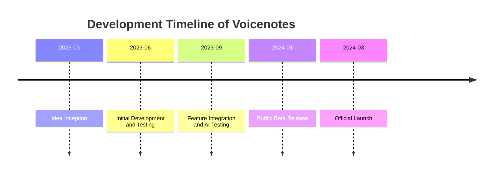
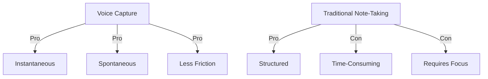
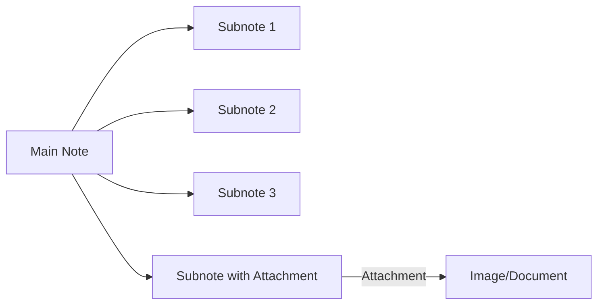
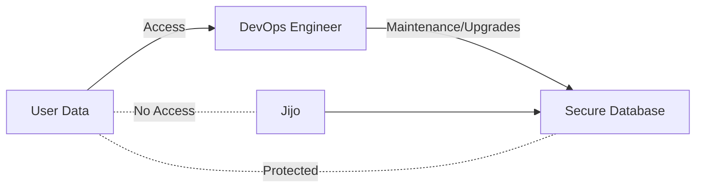
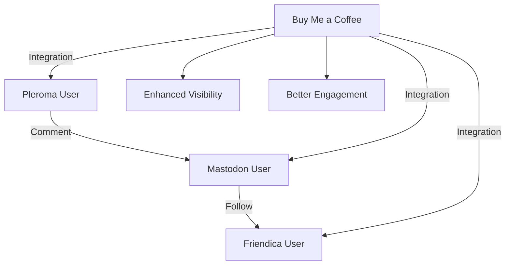

# VCP 6 - Voicenotes: The Inspiring Story & Future Plans (with: Jijo Sunny)

## Introduction

**Initial greeting and discussion about sponsorship.**

### Key Points:

- Sponsor mention
- Affiliate link
- Introduction of guest
- Gratitude for transparency

Today's video is sponsored by you if you like what I do here on the channel and you are planning to try Voice Notes, please use my affiliate link vadcampus.com/slvn voice notes. Did you get it? And of course, you can also buy me a coffee at vladcampus.com/coffee.

Hello, D! Thank you for being here with us today.

Hey Vlad, thank you for having me. Look, I love that you guys are being so transparent about the voice notes' numbers and statistics.

In this episode, we dive into the fascinating journey and future plans of Voicenotes, founded by Jijo Sunny. We'll explore his background, the genesis of Voicenotes, its unique features, the role of AI, plans for future enhancements, and also crucial aspects concerning privacy and security. The conversation also delves into possibilities concerning the engagement with the Fediverse and addressing user suggestions.

> "I love that you guys are being so transparent about the voice notes' numbers and statistics" - Jijo Sunny

## Who is Jijo Sunny?

**Background story and previous ventures of Jijo Sunny.**

### Key Points:

- Background on Jijo Sunny
- Early projects
- Involvement with his brother

Jijo Sunny's journey is nothing short of inspiring. He was born and raised in a beautiful place called Kerala in India. His entrepreneurial spirit was evident from a young age. At just 15, he launched an ad network back in 2010. Though this initial project only lasted for about six months due to financial constraints, it laid the foundation for his resilient spirit and future ventures.

After the early setback, Jijo didn't touch a computer for nearly a year. However, his passion reignited, leading to several other projects, one of which was the development of a Chrome extension called "What Runs." This tool allowed users to quickly check the tech stack of any website. It went viral on platforms like Hacker News and Product Hunt, marking Jijo’s first experience of a product going viral.

### Jijo’s Collaborations:

Jijo's brother, who is two years younger, joined him in his later ventures. He was always a part of the journey, from buying the domain to subsequent developments. Their strong partnership laid out the groundwork for their most successful product to date—Voicenotes.

## The Genesis of Voicenotes

**Discussion on the inspiration and early ideas behind Voicenotes.**

### Key Points:

- Inspiration for Voicenotes
- Development timeline
- Challenges and learning
- Initial usage of Voice Memos

Voicenotes began as an idea in March 2023, driven by Jijo's own experiences and needs. The concept emerged from conversations with nurses and doctors during medical consultations where critical information was often conveyed rapidly within short calls. Jijo and his wife Alicia initially used regular voice memos to capture this vital data but found it cumbersome to sift through the recordings later.

> "We were seeking back and forth to find the exact information, like which department to go to, what is the reason for X and Y, what we should do in this meanwhile preparing for surgery" - Jijo Sunny

There wasn't a simple way to record a note and see the transcription, especially one that effectively integrated AI for semantic searches. The idea was to create a tool where asking a question like, "What sports did I enjoy last month?" could jog relevant notes mentioning football or a Premier League game. This functionality, inspired largely by the capabilities of ChatGPT, became a cornerstone of Voicenotes.

This inspiration coincided with several challenges. Jijo and the team found that existing apps either had insufficient transcription capabilities or lacked the semantic search feature they envisioned. The task was not only to build a transcription service but to also incorporate advanced AI to help users seamlessly retrieve and organize their recordings.

The journey from conception to reality involved overcoming technological and financial constraints, but Jijo’s resilience and innovative mindset prevailed. Voicenotes aims to provide an easy-to-use tool that transforms chaotic voice memos into structured and easily searchable data, bringing a revolution in note-taking.

## Features and Innovations in Voicenotes

**Detailed discussion about the unique features and future enhancements of Voicenotes.**

### Key Points:

- Transcription challenges
- Voice capture advantages over traditional note-taking
- AI Integration
- Related Notes Feature
- Mini cassette recorder analogy

Voicenotes offers a myriad of features that stand out in the realm of voice-based note-taking applications. One of the fundamental challenges addressed is transcription accuracy. Unlike simple voice recorders, Voicenotes leverages advanced AI to not just transcribe but also semantically understand and organize the content.

### Voice Capture vs. Traditional Note-Taking:

Voicenotes excels over traditional note-taking by simplifying the capture process. While written notes can be structured, voice capture is instantaneous and allows users to jot down thoughts as they come, without losing the essence of spontaneity.

### AI Integration:

A significant innovation lies in its AI integration. Users can interact with their notes using voice commands. The AI can respond semantically; for instance, if asked about a recent trip, it can pull all related notes, transcending simple keyword searches to understand context and relevance.

### Related Notes Feature:

One of the groundbreaking features is "Related Notes." This tool automatically sorts and groups notes that are contextually linked. This feature was meticulously designed to solve the problem of finding relevant information quickly, turning Voicenotes into a smart repository of thoughts and reminders.

### Mini Cassette Recorder Analogy:

Drawing an interesting analogy, Jijo mentioned the old mini cassette recorders used by journalists and detectives. While practical for capturing ideas, they were inconvenient for finding specific information later. Voicenotes reimagines this concept with modern AI, making every recorded note easily searchable and contextually connected.

> "Capturing voice I think wins with flying colors. It's more spontaneous and intuitive" - Jijo Sunny

In sum, Voicenotes revolutionizes note-taking by combining the simplicity of voice capture with the sophistication of AI-driven data organization.

## The Role of AI in Transcription and Note-Taking

**Exploring the impact and utilization of AI in Voicenotes and its benefits over traditional methods.**

### Key Points:

- AI's impact on transcription and note-taking
- Integration with other languages
- Reader vs. viewer experiences
- Simplifying the capture process

The integration of AI in Voicenotes has fundamentally transformed how users interact with their recorded data. Traditional transcription methods, primarily limited to converting speech into text, lack the contextual understanding that AI brings to the table. Voicenotes employs AI not just for transcription but also for enhancing the usability of the notes.

### AI-Driven Transcription:

Voicenotes leverages AI to provide highly accurate transcriptions. Beyond mere conversion, it understands the context and semantics, enabling much more reliable and useful data retrieval.

### Multilingual Capabilities:

The platform supports multiple languages, ensuring that non-English speakers also benefit. Recent updates ensure that notes recorded in different languages retain their context, allowing users worldwide to interact with the platform effectively.

### Differentiating Reader vs. Viewer Experiences:

While video content often serves as both informational and entertainment, voice notes, akin to written notes, prioritize clarity and utility. AI helps distill chaotic verbal ramblings into organized insights, making the notes more readable and contextually precise.

### Simplifying the Capture Process:

Capturing ideas seamlessly is a significant advantage of Voicenotes. Whether you are out for a run or in mid-discussion, recording thoughts via voice is fast and unobtrusive. The platform removes the friction associated with written notes, capturing the spontaneity of ideas without losing structure, facilitated by AI.

Voicenotes stands as a testament to how AI can be harnessed to turn a time-consuming, often inaccurate transcription process into an intuitive, insightful, and profoundly useful tool for personal and professional use.

> "I love those click moments, something just clicks and you know that's the direction" - Jijo Sunny

## Future Plans for Voicenotes

**Insight into the upcoming features and development plans for Voicenotes.**

### Key Points:

- Subnotes
- Attachments
- Creating Blog Posts
- User-centric development approach

Jijo Sunny and his team are continuously working to enhance Voicenotes, with significant updates in the pipeline designed to further elevate the user experience. Here’s a glimpse of what’s to come:

### Subnotes:

Inspired by tools like Obsidian and Roam Research, Voicenotes will soon introduce "Subnotes," allowing users to nest notes hierarchically. For instance, while reading a book, users can create a main note for the book and nest related thoughts or key points as subnotes. This feature aims to bring more organization and context to note-taking, making it easier to revisit complex ideas and projects in a structured manner.

> "We want to be able to do that with voice notes as well where you start recording saying, 'Hey, I started reading Bible,' and then take the next note which is under that note as a subnote" - Jijo Sunny

### Attachments:

Recognizing that notes often need supplementary material, Voicenotes will support attachments. Users can add screenshots, images, and other files directly to their notes. This feature will enhance the richness of the notes, making them a more comprehensive repository of information. Whether you are capturing a screenshot from an article or a photo from a lecture, attaching it to your voice note ensures all relevant information is centralized and searchable.

### Creating Blog Posts:

Voicenotes is also looking to make creating content easier. The platform will allow users to convert their notes into blog posts seamlessly. A single click could transform a detailed voice note into a structured blog post, complete with formatting and enhanced by AI-generated content. This feature not only saves time but also maximizes the value derived from each note.

> "I tried the create a blog feature, and it blew my mind how AI created such a complex blog post from a simple sentence" - Vlad

### User-Centric Development Approach:

One of the defining attributes of Voicenotes’ development is its user-centric approach. Jijo emphasized that they prioritize features based on what he and his team find useful, believing that if they build a tool they love, it’s likely others will too. This philosophy ensures that every feature is practical, user-friendly, and crucially, not over-engineered.

In summary, the future of Voicenotes is bright. With its innovative features and a strong focus on user experience, it stands poised to reshape how we capture, store, and interact with our thoughts and ideas.

## Privacy and Security

**In-depth discussion about the measures taken to ensure the privacy and security of user data in Voicenotes.**

### Key Points:

- Developer access limitations
- Trust in service providers like OpenAI and Anthropic
- Designing for user privacy
- Use cases ensuring confidentiality

Ensuring user privacy and data security is paramount for Voicenotes. Jijo Sunny and his team have implemented several robust measures to protect user information, addressing one of the primary concerns when dealing with AI integration and cloud-based services.

### Developer Access Limitations:

Voicenotes operates under stringent data access policies. Only one DevOps engineer has access to the database, and this is strictly for maintenance and necessary upgrades. Even Jijo, the founder, cannot access user notes, ensuring an additional layer of security and privacy. This policy ensures that user data is secure and not vulnerable to misuse.

### Trusting Service Providers:

Voicenotes relies on reputable providers like OpenAI and Anthropic for their AI capabilities. These firms are selected for their commitment to privacy and security standards. OpenAI, for instance, ensures that data processed through their APIs is not used for training purposes, maintaining the confidentiality of user interactions.

### Built-In Privacy Design:

The platform is designed with privacy at its core. For instance, all data interactions and processing are done in a manner that ensures minimal exposure. This design philosophy extends to how the AI components are integrated, ensuring user data is only utilized to enhance the user experience without compromising security.

### Confidential Use Cases:

Voicenotes has been crafted to support even the most sensitive use cases. For example, Jijo and his wife use Voicenotes for personal and medical information. The system has been validated by these real-world, confidential use cases, further reinforcing the trust users can place in the platform.

> "No one else can read your notes, not even us. Our system is designed to ensure utmost privacy." - Jijo Sunny

By prioritizing privacy and security, Voicenotes sets a high standard in the industry, ensuring users can confidently leverage advanced features without sacrificing their data integrity.

## Engagement with the Fediverse

**Evaluating the potential and benefits of integrating Voicenotes and Buy Me a Coffee with the Fediverse.**

### Key Points:

- Fediverse overview
- Integrating Fediverse with Voicenotes
- Potential benefits of engagement on Fediverse
- Comparison with traditional social media platforms

The conversation about engaging with the Fediverse presents a fascinating opportunity for platforms like Voicenotes and Buy Me a Coffee. The Fediverse, a collection of interconnected but independently hosted social networks, offers a decentralized and open alternative to traditional social media.

### Understanding the Fediverse:

The Fediverse includes platforms like Mastodon, Pleroma, and Friendica, which communicate using the ActivityPub protocol. This protocol allows users to interact seamlessly across different services. For instance, a user on Mastodon can follow and interact with someone on a different network like Friendica, creating a broad and open social ecosystem.

### Integration Potential:

Integrating Voicenotes and Buy Me a Coffee with the Fediverse could significantly enhance user engagement. Users could share content from these platforms across Fediverse networks, ensuring greater visibility and interaction. This could be especially beneficial for smaller creators who might struggle to gain traction on larger, algorithm-driven networks like Twitter or Facebook.

> "It would be great to integrate with the Fediverse, allowing more engagement and visibility" - Vlad

### Benefits of Fediverse Engagement:

- **Decentralization:** Unlike traditional social networks, Fediverse is decentralized, meaning no single entity controls the data. This aligns well with the increasing demand for user privacy and control over personal data.
- **Enhanced Reach:** By enabling integration with the Fediverse, Voicenotes and Buy Me a Coffee users can tap into a vast, engaged community. This can increase their audience and foster more meaningful interactions.
- **Community-Driven Interaction:** The Fediverse is known for its community-centric approach. Engagement here is often more authentic, with conversations taking precedence over vanity metrics like likes and shares.

### Traditional Social Media vs. Fediverse:

Traditional social media platforms prioritize algorithms that often obscure genuine engagement. In contrast, the Fediverse promotes organic interactions, making it a fertile ground for substantive and cooperative discourse. While traditional platforms are known for their wide reach, the Fediverse offers a more intimate and community-oriented experience, which can be particularly advantageous for niche creators.

In conclusion, the potential integration with the Fediverse presents an exciting avenue for innovation and enhanced user engagement for Voicenotes and Buy Me a Coffee, potentially redefining how users share and interact with their content.

## User Suggestions and Feedback

**Addressing user suggestions and feedback to enhance Voicenotes.**

### Key Points:

- Timestamping notes
- Simplifying the 'Ask' feature
- Adding alt text for images
- Enhancing user interaction capabilities

Voicenotes is committed to continuous improvement, heavily influenced by user feedback and suggestions. Here are some of the key areas of focus that have emerged from user interactions.

### Timestamping Notes:

Users have expressed a desire to see more precise timestamps on their notes, beyond just the date. This feature is particularly useful for those using Voicenotes as a journaling tool, helping them track the exact times of their entries. Jijo mentioned the possibility of reintroducing timestamps, possibly togglable to maintain the clean and minimalist interface that users appreciate.

### Simplifying the 'Ask' Feature:

Some users find the current method for initiating an AI query a bit cumbersome, as it involves an additional tap on the microphone icon after hitting the 'Ask' button. Efforts are underway to streamline this process, potentially allowing for direct voice input as soon as the 'Ask' button is tapped, mirroring the simplicity of the recording function.

### Adding Alt Text for Images:

In line with enhancing the attachments feature, adding alt text to images was suggested. This would not only support accessibility for visually impaired users but also make images more searchable within the app. The AI could automatically generate these descriptions, leveraging its advanced understanding to provide meaningful alt texts.

> "My blogging platform creates alt text automatically, making images accessible and searchable. Implementing a similar feature could be very beneficial." - Vlad

### Enhancing User Interaction:

The introduction of features that facilitate better interaction among users is also on the table. This includes considering options for users to share their notes publicly or within a closed group, akin to social media platforms, but with an emphasis on productive and meaningful exchanges rather than superficial metrics.

By actively listening to user feedback, Voicenotes aims to evolve continually, ensuring it remains aligned with user needs and preferences, making it an indispensable tool for both everyday and professional use.

## Conclusion

**Final thoughts and gratitude extended by Vlad Campos.**

### Key Points:

- Summary of key points
- Expressions of gratitude
- Encouraging user engagement

As we wrap up this insightful discussion with Jijo Sunny, it’s clear that Voicenotes is not just another transcription tool but a revolutionary platform redefining how we capture, store, and interact with our thoughts. From its beginnings inspired by personal need to its innovative features powered by AI, Voicenotes stands as a testament to Jijo’s vision and resilience.

We explored Jijo’s background, understanding how his previous ventures laid the foundation for Voicenotes. His journey, peppered with challenges
