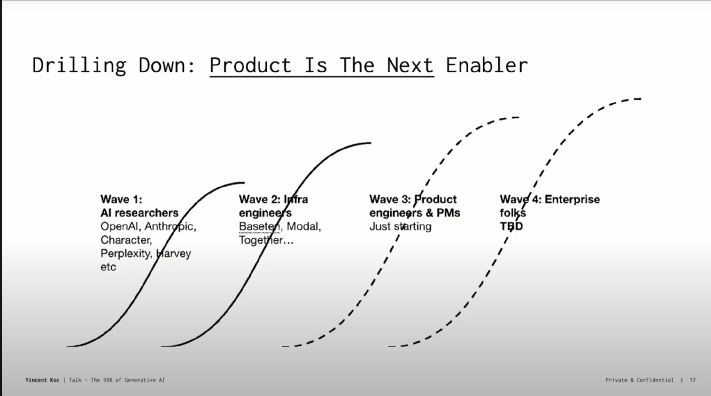
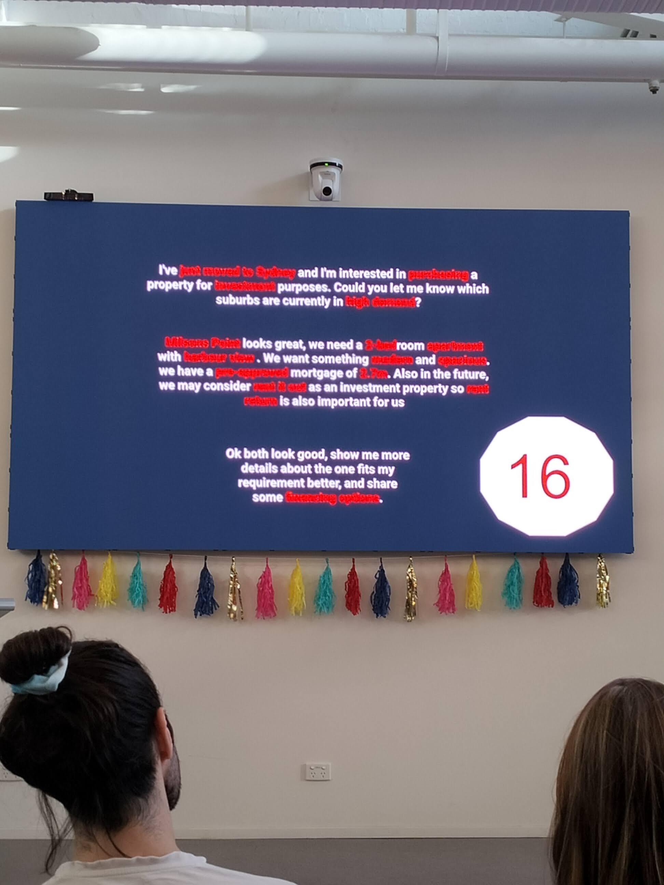

## AI Platform

1. A central platform and service that helps product teams launch AI features in under 8 weeks.
2. A central platform and service that helps internal business teams automate workflows
3. A central platform and service that helps unify the company's AI voice and establish its presence externally in the edtech market as an AI leader
4. A consultancy service that helps our clients experiment with and implement AI features in under 8 weeks

## Why do this

- our competitors are moving ahead of the curve
- our clients are moving ahead of the curve and their expectations are high => educators going ahead of the curve
- our mission
- what are the established emerging practices => examples of what works
- textbook machine learning engineering => 86% of Data projects => **Why do machine learning projects fail**
  - missing data infrastructure
  - specifically mentions lack of support for a machine learning workstyle => mlebook.com Josh Cooper has a section
- antifragile needs a team for rolling with the waves.

##

- prepared to swith. approaches and providers early.

##

Critic framework for agent reflection : https://arxiv.org/abs/2305.11738

Coala framework for agents : https://arxiv.org/abs/2309.02427

##

Dead internet theory says that internet is just bots. Gen AI can accelerate this. Full of stochastic content of no value. And further full of scams. The idea that search will keep up is laughable.

## Thoughts

- focus on how to implement in organisations
- B2B > B2C
- deep dive into edtech
- deep dive into workflows?
- involve wardley maps.
- I like SamboNova

## Pipedream

Check out pipedream for a nice workflow UI and Zapier like utility

## interesting takes on UI

https://www.inkandswitch.com/

## TEQSA Links

https://www.teqsa.gov.au/guides-resources/higher-education-good-practice-hub/artificial-intelligence

=> also look at National AI Centre

##

Maybe I can start with a collection of **predictions** then base my view on that?

THen I can move on to **examples**

## Marvin Minsky Article on AI steps

https://courses.csail.mit.edu/6.803/pdf/steps.pdf

## Strategy and Mental Models that are useful

### Vincent Koc

- above by vicent koc. I have the slides on my gmail via a youtube video.
- he also notes that cost is not an issue as in 2023 alone costs have reduced by 35x for OpenAI
- also notes an anecdote about how a generation is growing up (kid on a train telling ok Alexa stop this) expecting agentic/avataric assistants around to assist with everything. Modern tooling.

- I was interested to explore Everett rogers diffusion of innovation theories
- machine futures and emerging tech
- one at the end creates a whole new revenue stream
- coolest new one is generating the part of product including us on demand product is building itself as you goes

### Chief Data Scientist at Domain

- this interaction for investment property took 1 minute
- 16 intents captured in 60 seconds in 1 interaction of 1 minute
- what about businesses that only have access to one customer they can now leverage ai
- brand is tied to transparency and safety
- a new industry is going to be formed around AI safety like cybersecurity

### AI Jason from relevance

- AI Agents change task unit economy

## AI Design Patterns

[Patterns 1](https://medium.com/towards-data-science/generative-ai-design-patterns-a-comprehensive-guide-41425a40d7d0)
[Patterns 2](https://tomtunguz.com/ai-design-patterns/)

## Various things

- Avatars vs agents. Avatars create connections and are an investment, building a moat which induces switching costs that are not felt by impersonal transactional agents. I.e. an Avatar assistant is less replacable than an agent assistant

A **machine user** is an AI or software entity that performs tasks within digital environments or interacts with humans. These entities can range from simple automated programs to complex systems capable of emulating human decision-making and interaction.

Machine users are pivotal in today's digital landscape, serving a multitude of purposes across various industries. Their abilities span from executing repetitive tasks to engaging in dynamic, human-like interactions. Understanding the distinct types of machine users helps in harnessing their capabilities for improved efficiency, engagement, and innovation.

The classification is based on:

- **Decision Complexity**: Reflects the machine user's capability for making decisions, ranging from basic algorithm-driven choices to advanced, context-aware problem-solving.
- **Relational Dynamics**: Represents the level of interaction the machine user has with its environment or with humans, from simple responses to complex, engaging conversations.

### Quadrants

**Quadrant I: Twins**

These are advanced simulations of real-world systems or processes that can make complex decisions and interact dynamically with their environment.

- _Healthcare Digital Twin_: Adapts treatment plans based on real-time health data.
- _Smart City Digital Twin_: Manages urban environments by integrating diverse data sources.

**Quadrant II: Avatars**

Digital representations that interact with users or environments in a meaningful way but are limited in decision-making complexity.

- _Virtual Customer Service Representative_: Guides customers through online retail stores.
- _Educational Virtual Tutor_: Assists students on e-learning platforms.

**Quadrant III: Bots**

Software programs designed to perform automated tasks, usually repetitive and with minimal interaction.

- _Chatbot for Hotel Bookings_: Manages room bookings and customer queries.
- _Social Media Content Moderator Bot_: Flags inappropriate content based on set guidelines.

**Quadrant IV: Agents**

These systems perform complex tasks autonomously but with limited interaction, focusing on efficiency and execution.

- _Algorithmic Trading Agent_: Executes stock trades based on market analysis.
- _Autonomous Industrial Robot_: Performs complex tasks in manufacturing with minimal human interaction.

### Classification

In this section, we dive deeper into a few complex machine user examples to clarify their categorization:

- **Autonomous Negotiating Car**: A self-driving car that negotiates with smart parking lots for space would be classified as a **Twin**, due to its high decision complexity in real-time and its high relational dynamics in engaging with the parking infrastructure.

- **Self-Restocking Fridge**: A refrigerator that monitors inventory and orders groceries when supplies run low would fall under **Agents**. While it autonomously manages its inventory (high decision complexity), its interactions are limited to transactional ordering processes (low relational dynamics).

- **AI Legal Advisor**: An AI that provides legal advice by analyzing case law and statutes would be an **Agent**. It requires a high level of decision complexity to interpret and apply legal principles but generally does not engage in complex interactions as its advice is typically delivered in a report format.

- **Interactive Fictional Character**: In an immersive storytelling platform, this AI character interacts with users, making choices that influence the story. Its decision-making might appear complex, but it's primarily designed to emulate a character within a narrative context, categorizing it as an avatar.

Understanding the capabilities and interactions of machine users is critical for businesses and developers as they integrate AI into their operations and products. This classification helps in strategizing the deployment of AI systems for optimal performance and user experience.

#### Misclassification

For a machine user to be classified as an **Avatar**, it must exhibit both role emulation and interactivity. Role emulation involves the machine user mimicking or representing a human role, behavior, or persona, often in a digital or virtual environment. Interactivity refers to the machine user's capability to engage in dynamic, two-way interactions, often resembling human-like conversations or social behaviors.

- **Automated News Reader**: Imagine an AI that reads out news articles in a human-like voice. While it might seem like an avatar due to its human-like speech (role emulation), it lacks interactive capabilities. The AI does not engage in two-way communication; it simply performs a one-way broadcast of information. This absence of interactivity classifies it more accurately as a **Bot**, as it's primarily executing a defined, repetitive task without the dynamic engagement typical of avatars.

- **Virtual Museum Guide**: Consider an AI that provides guided tours in a virtual museum. If this AI simply follows a predetermined path and script without engaging with visitors' questions or personalizing the tour based on visitor interactions, it would be an **Agent** rather than an Avatar. Despite emulating the role of a tour guide (role emulation), the lack of real-time, responsive interaction with visitors means it doesn't fully meet the criteria for an Avatar.

Even when a process utilises advanced technologies like Large Language Models (LLMs), it can still be classified as a **Bot**. This classification hinges on the task's nature and the level of decision complexity and interactivity, rather than the sophistication of the technology used.

- **Task Specificity**: If the primary role is executing predefined, often repetitive tasks such as data generation or answering standard queries, it aligns with the bot's characteristic functionality.
- **Limited Interactivity**: Bots typically exhibit restricted interactive capabilities. A process using LLMs but not engaging in dynamic, responsive dialogues fits this category.

- **Decision Scope**: The use of LLMs does not automatically imply complex decision-making. If decisions are based on set rules or parameters, despite the advanced nature of the technology, the process is akin to a bot's operation.

**Example**: An LLM-driven chatbot for customer service, offering scripted responses to inquiries, demonstrates this concept. Despite its advanced underlying technology, its role in providing specific information without complex interactions or autonomous decision-making categorizes it as a "Bot."

In essence, the application and function of the technology, rather than its inherent complexity, determine a machine user's classification.

## Education Strategy / Edtech

Source : https://x.com/zachcohen25/status/1757497529523110191?s=20

### 4 key features

- Multimodal ability
- New interfaces
- Consumer first, B2B
- Hyper-specialised products

### Various companies in this space to consider

Consumer First General companies worth looking into : https://gamma.app/docs/a16z-Consumer-Abundance-Agenda-ieotbnzbxj81biu?mode=doc

| Company                                                                             | Description                           |
| ----------------------------------------------------------------------------------- | ------------------------------------- |
| [Sizzle AI](https://web.szl.ai/)                                                    | Multimodal, step by step tutor        |
| [Curio](https://heycurio.com/)                                                      | Toys come to life                     |
| [Magic School](https://www.magicschool.ai/)                                         | AI assistant for educators            |
| [Iago](https://getiago.com/extension)                                               | Learn Japanese while watching anime   |
| [Edsoma] (https://www.edsoma.com/)                                                  | AI reading assistant                  |
| [Bed Fables] (https://www.bedfables.com/)                                           | Create children's stories with AI     |
| [Matchbooks AI] (https://matchbooks.ai/)                                            | Create children's stories with AI     |
| [StoryWizard AI](https://www.storywizard.ai/)                                       | Create children's stories with AI     |
| [Koaluh](https://x.com/koalluh?s=20)                                                | Create children's stories with AI     |
| [StoryBird AI](https://www.storybird.ai/)                                           | Create children's stories with AI     |
| [Coco](https://coco.build/)                                                         | Co-create creative projects with kids |
| [Pratika](https://praktika.ai/)                                                     | Language Learning                     |
| [Lingostar](https://www.lingostar.ai/)                                              | Language Learning                     |
| [Timekettle](https://www.timekettle.co/)                                            | Translation hardware                  |
| [TalkPal](https://talkpal.ai/)                                                      | Language learning                     |
| [Elsa](https://elsaspeak.com/en/)                                                   | Language learning                     |
| [BoldVoice](https://apps.apple.com/us/app/boldvoice-pronunciation-app/id1567841142) | Language Learning                     |
| [Yoodli](https://app.yoodli.ai/)                                                    | Language/Communication Learning       |
| [Fluently](https://fluently.so/)                                                    | Multilingual writing                  |
| [Stimuler](https://www.stimuler.tech/)                                              | Language/Communication learning       |
| [Cramly](https://www.cramly.ai/)                                                    | Study tutor                           |
| [Studdy](https://studdy.ai/)                                                        | Study tutor                           |
| [Foondamate](https://foondamate.com/)                                               | Study tutor                           |
| [Chiron](https://projectchiron.org/)                                                | Math education                        |
| [Whiteboard AI](https://www.mywhiteboard.ai/)                                       | Study Aid                             |
| [Gizmo](https://gizmo.ai/)                                                          | Study Aid                             |
| [Wizdolia](https://www.wisdolia.com/)                                               | Study Aid                             |
| [Caktus](https://caktus.ai/)                                                        | Study Aid                             |
| [Kinnu](https://kinnu.xyz/)                                                         | Study Aid                             |
| [Quizlet](https://quizlet.com/gb)                                                   | Study Aid                             |
| [Elicit](https://elicit.com/)                                                       | Research                              |
| [Humata](https://www.humata.ai/)                                                    | Research                              |
| [Scite](https://scite.ai/)                                                          | Research                              |
| [Genei](https://www.genei.io/)                                                      | Research                              |
| [Cerelyze](https://x.com/humanloop/status/1693997168498237449?s=20)                 | Research                              |
| [Typeset](https://www.typeset.com/)                                                 | Writing                               |
| [MindGrasp](https://mindgrasp.ai/)                                                  | Study Aid                             |
| [Wonders](https://readwonders.com/)                                                 | Research                              |
| [Synaptiq](https://synaptiq.co/)                                                    | Study Aid for Medicine                |
| [Typeset Science](https://typeset.io/)                                              | Research                              |
| [Causaly](https://www.causaly.com/)                                                 | Research                              |
| [Brisk Teaching](https://www.briskteaching.com/)                                    | Teaching Aid                          |
| [ProfJim](https://profjim.com/)                                                     | Teaching Aid                          |
| [Curipod](https://curipod.com/)                                                     | Teaching Aid                          |
| [Class Companion](https://classcompanion.com/)                                      | Teaching Aid                          |
| [Pressto](https://www.joinpressto.com/)                                             | Teaching Aid                          |
| [Merlyn Mind](https://www.merlynmind.ai/)                                           | Teaching Agents                       |
| [Nolej](https://nolej.io/)                                                          | Teaching Aid                          |
| [Memorang](https://memorang.com/)                                                   | AI platform                           |
| [Quench](https://quench.ai/)                                                        | Turn content into copilot             |
| [Flintk12](https://www.flintk12.com/)                                               | School platform                       |
| [SchoolAI](https://schoolai.com/)                                                   | School platform                       |
| [Atypical](https://www.atypicalai.com/)                                             | No idea what this does                |
| [Kira](https://kirasystems.com/)                                                    | Contract review                       |
| [Vexis](https://vexisai.com/)                                                       | Grading                               |
| [SparkStudio](https://sparkstudio.ai/)                                              | Language Learning                     |
| [Edmachina](https://edmachina.com/)                                                 | Retention AI                          |
| **I have a bunch of admissions edtech in Confluence**                               |                                       |
| [Radius](https://radiusglobal.io/)                                                  | Admissions                            |
| [Extra Edge](https://www.extraaedge.com/)                                           | Marketing and Admissions              |
| [Enrol ML](https://www.enrollml.com/)                                               | Admissions                            |
| [Admit Yogi](https://admityogi.com/)                                                | Admissions                            |
| [College Advisor](https://www.collegeadvisor.com/)                                  | Admissions                            |

## Employee substitute companies

| Company                                           | Description        |
| ------------------------------------------------- | ------------------ |
| [Cognition Labs](https://www.cognition-labs.com/) | Software Engineer  |
| [Version Lens](https://www.versionlens.com/)      | Product Manager    |
| [Magic](https://magic.dev/)                       | Software Engineer  |
| [TextQL](https://www.textql.com/)                 | Data Scientist     |
| [Fluent](https://www.fluenthq.com/)               | Data Analyst       |
| [Mindy](https://mindy.com/)                       | Chief of Staff     |
| [Ema](https://www.ema.co/)                        | Universal Employee |
| [Finpilot](https://www.finpilotai.com/)           | Financial Analyst  |
| [Rogo](https://www.rogodata.com/)                 | Financial Analyst  |
| [Norm AI](https://www.norm.ai/)                   | Compliance         |
| [Arini](https://www.arini.ai/)                    | Receptionist       |
| [Casca](https://www.cascading.ai/)                | Loan Officer       |
| [Runnr](https://runnr.ai/)                        | Hotel Concierge    |
| [Sevn](https://app.sevn.ai/)                      | Designer           |
| [Sierra](https://sierra.ai/)                      | Customer Support   |
| [Rasa](https://rasa.com/)                         | Customer Support   |
|                                                   |                    |
|                                                   |                    |
|                                                   |                    |
|                                                   |                    |
|                                                   |                    |

If agents can help product managers architect and orchestrate workflows that result in faster, cheaper and better quality outcomes, then, depending on the scale of the improvement different opportunities open up.

- slight improvements lead to more productive PMs
- large improvements lead to changes in PM skillsets and labour force compositions (the jury is still out) and the move from "No" to "Yes" (https://x.com/clairevo/status/1774451083622191400?s=20)
- enormous improvements lead to a reshaping of the technology and productivity landscape with the rise of machine users

## Approach

- Get it working
- Get it right
- Get it to scale

https://wiki.c2.com/?MakeItWorkMakeItRightMakeItFast
