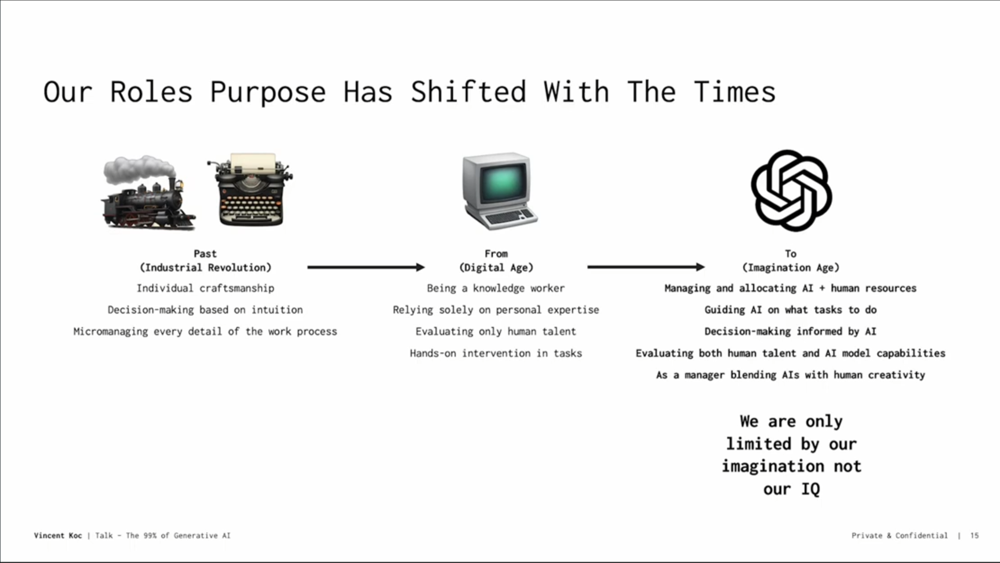

!!! tip "Hypothesis"

    A dedicated platform team accelerates AI value creation and capture for B2B SaaS companies

Innovations are adopted quickly if they are easy to make, easy to use, fit existing patterns, and have visible results. Generative AI has abruptly changed the innovation landscape by acclerating the utility and availability of AI products and services.

While the vast majority of consumers and companies do not make technology, they are actively searching for value in this space. Consequently, technology companies are trying to implement AI features that create value for their customers as fast as possible.

The long tail of B2B SaaS companies have a unique set of challenges. They have enterprise client traction and skilled development teams but lack extra capital and in-house AI/ML resources, making it hard to bootstrap production grade AI capabilities and features.

## Goals

A dedicated platform team helps B2B SaaS companies stay competitive by quickly matching competitors' advances and meeting client expectations for new experiences.

This team drives innovation, positioning the company as a leader in AI, and reduces risk by providing systemic infrastructure and resources to prevent project failures.

It specifically helps:

1. Product teams launch AI features
2. Business teams automate workflows
3. Leaders unify AI strategy, standards and voice
4. Clients adopt third-party AI products
5. Staff upskill AI knowledge and skills

Ultimately, platform teams shape organisational culture, ensuring that responsibility and enthusiasm for AI are shared by everyone, not just a small group of evangelists.

Good platform teams function as skunkworks, rapid execution engines, and guardrails, ensuring the company quickly and safely integrates AI across all operations in order to benefit clients and establish AI leadership amongst competitors.

## Ideas

When bootstrapping platform teams, only speed and outcomes matter. Fast, cheap value creation determines whether platforms continue or are killed off because resources are limited, track records nonexistent and executive patience is thin.

Platform teams must act for all functions and departments in a B2B SaaS company. They should tackle cross disciplinary needs - at least product, design and engineering to start with - and champion fairness - equitable platform access to all products - as foundational principles for success.

Focusing on both technical tooling and service delivery is important, as the latter reduces early bottlenecks the most.

In this environment, prioritisation is king and selecting the correct set of valuable and feasible initiatives to iterate on and build company confidence is crucial.

### Goal 1 : Help product teams launch AI features

| Step | Goal                            | Current Bottleneck                                                                                                                 | Artifact/Build Outcome                                                                                                                        | Platform Team Support                                                                                                                                                                                                                       |
| ---- | ------------------------------- | ---------------------------------------------------------------------------------------------------------------------------------- | --------------------------------------------------------------------------------------------------------------------------------------------- | ------------------------------------------------------------------------------------------------------------------------------------------------------------------------------------------------------------------------------------------- |
| 1    | **Write PRD in 1 day**          | **Lack of Expertise**: Teams may lack AI knowledge to identify feasible opportunities and articulate them effectively.             | **Product Requirements Document (PRD)**: Comprehensive document detailing AI feature ideas, user needs, and proposed solutions.               | **Idea Bank and PRD Generator**: Maintain an idea bank that scans competitor and research feeds and is continually updated. Provide a custom GPT to auto-generate a PRD with minimal context from the PM.                                   |
| 2    | **Build Prototype in 1 week**   | **Resource Intensive**: Creating a prototype requires significant time and resources, especially without in-house AI expertise.    | **Prototype**: An early version of the AI feature for demonstration and initial testing purposes.                                             | **Prototyping Tools and Support**: Offer pre-built modules, libraries, and infrastructure for rapid prototyping, along with technical support and access to shared development environments.                                                |
| 3    | **Create Pitch Deck in 1 day**  | **Approval Delays**: Gaining executive approval can be time-consuming, delaying project progression.                               | **Pitch Deck**: A concise, visually engaging presentation summarizing the AI project, prototype, goals, benefits, and required resources.     | **Executive Communication Templates**: Provide pitch deck templates, data visualization tools, and a repository of key metrics and case studies to support compelling presentations.                                                        |
| 4    | **Build AI Feature in 2 weeks** | **Iterative Process**: Development and integration require significant experimentation, tuning, and technical expertise.           | **Trained AI Model**: The fully developed AI model integrated into the product, ready for final testing and deployment.                       | **Development and Integration Support**: Supply optimized development environments, automated training pipelines, integration frameworks, and a common observability platform for monitoring and debugging.                                 |
| 5    | **Compliance Check in 1 week**  | **Compliance Complexity**: Navigating the complex landscape of AI regulations and standards can be challenging and time-consuming. | **Compliance Report**: Detailed assessment of the AI feature's compliance with relevant regulations and standards.                            | **RAG Database and Compliance Tools**: Create a Retrieval Augmented Generation (RAG) database of compliance requirements for AI, along with tools for auto-evaluating the PRD against these requirements and generating compliance reports. |
| 6    | **Develop GTM Plan in 1 week**  | **Market Readiness**: Ensuring the market is prepared and the product meets customer expectations can be challenging.              | **GTM Plan**: Detailed strategy outlining marketing, sales, and customer support plans for the AI feature launch.                             | **GTM Resources and Insights**: Share market research, user personas, best practices for AI product launches, and tools for tracking market readiness and customer feedback.                                                                |
| 7    | **Launch AI Feature in 1 day**  | **Operational Overheads**: Continuous monitoring and maintenance add to operational efforts.                                       | **Deployed AI Feature**: The AI feature is live in production, with systems in place for monitoring performance and collecting user feedback. | **Monitoring and Feedback Tools**: Implement monitoring systems, feedback loops, and dashboards to track performance metrics, user engagement, and identify areas for improvement.                                                          |

The list below sequences and categorises a core set of ideas for new platform teams to tackle.

- deal desk rubric to select projects, cst hem etc.
- probabilistic software infrastructure

## Josh's Ideas

- What would be timeline for a new feature. What would a sprint look like? What is the capacity of the team
- Some govt and justice product needs an AI feature
- do advanced AI stuff without needing a yearlong project
- What would you need to do to enable a team to enable the most simple thing like a summarisation feature => do we need an experimentation capability
- automatic evaluation
- what models to use
- what metrics to have
- observability platform
- take Admissions approach and generalise it
- How would you take it and generalise it ?

  - data sovereignty - map n data privacy issues
  - techniques for passing secure endpoints. clear understanding of what goes where. privacy guarantees
  - if you had a understanding of privacy constraints you could map that - technical infrastructure and techniques
  - tools and assistance on working with synthetic data how to make sure it is reliable and some tooling
  - centralising tooling is a difficult problem to solve
  - advanced techniques available to a product regardless of expertise
  - really good framework to reduce the costs of LLMs => can document that, write up actual code
  - benefit of centralising AI expertise

  - An over all evaluation rubric
  - making it more suited to a regular machine learning workflow

## Trends

As platform teams mature, the following are a list of key trends to keep in mind.

- Dramatic cost reductions are expected along with increased capital allocation as an ongoing part of budgets (e.g. OpenAI costs reduction)
- Generational change in user behaviour as it comes to agentic/avataric applications
- New revenue streams from AI products
- Boring, high value use cases in automation will proliferate

- **AI Agents Impact**:
  - Changing task unit economy.

## Machine Users Classification

## External Resources

- **Prefect**: See [Prefect](https://www.prefect.io/) for a nice implementation of task and flow primitives.
- **Critic Framework for Agent Reflection**: [Critic Framework](https://arxiv.org/abs/2305.11738).
- **Coala Framework for Agents**: [Coala Framework](https://arxiv.org/abs/2309.02427).
- **Pipedream**: Check out [Pipedream](https://www.pipedream.com/) for a nice workflow UI and Zapier-like utility.
- **Interesting Takes on UI**: [Ink & Switch](https://www.inkandswitch.com/).
- **TEQSA Links**: [Higher Education Good Practice Hub](https://www.teqsa.gov.au/guides-resources/higher-education-good-practice-hub/artificial-intelligence).
- **Marvin Minsky Article on AI Steps**: [AI Steps](https://courses.csail.mit.edu/6.803/pdf/steps.pdf).
- **AI Design Patterns**: [Patterns 1](https://medium.com/towards-data-science/generative-ai-design-patterns-a-comprehensive-guide-41425a40d7d0), [Patterns 2](https://tomtunguz.com/ai-design-patterns/).

- Our competitors are moving ahead of the curve.
- Our clients are moving ahead of the curve and their expectations are high, especially educators.
- Aligns with our mission.
- Established emerging practices: Examples of what works in AI.
- Textbook machine learning engineering: 86% of data projects fail due to missing data infrastructure and lack of support for a machine learning workstyle (see mlebook.com by Josh Cooper).
- Antifragile needs a team for rolling with the waves.
- Prepared to switch approaches and providers early.
- 5. Most people trust peer reviews over scientific studies.

### Classification

- **Decision Complexity**: Capability for making decisions, from basic to advanced.
- **Relational Dynamics**: Level of interaction with the environment or humans.

### Quadrants

1. **Twins**: Advanced simulations with complex decisions and dynamic interactions.
2. **Avatars**: Digital representations with meaningful interactions but limited decision-making.
3. **Bots**: Perform automated, repetitive tasks with minimal interaction.
4. **Agents**: Perform complex tasks autonomously with limited interaction.

### Misclassification Examples

- **Automated News Reader**: A bot due to lack of interactivity despite human-like speech.
- **Virtual Museum Guide**: An agent if it follows a script without engaging with visitors' questions.

## Education Strategy / Edtech

### Key Features

1. Multimodal ability.
2. New interfaces.
3. Consumer first, B2B.
4. Hyper-specialized products.

### Companies to Consider

| Company                                                                             | Description                           |
| ----------------------------------------------------------------------------------- | ------------------------------------- |
| [Sizzle AI](https://web.szl.ai/)                                                    | Multimodal, step-by-step tutor        |
| [Curio](https://heycurio.com/)                                                      | Toys come to life                     |
| [Magic School](https://www.magicschool.ai/)                                         | AI assistant for educators            |
| [Iago](https://getiago.com/extension)                                               | Learn Japanese while watching anime   |
| [Edsoma](https://www.edsoma.com/)                                                   | AI reading assistant                  |
| [Bed Fables](https://www.bedfables.com/)                                            | Create children's stories with AI     |
| [Matchbooks AI](https://matchbooks.ai/)                                             | Create children's stories with AI     |
| [StoryWizard AI](https://www.storywizard.ai/)                                       | Create children's stories with AI     |
| [Koaluh](https://x.com/koalluh?s=20)                                                | Create children's stories with AI     |
| [StoryBird AI](https://www.storybird.ai/)                                           | Create children's stories with AI     |
| [Coco](https://coco.build/)                                                         | Co-create creative projects with kids |
| [Pratika](https://praktika.ai/)                                                     | Language learning                     |
| [Lingostar](https://www.lingostar.ai/)                                              | Language learning                     |
| [Timekettle](https://www.timekettle.co/)                                            | Translation hardware                  |
| [TalkPal](https://talkpal.ai/)                                                      | Language learning                     |
| [Elsa](https://elsaspeak.com/en/)                                                   | Language learning                     |
| [BoldVoice](https://apps.apple.com/us/app/boldvoice-pronunciation-app/id1567841142) | Language learning                     |
| [Yoodli](https://app.yoodli.ai/)                                                    | Language/Communication learning       |
| [Fluently](https://fluently.so/)                                                    | Multilingual writing                  |
| [Stimuler](https://www.stimuler.tech/)                                              | Language/Communication learning       |
| [Cramly](https://www.cramly.ai/)                                                    | Study tutor                           |
| [Studdy](https://studdy.ai/)                                                        | Study tutor                           |
| [Foondamate](https://foondamate.com/)                                               | Study tutor                           |
| [Chiron](https://projectchiron.org/)                                                | Math education                        |
| [Whiteboard AI](https://www.mywhiteboard.ai/)                                       | Study aid                             |
| [Gizmo](https://gizmo.ai/)                                                          | Study aid                             |
| [Wizdolia](https://www.wisdolia.com/)                                               | Study aid                             |
| [Caktus](https://caktus.ai/)                                                        | Study aid                             |
| [Kinnu](https://kinnu.xyz/)                                                         | Study aid                             |
| [Quizlet](https://quizlet.com/gb)                                                   | Study aid                             |
| [Elicit](https://elicit.com/)                                                       | Research                              |
| [Humata](https://www.humata.ai/)                                                    | Research                              |
| [Scite](https://scite.ai/)                                                          | Research                              |
| [Genei](https://www.genei.io/)                                                      | Research                              |
| [Cerelyze](https://x.com/humanloop/status/1693997168498237449?s=20)                 | Research                              |
| [Typeset](https://www.typeset.com/)                                                 | Writing                               |
| [MindGrasp](https://mindgrasp.ai/)                                                  | Study aid                             |
| [Wonders](https://readwonders.com/)                                                 | Research                              |
| [Synaptiq](https://synaptiq.co/)                                                    | Study aid for medicine                |
| [Typeset Science](https://typeset.io/)                                              | Research                              |
| [Causaly](https://www.causaly.com/)                                                 | Research                              |
| [Brisk Teaching](https://www.briskteaching.com/)                                    | Teaching aid                          |
| [ProfJim](https://profjim.com/)                                                     | Teaching aid                          |
| [Curipod](https://curipod.com/)                                                     | Teaching aid                          |
| [Class Companion](https://classcompanion.com/)                                      | Teaching aid                          |
| [Pressto](https://www.joinpressto.com/)                                             | Teaching aid                          |
| [Merlyn Mind](https://www.merlynmind.ai/)                                           | Teaching agents                       |
| [Nolej](https://nolej.io/)                                                          | Teaching aid                          |
| [Memorang](https://memorang.com/)                                                   | AI platform                           |
| [Quench](https://quench.ai/)                                                        | Turn content into copilot             |
| [Flintk12](https://www.flintk12.com/)                                               | School platform                       |
| [SchoolAI](https://schoolai.com/)                                                   | School platform                       |
| [Atypical](https://www.atypicalai.com/)                                             | No idea what this does                |
| [Kira](https://kirasystems.com/)                                                    | Contract review                       |
| [Vexis](https://vexisai.com/)                                                       | Grading                               |
| [SparkStudio](https://sparkstudio.ai/)                                              | Language learning                     |
| [Edmachina](https://edmachina.com/)                                                 | Retention AI                          |
| [Radius](https://radiusglobal.io/)                                                  | Admissions                            |
| [Extra Edge](https://www.extraaedge.com/)                                           | Marketing and admissions              |
| [Enrol ML](https://www.enrollml.com/)                                               | Admissions                            |
| [Admit Yogi](https://admityogi.com/)                                                | Admissions                            |
| [College Advisor](https://www.collegeadvisor.com/)                                  | Admissions                            |

## Employee Substitute Companies

| Company                                           | Description        |
| ------------------------------------------------- | ------------------ |
| [Cognition Labs](https://www.cognition-labs.com/) | Software engineer  |
| [Version Lens](https://www.versionlens.com/)      | Product manager    |
| [Magic](https://magic.dev/)                       | Software engineer  |
| [TextQL](https://www.textql.com/)                 | Data scientist     |
| [Fluent](https://www.fluenthq.com/)               | Data analyst       |
| [Mindy](https://mindy.com/)                       | Chief of staff     |
| [Ema](https://www.ema.co/)                        | Universal employee |
| [Finpilot](https://www.finpilotai.com/)           | Financial analyst  |
| [Rogo](https://www.rogodata.com/)                 | Financial analyst  |
| [Norm AI](https://www.norm.ai/)                   | Compliance         |
| [Arini](https://www.arini.ai/)                    | Receptionist       |
| [Casca](https://www.cascading.ai/)                | Loan officer       |
| [Runnr](https://runnr.ai/)                        | Hotel concierge    |
| [Sevn](https://app.sevn.ai/)                      | Designer           |
| [Sierra](https://sierra.ai/)                      | Customer support   |
| [Rasa](https://rasa.com/)                         | Customer support   |

## Approach

1. Get it working.
2. Get it right.
3. Get it to scale.

Source: [Make It Work, Make It Right, Make It Fast](https://wiki.c2.com/?MakeItWorkMakeItRightMakeItFast).

---

- comfort with autonomy is also a thing that is unclear for now because users take time to get adjusted to this.

## AI Platform

1. A central platform and service that helps product teams launch AI features in under 8 weeks.
2. A central platform and service that helps internal business teams automate workflows
3. A central platform and service that helps unify the company's AI voice and establish its presence externally in the edtech market as an AI leader
4. A consultancy service that helps our clients experiment with and implement AI features in under 8 weeks

## Why do this

- our competitors are moving ahead of the curve
- our clients are moving ahead of the curve and their expectations are high => educators going ahead of the curve
- our mission
- what are the established emerging practices => examples of what works
- textbook machine learning engineering => 86% of Data projects => **Why do machine learning projects fail**
  - missing data infrastructure
  - specifically mentions lack of support for a machine learning workstyle => mlebook.com Josh Cooper has a section
- antifragile needs a team for rolling with the waves.

##

- prepared to swith. approaches and providers early.

## Prefect

See -> https://www.prefect.io/ for a nice implementation of task and flow primitives

##

Critic framework for agent reflection : https://arxiv.org/abs/2305.11738

Coala framework for agents : https://arxiv.org/abs/2309.02427

##

Dead internet theory says that internet is just bots. Gen AI can accelerate this. Full of stochastic content of no value. And further full of scams. The idea that search will keep up is laughable.

## Thoughts

- focus on how to implement in organisations
- B2B > B2C
- deep dive into edtech
- deep dive into workflows?
- involve wardley maps.
- I like SamboNova

## Pipedream

Check out pipedream for a nice workflow UI and Zapier like utility

## interesting takes on UI

https://www.inkandswitch.com/

## TEQSA Links

https://www.teqsa.gov.au/guides-resources/higher-education-good-practice-hub/artificial-intelligence

=> also look at National AI Centre

##

Maybe I can start with a collection of **predictions** then base my view on that?

THen I can move on to **examples**

## Marvin Minsky Article on AI steps

https://courses.csail.mit.edu/6.803/pdf/steps.pdf

## Strategy and Mental Models that are useful

### Vincent Koc

- above by vicent koc. I have the slides on my gmail via a youtube video.
- he also notes that cost is not an issue as in 2023 alone costs have reduced by 35x for OpenAI
- also notes an anecdote about how a generation is growing up (kid on a train telling ok Alexa stop this) expecting agentic/avataric assistants around to assist with everything. Modern tooling.

- I was interested to explore Everett rogers diffusion of innovation theories
- machine futures and emerging tech
- one at the end creates a whole new revenue stream
- coolest new one is generating the part of product including us on demand product is building itself as you goes

### Chief Data Scientist at Domain

- this interaction for investment property took 1 minute
- 16 intents captured in 60 seconds in 1 interaction of 1 minute
- what about businesses that only have access to one customer they can now leverage ai
- brand is tied to transparency and safety
- a new industry is going to be formed around AI safety like cybersecurity

### AI Jason from relevance

- AI Agents change task unit economy

## AI Design Patterns

[Patterns 1](https://medium.com/towards-data-science/generative-ai-design-patterns-a-comprehensive-guide-41425a40d7d0)
[Patterns 2](https://tomtunguz.com/ai-design-patterns/)

## Various things

- Avatars vs agents. Avatars create connections and are an investment, building a moat which induces switching costs that are not felt by impersonal transactional agents. I.e. an Avatar assistant is less replacable than an agent assistant

A **machine user** is an AI or software entity that performs tasks within digital environments or interacts with humans. These entities can range from simple automated programs to complex systems capable of emulating human decision-making and interaction.

Machine users are pivotal in today's digital landscape, serving a multitude of purposes across various industries. Their abilities span from executing repetitive tasks to engaging in dynamic, human-like interactions. Understanding the distinct types of machine users helps in harnessing their capabilities for improved efficiency, engagement, and innovation.

The classification is based on:

- **Decision Complexity**: Reflects the machine user's capability for making decisions, ranging from basic algorithm-driven choices to advanced, context-aware problem-solving.
- **Relational Dynamics**: Represents the level of interaction the machine user has with its environment or with humans, from simple responses to complex, engaging conversations.

### Quadrants

**Quadrant I: Twins**

These are advanced simulations of real-world systems or processes that can make complex decisions and interact dynamically with their environment.

- _Healthcare Digital Twin_: Adapts treatment plans based on real-time health data.
- _Smart City Digital Twin_: Manages urban environments by integrating diverse data sources.

**Quadrant II: Avatars**

Digital representations that interact with users or environments in a meaningful way but are limited in decision-making complexity.

- _Virtual Customer Service Representative_: Guides customers through online retail stores.
- _Educational Virtual Tutor_: Assists students on e-learning platforms.

**Quadrant III: Bots**

Software programs designed to perform automated tasks, usually repetitive and with minimal interaction.

- _Chatbot for Hotel Bookings_: Manages room bookings and customer queries.
- _Social Media Content Moderator Bot_: Flags inappropriate content based on set guidelines.

**Quadrant IV: Agents**

These systems perform complex tasks autonomously but with limited interaction, focusing on efficiency and execution.

- _Algorithmic Trading Agent_: Executes stock trades based on market analysis.
- _Autonomous Industrial Robot_: Performs complex tasks in manufacturing with minimal human interaction.

### Classification

In this section, we dive deeper into a few complex machine user examples to clarify their categorization:

- **Autonomous Negotiating Car**: A self-driving car that negotiates with smart parking lots for space would be classified as a **Twin**, due to its high decision complexity in real-time and its high relational dynamics in engaging with the parking infrastructure.

- **Self-Restocking Fridge**: A refrigerator that monitors inventory and orders groceries when supplies run low would fall under **Agents**. While it autonomously manages its inventory (high decision complexity), its interactions are limited to transactional ordering processes (low relational dynamics).

- **AI Legal Advisor**: An AI that provides legal advice by analyzing case law and statutes would be an **Agent**. It requires a high level of decision complexity to interpret and apply legal principles but generally does not engage in complex interactions as its advice is typically delivered in a report format.

- **Interactive Fictional Character**: In an immersive storytelling platform, this AI character interacts with users, making choices that influence the story. Its decision-making might appear complex, but it's primarily designed to emulate a character within a narrative context, categorizing it as an avatar.

Understanding the capabilities and interactions of machine users is critical for businesses and developers as they integrate AI into their operations and products. This classification helps in strategizing the deployment of AI systems for optimal performance and user experience.

#### Misclassification

For a machine user to be classified as an **Avatar**, it must exhibit both role emulation and interactivity. Role emulation involves the machine user mimicking or representing a human role, behavior, or persona, often in a digital or virtual environment. Interactivity refers to the machine user's capability to engage in dynamic, two-way interactions, often resembling human-like conversations or social behaviors.

- **Automated News Reader**: Imagine an AI that reads out news articles in a human-like voice. While it might seem like an avatar due to its human-like speech (role emulation), it lacks interactive capabilities. The AI does not engage in two-way communication; it simply performs a one-way broadcast of information. This absence of interactivity classifies it more accurately as a **Bot**, as it's primarily executing a defined, repetitive task without the dynamic engagement typical of avatars.

- **Virtual Museum Guide**: Consider an AI that provides guided tours in a virtual museum. If this AI simply follows a predetermined path and script without engaging with visitors' questions or personalizing the tour based on visitor interactions, it would be an **Agent** rather than an Avatar. Despite emulating the role of a tour guide (role emulation), the lack of real-time, responsive interaction with visitors means it doesn't fully meet the criteria for an Avatar.

Even when a process utilises advanced technologies like Large Language Models (LLMs), it can still be classified as a **Bot**. This classification hinges on the task's nature and the level of decision complexity and interactivity, rather than the sophistication of the technology used.

- **Task Specificity**: If the primary role is executing predefined, often repetitive tasks such as data generation or answering standard queries, it aligns with the bot's characteristic functionality.
- **Limited Interactivity**: Bots typically exhibit restricted interactive capabilities. A process using LLMs but not engaging in dynamic, responsive dialogues fits this category.

- **Decision Scope**: The use of LLMs does not automatically imply complex decision-making. If decisions are based on set rules or parameters, despite the advanced nature of the technology, the process is akin to a bot's operation.

**Example**: An LLM-driven chatbot for customer service, offering scripted responses to inquiries, demonstrates this concept. Despite its advanced underlying technology, its role in providing specific information without complex interactions or autonomous decision-making categorizes it as a "Bot."

In essence, the application and function of the technology, rather than its inherent complexity, determine a machine user's classification.

## Education Strategy / Edtech

Source : https://x.com/zachcohen25/status/1757497529523110191?s=20

### 4 key features

- Multimodal ability
- New interfaces
- Consumer first, B2B
- Hyper-specialised products

### Various companies in this space to consider

Consumer First General companies worth looking into : https://gamma.app/docs/a16z-Consumer-Abundance-Agenda-ieotbnzbxj81biu?mode=doc

| Company                                                                             | Description                           |
| ----------------------------------------------------------------------------------- | ------------------------------------- |
| [Sizzle AI](https://web.szl.ai/)                                                    | Multimodal, step by step tutor        |
| [Curio](https://heycurio.com/)                                                      | Toys come to life                     |
| [Magic School](https://www.magicschool.ai/)                                         | AI assistant for educators            |
| [Iago](https://getiago.com/extension)                                               | Learn Japanese while watching anime   |
| [Edsoma] (https://www.edsoma.com/)                                                  | AI reading assistant                  |
| [Bed Fables] (https://www.bedfables.com/)                                           | Create children's stories with AI     |
| [Matchbooks AI] (https://matchbooks.ai/)                                            | Create children's stories with AI     |
| [StoryWizard AI](https://www.storywizard.ai/)                                       | Create children's stories with AI     |
| [Koaluh](https://x.com/koalluh?s=20)                                                | Create children's stories with AI     |
| [StoryBird AI](https://www.storybird.ai/)                                           | Create children's stories with AI     |
| [Coco](https://coco.build/)                                                         | Co-create creative projects with kids |
| [Pratika](https://praktika.ai/)                                                     | Language Learning                     |
| [Lingostar](https://www.lingostar.ai/)                                              | Language Learning                     |
| [Timekettle](https://www.timekettle.co/)                                            | Translation hardware                  |
| [TalkPal](https://talkpal.ai/)                                                      | Language learning                     |
| [Elsa](https://elsaspeak.com/en/)                                                   | Language learning                     |
| [BoldVoice](https://apps.apple.com/us/app/boldvoice-pronunciation-app/id1567841142) | Language Learning                     |
| [Yoodli](https://app.yoodli.ai/)                                                    | Language/Communication Learning       |
| [Fluently](https://fluently.so/)                                                    | Multilingual writing                  |
| [Stimuler](https://www.stimuler.tech/)                                              | Language/Communication learning       |
| [Cramly](https://www.cramly.ai/)                                                    | Study tutor                           |
| [Studdy](https://studdy.ai/)                                                        | Study tutor                           |
| [Foondamate](https://foondamate.com/)                                               | Study tutor                           |
| [Chiron](https://projectchiron.org/)                                                | Math education                        |
| [Whiteboard AI](https://www.mywhiteboard.ai/)                                       | Study Aid                             |
| [Gizmo](https://gizmo.ai/)                                                          | Study Aid                             |
| [Wizdolia](https://www.wisdolia.com/)                                               | Study Aid                             |
| [Caktus](https://caktus.ai/)                                                        | Study Aid                             |
| [Kinnu](https://kinnu.xyz/)                                                         | Study Aid                             |
| [Quizlet](https://quizlet.com/gb)                                                   | Study Aid                             |
| [Elicit](https://elicit.com/)                                                       | Research                              |
| [Humata](https://www.humata.ai/)                                                    | Research                              |
| [Scite](https://scite.ai/)                                                          | Research                              |
| [Genei](https://www.genei.io/)                                                      | Research                              |
| [Cerelyze](https://x.com/humanloop/status/1693997168498237449?s=20)                 | Research                              |
| [Typeset](https://www.typeset.com/)                                                 | Writing                               |
| [MindGrasp](https://mindgrasp.ai/)                                                  | Study Aid                             |
| [Wonders](https://readwonders.com/)                                                 | Research                              |
| [Synaptiq](https://synaptiq.co/)                                                    | Study Aid for Medicine                |
| [Typeset Science](https://typeset.io/)                                              | Research                              |
| [Causaly](https://www.causaly.com/)                                                 | Research                              |
| [Brisk Teaching](https://www.briskteaching.com/)                                    | Teaching Aid                          |
| [ProfJim](https://profjim.com/)                                                     | Teaching Aid                          |
| [Curipod](https://curipod.com/)                                                     | Teaching Aid                          |
| [Class Companion](https://classcompanion.com/)                                      | Teaching Aid                          |
| [Pressto](https://www.joinpressto.com/)                                             | Teaching Aid                          |
| [Merlyn Mind](https://www.merlynmind.ai/)                                           | Teaching Agents                       |
| [Nolej](https://nolej.io/)                                                          | Teaching Aid                          |
| [Memorang](https://memorang.com/)                                                   | AI platform                           |
| [Quench](https://quench.ai/)                                                        | Turn content into copilot             |
| [Flintk12](https://www.flintk12.com/)                                               | School platform                       |
| [SchoolAI](https://schoolai.com/)                                                   | School platform                       |
| [Atypical](https://www.atypicalai.com/)                                             | No idea what this does                |
| [Kira](https://kirasystems.com/)                                                    | Contract review                       |
| [Vexis](https://vexisai.com/)                                                       | Grading                               |
| [SparkStudio](https://sparkstudio.ai/)                                              | Language Learning                     |
| [Edmachina](https://edmachina.com/)                                                 | Retention AI                          |
| **I have a bunch of admissions edtech in Confluence**                               |                                       |
| [Radius](https://radiusglobal.io/)                                                  | Admissions                            |
| [Extra Edge](https://www.extraaedge.com/)                                           | Marketing and Admissions              |
| [Enrol ML](https://www.enrollml.com/)                                               | Admissions                            |
| [Admit Yogi](https://admityogi.com/)                                                | Admissions                            |
| [College Advisor](https://www.collegeadvisor.com/)                                  | Admissions                            |

## Employee substitute companies

| Company                                           | Description        |
| ------------------------------------------------- | ------------------ |
| [Cognition Labs](https://www.cognition-labs.com/) | Software Engineer  |
| [Version Lens](https://www.versionlens.com/)      | Product Manager    |
| [Magic](https://magic.dev/)                       | Software Engineer  |
| [TextQL](https://www.textql.com/)                 | Data Scientist     |
| [Fluent](https://www.fluenthq.com/)               | Data Analyst       |
| [Mindy](https://mindy.com/)                       | Chief of Staff     |
| [Ema](https://www.ema.co/)                        | Universal Employee |
| [Finpilot](https://www.finpilotai.com/)           | Financial Analyst  |
| [Rogo](https://www.rogodata.com/)                 | Financial Analyst  |
| [Norm AI](https://www.norm.ai/)                   | Compliance         |
| [Arini](https://www.arini.ai/)                    | Receptionist       |
| [Casca](https://www.cascading.ai/)                | Loan Officer       |
| [Runnr](https://runnr.ai/)                        | Hotel Concierge    |
| [Sevn](https://app.sevn.ai/)                      | Designer           |
| [Sierra](https://sierra.ai/)                      | Customer Support   |
| [Rasa](https://rasa.com/)                         | Customer Support   |
|                                                   |                    |
|                                                   |                    |
|                                                   |                    |
|                                                   |                    |
|                                                   |                    |

If agents can help product managers architect and orchestrate workflows that result in faster, cheaper and better quality outcomes, then, depending on the scale of the improvement different opportunities open up.

- slight improvements lead to more productive PMs
- large improvements lead to changes in PM skillsets and labour force compositions (the jury is still out) and the move from "No" to "Yes" (https://x.com/clairevo/status/1774451083622191400?s=20)
- enormous improvements lead to a reshaping of the technology and productivity landscape with the rise of machine users

## Approach

- Get it working
- Get it right
- Get it to scale

https://wiki.c2.com/?MakeItWorkMakeItRightMakeItFast
