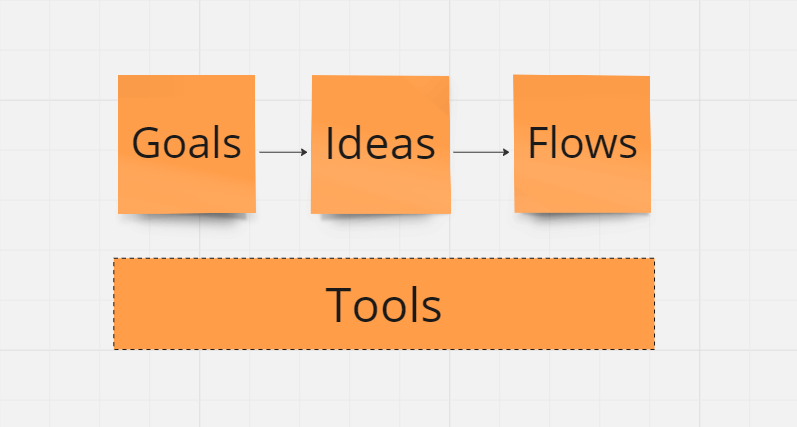

Where product managers end up is not where they start. _Build-measure-learn_ and _design thinking_ are two powerful ways to accelerate value creation and capture. I use these concepts - framed as loops and documents respectively - as foundational schemas in implementation.

## Loops

GIST is a modern approach to learning loops in product management; it stands for **G**oals, **I**deas, **S**teps and **T**asks. The underlying theory advocates rapid experimentation to increase confidence that ideas deliver measurable value.

> goals define what we wish to achieve, ideas are hypothetical ways to achieve the goals, steps are mini-projects that implement an idea in parts while validating it, and tasks are the day-to-day activities that implement a step[1](https://itamargilad.com/book-evidence-guided/)

GIST has a variety of tools available - quantitative metrics, idea banks and ICE scores - to structure loops and is often depicted as a sequential whiteboard with sticky notes.

## Documents

Design thinking is a convenient way to categorise different stages of product planning and execution. I use a specific flavour of design thinking, assigning a single output document to each stage.

These documents are live and persistent artifacts with a dual purpose; they help product managers think better by themselves and communicate their thoughts more clearly to others throughout a loop.

The distinction between loops and documents is the difference between execution routes and planning maps. I position design thinking documents as a parallel step stage and persistent set of artifacts in the GIST loop.

!!! tip

    **Act quickly** with GIST loops and **plan persistently** with design thinking documents

My version of GIST is also a specific instance of the generic workflow class. Workflows combine loops and documents to guide action from concept to execution.

## Flows

The near-term promise of AI agents is that given minimal input and supervision they can:

- decide what to do by stringing together workflow components, sequences and schedules
- get things done by implementing automations, accessing tools and parallelising activity
- know when to start, when to keep going and when to stop
- help architect and orchestrate workflows for faster, cheaper and better outcomes

Agent workflows foreground opportunities for semi-autonomous tool use. This modifies our GIST loop by combining Steps and Tasks into Flows, and adding Tools to the loop. The GIST loop is now the GIFT loop with Tools positioned as the substrate on which Goal, Idea and Flow automations are built.

Tools can take two forms: tools for thought and tools for action. Tools for thought are persistent state objects like the already mentioned design thinking documents. Tools for action are functions that process input, manipulate data and return a result - like calling a weather API to get the forecast for my current location. Tools for thought focus on representation while tools for action focus on transformation.

Inspired by Andrew Ng[2](https://youtu.be/sal78ACtGTc?si=ciC6rMuax6sIdtfU) and Marvin Minsky[3](https://courses.csail.mit.edu/6.803/pdf/steps.pdf), _Planning_, _Reflection_ and _Search_ are predefined workflows that have wide utility and can be nested as Tools in other workflows.

??? danger "Caution"

    Not every workflow or task needs to be agentic. Right now, agents are buzzy and fuzzy; we are all figuring out where they fit and sometimes use them as hammers even when there aren't any nails.

## Intelligence

In a recent nature article[4](https://doi.org/10.1038/s42003-024-06037-4) [5](https://x.com/kasratweets/status/1783217644897984636), intelligence is framed as a defining characteristic of biological systems, operating across scales from molecular to societal.

This challenges the conventional view that intelligence is purely cognitive, instead arguing that each level of biology - all the way down to organs, tissues, and genetic networks, and all the way up to swarms of organisms and societies, and even the biosphere - is intelligent in its own problem space.

At each level, the collective intelligence of competent units (e.g. cells, organs, humans) combine to develop a joint capacity that each individual unit doesn't have on its own. For instance, neural crest cells and tadpole melanocytes demonstrate that biological entities can exhibit collective behaviors that override individual tendencies, enhancing their adaptive success in their respective environments.

In the science fiction novel _Kiln People_, David Brin introduces the idea of 'dittos'. Dittos are temporary clay replicas that perform tasks, experience the world, and transfer memories back to the original human before expiring at the end of the day. This technology significantly alters social structure, economics, and personal interactions.

Dittos are humanoid agents with varying lifespans and intelligence based on colour, representing a gradient from basic labor to advanced cognitive functions. Broadly, the colour abilities are:

- Gray: Handle mundane tasks with limited cognitive abilities
- Green: Engage in skilled labor requiring more intellectual effort
- Blue: Perform complex problem-solving for specialized professional tasks
- Black: Tackle highly specialized fields and complex investigations with deep creativity
- Silver: Used for significant social interactions and business meetings

Each ditto colour addresses a different problem space that is not entirely substitutable or subsumable by another. Silver dittos may be smarter than grays, but it isn't clear that they can do all gray tasks better, faster and cheaper than grays. Further, dittos of the same or different colors working together can often achieve greater outcomes than dittos working alone.

Applied to AI agents, these narratives from biology and science fiction suggest two things. First, agents that perform individual tasks or execute entire workflows by interacting with Large Multimodal Models (LMMs) are specialised kinds of scaled intelligence. Second, multi-agent collaboration in a task or a workflow is a form of collective intelligence that can lead to better quality decisions and outcomes than monolithic agents can achieve by themselves.

!!! tip "Agent Intelligence"

    Agents exhibit **scaled** and **collective** intelligence

In the simplest interactions, an LMM processing a single request demonstrates momentary agency. This happens when the model uniquely responds to each query, creating something new and appropriate for the situation. These instances illustrate the LLM acting with micro creativity. They underscore the model's capacity to generate outputs that are not strictly predetermined.

When LMMs scale from specific tasks towards iterative for-loops - repeating tasks with minor variations - they exhibit rhizomatic agency, inspired by Deleuze and Guattari's concept of endlessly branching structures. Each cycle allows the LLM to subtly adjust its responses, by reading the message history and drawing on the outcomes of previous iterations. This ongoing adaptation distinguishes it from mindless repetition.

Moving to more complex scenarios, LMMs in workflows exhibit systemic agency. These systems coordinate multiple processes to handle complex tasks that surpass the abilities of individual components. This coordination enhances decision-making and outcomes. Unlike the transient and adaptive behaviors of momentary and rhizomatic agencies, systemic agency allows workflows to flexibly manage intricate sequences and unexpected challenges, demonstrating a robust capacity for problem-solving.

Just as in biology and science fiction, I believe that all LMM interactions from single tasks to complex workflows show signs of agency. By focusing on how this agency scales with the complexity of the problem and solution space, we shift from drawing boundaries between abstract definitions of agents to assessing real-world effectiveness.

## Hypothesis

My hypothesis is that agentic tasks and pipelines built to accelerate productivity can also be repurposed or adjusted to accelerate creativity; the reverse is also true.

The core insight is that creative and productive processes and patterns both rely on overlapping agentic workflows. This is particlarly true when focusing - as I am - on the **intersection of AI-generated science fiction and fantasy microworlds and product ideas**.

!!! tip "Hypothesis"

    Productivity and creativity agents share workflows and workflow primitives

I believe the speed, cost and quality improvements offered by agents provides a step change in resources, opportunities and leverage for product managers. Agents help product managers:

- ship faster, cheaper and better at every stage of value capture and creation
- shift the default response from no to yes[8](https://x.com/clairevo/status/1774451083622191400)
- log audit trails for previously implicit thoughts and actions
- weave creative and compelling narratives

See -> https://www.prefect.io/ for a nice implementation of task and flow primitives
