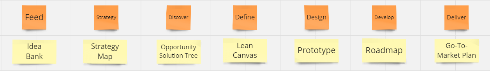
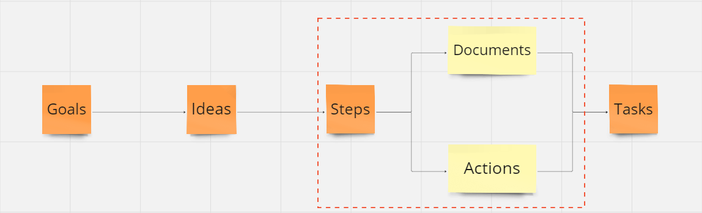

Where product managers end up is not where they start. _Build-measure-learn_ and _design thinking_ are two powerful ways to accelerate value creation and capture. I use these concepts - framed as loops and documents respectively - as foundational schemas in implementation.

## Loops

GIST is a modern approach to learning loops; it stands for **G**oals, **I**deas, **S**teps and **T**asks. The underlying theory advocates rapid experimentation to increase confidence that ideas deliver measurable value.

> goals define what we wish to achieve, ideas are hypothetical ways to achieve the goals, steps are mini-projects that implement an idea in parts while validating it, and tasks are the day-to-day activities that implement a step[1](https://itamargilad.com/book-evidence-guided/)

GIST has a variety of tools available - quantitative metrics, idea banks and ICE scores - to structure loops and is often depicted as a sequential whiteboard with sticky notes.

## Documents

Design thinking is a convenient way to categorise different stages of product planning and execution. I use a specific flavour of design thinking, assigning a single output document to each stage.

These documents are live and persistent artifacts with a dual purpose; they help product managers think better by themselves and communicate their thoughts more clearly to others throughout a loop.

The distinction between loops and documents is the difference between execution routes and planning maps. I position design thinking documents as a parallel step stage and persistent set of artifacts in the GIST loop.

!!! tip

    **Act quickly** with GIST loops and **plan persistently** with design thinking documents

My version of GIST is also a specific instance of the generic workflow class. Workflows combine loops and documents to guide action from concept to execution.

## Workflows

The near-term promise of AI agents is that, given minimal input and supervision they can:

- decide what to do by stringing together workflow components, sequences and schedules
- get things done by implementing automations, accessing tools and parallelising activity
- semi-autonomously know when to start, when to keep going and when to stop
- help architect and orchestrate workflows for faster, cheaper and better outcomes

Taking the goal of writing a fiction novel, the table below distinguishes between four types of agentic workflows.

| Workflow      | Description                                                                                                                                                         | Example                                                                                                                                                                        |
| ------------- | ------------------------------------------------------------------------------------------------------------------------------------------------------------------- | ------------------------------------------------------------------------------------------------------------------------------------------------------------------------------ |
| Operational   | These are the basic tasks that the AI agent handles, like fixing grammar, suggesting better words, or keeping track of character details in a story.                | Imagine the AI agent is like a helpful assistant who takes care of the small but important jobs, such as making sure the writing is polished and consistent.                   |
| Strategic     | These are the bigger plans and decisions the AI agent helps with, like figuring out the main steps of a story or setting goals for what the writing should achieve. | Think of the AI agent as a co-author who helps map out the story's journey and ensures that each chapter moves the plot forward.                                               |
| Cognitive     | These are the smart, thinking tasks where the AI agent analyses the writing, spots areas for improvement, and learns from feedback to make better suggestions.      | The AI agent acts like a wise editor who not only finds issues but also learns what works best for your writing style and preferences.                                         |
| Metacognitive | This is where the AI agent manages and improves its own tasks, strategies, and thinking processes to become more effective over time.                               | Imagine the AI agent is like a self-improving app that gets better at helping you the more you use it, constantly fine-tuning its assistance based on your needs and feedback. |

These workflows can also be applied to the goal of a product manager delivering an admissions module within a student management system.

| Workflow      | Description                                                                                                                                                                                      | Example                                                                                                                                                                                                                                                                                                                                                                                                                                                                                                                                 |
| ------------- | ------------------------------------------------------------------------------------------------------------------------------------------------------------------------------------------------ | --------------------------------------------------------------------------------------------------------------------------------------------------------------------------------------------------------------------------------------------------------------------------------------------------------------------------------------------------------------------------------------------------------------------------------------------------------------------------------------------------------------------------------------- |
| Operational   | These are the basic tasks that the AI agent handles, such as automating data entry for student applications, generating reports on application status, or sending notifications to applicants.   | Imagine the AI agent as a meticulous assistant who streamlines the admissions process by automatically entering student application data, generating real-time reports on the status of applications, and sending timely notifications to applicants about their application status.                                                                                                                                                                                                                                                    |
| Strategic     | These are the larger plans and decisions the AI agent assists with, using frameworks like GIST to set goals, generate ideas, plan steps, and execute tasks for developing the admissions module. | Think of the AI agent as a strategic partner who uses the GIST framework to help the development team set clear goals for the admissions module, brainstorm features that enhance the admissions process, outline development steps, and guide the execution of the module development.                                                                                                                                                                                                                                                 |
| Cognitive     | These are the intelligent analysis and decision-making tasks where the AI agent identifies patterns in application data, plan module enhancements, and solve usability challenges.               | The AI agent acts like a smart analyst who examines application data, plans improvements based on applicant feedback, and addresses usability challenges to enhance the module's effectiveness and user experience.                                                                                                                                                                                                                                                                                                                     |
| Metacognitive | This is where the AI agent oversees and refines its own operational, strategic, and cognitive workflows to optimize the development and implementation of the admissions module over time.       | Visualise the AI agent as a self-regulating system that continually optimises its performance within the admissions module. It assesses its own effectiveness in handling application workflows, identifies areas for improvement in data analysis, and adapts its strategies for engaging with applicants. This self-assessment and adaptation are driven by ongoing feedback from the admissions team and shifts in application patterns, ensuring the module remains aligned with the evolving objectives of the admissions process. |

??? danger "Caution"

    Not every workflow or outcome needs to be agentic, especially operationally. Many of the items above may just be app features with no agent input or output.

    Right now, agents are buzzy and fuzzy; we are all figuring out where they fit and sometimes use them as hammers even when there aren't any nails.

As workflows move from operational to metacognitive, they get less domain specific, more abstract and more general purpose. Operational workflows are usually some type of concrete user journey or user flow. GIST is an example of a strategic but still domain specific workflow as is Double/Triple Diamond design thinking.

Marvin Minsky's _Search -> Pattern-Recognition -> Learning -> Planning -> Induction_ and Andrew Ng's _Reflection -> Tool Use > Planning -> Multi-Agent Collaboration_ come to mind as examples of cognitive workflows with greater abstraction and wider applicability with their genesis in artificial intelligence. Finally, Flavell, Brown, and Nelson and Naren's models of metacognition are all examples of thinking about thinking.

## Hypothesis

My hypothesis is that agents and pipelines built to accelerate productivity in product management can also be repurposed or adjusted to accelerate creativity in generating content about fictional businesses, products and people.

!!! tip "Hypothesis"

    Productivity and creativity agents enhance each other through shared workflows

The core insight is that creative and product management processes and patterns both rely on overlapping agentic workflows. This is particlarly true when focusing - as I am - on the **intersection of AI-generated science fiction and fantasy microworlds and product ideas**.

I believe the speed, cost and quality improvments offered by agents also starts to reposition the role of product managers from always saying no amidst scarcity to starting to say yes amidst abundance[2](https://x.com/clairevo/status/1774451083622191400).

## One Hour PM

I'm building a library - a work in progress which I'm calling **One Hour PM** - that uses generative AI agents to help product managers accelerate value creation and capture. It does this by exploring how agents and automations can improve **creative** and **productive** ways of working with product ideas and tasks.

The library has the following key features:

- **Simple**: One input interface across all tasks
- **Multimodal**: Inputs and outputs work with many data types
- **Curated**: Modern product tools and templates selected with a bias for lean workflows
- **Contextual**: Add custom data sources for more specific and specialised outcomes
- **Connected**: Access to internal and external tools
- **Automatic**: Agents execute creative and directed tasks semi-autonomously
- **Fast**: Compressing task cycle times to minutes and workflow cycle times to an hour
- **Solo**: Get more done with only yourself-in-the-loop
- **Safe**: Validated output that enforces structure and reliability
