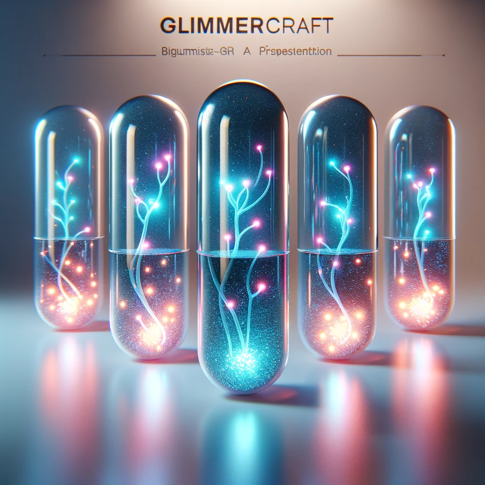

## Story

Amidst the bustling floating market of Armada, a young artisan named Jael struggles with the limited visibility in her underwater sculpture workshop. The dim, flickering lights barely penetrate the murky depths, affecting her intricate carvings. That’s when she discovers GlimmerCraft, a novel lighting system harnessing bioluminescent organisms. The vibrant, steady glow transforms her workspace, illuminating her art in a spectrum of colors, and turning her once struggling venture into a sought-after attraction.

## Founding Team

1. **Talos** - A resourceful bio-engineer, adept in marine biology, specializing in bioluminescence. His passion for sustainable solutions drives the core technology of GlimmerCraft.
2. **Renna** - A seasoned artisan turned tech-innovator, excelling in design and aesthetics. Her expertise ensures that GlimmerCraft is not only functional but also artistically appealing.
3. **Verek** - A shrewd strategist with a deep understanding of Armada's complex market dynamics. He navigates the business through the intricate socio-economic waters of the floating city.

## How it Works

GlimmerCraft utilizes genetically modified bioluminescent organisms, housed in elegant, artistic capsules. These organisms are sustainably harvested and nurtured, providing a renewable light source. Users can adjust the intensity and color spectrum through simple, intuitive mechanisms, catering to various artistic and practical needs.

## Marketing Jingle

_"Light up your craft, with a GlimmerCraft!"_

## Key Features

1. **Sustainable Light Source:** Harnesses bioluminescence for an eco-friendly solution.
2. **Customizable Spectrum:** Offers a range of colors and intensities for diverse artistic needs.
3. **Elegant Design:** Artistically crafted capsules that enhance any workspace aesthetics.
4. **Ease of Use:** Simple, user-friendly controls to adjust lighting.
5. **Renewable and Safe:** Utilizes renewable organisms, ensuring safety and sustainability.

## Hater's Corner

"As an old-school craftsman, I find GlimmerCraft's reliance on fancy organisms unnecessary. Traditional light sources have worked for centuries. Plus, maintaining these capsules is a hassle. Not everyone wants to play scientist in their workshop."

## Two Sentence Story

"Ever tried sculpting in the dark? With GlimmerCraft, even the shadows in Armada’s depths can't hide my masterpiece’s flaws!"

## Early Adopters

1. **Underwater Artists and Artisans:** Seeking a reliable light source for precision work in murky environments.
2. **Submarine Botanists:** Needing specialized lighting to study and showcase exotic deep-sea flora.
3. **Night Market Vendors:** Looking to attract customers with visually appealing and unique stall lighting.
