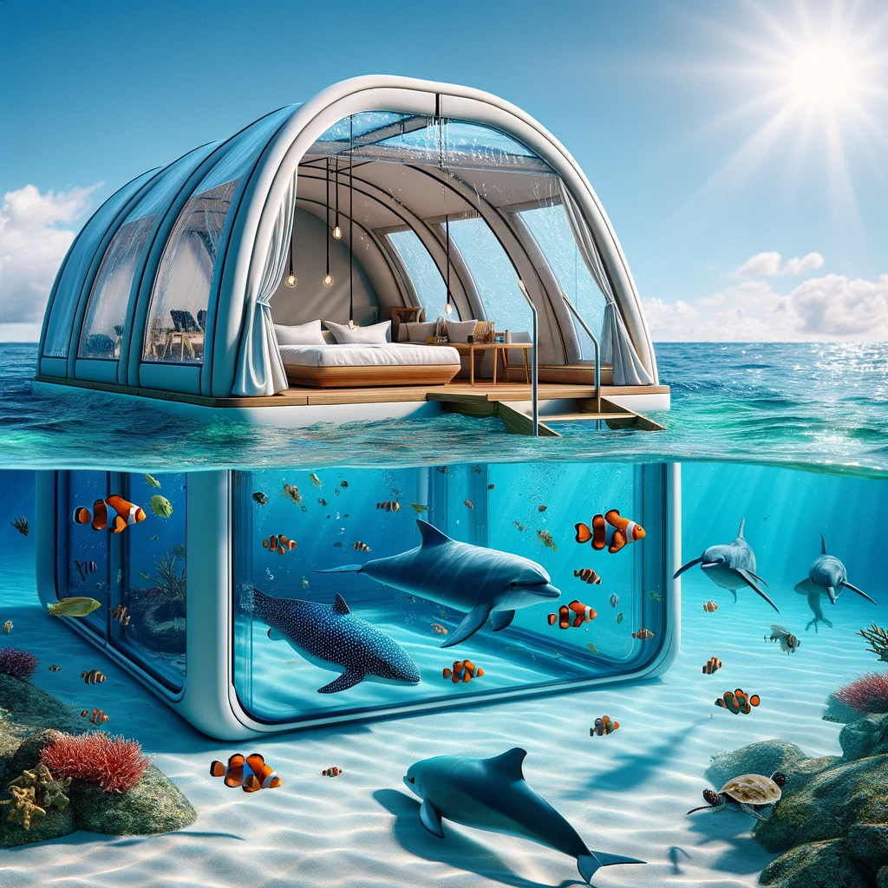

## Story

In the sun-kissed realm of Solaria, Marina Coralheart, a visionary mermaid princess, had always yearned to bridge the gap between land-dwellers and the enigmatic beauty of the ocean depths. She envisioned a world where not only humans but beings of diverse species could immerse themselves in the underwater world comfortably, free from the constraints of diving gear or pollution. Turning this dream into reality required more than just wishful thinking.

One fateful day, Marina met a diverse group of beachgoers, each with their unique backgrounds and origins, yearning to explore the ocean's depths. Some sought adventure, others wanted to bond with marine life, and a few simply craved relaxation amidst the aquatic wonders. The spark of inspiration ignited within her. With her underwater expertise and their shared passion, the stage was set for an extraordinary journey.

## Founding Team

- **Marina Coralheart**: The visionary mermaid princess, skilled in understanding oceanic ecosystems and marine life.
- **Professor Samuel Oceanus**: A human marine biologist with a deep love for the ocean and extensive knowledge of marine environments.
- **Ella Shorewalker**: An engineer and inventor, specializing in developing waterproof materials and structures.
- **Captain Finn Seafarer**: A retired sea captain with vast experience navigating ocean waters, ensuring safety during underwater excursions.

## How It Works

**AquaTents** are revolutionary beach tents designed to immerse you in the ocean's wonders without ever leaving the shore. These state-of-the-art tents are partially submerged in shallow waters, providing a unique opportunity for beings of diverse species to explore the underwater world in comfort. Featuring transparent walls that offer an unobstructed view of marine life, AquaTents combine education, adventure, and relaxation.

Guests can lounge comfortably in AquaTents while observing colorful fish, vibrant coral reefs, and even the occasional playful dolphins or turtles. To ensure a safe and enjoyable experience, each tent comes equipped with adjustable seating, a retractable sunshade for sun protection, and a marine biologist-led tour for a deeper understanding of the marine environment.

## 🎵 Marketing Jingle 🎵

"Dive into Serenity with AquaTents – Where the Ocean Meets Your Paradise Retreat!"

<video controls>
<source src="../../assets/10.mp4" type="video/mp4">
</video>

## Key Features

- **Universal Compatibility**: AquaTents are designed to accommodate beings from diverse species, ensuring everyone can explore the ocean's wonders.
- **360° Underwater View**: Crystal-clear panels offer a panoramic view of the underwater world while providing protection from harmful UV rays.
- **Customizable Comfort**: AquaTents come with adjustable seating, a retractable sunshade, and a variety of seating arrangements, ensuring a cozy experience for all visitors.
- **Eco-Friendly Design**: The tents are made from sustainable, ocean-friendly materials, and a portion of every AquaTents booking goes toward marine conservation efforts.
- **Marine Life Interaction**: Specially designed feeders allow guests to observe and interact with friendly marine creatures that visit the tent.

## Hater's Corner

A skeptical beachgoer complains, "AquaTents are intriguing, but what about the marine life? Won't they be disturbed by all the visitors? And what if the tent gets damaged and harms the delicate coral reefs? We should prioritize marine conservation over entertainment."

## Main Competitor

"DeepSea Domes" offers a similar underwater experience, but their structures are permanent installations, limiting accessibility. AquaTents, on the other hand, provide a more flexible and eco-friendly solution for exploring the ocean, offering a welcoming space for beings from various species.

## Two-Sentence Story

During an AquaTent excursion, a curious octopus named Oswald decided to join the guests, providing impromptu ink-based artwork on the tent's transparent walls, creating a whimsical underwater art show that left everyone in stitches.

## Early Adopters

- **Xandar the Alien Explorer**: A curious intergalactic traveler eager to witness Earth's marine life up close.
- **Aria Shadowdancer**: A mystical sorceress with a fascination for the ocean's magical energies.
- **Grimgor the Orc Warlord**: A fearsome warrior from a fantasy realm who finds solace in the tranquility of the underwater world.

## Maybe This Happens

Years later, as Marina Coralheart gazes upon a pristine coral reef teeming with life, she reflects on her journey from mermaid princess to pioneering entrepreneur. Little did she know that her dream of uniting beings from diverse species with the ocean would lead to a deeper understanding of both worlds. AquaTents had not only connected different beings with the wonders of the ocean but also fostered bonds between species, creating a community that celebrated the beauty and diversity of marine life together, one tent at a time.
