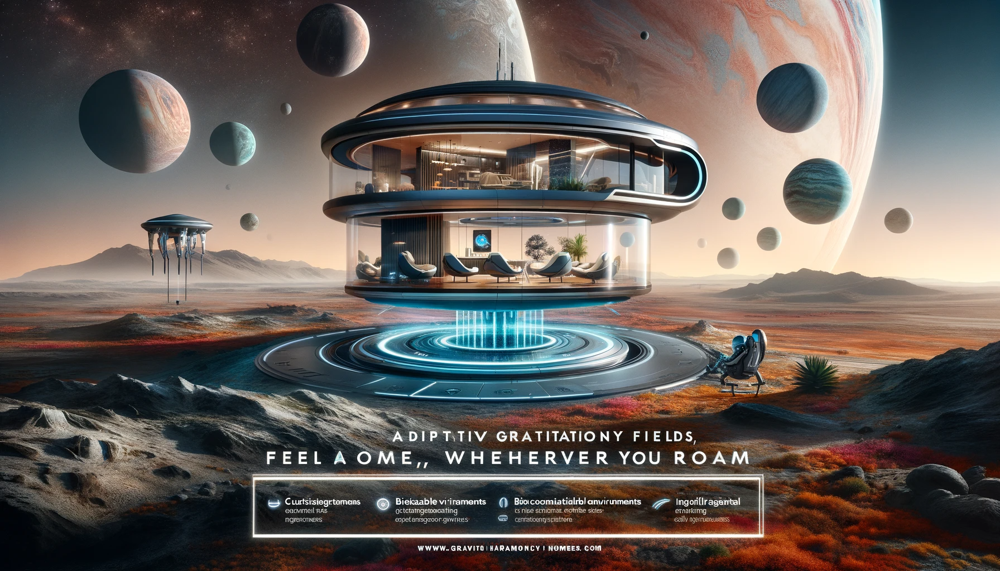

## Story

In a galaxy where interstellar travel has become the norm, three diverse individuals find a sense of home in the most unexpected places. Zara, a Martian geologist, discovers comfort and ease in her new off-world habitat that mimics Mars' gravity. Jin, a child born in zero gravity, experiences Earth's gravity for the first time without the usual strain, thanks to "Gravitational Harmony Homes". Lastly, Elder Selon, from a high-gravity world, finds relief from his planet's intense pressure in a customized living space that adapts to his physical needs.

## Founding Team

- **Lev Graviton**: Master of Gravitational Physics, providing the core technology.
- **Aria Zel**: Expert in Exobiology, ensuring the homes are biologically compatible with diverse species.
- **Rho Telluride**: Architectural Genius, blending design with functionality.
- **Elia Sync**: AI Specialist, integrating artificial intelligence for adaptive environmental control.

## How It Works

Gravitational Harmony Homes use advanced gravitational field manipulation technology to customize the gravity in each living space, adapting to the native gravitational needs of its inhabitants. This allows for a seamless transition for species and individuals moving between planets with varying gravity levels.

## Marketing Jingle

"Feel at Home, Wherever You Roam - Gravitational Harmony!"

## Key Features

1. **Adaptive Gravitational Fields**: Customizes gravity to match any planetary standard.
2. **Biocompatible Environments**: Ensures suitability for a wide range of biological needs.
3. **Intelligent Environmental Control**: AI-driven systems that adjust settings for optimal comfort.
4. **Sustainable Energy Use**: Utilizes zero-point energy, minimizing environmental impact.
5. **Aesthetic Customization**: Designs that reflect the cultural heritage of the inhabitants.

## Hater's Corner

"I miss the challenge of adapting to new gravities. Gravitational Harmony Homes make it too easy, taking away the thrill of interplanetary travel. Plus, how do we know this won't make us weak over time?" - Xan, Intergalactic Adventurer

## Main Competitor

"Stellar Adjust Residences" - a company that creates biomes mimicking entire planetary environments, not just gravity. They offer a full sensory experience but lack the flexibility and energy efficiency of Gravitational Harmony Homes.

## Two-Sentence Story

At a Gravitational Harmony Home showcase, a notoriously gravity-sensitive Glorbian fainted from delight, only to float gently to the ground, cushioned by the home's perfectly calibrated gravity. It was the first time in history a Glorbian experienced a soft landing!

## Early Adopters

- **Greta the Gardener**: Loves how her exotic plants from different gravity environments can now thrive under one roof.
- **Maxim the Miner**: A space miner who can now relax in Earth-like gravity after long stints in zero-g environments.
- **Luna and Sol Starbound**: A couple from different planets who find common ground in their shared home, tailored to both their needs.

## Maybe This Happens

Years later, Lev Graviton stands on the balcony of a Gravitational Harmony Home, floating above a breathtaking alien landscape. He smiles, reminiscing about his early doubts, and watches a child experiencing Earth's gravity for the first time, their laughter echoing in the air. Suddenly, a bird, native to a low-gravity planet, swoops by and playfully snatches Lev's hat, reminding him that in this vast universe, gravity is but a playful element.
