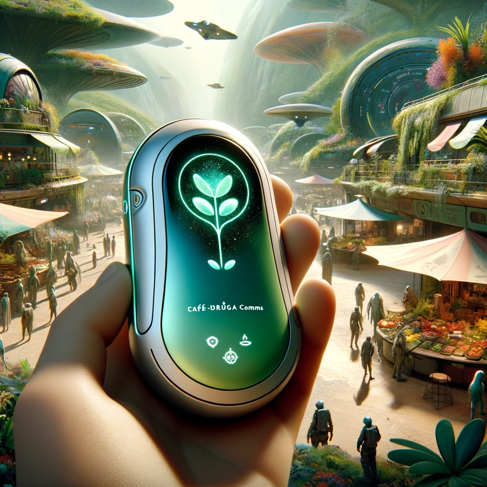

## Story

In the verdant forests of Cafethra, a trader named Zylex struggles to negotiate with the local insectoid farmers. He's frustrated, as the subtle plant murmurs elude him. Enter Jaxar Tanglethorn with his Café-Oruga Comms device. Instantly, the murmurs become clear speech in Zylex's earpiece, bridging the communication gap. The farmers, too, are delighted, as their needs are finally understood and respected. This breakthrough leads to a thriving trade relationship, transforming Cafethra's economy.

## Founding Team

1. **Jaxar Tanglethorn** - An expert in plant and insect murmurs, bringing invaluable insight into interspecies communication.
2. **Rina SynthTech** - A tech genius from Neon Shroud, specializing in advanced device engineering and AI.
3. **Lorix Quill** - A marketing strategist with a knack for understanding diverse cultural dynamics.

## How It Works

Café-Oruga Comms devices capture the subtle vibrations and murmurs of Cafethra's flora and fauna, translating them into various galactic languages through an AI-driven translator. The device also learns and adapts to new dialects and species-specific communication methods, ensuring effective and dynamic interspecies dialogue.

## Marketing Jingle

"Harmonizing Nature's Choir, Café-Oruga for a World More Inspired!"

## Key Features

1. **Adaptive Translation AI**: Continuously learns and updates from every interaction.
2. **Multi-Species Compatibility**: Tailored for a wide range of species and languages.
3. **Eco-Sustainable Design**: Crafted from environmentally friendly materials native to Cafethra.
4. **Compact and Durable**: Ideal for field use in various environmental conditions.
5. **Real-Time Communication**: Instant translation with minimal lag.

## Hater's Corner

"Sure, Café-Oruga Comms bridges species, but what about the nuances lost in translation? Plus, it relies on the user's interpretation of AI translations - a risky game in delicate negotiations!"

## Main Competitor

**Chatterleaf Networks**: Specializing in organic communication enhancers, Chatterleaf taps into the natural bio-rhythms of plants and insects for translations, offering a more 'organic' approach but lacking the advanced AI and adaptability of Café-Oruga Comms.

## Two-Sentence Story

At an intergalactic trade fair, a mischievous child fiddles with a Café-Oruga Comms, accidentally setting it to interpret plant 'complaints.' The ensuing chaos of diplomats hearing their potted plants' gripes about overwatering becomes the talk of the galaxy!

## Early Adopters

1. **Grexar the Trader**: Always traveling to new planets, Grexar finds the device perfect for his diverse dealings.
2. **Ambassador Lila**: A diplomat working to foster interspecies alliances, she values the device for its precision and adaptability.
3. **Fen the Researcher**: Studying unique ecosystems, Fen relies on Café-Oruga Comms for accurate data collection.

## Maybe This Happens

Years later, Jaxar quietly revisits a now bustling market in Cafethra. Watching diverse species converse effortlessly, he smiles, remembering the days of misunderstandings. As he turns to leave, a child tugs his sleeve, thanking him in a perfect blend of human and insectoid language, a product of his invention.
