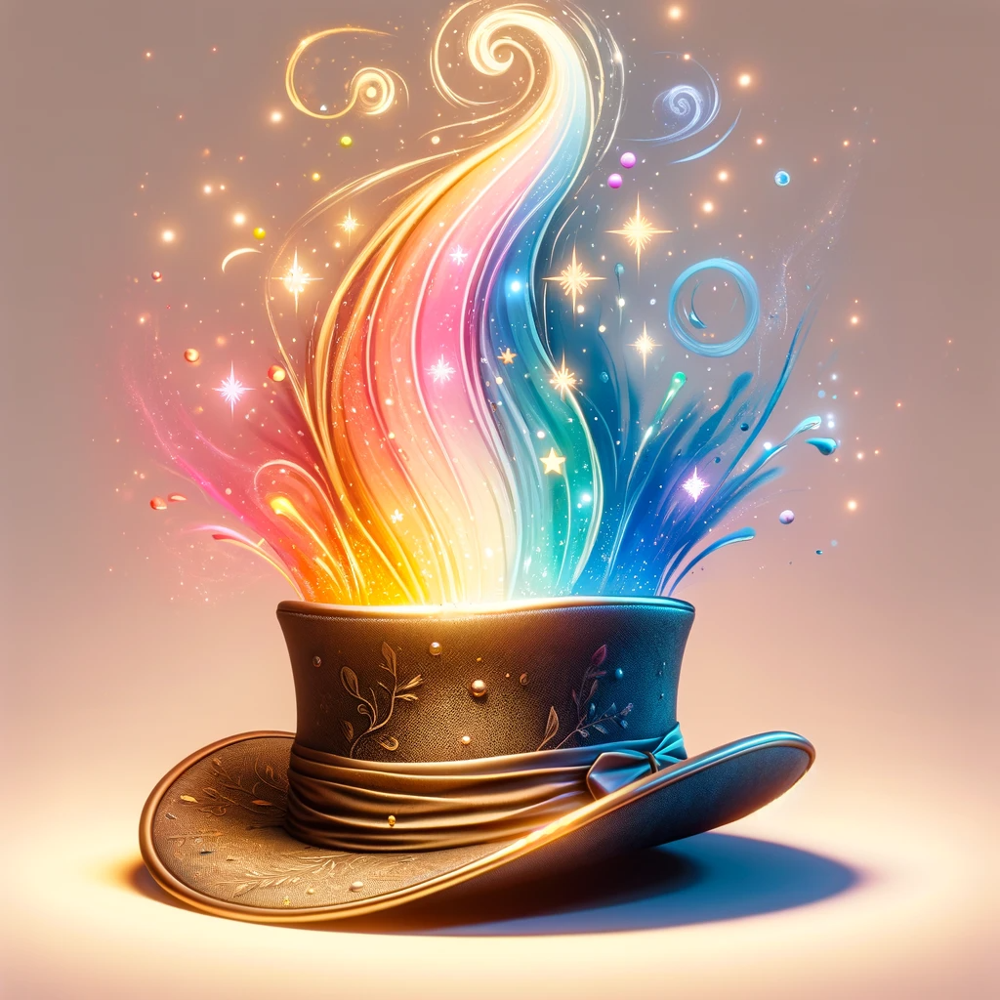
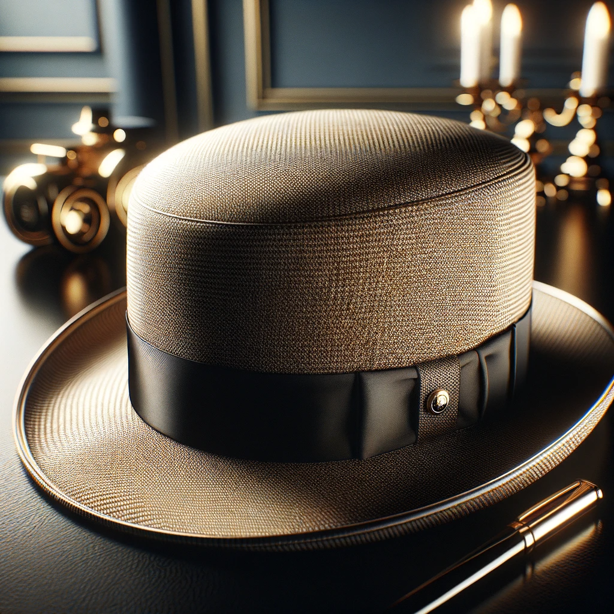

## Story

In the bustling, vibrant city of Lumina, where emotions manifest as colorful auras, three individuals find their lives transformed by MoodHues Chapeau. Emily, a shy artist, discovers newfound confidence as her hat shifts into a radiant crown during a gallery opening, reflecting her inner pride. Marcus, a public speaker, watches his hat morph into a sleek, commanding top hat, amplifying his presence on stage. And little Mia, struggling with expressing her feelings, finds comfort as her MoodHues bonnet gently glows, mirroring her emotions to her parents in a silent language of colors.

## Founding Team

1. **Marisol Sombrerero:** the magical, shape-shifting hat, brings her empathic abilities to understand emotions and aesthetics.
2. **Leonardo:** a visionary technomagician skilled in enchanting objects
3. **Sofia:** a marketing guru with a knack for understanding the heart of consumers. T

## How It Works

Each MoodHues Chapeau is enchanted with empathic magic, allowing it to read and reflect the wearer's emotions through color and shape transformations. Integrated with a subtle, magical feedback loop, the hat adjusts its form to provide emotional support and confidence-boosting aesthetics, making it more than just a fashion statement.

## Marketing Jingle

"Cap your Day with a Hue, MoodHues Chapeau, Reflecting the True You!"

## Key Features

1. **Emotion-Sensitive Transformations**: Responds to the wearer's emotional state with color and shape changes.
2. **Personalized Comfort Fit**: Magically adjusts to provide the perfect fit for any head shape.
3. **Durable Enchantment**: Long-lasting magical effects resistant to wear and tear.
4. **Eco-Friendly Materials**: Sustainably sourced fabrics infused with organic enchantments.
5. **Customizable Designs**: Option for wearers to select base styles and color palettes.

## Hater's Corner

"Sure, they change color and shape, but what about when you're trying to hide how you feel? The last thing I need is my hat blabbing about my mood in a business meeting!" - Cynical Steve, a privacy-conscious businessman.

## Main Competitor

"StaticTop Hats" - Traditional, high-end headwear with no magical properties. StaticTop focuses on classic designs and luxury materials, appealing to those who prefer a more conservative, unchanging style and value privacy over emotional expression.

## Two-Sentence Story

When a MoodHues Chapeau accidentally ended up on the head of a notoriously stoic judge during a court session, the courtroom erupted in laughter as the hat transformed into a whimsical jester's cap, revealing the judge's secret amusement at the case's absurdity.

## Early Adopters

1. **Isabella, the Empathic Counselor**: Drawn to the hat's ability to visually express emotions, aiding in her therapy sessions.
2. **Lucas, the Trendsetting Teenager**: Loves the idea of showcasing his dynamic personality through fashion.
3. **Eleanor, the Introverted Novelist**: Finds the hat's mood-reflecting feature a unique way to communicate her feelings without words.

## Maybe This Happens

Years later, Marisol Sombrerero, now an acclaimed innovator, sits quietly in her Lumina studio, her original MoodHues Chapeau perched beside her. She smiles wistfully, recalling the myriad emotions her creation has mirrored, and in a whimsical twist, the hat shifts to a soft, nostalgic beret, reflecting her journey.
