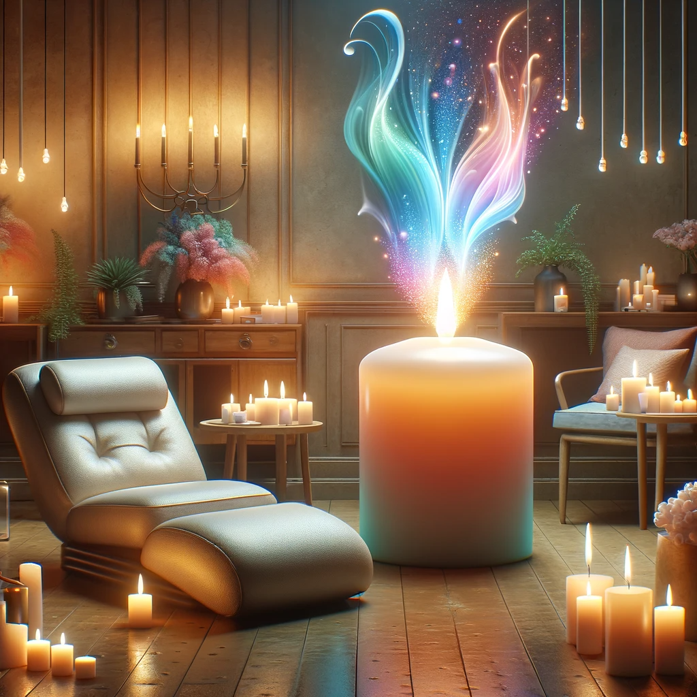
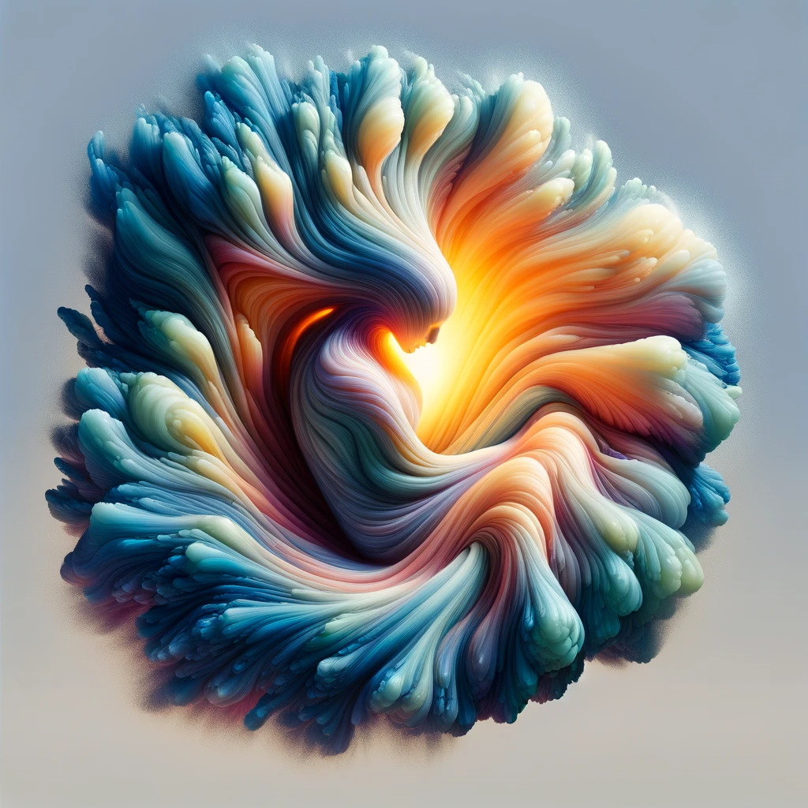
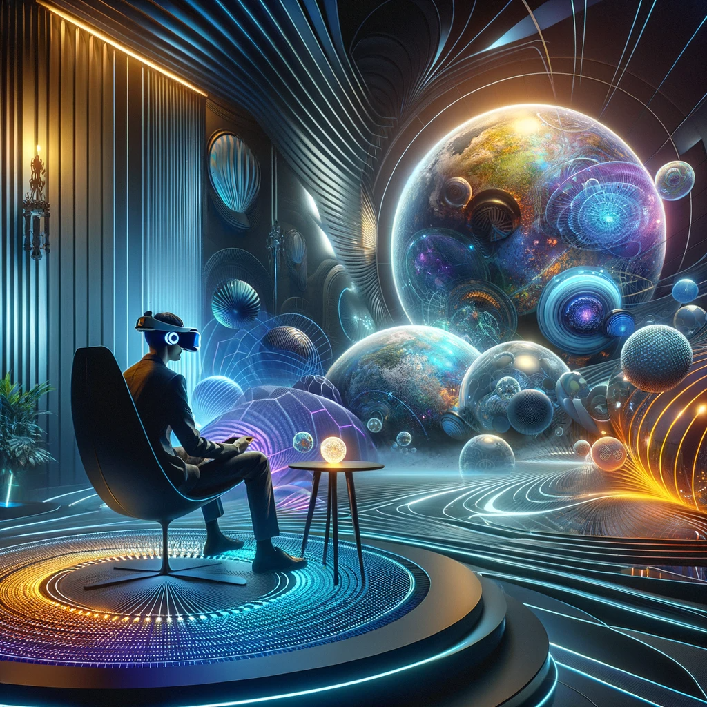

## Story

In the bustling city of Lumenopolis, three individuals find solace in Waxen Calm's serene ambiance. Maya, a stressed-out tech developer, experiences a profound sense of peace as the soft light from Candelus soothes her overworked mind. Leo, a retired veteran, finds the gentle glow reminiscent of the campfires from his adventurous past, bringing him a nostalgic comfort. Young Emma, fascinated by Candelus's changing shapes, discovers a playful curiosity in the ever-shifting lights, turning her fear of the dark into enchantment.

## Founding Team

- **Candelus**: The visionary light being, whose unique composition is central to the business's concept.
- **Iris Lightfoot**: An expert in light therapy, bringing scientific understanding of light's therapeutic effects.
- **Marco Lumiere**: A seasoned entrepreneur with a knack for creating ambient spaces that appeal to urban dwellers.
- **Elena Shadow**: A tech wizard specializing in integrating smart technology with natural elements.

??? example "Founder Photo - Candelus"

    

## How It Works

Waxen Calm utilizes Candelus's ability to morph and emit various intensities and colors of light. Customers enter personalized light chambers where Candelus adjusts the ambiance to their emotional and psychological needs. The sessions combine light therapy with a natural, calming environment, augmented with smart technology to create bespoke therapeutic experiences.

## 🎵 Marketing Jingle 🎵

"Shine, Shape, Soothe - Light Up Your Mood with Waxen Calm!"

<video controls>
<source src="../../assets/18.mp4" type="video/mp4">
</video>

## Key Features

1. **Adaptive Illumination**: Candelus's light changes in response to the user's mood.
2. **Personalized Sessions**: Tailored light therapy based on individual preferences and needs.
3. **Smart Integration**: Use of smart tech to enhance the overall experience and track progress.
4. **Eco-Friendly Design**: Sustainable and natural environment, promoting wellness and environmental consciousness.
5. **Interactive Ambiance**: Users can interact with Candelus, creating a unique and personal connection.

## Hater's Corner

"Sure, Waxen Calm's lights are pretty, but it's just a glorified lamp show. How much can colored lights really help with real stress or anxiety? Seems more like a temporary escape than a solution."

## Main Competitor

"Solace Sphere" – A competitor offering virtual reality-based relaxation experiences. Their high-tech approach creates immersive, customizable worlds, posing a challenge to Waxen Calm's more natural and intimate setting.

## Two-Sentence Story

During a Waxen Calm session, Candelus accidentally morphed into the shape of a unicorn, leading to an unexpected burst of laughter from a typically reserved CEO. This moment of whimsy became the talk of the town, showcasing Waxen Calm's ability to surprise and delight.

## Early Adopters

- **Zara Zenith**: A yoga instructor drawn to the natural and calming aspects of the light therapy.
- **David Digi**: A software engineer looking for non-digital ways to de-stress.
- **Ella Evergreen**: An environmental activist who appreciates the eco-friendly approach.
- **Samuel Smiles**: A child psychologist interested in using Waxen Calm for therapy sessions with children.

## Maybe This Happens

Years later, Candelus, standing in a newly opened Waxen Calm center on a distant planet, reflects on the countless lives touched by their soothing light. A surprise visit from an alien child, giggling at Candelus's light shapes, reminds them of the universal language of light and laughter, a poignant moment that transcends worlds and species.
