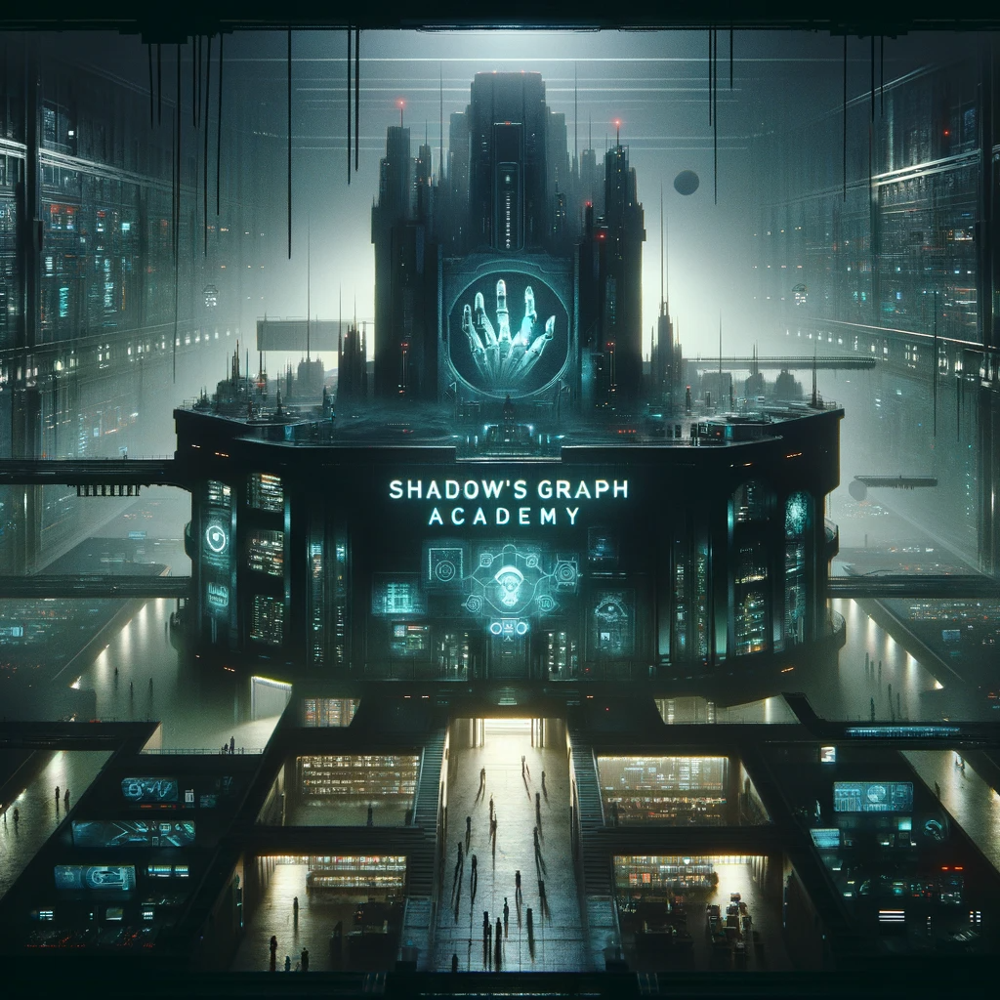

## Story

In the bustling alleys of New Arcadia, three young outcasts, Jax, Luna, and Milo, find their paths crossing at the Sleight of Hand Academy. Jax, a street performer, uses his new skills to escape the clutches of the city guards. Luna, once a struggling artist, now crafts illusions with her hands, mesmerizing audiences. Milo, the shy bookworm, finds confidence in his newfound dexterity, evading the scrutiny of the ever-watchful market enforcers.

## Founding Team

- **Moxie:** A master pickpocket with a heart of gold, leading with charm and a mischievous grin.
- **Rex:** A retired thief-turned-teacher, bringing decades of experience in stealth and strategy.
- **Zara:** A tech whiz, creating gadgets and tools for the modern-day pickpocket.
- **Eve:** A former street magician, specializing in distraction and illusion.

## How It Works

The academy offers courses in pickpocketing techniques, blending traditional sleight of hand with modern stealth technology. Students learn through interactive holographic simulations, real-world exercises, and lectures on the psychology of distraction.

## Marketing Jingle

"Quick hands, quick minds, escape the binds, at Sleight of Hand Academy!"

## Key Features

1. **Holographic Training Modules:** Lifelike simulations to practice in a risk-free environment.
2. **Customized Stealth Gear:** Tailored gadgets and clothing for seamless thievery.
3. **Psychological Manipulation Classes:** Understanding and exploiting human behavior.
4. **Real-World Application Tests:** Safely orchestrated pickpocketing scenarios in controlled settings.
5. **Network of Alumni:** A supportive community for job opportunities and mentorship.

## Hater's Corner

"A pickpocketing school? It's just glamorizing crime! Real jobs don't involve stealing wallets. What's next, a burglary bachelor's degree?"

## Main Competitor

"Shadow's Graph" - A rival school that focuses on high-tech thievery, using advanced gadgets and cyber-tools. They claim a more 'modern' approach, appealing to those who prefer technology over traditional methods.

??? example "Founder's Bio"

    

    **Founder's Bio: Zephyr Xanthe**

    In the shadowy realms of the interstellar underbelly, where technology and cunning intersect, stands Zephyr Xanthe, the enigmatic founder of Shadow's Graph Academy. Zephyr, belonging to the elusive Xylothian race, brings a blend of otherworldly intellect and stealth to the art of high-tech thievery.

    Born under the twin moons of Xylotha, a planet known for its dense, dark forests and advanced civilizations, Zephyr quickly outgrew the confines of their native world. With skin like dark metallic scales that shimmer in the starlight and multiple, glowing eyes capable of seeing in various spectrums, Zephyr was always set apart. Their early years were spent mastering the art of stealth among the ancient, towering megatrees of Xylotha, where silence was not just a skill but a means of survival.

    Zephyr's journey across the galaxies was marked by a trail of sophisticated heists and ingenious escapades. They delved into the most secure vaults and escaped the most perilous traps, not for wealth or fame, but for the sheer thrill of the challenge. Their reputation grew, not only as a master thief but as a visionary in the use of technology for espionage and subterfuge.

    Upon arriving on Earth, Zephyr was fascinated by human society's reliance on and reverence for technology. They saw an opportunity to blend their alien techniques with human technological advancements. Thus, Shadow's Graph Academy was born – a place where the art of thievery transcended mere pickpocketing to become a dance of shadows and light, of technology and skill.

    Zephyr's teaching methods are as unconventional as their appearance. They focus on psychological manipulation, advanced gadgetry, and the art of remaining unseen in a world where everything is observed. Their lessons are not just about stealing valuables but about understanding the deeper value of objects and secrets in the tapestry of the universe.

    Mysterious and rarely seen, Zephyr is more than just the founder of the academy; they are a symbol of the unattainable, a legend whispered in the dark corners of the galaxy. To their students, Zephyr is not just a teacher but a gateway to a world where the impossible becomes possible, where the unseen becomes seen, and where the boundaries of what can be owned and what can be known are pushed to their very limits.

## Two-Sentence Story

When Moxie demonstrated the 'invisible wallet lift' during an open house, Mayor Johnson’s wallet somehow ended up on the academy's trophy shelf. The Mayor still can't figure out if he should be angry or impressed.

## Early Adopters

- **"Sneaky Pete"**: A small-time crook looking to refine his skills.
- **"Illusionist Izzy"**: A street magician seeking to add pickpocketing to her act.
- **"Nimble Nicky"**: A young runaway looking for a way to survive in the city.

## Maybe This Happens

Years later, Moxie, now a renowned figure in the underworld, quietly visits the academy. She smiles at the new generation, their hands as quick as whispers, and leaves a mysterious, unstealable coin on the doorstep – her legacy.
