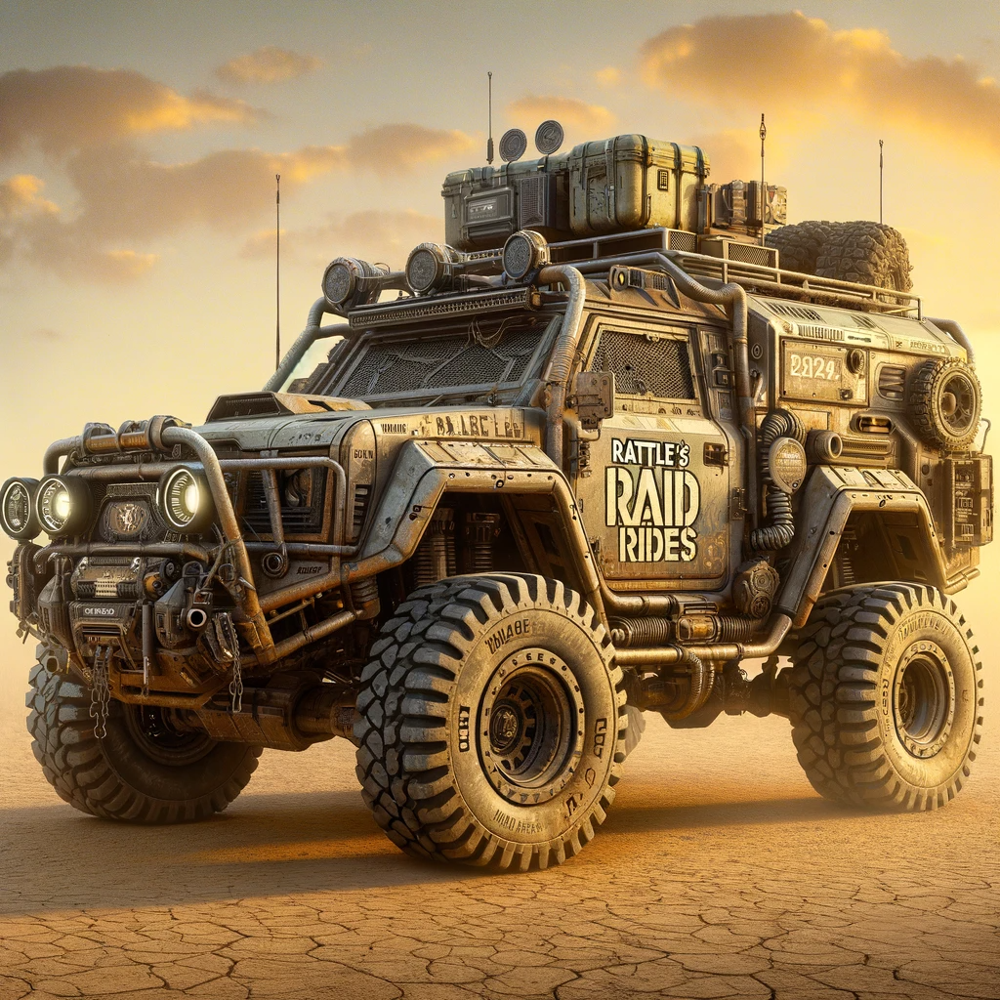
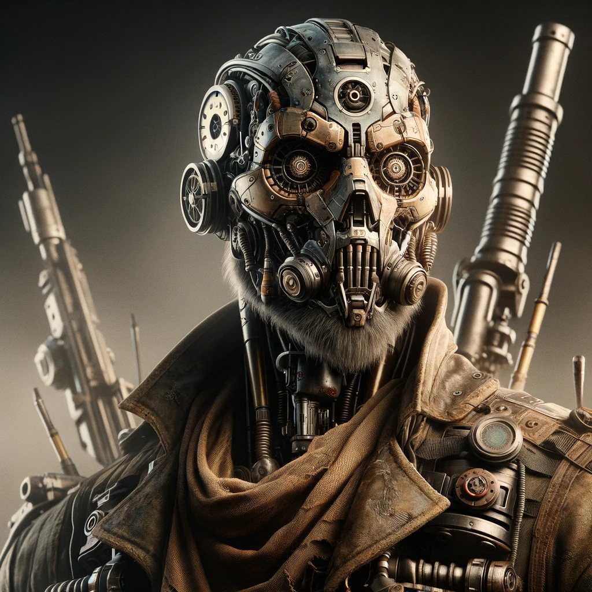
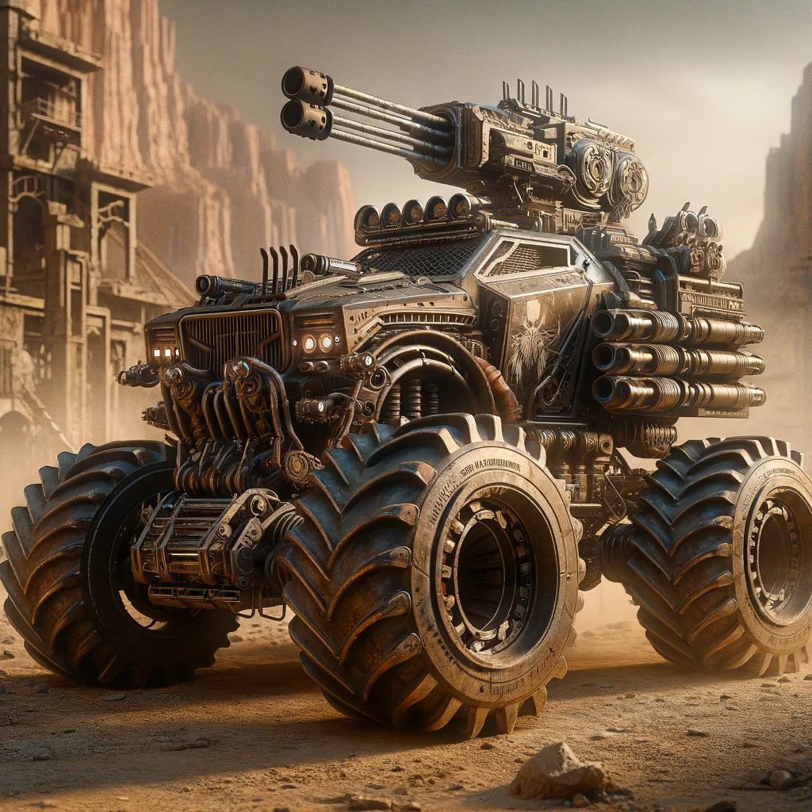

## Story

In the dusty, post-apocalyptic world of Dusthaven, three individuals find purpose at Rattle's Raid Rides. Max, a lone wanderer, discovers a newfound sense of belonging as he navigates treacherous terrains. Ava, a mechanic with a knack for speed, sees her creations come to life on perilous runs. Jake, once a timid scavenger, finds his courage behind the wheel, outrunning dangers of the wasteland.

## Founding Team

- **Rattle:** The charismatic and ingenious founder, with unmatched driving skills and a deep knowledge of the wasteland.
- **Spike:** A seasoned raider-turned-mechanic, responsible for vehicle modifications and maintenance.
- **Ruby:** A savvy navigator and strategist, planning the safest and most efficient raid routes.

## 📽️ How It Works 📽️

<video controls>
<source src="../../assets/21b.mp4" type="video/mp4">
</video>

Rattle's Raid Rides offers customized vehicles for raiding parties, equipped for the harsh conditions of the wasteland. Customers can rent vehicles for specific missions, with options for armor, speed, or stealth. The service includes route planning, vehicle maintenance, and emergency support.

## 🎵 Marketing Jingle 🎵

"Speed through dust, leave foes behind, with Rattle's Raid Rides, the wasteland's kind!"

<video controls>
<source src="../../assets/21.mp4" type="video/mp4">
</video>

## Key Features

1. **Customizable Vehicles:** Tailored for different raiding needs - speed, armor, or stealth.
2. **Advanced Navigation Systems:** Equipped with maps and tools for navigating the unpredictable wasteland.
3. **Emergency Support:** Quick response team for vehicle recovery and repair.
4. **Route Planning Services:** Expert advice on the safest and most efficient raiding routes.
5. **Community Workshops:** Teaching basic repair and maintenance skills to customers.

## Hater's Corner

"Rattle's rides are just flashy death traps. Real raiders build their own wheels. Why rent when you can make something that's truly yours?"

## Main Competitor

"Desert Demons" - A rival gang offering more aggressive and heavily armed vehicles. They appeal to raiders who prefer brute force over strategy and reliability.

## Two-Sentence Story

During a showcase race, Rattle's favorite buggy, "The Scorpion," got stuck in a sand trap. He quipped, "Guess it's more of a desert snail today," as he cheerfully dug it out.

## Early Adopters

- **"Daring Dan"**: An adrenaline junkie seeking the thrill of high-speed desert chases.
- **"Clever Clara"**: A resourceful scout in need of reliable transportation for scouting missions.
- **"Scavenger Sam"**: A lone wolf who values stealth and efficiency on his looting expeditions.

## Maybe This Happens

Years down the line, Rattle finds himself teaching young wastelanders how to build their own raid rides, passing on his legacy and love for the open desert.
