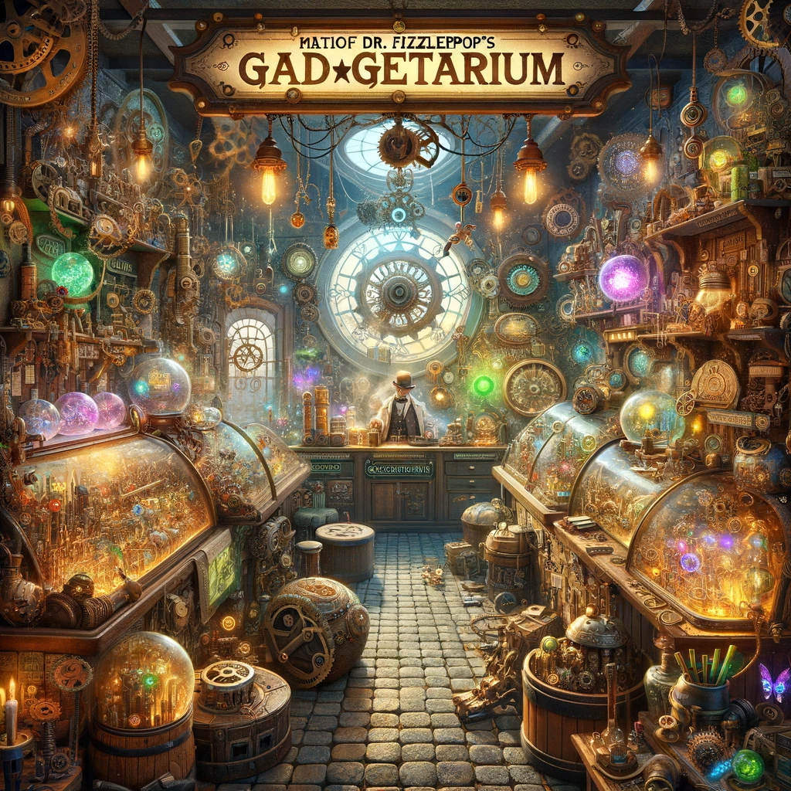
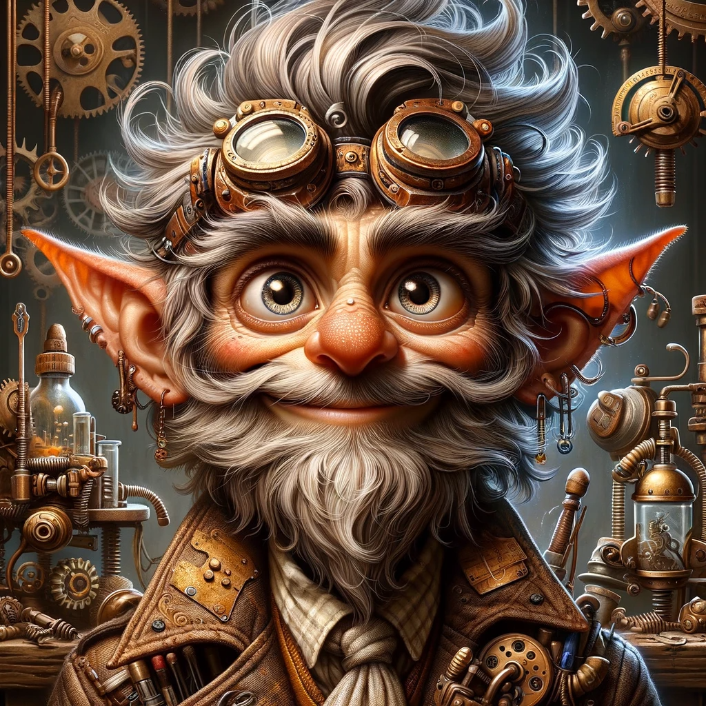
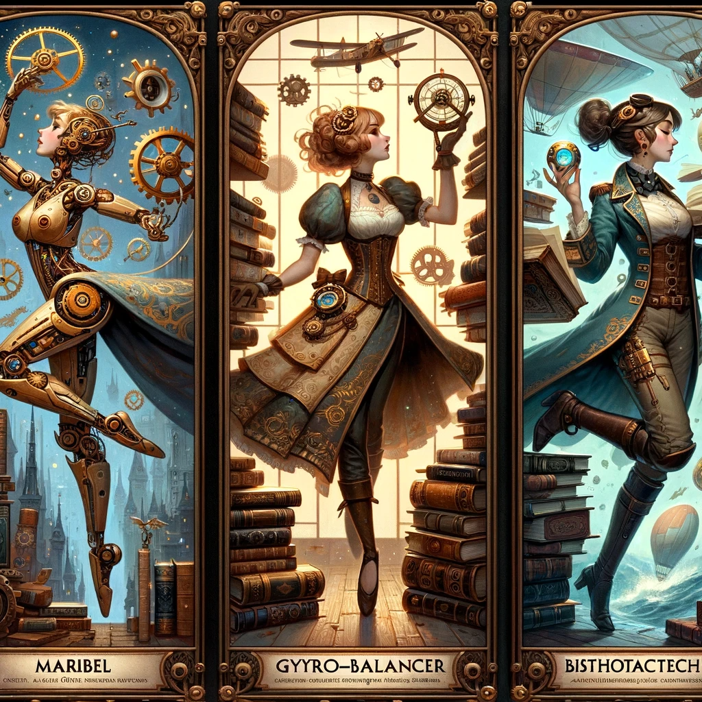
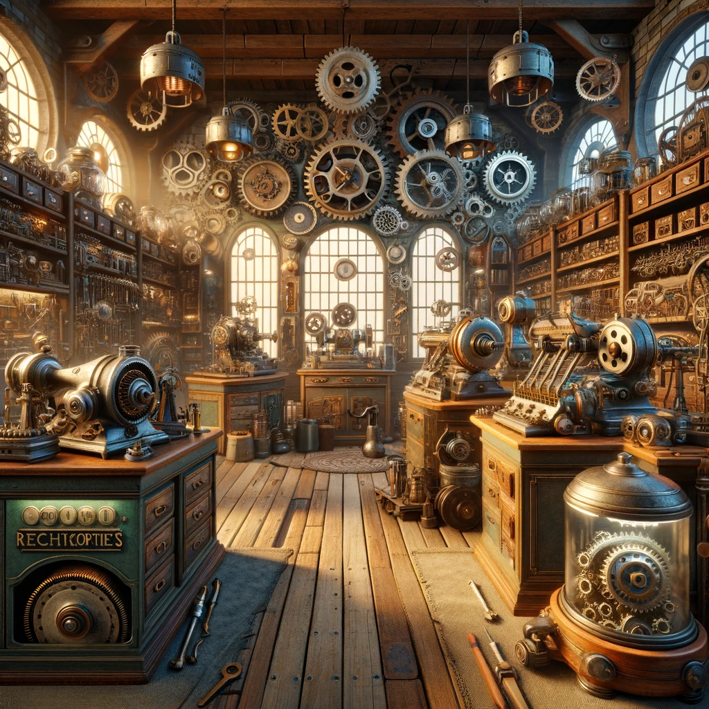
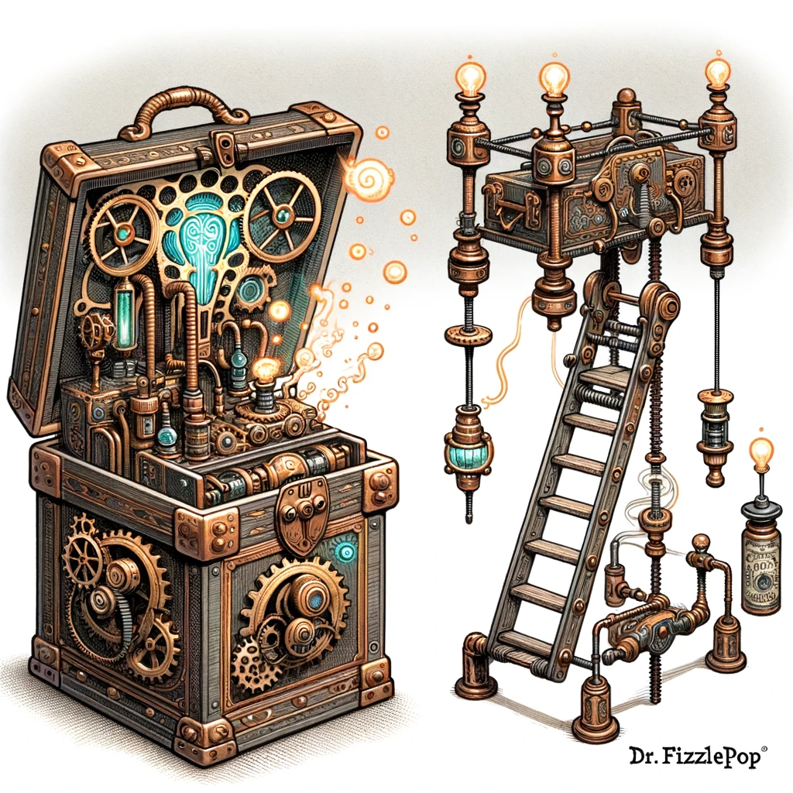

## Story

In the bustling steampunk city of Gearford, three unlikely friends - a clockwork dancer named Maribel, a steam-powered librarian, Rowan, and an adventurous sky pirate, Captain Zephyra - each find their lives transformed by Dr. Fizzlepop's inventions. Maribel, once restricted by her rigid gears, now dances with fluid grace thanks to Fizzlepop's Gyro-Balancer. Rowan, overwhelmed by the vast library archives, now efficiently categorizes ancient tomes using the Bibliotech Navigator. Captain Zephyra, facing treacherous air currents, navigates the skies with ease using the Aetheric Compass. Each gadget not only solves practical problems but also brings a touch of whimsy and wonder into their lives.

## Founding Team

1. **Dr. Fizzlepop**: The eccentric half-goblin, half-human inventor with a penchant for the bizarre.
2. **Ivy Gearspanner**: A genius mechanical engineer, specializing in kinetic and steam-powered machinery.
3. **Jasper Tinkersmith**: A savvy businessman and master craftsman, adept at bringing Fizzlepop's ideas to market.

## How It Works

Fizzlepop's Fantastical Contraptions are a unique blend of magic and machinery. Each invention is custom-built, incorporating both ancient enchantments and cutting-edge steam tech. The gadgets are designed to be user-friendly, adaptable, and, most importantly, to add a dash of magic to everyday tasks.

## Marketing Jingle

"Whirl, twirl, steam, and spark, Fizzlepop makes its magical mark!"

## Key Features

1. **Adaptive Enchantment**: Gadgets adjust magically to the user’s needs.
2. **Steam-Powered Durability**: Built to last with the finest Gearford steel and steam tech.
3. **Customization**: Each contraption is uniquely tailored to the customer's whimsy.
4. **Eco-Magical Efficiency**: Utilizes renewable magical energies, ensuring sustainability.
5. **Portable and Compact**: Designed for convenience, each gadget is easily transportable.

## Hater's Corner

"I've seen Fizzlepop's gadgets. They're all flash and no substance. They look pretty and do the job, but the magic wears off too quickly, and they're not as reliable as good, old-fashioned gear-and-cog machinery."

## Main Competitor

**Cogsworth's Reliable Machineries**: A more traditional and conservative competitor, Cogsworth's focuses on durability and functionality over whimsy. Their gadgets lack the magical flair of Fizzlepop's but are known for their reliability and efficiency.

## Two-Sentence Story

When Lady Arabella's cat got stuck in a tree, instead of calling the fire brigade, she used Fizzlepop's Extendable Ladder-in-a-Box. To everyone's surprise, the ladder not only rescued the cat but also transformed into a comfortable reclining chair for Lady Arabella to relax in afterward.

## Early Adopters

1. **The Curious Tinkerer, Gwendolyn**: Always looking for the latest gadget to help with her inventions.
2. **The Overworked Homesteader, Angus**: Seeks efficient solutions for daily chores on his steam farm.
3. **The Aspiring Magician, Eliot**: Enthralled by the combination of magic and machinery, perfect for his act.
4. **The Boutique Cafe Owner, Eliza**: Desires unique contraptions to add flair to her cafe's ambiance.

## Maybe This Happens

Years later, Dr. Fizzlepop, now an acclaimed inventor, finds an old, unfinished gadget in his workshop. As he tinkers with it, the device suddenly springs to life, projecting a holographic map of a hidden, mystical city. With a chuckle and a sense of newfound adventure, he whispers, "Maybe it's time for a new journey."
