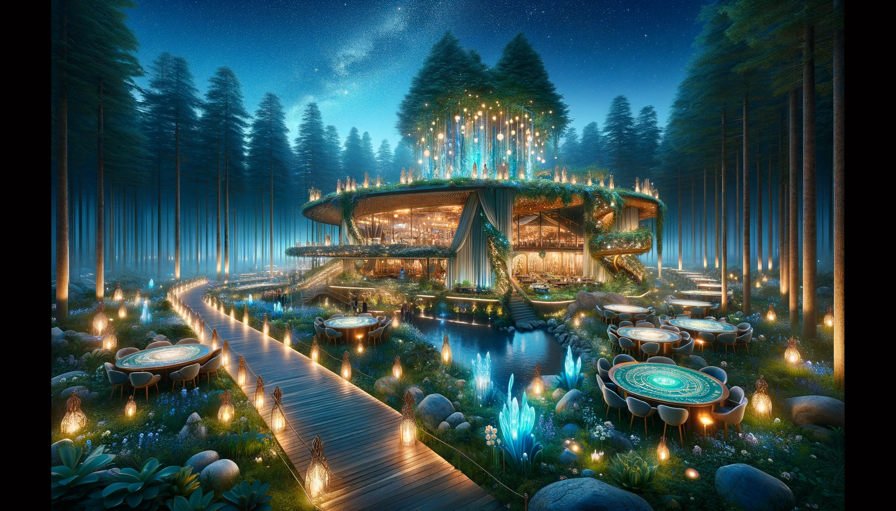
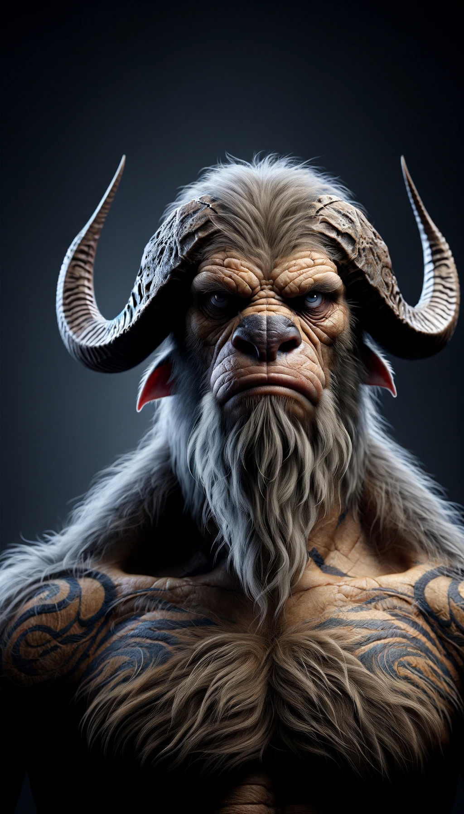

## Story

In the heart of Elderglen forest, three adventurers - a wizard, a rogue, and a knight - weary from their travels, find solace in The Twilight Grove. The wizard, intrigued by the mystical aura, deciphers ancient runes on the walls, unveiling hidden lore. The rogue, a master of stealth, finds camaraderie among other patrons, sharing tales of escapades. The knight, seeking relaxation, is captivated by the harmonious blend of thrill and serenity. Each discovers a unique facet of The Twilight Grove that speaks to their soul, binding them to the mystical allure of Bufloth's domain.

## Founding Team

1. **Bufloth**: The visionary leader, blending strength and serenity, his deep connection to the forest fuels the Grove's mystical ambiance.
2. **Alia**: A shrewd elven strategist, her keen insights into different cultures make the Grove a crossroads for diverse beings.
3. **Brogan**: A dwarven engineer, his craftsmanship brings a unique blend of magic and technology to the Grove's infrastructure.
4. **Lythia**: A human mixologist and herbalist, her potions and brews add an enchanting flavor to the Grove's offerings.

## How It Works

The Twilight Grove operates as a high-end casino and social club. Magical barriers ensure privacy and safety. Enchanted games adapt to players' skill levels, offering a fair and thrilling experience. Bufloth's empathic abilities create a personalized atmosphere, attuning the Grove to each patron's mood. Ethereal music, sourced from the forest itself, provides an immersive sensory experience.

## Marketing Jingle

"Where magic meets mystery, under the Elderglen canopy!"

## Key Features

1. **Adaptive Gaming Tables**: Magically adjust to player's experience level.
2. **Empathic Ambiance Control**: Bufloth's presence fine-tunes the environment to guest moods.
3. **Enchanted Privacy Barriers**: Ensures discreet and safe experiences.
4. **Elixir Mixology**: Unique brews and potions tailored to individual tastes.
5. **Nature-Infused Architecture**: Blends seamlessly with the forest, enhancing the mystical experience.

## Hater's Corner

"I tried The Twilight Grove, but it's too quiet for my taste. I prefer my casinos loud and bustling. Plus, the games are too fair – where's the thrill if I can't outsmart the system?" - Rax, a thrill-seeking goblin gambler.

## Main Competitor

"Silvermoon's Den" - A rival establishment known for its high-energy, vibrant atmosphere. While lacking The Twilight Grove's serene mystique, Silvermoon's Den appeals to those seeking a more traditional, lively gambling experience, challenging Bufloth's concept of blending tranquility with thrill.

## Two-Sentence Story

Bufloth once played a game of chance with a mischievous fairy who bet the sun wouldn't rise if she lost. The next morning, Elderglen awoke to a twilight that lasted until Bufloth, with a knowing smile, gently nudged the sun up the horizon.

## Early Adopters

1. **Thalor, the Elven Scholar**: Seeks knowledge and mystery.
2. **Mira, the Human Diplomat**: Enjoys high-class, discreet environments for negotiations.
3. **Grend, the Half-Orc Poet**: Finds inspiration in the Grove's unique blend of nature and enchantment.
4. **Ziri, the Gnome Inventor**: Attracted to the innovative magical technology.

## Maybe This Happens

Years later, Bufloth gazes upon the thriving Twilight Grove, a testament to his vision. As he reminisces, a young, ambitious dryad approaches, proposing a daring new venture. Bufloth smiles, his eyes twinkling with the same adventurous spirit that started it all, hinting at a new chapter in the mystical Elderglen.
