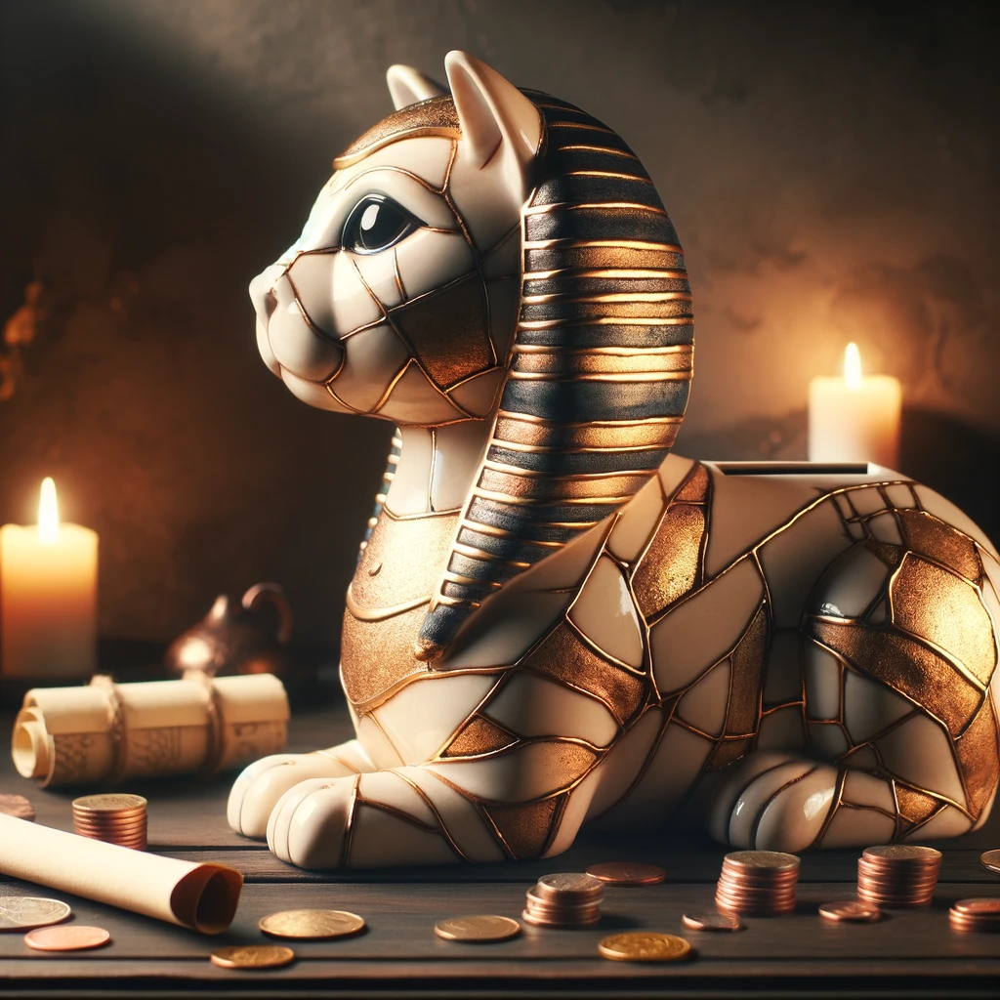
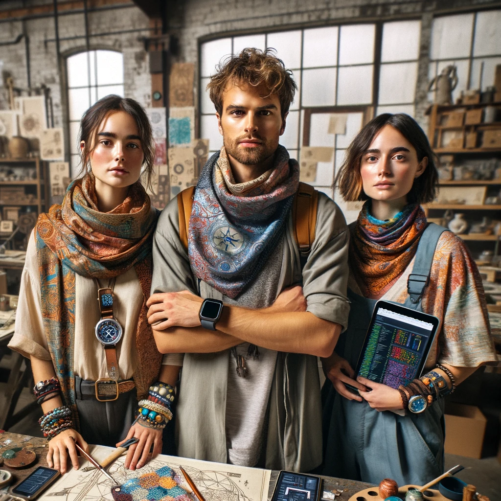

??? example "🪞 Mirrored Story 🪞"

    This is a mirrored story. It takes the base story and product idea here with an additional prompt to convert it into a science fiction and fantasy setting as seen in [Seshatian Vault](26.md).

## Story

In the heart of a bustling city, three friends—Mina, Theo, and Sara—discover the _Guardians of Prosperity: The Wisdom Keeper_, a sphinx-shaped savings bank, at a quaint local market. Mina, a passionate traveler, uses it to save for her adventures abroad, finding motivation in its glowing kintsugi repairs that remind her of the beauty in every journey's ups and downs. Theo, an aspiring entrepreneur, is inspired by its ancient wisdom, setting aside funds for his dream startup, while Sara, a budding artist, saves to open her own gallery. Each compartment holds not just their money but their dreams, glowing softly in their rooms, guiding them like constellations in the night.

## Founding Team

- **Mina**: With a background in cultural studies and a passion for travel, Mina brings a deep understanding of global traditions and aesthetics to the team. Her vision for a product that combines history, art, and personal growth is the cornerstone of the Wisdom Keeper.
- **Theo**: A software developer with a knack for finance, Theo integrates smart technology into traditional forms, making the Wisdom Keeper not only a symbol of prosperity but also a practical tool for financial management.
- **Sara**: An artist known for her work with sustainable materials, Sara designs the Wisdom Keeper's unique appearance, ensuring that each piece tells a story of resilience and beauty through its kintsugi-inspired features.

## How It Works

The Wisdom Keeper functions as a multi-compartment piggy bank, each designed for different savings goals. Its exterior, modeled after the Sphynx, exudes an aura of wisdom and protection. The kintsugi repairs, glowing in the dark, serve as a reminder of overcoming financial hurdles. A smart app accompanies the Wisdom Keeper, offering financial advice and tracking progress towards goals, inspired by ancient wisdom translated into modern contexts.

## Marketing Jingle

"Save with wisdom, glow with growth—The Wisdom Keeper, your financial oath."

## Key Features

- **Multi-Compartment Design**: Tailored for diverse savings goals, encouraging users to allocate funds wisely.
- **Kintsugi Glow**: Symbolizes resilience; the glow serves as a nightlight and a reminder of progress.
- **Ancient Wisdom App**: Provides financial tips inspired by historical insights, integrating tradition with modern financial planning.
- **Eco-Friendly Materials**: Made with sustainable resources, emphasizing the importance of environmental consciousness in design.
- **Customizable Aesthetics**: Offers personalization options for kintsugi patterns, making each piece unique to its owner's journey.

## Hater's Corner

"Sure, it's pretty, but why not just use a regular savings account? Seems like a gimmick wrapped in mythology to me. Plus, how durable is this thing really? I can't imagine ancient wisdom helps much when it falls off your shelf."

## Main Competitor

**Fortuna's Vault**: A high-tech digital savings platform with gamified features, appealing to users looking for a purely digital experience. While lacking the Wisdom Keeper's tangible, historical charm and personal growth symbolism, Fortuna's Vault offers virtual rewards and social sharing capabilities, challenging the Wisdom Keeper's blend of tradition and personal finance management.

## Two-Sentence Story

When Theo accidentally dropped the Wisdom Keeper, it didn't just survive; it glowed brighter, much to his surprise. "Guess it's not just our finances that are getting stronger," he chuckled, as Mina and Sara marveled at the unexpected resilience of their creation.

## Early Adopters

- **Ava**: A college student studying anthropology, drawn to the Wisdom Keeper's blend of cultural history and personal finance.
- **Liam**: A young professional with a keen interest in personal growth and self-improvement, looking for a unique way to manage savings.
- **Zoe**: An environmentally conscious consumer, attracted to the sustainable design and the personal touch of the kintsugi feature.

## Maybe This Happens

Years later, Mina, Theo, and Sara find themselves at an international design conference, showcasing the global impact of the Wisdom Keeper. Amid the applause, they share a glance, a mix of pride and nostalgia, remembering their humble beginnings. Just then, a message pings on Sara's phone: a photo from a user in a distant land, her Wisdom Keeper filled to the brim, beneath the glow of the Northern Lights—a reminder of the universal journey towards prosperity and resilience.
