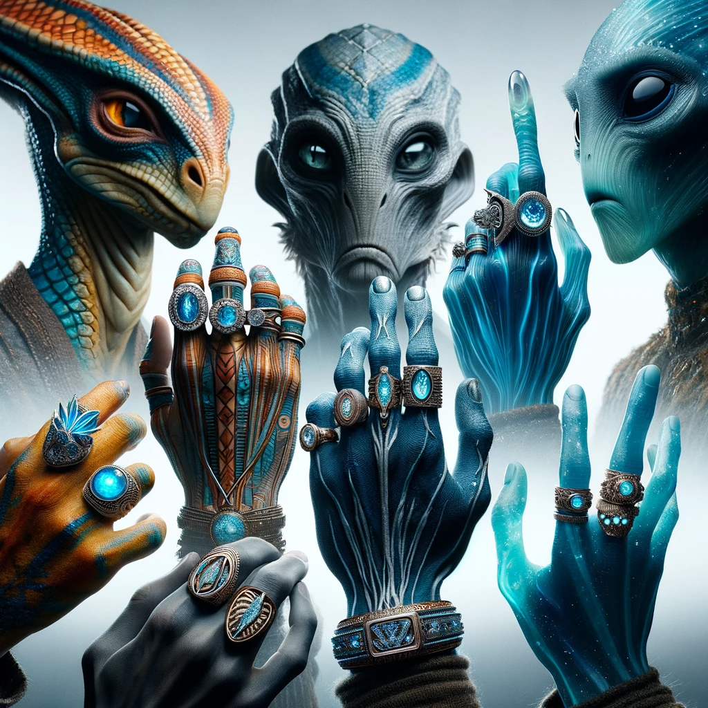

## Story

In the vibrant trading city of Zephyria, renowned for its abundance of diamonds, renowned ring maker Elion faces a unique challenge. In this world of diverse non-human species, diamonds are as common as pebbles, and traditional diamond rings no longer captivate the market. Elion, with his venture LustraGem Artisans, revolutionizes the concept by infusing traditional craftsmanship with innovative, species-specific designs. He crafts rings that not only showcase the beauty of diamonds but also resonate with the unique cultural and anatomical characteristics of each species. From the elegant, spiraling rings for the tentacled Naiadians to the holographically enhanced bands for the light-sensitive Luxorians, LustraGem becomes a symbol of bespoke luxury and artistic expression.

## Founding Team

- **Elion Varr**: A master jeweler with a deep understanding of gemology and aesthetics, Elion's expertise in crafting intricate designs sets LustraGem apart.
- **Talia Kres**: An anthropologist specializing in non-human cultures, Talia ensures that each design authentically reflects the traditions and values of its intended species.
- **Rex Jolun**: A material scientist, Rex innovates in blending traditional metals with exotic, durable materials suitable for different species' lifestyles.

## How It Works

LustraGem Artisans utilizes a combination of advanced gem-cutting technology and deep cultural research to create rings that are both aesthetically stunning and culturally significant. Each ring is custom-made, taking into consideration the wearer's species-specific anatomy and cultural heritage. The designs incorporate unique settings and materials that complement the natural beauty of diamonds, while also ensuring durability and comfort for various species' limbs.

## Marketing Jingle

"Shine Unique, Speak Chic, LustraGem's Elegance Peak!"

## Key Features

1. **Species-Specific Designs**: Tailored to fit and appeal to a wide range of non-human anatomies.
2. **Cultural Resonance**: Each ring reflects the cultural heritage and aesthetics of the wearer's species.
3. **Advanced Gem-Cutting Technology**: Creates unparalleled brilliance and showcases the natural beauty of diamonds.
4. **Durable and Comfortable**: Uses exotic materials suitable for different lifestyles and environments.
5. **Artistic Expression**: Each ring is a piece of art, celebrating the diversity and uniqueness of the wearer.

## Hater's Corner

"Sure, these fancy rings are nice to look at, but what's the point when diamonds are everywhere? It's just a shiny bauble at the end of the day. I prefer something more practical and less showy. Isn't the beauty of a ring in its simplicity and the meaning it holds, not in how many twists and turns it has?"

## Main Competitor

CrystalClasp Creations, a well-established jewelry maker, is LustraGem's main competitor. They focus on producing high-volume, standard designs that lack the customization and cultural depth of LustraGem's offerings. While popular for their affordability and traditional styles, CrystalClasp doesn't cater to the diverse needs of the non-human market as effectively as LustraGem.

## Two-Sentence Story

At the grand Zephyrian gala, a Luxorian ambassador flaunts her LustraGem ring, its diamond facets catching the ambient light to create a mesmerizing spectrum of colors. Elion watches from afar, his heart swelling with pride as his creation not only adorns but also tells a story of her heritage.

## Early Adopters

- **Elion, the Master Jeweler**: Constantly seeking to push the boundaries of his craft, Elion creates each piece as a testament to his artistic vision and respect for cultural diversity.
- **Aria, the Naiadian Poet**: Known for her exquisite taste, Aria champions LustraGem for their ability to blend artistic beauty with the practicality required by her tentacled limbs.
- **Dorn, the Luxorian Ambassador**: A connoisseur of fine art and jewelry, Dorn is drawn to LustraGem's unique fusion of light-play and cultural homage in their designs.
