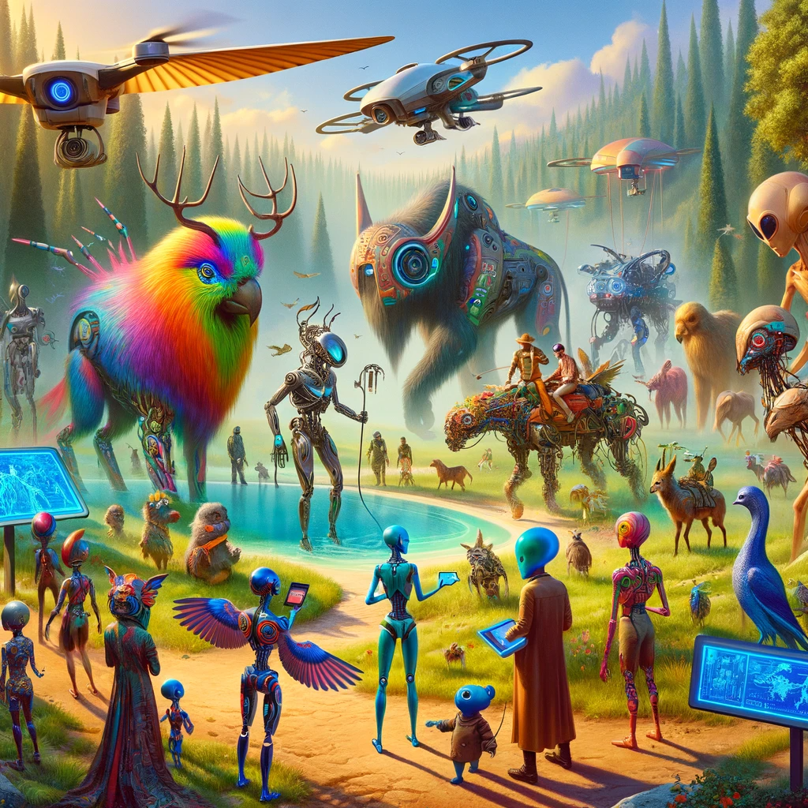

## Story

Mila, a wanderlust-driven archivist from a small village, stumbled upon the mysteries of Mechalon's mechanical wildlife. Overwhelmed by her town's mundane life, she yearned for adventure. Her discovery of Orion's Glintroam Odyssey Tours was a beacon of hope. Mila, along with her skeptical brother Jax and curious friend Zara, embarked on a journey led by Orion. Through the dense forests and metallic plains of Mechalon, they experienced the awe-inspiring harmony of technology and nature, transforming their perception of the world.

## Founding Team

- **Orion**: The visionary tamer, adept in cyber-beast communication and wilderness survival.
- **Talia**: A former librarian with an encyclopedic knowledge of Mechalon's history and wildlife.
- **Renn**: An ex-engineer turned navigator, specializing in Mechalon's unpredictable terrain.
- **Elio**: A youthful drone operator, providing aerial perspectives and enhancing tour safety.

## How it Works

Glintroam Odyssey Tours utilizes Orion's unique cyber-beast taming abilities, offering immersive safaris into Mechalon's wilds. Tours include real-time interaction with mechanical creatures, holographic historical insights, and drone-supported exploration, catering to adventure-seekers and nature enthusiasts.

## Marketing Jingle

"Discover the Wild Heart of Mechalon, Where Technology Meets Wilderness."

## Key Features

1. **Interactive Cyber-Beast Encounters**: Unique communication technology for safe, close-up interactions.
2. **Holographic Historical Overlays**: Educational insights into Mechalon's past and wildlife.
3. **Personalized Drone Scouts**: Ensuring safety and offering unseen perspectives.
4. **Eco-conscious Travel**: Promoting environmental awareness and sustainability.
5. **Small Group Expeditions**: Tailored experiences for intimate exploration.

## Hater's Corner

"I tried Glintroam Odyssey Tours, and honestly, it felt too safe. The real thrill of Mechalon is in unpredictability, but these tours are too controlled for my taste. Plus, the historical stuff feels like a school lesson. I prefer raw adventure!"

## Main Competitor

Rival company "WildTech Wanderers" offers a more rugged approach to Mechalon exploration. Their tours, led by a group of rogue tech enthusiasts, emphasize thrill over safety, attracting daredevils and thrill-seekers. Their unregulated methods raise questions about wildlife conservation and visitor safety.

## Two Sentence Story

During a Glintroam tour, a timid visitor accidentally activated a mechanical bird's ancient song. The melody, unheard for centuries, led to an impromptu dance party with robots and tourists alike.

## Early Adopters

- **Lina**: A digital artist fascinated by the fusion of technology and nature, seeking inspiration for her next masterpiece.
- **Arom**: A retired cybernetic engineer, eager to witness the evolution of technology in the wild.
- **The Zephyr Club**: A group of elderly adventure enthusiasts, chasing youthful thrills while appreciating the educational aspect.
