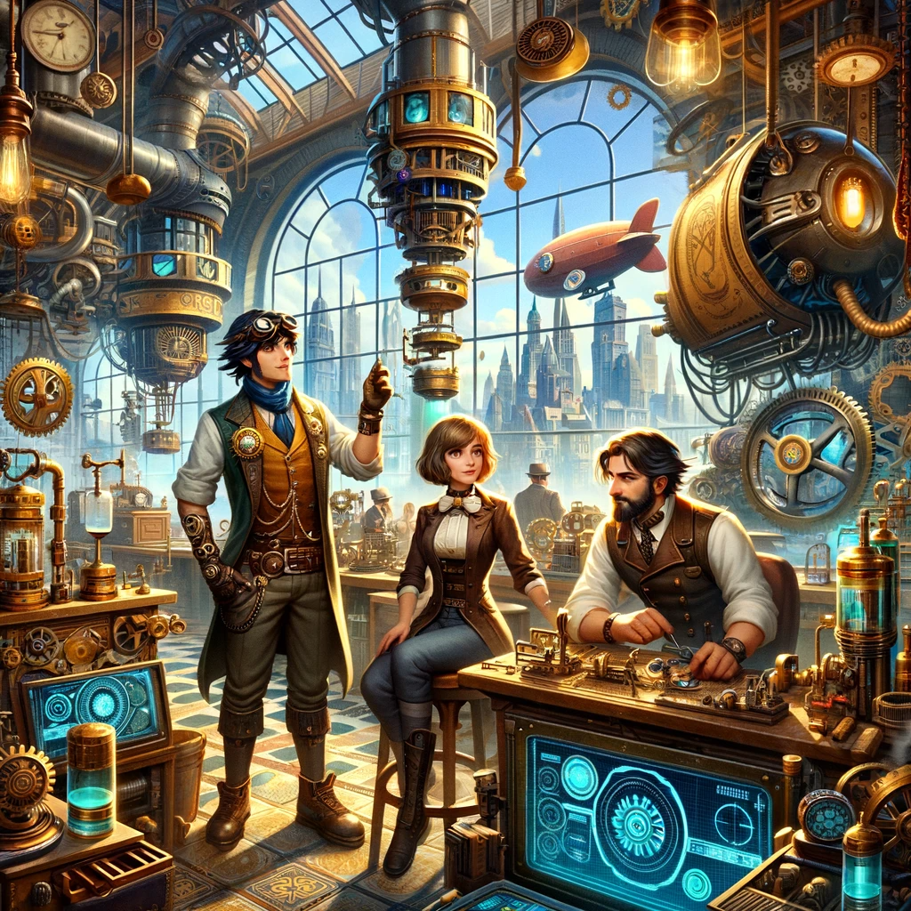

## Story

In the bustling city of Gearford, three individuals – a young aspiring inventor, a seasoned airship captain, and a local café owner – find their lives transformed by SteamCraft Innovations. The inventor, inspired by Thorne's custom steam gadgets, creates a revolutionary water-recycling system for the city. The airship captain uses a bespoke navigation device to explore uncharted territories safely. Meanwhile, the café owner integrates a custom-built steam espresso machine, becoming the talk of the town for her unique brews.

## Founding Team

1. **Thorne** - Master Inventor and Mechanic, the creative brain behind the designs.
2. **Elara** - A savvy businesswoman with a background in trade and finance, managing operations and client relations.
3. **Jax** - A former airship engineer with a knack for practical design and implementation, overseeing production and quality control.

## How It Works

SteamCraft Innovations operates in a workshop where Thorne's designs come to life. Each invention is crafted with a blend of traditional steampunk aesthetics and modern functionality, tailored to the client's needs. From personal gadgets to industrial machines, the workshop uses sustainable steam power and innovative clockwork mechanisms.

## Marketing Jingle

"Crafting Dreams, Powering Tomorrow – SteamCraft Innovations!"

## Key Features

1. **Customizable Design** - Each product is uniquely tailored to the client's specifications.
2. **Eco-Friendly Steam Power** - Utilizing clean, renewable energy sources.
3. **Advanced Clockwork Technology** - Incorporating intricate mechanisms for precision and reliability.
4. **Aesthetic Elegance** - Combining functionality with classic steampunk charm.

## Hater's Corner

"I don't trust all these newfangled steam contraptions. They say it's all safe and sustainable, but I'll stick to my old-fashioned methods. Plus, all those gears and steam, it's just a fad, won't last a season!"

## Main Competitor

"Cogs & Gears Ltd." - A well-established company specializing in mass-produced steam gadgets. They offer cheaper products, but lack the personal touch and customization of SteamCraft Innovations, catering to a more general market.

## Two-Sentence Story

During the annual Gearford Inventors' Fair, a rival challenged Thorne to a duel of inventions. Thorne, with his custom-built steam-powered unicycle, won not just the duel but also a herd of mechanical sheep, much to everyone's amusement.

## Early Adopters

1. **Inventors and Creators** - Attracted to the customization and unique design elements.
2. **Eco-Conscious Consumers** - Drawn to the sustainable use of steam power.
3. **Steampunk Enthusiasts** - Loving the blend of aesthetic elegance with modern functionality.
