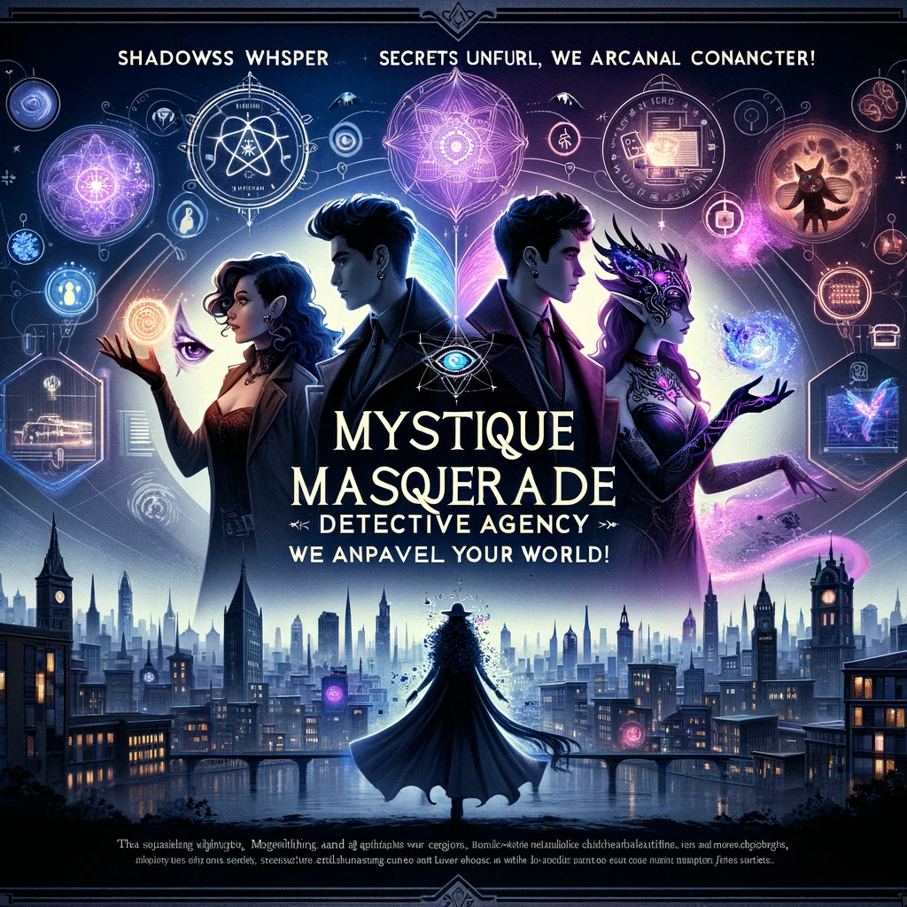

### Story

In the shadows of the magical noir city, three lives intersect at Mystique & Masquerade: A heartbroken wizard seeking his vanished familiar, a human entrepreneur entangled in a fae contract, and a shape-shifting artist accused of stealing her own work. Each finds not just solutions but transformative insights into their worlds, as the agency unravels mysteries that blend the magical and the mundane.

### Founding Team

1. **Alexa Vortex**: A wizard with a knack for enchantments, providing magical insight and spell-based solutions.
2. **Sam Rivera**: A tech-savvy human with a deep understanding of the city's underworld and digital network.
3. **Luna Eclipse**: A fae with connections to mystical realms, offering unique perspectives on supernatural elements.

### How It Works

Utilizing shape-shifting to infiltrate various social circles, the agency gathers clandestine information. Alexa's enchantments enhance investigative capabilities, while Sam's tech expertise bridges the gap between the magical and modern worlds. Luna's fae connections provide access to mystical intelligence otherwise unreachable.

??? example "Mystery Solved! : The Shape Shifting Artist"

    Once in the enigmatic city where magic danced with the mundane, an acclaimed shape-shifting artist named Elara Moonbeam found herself in a perplexing dilemma. Known for her living art – paintings that subtly changed form overnight – Elara was accused of stealing her own masterpieces from the prestigious Lunar Gallery.

    The Mystique & Masquerade Detective Agency, with its unique blend of magical insight and detective prowess, took on Elara's case. The agency's founding team, Alexa Vortex, Sam Rivera, and Luna Eclipse, were intrigued by the paradox of an artist accused of stealing her own works.

    Elara explained how her paintings, imbued with a touch of her shape-shifting essence, were her pride. But over the past month, the original paintings started disappearing, only to be replaced by near-perfect duplicates. The duplicates lacked the subtle magical animation, a signature of Elara's art. This theft not only risked her reputation but also threatened to expose the closely guarded secrets of her shape-shifting community.

    The agency began its work. Luna, with her fae connections, delved into the supernatural art underworld, seeking whispers of magical art theft. Sam employed his tech skills to analyze the gallery's security footage, looking for digital traces of the thief. Meanwhile, Alexa, with her magical expertise, examined the duplicate paintings for enchantments or magical residues.

    The breakthrough came from an unexpected quarter. Sam discovered a hidden magical signature in the gallery's security system – a cloaking spell, expertly masking the thief's identity. Alexa recognized the spell as a rare arcane technique, used by a reclusive sorcerer known for his obsession with magical art.

    Pooling their resources, the team staged a sting operation during the next exhibit. Elara, using her shape-shifting skills, posed as one of her paintings. As the night grew older, the sorcerer, confident in his magical disguise, appeared to claim his prize. But this time, he was met by the combined forces of Mystique & Masquerade.

    The sorcerer was apprehended, and Elara's paintings were recovered. The agency not only cleared Elara's name but also helped her understand the depth of her art's impact on both the magical and non-magical communities. Her exhibitions became more popular than ever, celebrated as a fusion of art and life, blurring the lines between reality and enchantment.

    Thus, the agency solved the mystery, proving that in a world where magic meets the eye, it takes a blend of unique talents to uncover the truth hidden in plain sight.

### Marketing Jingle

"Shadows whisper, secrets unfurl, at Mystique & Masquerade, we unravel your world!"

### Key Features

1. **Shape-Shifting Reconnaissance**: Access to otherwise inaccessible intel.
2. **Enchantment-Enhanced Investigations**: Magical spells to aid in solving crimes.
3. **Tech-Magic Interface**: Bridging modern technology with arcane resources.
4. **Supernatural Networking**: Connections to mystical beings for unique insights.

### Hater's Corner

"I heard they rely too much on magic. What about cases where magic doesn't work? Plus, shape-shifting seems intrusive. What about privacy concerns?"

### Main Competitor

"Veil & Vision Inc.," a rival agency boasting advanced tech gadgets and a team of psychic mediums. They challenge Mystique & Masquerade with their high-tech approach to supernatural sleuthing, appealing to a more tech-oriented clientele.

### Two-Sentence Story

During a stakeout, the shape-shifting detective accidentally turned into a cat and was adopted by the suspect. The case was solved when the 'pet' overheard the suspect's confession over a bowl of tuna.

### Early Adopters

1. **Mystical Entities**: Seeking understanding of human laws and society.
2. **Urban Fantasy Enthusiasts**: Humans intrigued by the blending of their world with the magical.
3. **Wrongfully Accused Supernaturals**: Needing someone who understands both their magic and their plight.
