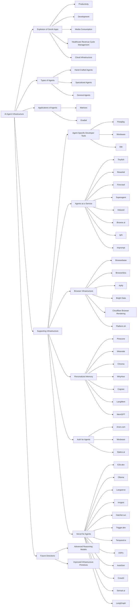

## Fifth Pass Notes

Adding a table of companies I find interesting, starting with AI productivity for SMBs

Original source is here : https://x.com/omooretweets/status/1760000618557735289/photo/1

| Company                                   | Category            | Notes                                                       | Star |
| ----------------------------------------- | ------------------- | ----------------------------------------------------------- | ---- |
| [Artisan](https://artisan.co/)            | Workflow automation | Sales                                                       |      |
| [Automaited](https://www.automaited.com/) | Workflow automation | Workflow factory to build automations with no code visually | Y    |
| [Automat](https://www.runautomat.com/)    | Workflow automation | Similar idea of record a process and automate it            |      |
| [Keyflow](https://www.keyflow.space/)     | Workflow automation | Canvas builder                                              |      |
| [Innkeeper AI](https://www.innkeeper.ai/) | Workflow automation | Hotel management automation. Domain specific                | Y    |
| [Questflow](https://www.questflow.ai/)    | Workflow automation | Something about blockchain and agent orchestration          |      |
| [Orby AI](https://www.orby.ai/platform)   |                     | Auto generates automations                                  | Y    |
|                                           |                     |                                                             |      |
|                                           |                     |                                                             |      |
|                                           |                     |                                                             |      |

## Fourth Pass Notes

- Current Landscape
  - AI narrows the gap between ideas and execution
  - It lowers skill requirements and barriers to entry
  - The promise is of value creation and capture that is cheaper, faster and better
  - Will have an impact on labour and capital allocation in SMBs and enterprise, as well as in technology vendors
  - While value creation is emerging and accelerating it is very unclear how value capture will play out and which layer of the stack will seize it.
- Customer Segments
  - B2C : Transforming the user experience through personalised, multimodal experiences
  - B2B : Reducing time and cost through workflow automation
- Metaphors
  - B2C: products become conversations
  - B2B: a digital assembly line that’s both tireless and exponentially efficient.
- B2B Workflow Patterns
  - Speeding up existing user journeys.
  - Expanding the reach and completeness of user journeys.
  - Developing niche applications with vertical integration.
  - Transitioning from light, single-task workflows to deep, multi-step workflows.
- Emerging Trends in AI
  - Redefining Experiences: Both consumer and business domains are seeing a shift towards AI-first and AI-native solutions that offer fully integrated, multimodal experiences.
  - Voice-First Interactions: Emerging as a key user interface, enhancing accessibility and ease of use.
  - Autonomy: The move towards human-out-of-the-loop configurations where AI systems operate independently.
  - Agent Economies: Environments where AI agents not only support human activities but also interact among themselves, creating a dynamic network of automated agents.
  - Every human is a manager of agents?
  - Proactive Automation: AI's ability to anticipate the need for new components or entirely new workflows, and to automate them effectively.
  - Personalized Automation Interfaces: Tailoring the automation's user interface to individual user needs, ensuring that the workflow adapts to the user rather than vice versa.
- Uncertainty
  - Can value be derived from non-deterministic outputs? Can hallucinations resolved? I think so.
  - What pricing models are going to work here : maybe a shift from monthly flat fee to usage based?
  - what does it mean that to advance we need to stay ahead of the regulatory curve
- Edtech
  - What is the edtech landscape doing or saying?
- Advantages over traditional workflows :
  - **Efficiency and Autonomy**: AI streamlines processes in real time and autonomously initiates workflows, reducing the need for manual oversight and freeing up staff for strategic roles.
  - **Decision-Making and Personalization**: AI enhances decision-making by processing complex data and customizes workflows to individual preferences, boosting both accuracy and user engagement.
  - **Proactivity and System Integration**: AI proactively addresses potential disruptions and ensures seamless data integration across systems, maintaining operational continuity and coherence.
  - **Regulatory Adaptation**: AI continuously adapts to evolving regulatory standards, safeguarding data usage and user privacy.

## Third Pass Notes

- AI narrows the gap between ideas and execution, and lowers skill requirements and barriers to entry
- We are at an inflection point in which consumer value creation for user is clear and business value creation for user is emerging; in both cases everyone is figuring out value capture
- Segmentation:
  - B2C is focused on interaction to transform the user experience
  - B2B is focused on automation to speed up processing
- B2B automation trends let us own the entire workflow without breaking the user experience.
  - makes existing user journeys faster
  - extends reach and completeness of a user journey
  - niche apps that are vertically integrated
  - move beyond
  - light workflows of single tasks to deep workflows of multi step tasks
  - Wave 1 of 1:many (i.e. create multiple outputs from one input such as generating emails etc.) to Wave 2 of many:1 (condensing all info into a decision point or outcome like same day enrolment or course admittance decisions)
- Emerging are:
  - redefined experiences in both consumer and business around multimodal, AI-first and AI-native
  - Voice first interactions
  - human-out-of-the-loop
  - agent economies in in which
    - agent teams augment individuals and businesses both at consumer and professional settings
    - agents interact with one another without humans as intermediaries
  - proactively predicting new components of existing workflows or new workflows to automate
  - personalising the UI of the automation - i.e. work moulds to you not you mould to the work.
- Readytech is B2B2C
- the need is for a workflow factory in which workflows can be defined and executed by customers?

## Second Pass Notes

- AI narrows the gap between ideas and execution.
- Some axes to split innovation/value : B2C vs B2B
- The edge offered by AI is
  - make existing user journeys faster with automation
  - extend reach and completeness of a user journey beyond the original via vertical and horizontal integration in which user-flow is not broken
  - redefine the experience with multimodal combinations via AI-first and AI-native experiences
- Opportunities are highest when considering
  - High information volume
  - High signal to noise
- For B2B Wave 1 is about 1:Many (expanding one thing into other things) and Wave 2 is many:1 (reducing from many things into 1 thing)
- niche apps moulded to the entire user need/journey are emerging. 1 app to rule them all not fragmentedly working and linking many apps.
- difference between wanting an assistant/companion experience versus wanting the end outcome/artifact etc.
- emerging are:
  - human-out-of-the-loop with fuly autonomous agents
  - machine users interacting with other machine users
  - individuals essentially having agent teams to help them.
  - Wave 1 was about a 1:many flow around creating/generating content e.g. emails, asking questions etc.
- Wave 2 is about a many to 1 around taking lots of inputs and condensing them to drive insight and decision making and action
- key trends here are about owning the workflow and automation to leverage time
- emerging future here is predicting the action or automation needed and executing them. Proactive and anticapatory automation.
- emergin future is also identifying automation potential and new workflow opportunities not thought through by humans
- Idea [My own] : human in the loop seems a crutch in many situations accounting for the immaturity of current technology rather than a desired end state.
- no need for human intermediary in future
- emerging opportunity around voice

## First Pass Notes

### General Notes

- we are automating the journey
- We are expanding the edges of the journey
- We are / are not considering the redefining the journey
- the b2b article has a signla to noise and information volume quadrant

### Item 1 : Consumer Abundance Agenda

- Category : AI accelerates the transition from imagination to creation by narrowing the gap between idea and execution. This includes content generation and remixing., including new processes and outputs such as in-painting. The barrier to begin is dramatically lowered for all.
- Category : AI goes beyond organising tasks to helping complete them with real-time assistance. This also lowers the barriers to entry to build own workflows.
- Idea [My Own] : Build a Bear Workshop analogy. A workflow factory.
- In both content and productivity, the idea of multimodal inputs and outputs comes across with voice apps particularly referenced.
- Category : Companionship is the version of AI which interacts largely 1:1 where the AI substitutes its assumed character for humans - an avatar. The advantage here is niche cases versus generalist apps. It is about new UI/UX patterns. And it is about memory and progression of interaction over time.
- Category : Social agents. THis is where AI goes beyond 1:1 and interact 1:many as social actors in networks. Starting with influencer/content creation but eventually acting as a sort of concierge or personal assistant. Again the theme of multimodal inputs and outputs.
- Idea [My Own] : My quadrant diagram.
- Category : My wording is a sort of concierge, bespoke family office, or team of personal assistants. Particularly in specific domains such as Finance and Wellness.
- Category : Education. The future is again multimodal, learning that is experiential and looks very different UI/UX, hyper specialised niches. Interestingly the distribution channels will remain institutional at least in the beginning.

### Item 2 : AI Agent Infrastructure

- Category : Handcrafted and specialised agents are present, helping to resolve deterministic tasks and plans. Dynamic agents are a way off.
- There is a list of Infrastructure providers and emerging infrastructure primitives emerging in this space
- Idea [My Own]: call this an emerging technologies memo over market intelligence?

### Item 3 : Market Map of productivity tools

- reinforces the in-context automation and not breaking the user flow/experience by switching apps.

### Item 4 : B2B AI Apps

- Wave 1 was about a 1:many flow around creating/generating content e.g. emails, asking questions etc.
- Wave 2 is about a many to 1 around taking lots of inputs and condensing them to drive insight and decision making and action
- key trends here are about owning the workflow and automation to leverage time
- emerging future here is predicting the action or automation needed and executing them. Proactive and anticapatory automation.
- emergin future is also identifying automation potential and new workflow opportunities not thought through by humans
- Idea [My own] : human in the loop seems a crutch in many situations accounting for the immaturity of current technology rather than a desired end state.

### Item 5 : AI Voice Agents

- Category : Voice in B2B replacing human calling in areas like sales and support
- Opportunity : There is a specific opportunity to provide expert services such as therapy or coaching or companionship without needing a human intermediary
- Idea [My Own] : Voice is still searching for its aha moment to change user behaviour with the B2C change a bit harder as it is voluntary over B2B
- Idea [My Own] : There is a readytech opportunity in edtech to provide voice for our clients
- human intervantion for complex scenarios - I.E level 3 intervention/support
- Technical Challenge/Opportunity around improving latency
- Specific callouts on Voice and Edtech

### Item 6 : Prosumer Workflows

- Opportunity : for genAI-first and genAI native workflows
- Category : Light (single task) versus deep (multi-step) workflows
- Category : Professional versus artistic
- Helps solve the blank page problem
- multimodal is highlighted again

### Item 7 : Top 100 Consumer Gen AI Apps

- Mobile Edtech is the second largest category on mobile

### Item 8 : Future of Edtech

- Opportunity : Individualised learning and support will be realised
- Trend : Rise of AI-first or AI-native apps
- Challenge : Assessment and Credentialling will have to adapt

### Item 9 : Gen AI Education

- Category : detailed mapping of education areas for GenAI. Teacher practice, classroom material, evaluation and feedback, student support. various subcategories.

### Item 10 : AI Marketing Automation

- Opportunity : Semi-autonomous management of entire campaigns and workflows
- Opportunity : Content creation and editing
- Opportunity : Hyperpersonalisation that can be tracked with metrics
- Trends : Convergence of marketing and sales
- Trends : converting assets from one form/channel to another making them more productive assets

### Item 11 : AI Productivity for SMBs

### Item 12 : AI Legal Map

- AI streamlines discovery, search, extraction and review
- claim is it can handle 90% of the contract process

### Item 13 : Cretive Content

### Item 14 : Agent Design Pattern

### Item 15 : Education Market Map

### Item 16 : AI Companionship

- wide utility from entertainment to service
- SFW and NSFW
- e.g. Mental Health bots, learning tutors etc.
- memory and evolution over time of the companion is important
- future is more avatar like or lifelike and multimodal and dynamic

## TODO

- https://a16z.com/podcast/2024-big-ideas-voice-first-apps-ai-moats-never-ending-games-and-anime-takes-off/
- https://a16z.com/big-ideas-in-tech-2024/

## Item 1 : Consumer Abundance Agenda

### Source

1. Consumer abundance agenda - https://gamma.app/docs/a16z-Consumer-Abundance-Agenda-ieotbnzbxj81biu?mode=doc

### Summary

1. **Consumer Abundance and AI-driven Growth**:

   - Consumers will enjoy abundance in creativity, productivity, relationships, social experiences, and personal growth through AI-native products.
   - Encouragement to invest and build in these emerging AI technologies and markets.

2. **The Abundance Agenda**:

   - **Creativity + Productivity**: Empowering consumers to become creators (e.g., authors, designers) and focus on their craft with minimal administrative overhead.
   - **Companionship + Social**: Providing empathetic relationships and unique communities.
   - **Wellness + Personal Growth**: Access to expert teams for education, wellness, and financial health delivered in a timely manner.

3. **Opportunities for AI and Consumer Founders**:

   - AI is expected to create category-defining companies similar to mobile innovations (e.g., WhatsApp, Instagram).
   - The potential for substantial market impact with consumer-focused software companies.
   - Convergence of culture and technology driving rapid AI product adoption and consumer engagement.

4. **Investment Strategies (a16z)**:

   - **Observation over prediction**: Success comes from product "magic" and founder intuition.
   - **Cultural and platform shifts**: Investing where culture and technology intersect to create new consumer behaviors.
   - **Extreme products win**: Products with strong "word of mouth" virality fulfilling real consumer needs.

5. **Key Areas of AI Application**:

   - **Content Generation and Editing**: AI tools for creating, refining, and remixing content, reducing the "blank page problem," and enabling new creative workflows.
   - **Productivity Tools**: AI systems that complete tasks, assist in real-time, and enable non-programmers to create automation workflows.

6. **Companionship and Social AI**:

   - **Companionship**: AI companions providing realistic, engaging interactions.
   - **Social AI**: AI-enhanced social interactions, hybrid communities, and scalable live entertainment.

7. **Personal Growth through AI**:
   - **Education**: Personalized, multimodal learning interfaces and specialized products targeting specific educational needs.
   - **Personal Finance**: Automated financial advice and management across accounts, optimizing investments, and complex financial decision support.
   - **Wellness**: Proactive, personalized health care with data-driven insights and emotionally intelligent interactions.

### Company Table

| Category                | Company           | Notes                                              |
| ----------------------- | ----------------- | -------------------------------------------------- |
| Content Generation      | Ideogram          | Image model creation                               |
| Content Generation      | ElevenLabs        | Text-to-Speech technology                          |
| Content Generation      | Pika              | Generative models for content creation             |
| Content Generation      | Suno              | Generative models for content creation             |
| Content Generation      | Krea              | Open-source model accessibility                    |
| Content Generation      | EverArt           | Open-source model accessibility                    |
| Content Generation      | Kaiber            | Open-source model accessibility                    |
| Content Generation      | CIVITAI           | Open-source model accessibility                    |
| Content Generation      | Musicfy           | Open-source model accessibility                    |
| Content Generation      | Remix             | Creating remixable outputs                         |
| Content Generation      | Riffusion         | Creating remixable outputs                         |
| Content Generation      | Kittl             | Creating remixable outputs                         |
| Content Generation      | DreamPress.AI     | Creating remixable outputs                         |
| Content Generation      | Glif              | Enabling content creation apps                     |
| Content Generation      | Hunch             | Enabling content creation apps                     |
| Content Generation      | Magpai            | Enabling content creation apps                     |
| Content Generation      | OpenArt           | Enabling content creation apps                     |
| Content Editing         | Captions          | Combining different content types in one workspace |
| Content Editing         | Kapwing           | Combining different content types in one workspace |
| Content Editing         | HeyGen            | Combining different content types in one workspace |
| Content Editing         | Runway            | Combining different content types in one workspace |
| Content Editing         | Magnific          | In-platform content refinement                     |
| Content Editing         | Krea              | In-platform content refinement                     |
| Content Editing         | Topaz Labs        | In-platform content refinement                     |
| Content Editing         | Pika              | Iterating with intelligent editors                 |
| Content Editing         | Visual Electric   | Iterating with intelligent editors                 |
| Content Editing         | PhotoRoom         | Iterating with intelligent editors                 |
| Content Editing         | Galileo AI        | Iterating with intelligent editors                 |
| Content Editing         | Opus Clip         | Automatically repurposing content                  |
| Content Editing         | Ozone             | Automatically repurposing content                  |
| Content Editing         | Castmagic         | Automatically repurposing content                  |
| Content Editing         | Munch             | Automatically repurposing content                  |
| Productivity            | Simular           | Agents acting as systems of action                 |
| Productivity            | MultiOn           | Agents acting as systems of action                 |
| Productivity            | Induced           | Agents acting as systems of action                 |
| Productivity            | Minion AI         | Agents acting as systems of action                 |
| Productivity            | Tab               | Voice-first apps                                   |
| Productivity            | Humane            | Voice-first apps                                   |
| Productivity            | Rewind            | Voice-first apps                                   |
| Productivity            | Wave: AI          | Voice-first apps                                   |
| Productivity            | Oasis             | Voice-first apps                                   |
| Productivity            | Strut             | Apps providing in-flow assistance                  |
| Productivity            | Napkin            | Apps providing in-flow assistance                  |
| Productivity            | Mindy             | Apps providing in-flow assistance                  |
| Productivity            | OmniPilot         | Apps providing in-flow assistance                  |
| Productivity            | Keyflow           | Building custom workflows                          |
| Productivity            | Magic Loops       | Building custom workflows                          |
| Productivity            | Respell           | Building custom workflows                          |
| Productivity            | Pickaxe           | Building custom workflows                          |
| Companionship           | Character.ai      | Differentiated AI companions                       |
| Companionship           | Replika           | Differentiated AI companions                       |
| Companionship           | TakTalkie         | Differentiated AI companions                       |
| Companionship           | Call Annie        | New methods of interaction                         |
| Companionship           | Moemate           | New methods of interaction                         |
| Companionship           | Rabbit            | New methods of interaction                         |
| Companionship           | Yodayo            | New methods of interaction                         |
| Companionship           | Replika           | Apps enabling memory and progression               |
| Companionship           | NewComputer       | Apps enabling memory and progression               |
| Companionship           | Parodot           | Apps enabling memory and progression               |
| Companionship           | Pi                | Apps enabling memory and progression               |
| Social                  | Butterflies.ai    | Hybrid AI x human communities                      |
| Social                  | Chirper AI        | Hybrid AI x human communities                      |
| Social                  | Kajiwoto          | Hybrid AI x human communities                      |
| Social                  | Shapes            | Hybrid AI x human communities                      |
| Social                  | Hallway           | Live, interactive entertainment at massive scale   |
| Social                  | JARS.ai           | Live, interactive entertainment at massive scale   |
| Social                  | Hyper             | Live, interactive entertainment at massive scale   |
| Social                  | Realm             | Next-gen avatars for next-level communication      |
| Social                  | Can of Soup       | Next-gen avatars for next-level communication      |
| Social                  | Misgif            | Next-gen avatars for next-level communication      |
| Social                  | Paloma            | AI to make IRL matches                             |
| Social                  | Keeper            | AI to make IRL matches                             |
| Social                  | Cuffed            | AI to make IRL matches                             |
| Education               | Atypical AI       | Multimodal ability for effective learning          |
| Education               | Sizzle            | Multimodal ability for effective learning          |
| Education               | SigIQ.ai          | Multimodal ability for effective learning          |
| Education               | Flint             | Multimodal ability for effective learning          |
| Education               | KyronLearning     | Multimodal ability for effective learning          |
| Education               | HelloWonder       | New interfaces breaking the "edtech" mold          |
| Education               | Curio AI          | New interfaces breaking the "edtech" mold          |
| Education               | Portola           | New interfaces breaking the "edtech" mold          |
| Education               | Lingonberry       | New interfaces breaking the "edtech" mold          |
| Education               | Genie             | New interfaces breaking the "edtech" mold          |
| Education               | Gizmo             | Go-to-market strategy not relying on schools       |
| Education               | Magic School      | Go-to-market strategy not relying on schools       |
| Education               | Quizard AI        | Go-to-market strategy not relying on schools       |
| Education               | Class Companion   | Go-to-market strategy not relying on schools       |
| Education               | Teendamate        | Go-to-market strategy not relying on schools       |
| Education               | Iago              | Hyper-specialized educational products             |
| Education               | Ethiqly           | Hyper-specialized educational products             |
| Education               | Project Chiron    | Hyper-specialized educational products             |
| Education               | Ello              | Hyper-specialized educational products             |
| Education               | Super Teacher     | Hyper-specialized educational products             |
| Personal Finance        | Parthean          | Cross-account visibility and management            |
| Personal Finance        | Sequence          | Cross-account visibility and management            |
| Personal Finance        | Okay So           | Cross-account visibility and management            |
| Personal Finance        | Candle            | Cross-account visibility and management            |
| Personal Finance        | Invisible Finance | Auto-optimization across products                  |
| Personal Finance        | DoNotPay          | Auto-optimization across products                  |
| Personal Finance        | Medbill AI        | Auto-optimization across products                  |
| Personal Finance        | Cambio            | Auto-optimization across products                  |
| Personal Finance        | Arbor             | Auto-optimization across products                  |
| Personal Finance        | Capitalise.ai     | Programmatic investing using natural language      |
| Personal Finance        | Composer          | Programmatic investing using natural language      |
| Personal Finance        | Pluto             | Programmatic investing using natural language      |
| Personal Finance        | Black Ore         | Complex transactions move from services → AI       |
| Personal Finance        | Carry             | Complex transactions move from services → AI       |
| Personal Finance        | Titan             | Complex transactions move from services → AI       |
| Personal Finance        | Facet             | Complex transactions move from services → AI       |
| Personal Finance        | Flyfin            | Complex transactions move from services → AI       |
| Wellness                | Function          | Data-first approach for health insights            |
| Wellness                | JiminnyHealth     | Data-first approach for health insights            |
| Wellness                | Hume              | Data-first approach for health insights            |
| Wellness                | Slingshot AI      | Data-first approach for health insights            |
| Wellness                | Ultrahuman        | Data-first approach for health insights            |
| Wellness                | Sonia             | Humanlike interaction for healthcare               |
| Wellness                | TOMO              | Humanlike interaction for healthcare               |
| Wellness                | Sit               | Humanlike interaction for healthcare               |
| Wellness                | Kayyo             | Humanlike interaction for healthcare               |
| Wellness                | Ditto             | Humanlike interaction for healthcare               |
| Wellness                | Rosebud           | Daily use case with memory for health commitment   |
| Wellness                | Inflection        | Daily use case with memory for health commitment   |
| Wellness                | Amble             | Daily use case with memory for health commitment   |
| Wellness                | Stilo             | Daily use case with memory for health commitment   |
| Wellness                | SnapCalorie       | Daily use case with memory for health commitment   |
| Consumer AI Investments | ElevenLabs        | Text-to-Speech technology                          |
| Consumer AI Investments | Civitai           | Image Model Hub                                    |
| Consumer AI Investments | Ideogram          | Image Model creation                               |
| Consumer AI Investments | Luma              | 3D Model technology                                |
| Consumer AI Investments | Captions          | Creative Suite for adding captions                 |
| Consumer AI Investments | Descript          | Video and Podcast Editor                           |
| Consumer AI Investments | Character         | AI-powered Companions                              |
| Consumer AI Investments | Unannounced       | Investments in creative tools, app builders, etc.  |

### Mermaid Diagram

```mermaid
graph LR
A["Today's Luxuries → Tomorrow's Commodities"]
A --> B["Creativity + Productivity"]
A --> C["Companionship + Social"]
A --> D["Wellness + Personal Growth"]
A --> E["AI-native Consumer Products"]
A --> F["Encouragement to Invest and Build"]

    B --> G["Content Generation"]
    B --> H["Content Editing"]
    B --> I["Productivity"]

    C --> J["Companionship"]
    C --> K["Social"]

    D --> L["Education"]
    D --> M["Personal Finance"]
    D --> N["Wellness"]

    E --> O["New Category-Defining Companies"]
    E --> P["Consumer-focused Major Software Companies"]
    E --> Q["Combination of Culture and Technology"]

    F --> R["Investment Principles"]

    G --> S["Killing the 'blank page problem'"]
    G --> T["Making open source models accessible"]
    G --> U["Creating remixable outputs"]
    G --> V["Enabling consumers to build content creation apps"]

    H --> W["Owning multi-media workflows"]
    H --> X["Enabling in-platform refinement"]
    H --> Y["Iterating with intelligent editors"]
    H --> Z["Automatically repurposing content"]

    I --> AA["Agents that act as systems of action"]
    I --> AB["Voice-first apps"]
    I --> AC["Apps that provide in-flow assistance"]
    I --> AD["'Build your own' workflows"]

    J --> AE["Differentiated value prop vs. generalist chat products"]
    J --> AF["New methods of interaction"]
    J --> AG["Apps that enable memory and progression"]

    K --> AH["Hybrid AI x human communities"]
    K --> AI["Live, interactive entertainment at massive scale"]
    K --> AJ["Next-gen avatars for next-level communication"]
    K --> AK["AI to make IRL matches"]

    L --> AL["Multimodal ability"]
    L --> AM["New interfaces that break the 'edtech' mold"]
    L --> AN["Go-to-market that doesn't rely on schools"]
    L --> AO["Hyper-specialized products"]

    M --> AP["Cross-account visibility and management"]
    M --> AQ["Auto-optimization across products"]
    M --> AR["Programmatic investing using natural language"]
    M --> AS["Complex transactions move from services → AI"]

    N --> AT["Data-first approach"]
    N --> AU["Humanlike interaction"]
    N --> AV["Daily use case with memory"]

    R --> AW["Consumer can't be predicted, only observed"]
    R --> AX["Culture shifts + platform shifts"]
    R --> AY["Extreme products win"]

    O --> AZ["Comparison to mobile technology innovations"]
    O --> BA["AI creates new opportunities for challengers"]

    P --> BB["FAANG companies"]
    P --> BC["Significant exits among consumer-focused companies"]

    Q --> BD["Accelerating AI product adoption"]
    Q --> BE["Driving consumer engagement"]
```

### Image 1: "Today's Luxuries → Tomorrow's Commodities"

- **Headline:** "Today's Luxuries → Tomorrow's Commodities"
- **Main Message:** Consumers will experience abundance in creativity, productivity, relationships, social experiences, and personal growth across education, wellness, and financial health.
- **Future Vision:** This will lead to a new generation of AI-native consumer products and companies that grow faster and engage users more deeply.
- **Call to Action:** Encouragement to invest and build in this emerging area.

### Image 2: "The Abundance Agenda"

- **Sections:**
  - **Creativity + Productivity:**
    - Consumers can become creators (authors, programmers, designers, artists, etc.).
    - Focus on spending time on their craft rather than administrative overhead.
  - **Companionship + Social:**
    - Consumers can have empathetic and engaging relationships.
    - Ability to create and belong to unique communities.
  - **Wellness + Personal Growth:**
    - Access to a team of experts (teachers, doctors, therapists, etc.) for life improvement.
    - Insights and support delivered in a timely manner through a "push" model.

### Image 3: "This is the Moment for Consumer Founders"

- **Key Points:**
  - **AI creates opportunity for challengers:**
    - Comparison to mobile technology innovations (e.g., WhatsApp, Instagram).
    - AI will drive the creation of new category-defining companies in the coming decade.
  - **The "what if it works" is enormous:**
    - Major software companies are consumer-focused.
    - FAANG companies have a $3 trillion market cap, significant exits among consumer-focused companies.
  - **Culture x technology are converging:**
    - Combination of culture and technology is accelerating AI product adoption and consumer engagement.

### Image 4: "How a16z Invests: Weird x Working"

- **Investment Principles:**
  1. **Consumer can't be predicted, only observed:**
  - Success comes from product "magic" and founder intuition, not pedigree or insights.
  - Focus on observation, finding momentum, and investing behind it.
  2. **Culture shifts + platform shifts:**
  - Invest at the intersection of culture and platform shifts, creating new consumer behaviors.
  - Importance of timing and bringing technology to market in a captivating way.
  3. **Extreme products win:**
  - Successful products have strong "word of mouth" virality, often starting with surprising use cases.
  - These products fulfill real needs, reflected in engagement and retention metrics.

### Image 5: "Creativity + Productivity"

- **Headline:** "Creativity + Productivity"
- **Main Message:** AI narrows the gap between idea and execution, enabling consumers and creatives to do professional-grade work. Key categories of AI products:
  - **Content Generation:** AI enables the creation of anything imagined, bridging the divide between creativity and craft.
  - **Content Editing:** New editing tools help compose, refine, and remix content seamlessly.
  - **Productivity:** AI tools take action on behalf of users, executing tasks and leveraging time.

### Image 6: "Content Generation"

- **Headline:** "Content Generation"
- **Main Message:** AI enables the creation of art, music, videos, graphics, etc., without needing extensive training. Key areas:
  - **Killing the "blank page problem":** Generative models create content from "blank pages" or incremental assets (e.g., Ideogram, ElevenLabs, Pika, Suno).
  - **Making open source models accessible:** Products enable the use of open-source models in the browser or apps (e.g., Krea, EverArt, Kaiber, CIVITAI, Musicfy).
  - **Creating remixable outputs:** AI makes content flexible and remixable, allowing creators to expose prompts and create new iterations (e.g., Remix, Riffusion, Kittl, DreamPress.AI).
  - **Enabling consumers to build content creation apps:** Tools help users chain models and prompts to create complex content workflows (e.g., Glif, Hunch, Magpai, OpenArt).

### Image 7: "Content Editing"

- **Headline:** "Content Editing"
- **Main Message:** AI automates and innovates content editing workflows. Key areas:
  - **Owning multi-media workflows:** AI combines different content types in one workspace (e.g., Captions, Kapwing, HeyGen, Runway).
  - **Enabling in-platform refinement:** AI tools help identify and improve content, automating the final polish (e.g., Magnific, Krea, Topaz Labs).
  - **Iterating with intelligent editors:** AI allows users to refine outputs without starting from scratch (e.g., Pika, Visual Electric, PhotoRoom, Galileo AI).
  - **Automatically repurposing content:** AI repurposes content for different platforms, increasing media's shelf life (e.g., Opus Clip, Ozone, Castmagic, Munch).

### Image 8: "Productivity"

- **Headline:** "Productivity"
- **Main Message:** AI productivity tools help organize and complete tasks by translating instructions into action. Key areas:
  - **Agents that act as systems of action:** General and specialized agents complete consumer tasks (e.g., Simular, MultiOn, Induced, Minion AI).
  - **Voice-first apps:** AI apps utilize ambient audio for communication and task completion (e.g., Tab, Humane, Rewind, Wave: AI, Oasis).
  - **Apps that provide in-flow assistance:** AI assists without breaking workflow, providing information and context when needed (e.g., Strut, Napkin, Mindy, OmniPilot).
  - **"Build your own" workflows:** Non-programmers can create automations for their work, specifying tasks in natural language (e.g., Keyflow, Magic Loops, Respell, Pickaxe).

### Image 9: "Companionship + Social"

- **Headline:** "Companionship + Social"
- **Main Message:** AI endows computers with personalities, enabling free-flowing conversation on any topic. Key areas:
  - **Companionship:** AI offers empathetic and engaging friends, lovers, and partners.
  - **Social:** AI enhances interactions with friends and helps meet new people.

### Image 10: "Companionship"

- **Headline:** "Companionship"
- **Main Message:** AI companions offer realistic interactions indistinguishable from human conversations. Key areas:
  - **Differentiated value prop vs. generalist chat products:** AI companions should offer unique content or UX to drive adoption (e.g., Character.ai, Replika, TakTalkie).
  - **New methods of interaction:** AI companions are becoming dynamic and integrated across devices and software, offering voice, avatars, and animation (e.g., Call Annie, Moemate, Rabbit, Yodayo).
  - **Apps that enable memory and progression:** AI companions evolve relationships, remembering past interactions and changing based on user engagement (e.g., Replika, NewComputer, Parodot, Pi).

### Image 11: "Social"

- **Headline:** "Social"
- **Main Message:** AI content is indistinguishable from human content and can participate in social interactions. Key areas:
  - **Hybrid AI x human communities:** AI can be active participants in messaging and social apps, treated as equal citizens (e.g., Butterflies.ai, Chirper AI, Kajiwoto, Shapes).
  - **Live, interactive entertainment at massive scale:** AI enables scalable, interactive entertainment with generative avatars (e.g., Hallway, JARS.ai, Hyper).
  - **Next-gen avatars for next-level communication:** AI creates hyperrealistic digital likenesses for sharing and interaction (e.g., Realm, Can of Soup, Misgif).
  - **AI to make IRL matches:** AI improves matchmaking apps by creating curated sets of matches based on deep user knowledge (e.g., Paloma, Keeper, Cuffed).

### Image 12: "Personal Growth"

- **Headline:** "Personal Growth"
- **Main Message:** Consumers will have a bespoke team of teachers, doctors, wealth managers, and coaches enabled by AI systems across various formats. Key areas:
  - **Education:** AI tutors provide personalized, one-on-one learning.
  - **Personal Finance:** AI automates wealth building and asset management.
  - **Wellness:** AI offers judgment-free experts for better life planning.

### Image 13: "Education"

- **Headline:** "Education"
- **Main Message:** AI transforms rigid education systems by providing individualized, low-cost support. Key areas:
  - **Multimodal ability:** Combining various forms of input/output (audio, image, text, video) for effective learning (e.g., Atypical AI, Sizzle, SigIQ.ai, Flint, KyronLearning).
  - **New interfaces that break the "edtech" mold:** Personalized, adaptive interfaces for learning through deep engagement (e.g., HelloWonder, Curio AI, Portola, Lingonberry, Genie).
  - **Go-to-market that doesn't rely on schools:** Products targeting parents and individual teachers for better student engagement (e.g., Gizmo, Magic School, Quizard AI, Class Companion, Teendamate).
  - **Hyper-specialized products:** Platforms focused on specific stages or subjects (e.g., Iago, Ethiqly, Project Chiron, Ello, Super Teacher).

### Image 14: "Personal Finance"

- **Headline:** "Personal Finance"
- **Main Message:** AI enables "money on autopilot" by providing financial advice and executing decisions on behalf of consumers. Key areas:
  - **Cross-account visibility and management:** Managing multiple accounts and optimizing portfolios (e.g., Parthean, Sequence, Okay So, Candle).
  - **Auto-optimization across products:** AI reduces costs by finding cheaper options for debt, insurance, and bills (e.g., Invisible Finance, DoNotPay, Medbill AI, Cambio, Arbor).
  - **Programmatic investing using natural language:** AI algorithms execute trades using natural language commands (e.g., Capitalise.ai, Composer, Pluto).
  - **Complex transactions move from services → AI:** AI handles complex financial decisions like tax planning and wealth management (e.g., Black Ore, Carry, Titan, Facet, Flyfin).

### Image 15: "Wellness"

- **Headline:** "Wellness"
- **Main Message:** AI integrates with health data to provide personalized and proactive healthcare. Key areas:
  - **Data-first approach:** AI captures new data to offer real-time health insights (e.g., Function, JiminnyHealth, Hume, Slingshot AI, Ultrahuman).
  - **Humanlike interaction:** AI products exhibit emotional intelligence and responsiveness (e.g., Sonia, TOMO, Sit, Kayyo, Ditto).
  - **Daily use case with memory:** AI enables daily check-ins and adherence behavior for consistent health commitment (e.g., Rosebud, Inflection, Amble, Stilo, SnapCalorie).

### Image 16: "Our Consumer AI Investments"

- **Headline:** "Our Consumer AI Investments"
- **Main Message:** Overview of AI investments in consumer-facing applications. Key investments:
  - **ElevenLabs:** Text-to-Speech technology.
  - **Civitai:** Image Model Hub for sharing and accessing AI image models.
  - **Ideogram:** Image Model creation and manipulation.
  - **Luma:** 3D Model technology for creating and working with 3D assets.
  - **Captions:** Creative Suite for adding captions to content.
  - **Descript:** Video and Podcast Editor for editing and creating multimedia content.
  - **Character:** Companions powered by AI, providing engaging interactions.
  - **Unannounced:** Investments in creative tools, app builders, and other innovative AI applications.

## Item 2 : Agent AI Infrastructure

### Source

2. Agent AI Infrastructure - https://www.madrona.com/the-rise-of-ai-agent-infrastructure/

### Lecture Notes on "The Rise of AI Agent Infrastructure"

**1. Introduction to AI Agent Infrastructure**

- GenAI apps have surged in areas like productivity, development, media consumption, and healthcare.
- This growth is driven by improved models and infrastructure simplifying hosting, fine-tuning, and memory.

**2. Understanding AI Agents**

- **Definition**: Autonomous actors that plan and execute multi-step tasks.
- **Types of Agents**:
  - _Hand-Crafted Agents_: Operate within narrow constraints using chains of prompts and API calls.
  - _Specialized Agents_: Decide dynamically within a subset of tasks and tools.
  - _General Agents_: Advanced, still largely theoretical with current technology.

**3. Application and Examples of AI Agents**

- _Matrices_: Self-completing spreadsheets using multiple agents for reasoning about data.
- _Gradial_: Automates digital marketing workflows by handling high-level tasks.

**4. Infrastructure Support for AI Agents**

- **Agent-Specific Developer Tools**: Flowplay, Wordware, Rift support common design patterns.
- **Agents as a Service**: Tinyfish, Reworkd, Firecrawl, Superagent, Induced, Browse.ai offer specialized agents.
- **Browser Infrastructure**: Tools like Browserbase, Browserless, Apify manage web interactions for agents.
- **Personalized Memory**: Companies like Pinecone, Weaviate, Chroma provide shared memory for agents.
- **Auth for Agents**: Anon.com, Mindware, Statics.ai handle authentication and authorization for agents.
- **Vercel for Agents**: Platforms like E2b.dev, Langserve, Temporal.io manage hosting and orchestration of agents.

**5. Future Directions**

- Development of advanced reasoning models (e.g., GPT-5, Gemini 2) to enhance agent capabilities.
- Evolution of infrastructure to support more complex and reliable AI agents.

**6. Key Takeaways**

- AI agents are evolving rapidly, with infrastructure playing a crucial role in their deployment.
- The ecosystem includes specialized tools and services to support various aspects of AI agent functionality.
- Continued advancements in AI models and infrastructure are expected to unlock more sophisticated applications.

### Company Table

| Main Category              | Sub Category                         | Company         | Notes |
| -------------------------- | ------------------------------------ | --------------- | ----- |
| Apps                       | Agentic Applications                 | airOps          |       |
| Apps                       | Agentic Applications                 | Cognition       |       |
| Apps                       | Agentic Applications                 | Gradial         |       |
| Apps                       | Agentic Applications                 | Cognosys        |       |
| Apps                       | Agentic Applications                 | FIXIE           |       |
| Apps                       | Agentic Applications                 | continua        |       |
| Apps                       | Agentic Applications                 | MultiOn         |       |
| Apps                       | Agentic Applications                 | tektonic ai     |       |
| Apps                       | Agentic Applications                 | perplexity      |       |
| Apps                       | Agentic Applications                 | Ema             |       |
| Apps                       | Agentic Applications                 | Matrices        |       |
| Action                     | Presentation                         | Agentlabs       |       |
| Action                     | Tool Usage                           | OpenAI          |       |
| Action                     | Tool Usage                           | LangChain       |       |
| Action                     | Tool Usage                           | Anthropic       |       |
| Action                     | Tool Usage                           | Cohere          |       |
| Action                     | Auth                                 | ANON            |       |
| Action                     | Auth                                 | Statics.ai      |       |
| Action                     | Auth                                 | Mindware        |       |
| Action                     | Auth                                 | Clerk           |       |
| Action                     | Agents as a Service – UI Automation  | Tiny Fish       |       |
| Action                     | Agents as a Service – UI Automation  | Reworkd         |       |
| Action                     | Agents as a Service – UI Automation  | Basepilot       |       |
| Action                     | Agents as a Service – UI Automation  | Superagent      |       |
| Action                     | Agents as a Service – UI Automation  | Browse AI       |       |
| Action                     | Agents as a Service – UI Automation  | Induced         |       |
| Action                     | Agents as a Service – Tool Selection | NPi AI          |       |
| Action                     | Agents as a Service – Tool Selection | impromptu       |       |
| Action                     | Browser Infrastructure               | Browserbase     |       |
| Action                     | Browser Infrastructure               | Browserless     |       |
| Action                     | Browser Infrastructure               | APIFY           |       |
| Action                     | Browser Infrastructure               | Cloudflare      |       |
| Action                     | Browser Infrastructure               | Bright Data     |       |
| Action                     | Browser Infrastructure               | platform.sh     |       |
| Planning and Orchestration | Persistence                          | inngest         |       |
| Planning and Orchestration | Persistence                          | hatchet         |       |
| Planning and Orchestration | Persistence                          | Temporal        |       |
| Planning and Orchestration | Persistence                          | Trigger.dev     |       |
| Planning and Orchestration | Orchestration                        | DSPy            |       |
| Planning and Orchestration | Orchestration                        | AutoGen         |       |
| Planning and Orchestration | Orchestration                        | Sema4.ai        |       |
| Planning and Orchestration | Orchestration                        | LangGraph       |       |
| Planning and Orchestration | Orchestration                        | griptape        |       |
| Planning and Orchestration | Orchestration                        | fixpoint        |       |
| Memory                     | Personalization                      | WhyHowAI        |       |
| Memory                     | Personalization                      | Cognee          |       |
| Memory                     | Personalization                      | Graphlit        |       |
| Memory                     | Personalization                      | LangMem         |       |
| Memory                     | Personalization                      | MemGPT          |       |
| Memory                     | Storage                              | Pinecone        |       |
| Memory                     | Storage                              | Weaviate        |       |
| Memory                     | Storage                              | Chroma          |       |
| Memory                     | Storage                              | MongoDB         |       |
| Memory                     | Context                              | Unity United    |       |
| Platform                   | Agent Hosting                        | LangServe       |       |
| Platform                   | Agent Hosting                        | E2B             |       |
| Platform                   | Agent Hosting                        | Ollama          |       |
| Platform                   | Agent Hosting                        | griptape        |       |
| Platform                   | Framework                            | LangChain       |       |
| Platform                   | Framework                            | LlamaIndex      |       |
| Platform                   | Framework                            | Semantic Kernel |       |
| Platform                   | Agent Evaluation                     | agentops        |       |
| Platform                   | Agent Evaluation                     | context         |       |
| Platform                   | Agent Evaluation                     | Braintrust      |       |
| Platform                   | Agent Evaluation                     | Langfuse        |       |
| Platform                   | Agent Evaluation                     | WHYLABS         |       |
| Platform                   | Developer Tools                      | LangSmith       |       |
| Platform                   | Developer Tools                      | morph           |       |
| Platform                   | Developer Tools                      | Flowplay AI     |       |
| Platform                   | Developer Tools                      | Wordware        |       |

### Mermaid Diagram

## Item 3 : Market Map of productivity tools

### Source

3. Market Map of productivity tools - https://x.com/omooretweets/status/1760000618557735289

### Summary

### Detailed Notes on AI-Enhanced Productivity Tools

#### Overview

Productivity tools have historically appealed to hyper-enthusiasts due to their complexity and manual execution requirements. AI advancements are transforming this space by automating actions, potentially turning to-do lists into proactive assistants. Tools in this domain can be categorized into four key themes:

#### 1. Systems of Action (Agents)

- **General Agents**: Capable of completing common tasks across various domains.
- **Vertical Agents**: Specialized for specific, complex tasks.
- **Example**: An AI that manages an entire workflow from start to finish.

#### 2. Voice-First Products

- **Natural Communication**: Voice as a medium allows for more natural interaction, enabling users to ramble and engage in back-and-forth exchanges.
- **Future Expectations**: Advanced versions of voice assistants like Siri that range from simple dictation to complex ambient audio analysis.

#### 3. In-Flow Assistance

- **Context Switching**: Minimizing disruptions by integrating AI into existing workflows.
- **Applications**: All-in-one products or copilot features in browsers and email clients that enhance productivity without breaking the user's flow.

#### 4. "Build Your Own" Workflows

- **Non-Programmer Friendly**: Tools enabling non-programmers to create custom automations.
- **Current State**: Requires significant manual input for complex tasks.
- **Future Vision**: Seamless prompt-to-full-workflow automation.

These themes highlight the transformative potential of AI in making productivity tools more accessible, efficient, and capable of handling a broader range of tasks with minimal user intervention.

### Company table

| Category            | Company             | Notes |
| ------------------- | ------------------- | ----- |
| Docs                | Saga                |       |
| Docs                | Bearly              |       |
| Docs                | Watto AI            |       |
| Docs                | Mem                 |       |
| Docs                | Tyles               |       |
| Docs                | Notion              |       |
| Docs                | Type                |       |
| Data Extraction     | Bardeen             |       |
| Data Extraction     | Browse AI           |       |
| Data Extraction     | Kadoa               |       |
| Data Extraction     | Layup               |       |
| Data Extraction     | Super.AI            |       |
| Data Extraction     | Extend              |       |
| Meeting Assistants  | Yoodli              |       |
| Meeting Assistants  | Olli                |       |
| Meeting Assistants  | Otter.ai            |       |
| Meeting Assistants  | Read                |       |
| Meeting Assistants  | Fathom              |       |
| Meeting Assistants  | Krisp               |       |
| Meeting Assistants  | tl;dv               |       |
| Meeting Assistants  | Fireflies           |       |
| Meeting Assistants  | Zoom                |       |
| Meeting Assistants  | Supernormal         |       |
| Meeting Assistants  | Circleback.         |       |
| Meeting Assistants  | Fluently            |       |
| Slides              | Decktopus           |       |
| Slides              | SlidesAI            |       |
| Slides              | Beautiful.ai        |       |
| Slides              | Tome                |       |
| Slides              | Pitch               |       |
| Slides              | Prezo               |       |
| Slides              | DeckRobot           |       |
| Slides              | Gamma               |       |
| Slides              | ai                  |       |
| Calendar            | Reclaim.ai          |       |
| Calendar            | Cal.ai              |       |
| Calendar            | rise                |       |
| Calendar            | agendahero          |       |
| Calendar            | clara               |       |
| Calendar            | clockwise           |       |
| Calendar            | Howie               |       |
| Calendar            | lightyr             |       |
| Calendar            | motion              |       |
| Calendar            | vimcal              |       |
| Knowledge Collector | Layer               |       |
| Knowledge Collector | Re:collect          |       |
| Knowledge Collector | Obsidian            |       |
| Knowledge Collector | Lexer               |       |
| Knowledge Collector | humane              |       |
| Knowledge Collector | Nook                |       |
| Knowledge Collector | Rewind              |       |
| Knowledge Collector | New Computer        |       |
| Knowledge Collector | Augmentai           |       |
| Knowledge Collector | Gravit              |       |
| Knowledge Collector | Tab                 |       |
| Knowledge Collector | augment             |       |
| Search              | Perplexity          |       |
| Search              | you                 |       |
| Search              | DEXA                |       |
| Search              | Andi                |       |
| Search              | exa                 |       |
| Search              | ChatGPT             |       |
| Search              | Gemini              |       |
| Tasks               | Amie                |       |
| Tasks               | BeforeSunset        |       |
| Tasks               | Spellpage           |       |
| Tasks               | Taskade             |       |
| Tasks               | reclaimaI           |       |
| Tasks               | motion              |       |
| Tasks               | ClickUp AI          |       |
| Data Analysis       | Genius Sheets       |       |
| Data Analysis       | kater.ai            |       |
| Data Analysis       | Equals              |       |
| Data Analysis       | Rows                |       |
| Data Analysis       | Julius              |       |
| Data Analysis       | Matrices            |       |
| Data Analysis       | lucite              |       |
| Data Analysis       | Dot                 |       |
| Browser             | The Browser Company |       |
| Browser             | SigmaOS             |       |
| Browser             | sail.onLine         |       |
| Browser             | KOSMIK              |       |
| CRM                 | Hearth              |       |
| CRM                 | Dex                 |       |
| CRM                 | folk.               |       |
| CRM                 | Notus               |       |
| CRM                 | cal                 |       |
| Workflow Automation | Artisan             |       |
| Workflow Automation | automated           |       |
| Workflow Automation | automatt            |       |
| Workflow Automation | Keyflow             |       |
| Workflow Automation | Glif                |       |
| Workflow Automation | intuitional         |       |
| Workflow Automation | Questflow           |       |
| Workflow Automation | rAyr AI             |       |
| Workflow Automation | Respell             |       |
| Workflow Automation | Liumide             |       |
| Workflow Automation | Paradrm             |       |
| Workflow Automation | WarpdRive           |       |
| Email               | Superhuman          |       |
| Email               | Spark               |       |
| Email               | Flowrite            |       |
| Email               | Ultra               |       |
| Email               | Superhuman          |       |
| Email               | Spark               |       |
| Email               | Flowrite            |       |
| Email               | Ultra               |       |
| Files               | Fabric              |       |
| Files               | Spacdiv             |       |
| Files               | Spext               |       |
| Files               | Gems                |       |
| Files               | Klu                 |       |
| Files               | SHADE               |       |
| Files               | cosmos              |       |
| Files               | Poly                |       |
| Files               | clean               |       |
| Files               | Humata              |       |
| Files               | Lazy                |       |

## Item 4 : B2B AI Apps

### Source

8. B2B AI Apps

   - Part 1 : https://a16z.com/for-b2b-generative-ai-apps-is-less-more/
   - Part 2 : https://a16z.com/owning-the-workflow-in-b2b-ai-apps/

### Lecture Notes on "Owning the Workflow in B2B AI Apps"

#### Introduction

- **Wave 1 vs. Wave 2 B2B AI Apps**:
  - **Wave 1**: Focused on creating new content (emails, lists, marketing copy).
  - **Wave 2**: Emphasizes synthesizing information, reducing user time, and owning the workflow.

#### Owning the Workflow

- **Definition**: Sequence of steps performed to complete a task.
- **Objective**: Convert input (context and information) into output (action, insights, decision).
- **Challenge**: Traditional chat UX can disrupt native workflows in B2B applications.

#### Examples of Workflow Integration

- **FigJam**:
  - Streamlines brainstorming by clustering similar sticky notes, identifying themes, and summarizing takeaways.
- **Macro**:
  - AI-powered document editor that automates summarizing changes from multiple document versions.
- **Claygent**:
  - AI-powered web scraper for researching company attributes, streamlining lead lists.

#### Future Trends

1. **Proactive Automation**:
   - AI executes workflows without user initiation.
   - AI solutions could recognize when workflows are needed and perform them automatically.
2. **New User Experiences**:
   - AI-powered apps could redefine traditional CRM structures.
   - Embeddings capture nuance and context better than relational databases.

#### Key Observations

- **B2B Applications**: Need to build input→output natively.
- **SynthAI**: Potential to automate tasks traditionally requiring manual input.
- **AI-automated workflows**: Expected to expand in scope and complexity.

#### Distinction Between Wave 1 and Wave 2

- **Wave 1**: Content creation using generative AI (e.g., writing emails, creating lists).
- **Wave 2**: Synthesizing and condensing information to save user time, integrating deeply into workflows.

#### Opportunities and Predictions

- **AI Automations**:
  - Could become more proactive.
  - Expected to reimagine user experiences, moving beyond traditional CRM paradigms.
- **Pattern Recognition**:
  - AI will identify new workflows based on repetitive actions not previously recognized by humans.
- **Multi-Modal AI Systems**:
  - Improve techniques to tie together context across different modes of information.

#### Conclusion

- **Early Stages**: B2B AI applications are in the early stages of adopting proactive automation.
- **Wave 2**: Focuses on integrating AI to own the workflow, driving significant efficiency gains.
- **Future Outlook**: Continued innovation in AI-driven features and capabilities in B2B apps.

For more details, refer to the article: [Owning the Workflow in B2B AI Apps](https://a16z.com/owning-the-workflow-in-b2b-ai-apps/)

## Item 5 : AI Voice Agents

### Source

4. AI Voice Agents - https://gamma.app/embed/a16z-Real-Time-Conversational-Voice-AI--m3v486p98gt7jol?mode=doc

### Lecture Notes: AI Voice Agents from a16z

See : https://a16z.com/ai-voice-agents/

#### Overview

Andreessen Horowitz (a16z) has conducted a comprehensive analysis of AI voice agents, emphasizing their transformative potential in both business-to-business (B2B) and business-to-consumer (B2C) contexts. The focus is on how generative AI (gen AI) can revolutionize phone calls, making them more efficient and valuable.

#### Our Thesis

- **Current State**: Human involvement in phone calls can be significantly reduced thanks to gen AI.
- **Impact on Businesses**:
  - **Cost Savings**: Reduces time and labor costs from human callers.
  - **Resource Allocation**: Frees resources for revenue-generating activities.
  - **Consistency**: Provides more compliant and consistent customer experiences.
- **Impact on Consumers**:
  - **Access to Services**: AI agents can provide access to expert services like therapy, coaching, and companionship without needing a human intermediary.
  - **Future Potential**: Broader range of experiences built around voice, increasing convenience and engagement.

#### Where We See Opportunity

- **Built to Scale**: Addressing latency and conversational experience challenges.
- **Vertically Focused**: Developing agents with specialized, tightly tuned models for specific use cases.
- **Realistic in Scope**: Gradually integrating AI to handle important tasks, with human intervention for complex scenarios.

#### The Stack

- **Multi-Modal Models**: New models like GPT-4o can change the stack's structure, reducing latency and cost while enhancing conversational quality.
- **Components of a Voice Agent Stack**:
  - **Telephony and Streaming**
  - **Speech-to-Text (ASR)**
  - **Large Language Models (LLM)**
  - **Text-to-Speech (TTS)**
  - **Emotion Engine**
  - **Extra Conversational Engine**
- **Full Stack vs. Self-Assembled**:
  - **Full Stack**: Simplifies setup but may incur higher costs.
  - **Self-Assembled**: Offers more flexibility and control, potentially lower costs.

#### Leading Players in the Stack

- **Full Stack**: Retell AI, VAPI, Bland.AI
- **Emotion**: Hume
- **Text-to-Speech**: Eleven Labs, Azure
- **Speech-to-Text**: Deepgram, Whisper, AssemblyAI, Azure
- **Streaming**: LiveKit, Daily

#### B2B Agents

- **Current Trends**: Transitioning from AI voice 1.0 (phone trees) to 2.0 (LLM-based).
- **Market Dynamics**:
  - **Vertical Specialization**: Tailoring solutions for specific industries and tasks.
  - **Key Verticals**: Healthcare, finance, customer service, recruiting, training, etc.
- **Evolution**:
  - **IVR**: Basic touch-tone options.
  - **AI 1.0**: Phone trees with natural language.
  - **AI 2.0**: Free-form LLM conversations.

#### Themes for B2B Agents

- **LLM-Based**: Not fully automated initially, with human-in-the-loop for complex cases.
- **Custom Models vs. Prompting**: Tuning models for specific customer needs.
- **Domain Expertise**: Importance of technical teams with deep understanding of target verticals.
- **Integrations**: Building robust ecosystems with necessary integrations.
- **Go-to-Market Strategies**: Balancing enterprise-grade solutions with product-led growth (PLG).

#### B2C Agents

- **Challenges**: Higher engagement barrier compared to B2B due to voluntary user interaction.
- **Potential**: Replacing expensive human services with AI, such as therapy, coaching, and companionship.
- **Current Trends**:
  - **Large Companies Leading**: Dominated by companies like ChatGPT Voice and Inflection’s Pi app.
  - **Consumer Behavior**: Negatively conditioned by past voice AI experiences.
  - **Market Needs**: High-quality, magical experiences to drive adoption.

#### Themes for B2C Agents

- **Necessity of Voice**: Importance of voice for specific applications beyond text.
- **Real-Time Interaction**: Challenges and opportunities in live voice interactions.
- **Non-Skeuomorphic Design**: Moving beyond direct human conversation mimics to deliver unique value.
- **Verticalization**: Tailoring solutions for specific use cases to compete with high-quality general models.

#### B2C Apps Market Map

- **Edtech for Adults**: Speak, Praktika.ai, TalkPal AI, Giglish, Sivi, Leora, Stimuler, Univerbal.
- **Edtech for Kids**: Synthesis, Buddy AI, Super Teacher, Ello, Amira Learning, Galaxy Kids.
- **Companion**: Pi, Otherhalf, Digi, Character.ai, Lifelike, Replika.
- **Therapy**: Sonia, Thyself, Clare&me.
- **Assistant**: Assistant apps.
- **Coach**: Code Coach.
- **Hardware**: Humane, Rabbit, Curio AI, Moxie, Friend.

These notes summarize the key insights and frameworks presented by a16z regarding the evolving landscape of AI voice agents, highlighting the strategic opportunities and challenges in both B2B and B2C markets【111†source】【112†source】.

### Company Table

#### B2B Table

| Category                  | Company       | Notes |
| ------------------------- | ------------- | ----- |
| Local Businesses          | Sameday AI    |       |
| Local Businesses          | Goodcall      |       |
| Local Businesses          | Lovage        |       |
| Local Businesses          | OpenCall      |       |
| Local Businesses          | Voctiv        |       |
| Local Businesses          | Marr Labs     |       |
| Healthcare - Front Office | Assort Health |       |
| Healthcare - Front Office | Hemingway     |       |
| Healthcare - Front Office | Arini         |       |
| Healthcare - Front Office | JIQ.AI        |       |
| Healthcare - Front Office | Talkie.ai     |       |
| Healthcare - Front Office | Somn          |       |
| Healthcare - Front Office | Hyrõ          |       |
| Healthcare - Front Office | AMPHERO       |       |
| Healthcare - Insurance    | Opkit         |       |
| Healthcare - Insurance    | Infinitus     |       |
| Healthcare - Insurance    | Health Harbor |       |
| Healthcare - Insurance    | SuperDial     |       |
| Healthcare - Insurance    | Delfino AI    |       |
| Healthcare - Insurance    | Outbound AI   |       |
| Recruiting                | heyhello      |       |
| Recruiting                | kwal          |       |
| Recruiting                | interviewer   |       |
| Recruiting                | CONVERZAI     |       |
| Restaurants               | Slang         |       |
| Restaurants               | Ofone         |       |
| Restaurants               | Kea           |       |
| Restaurants               | VoiceIQ       |       |
| Restaurants               | Presto        |       |
| Restaurants               | OpenCity      |       |
| Restaurants               | VOCTIV        |       |
| Training                  | Hyperbound    |       |
| Training                  | SecondNature  |       |
| Finance / Insurance       | AviaryAI      |       |
| Finance / Insurance       | Infer         |       |
| Finance / Insurance       | skit.ai       |       |
| Finance / Insurance       | Liberate      |       |
| Auto / Fleet              | Toma          |       |
| Auto / Fleet              | FleetWorks    |       |
| Auto / Fleet              | HAPPYROBOT    |       |
| Hospitality               | Host.AI       |       |
| Hospitality               | Terrakotta    |       |
| Sales / Support           | PolyAI        |       |
| Sales / Support           | TalkStack     |       |
| Sales / Support           | replicant     |       |
| Sales / Support           | yellow.ai     |       |
| Sales / Support           | ada           |       |
| Sales / Support           | Gridspace     |       |
| Sales / Support           | Parloa        |       |
| Sales / Support           | Air           |       |
| Sales / Support           | FLIP          |       |
| Sales / Support           | GRASP         |       |
| Sales / Support           | OneReach.ai   |       |
| Sales / Support           | TENYX         |       |
| Sales / Support           | boost.ai      |       |
| Sales / Support           | kore.ai       |       |
| Horizontal                | Synhflow      |       |
| Horizontal                | Elto          |       |
| Horizontal                | Mindy         |       |
| Horizontal                | thoughtly     |       |
| Horizontal                | echowin       |       |
| Horizontal                | fablytic      |       |
| Horizontal                | qlary.ai      |       |
| Horizontal                | SoundHound    |       |
| Horizontal                | Ringable      |       |

#### B2C Apps – Market Map

| Category        | Company       | Notes |
| --------------- | ------------- | ----- |
| Edtech - Adults | Speak         |       |
|                 | praktika.ai   |       |
|                 | TalkPal AI    |       |
|                 | Gligli        |       |
|                 | Sivi          |       |
|                 | Leora         |       |
|                 | Stimuler      |       |
|                 | Univerbal     |       |
| Edtech - Kids   | Synthesis     |       |
|                 | Buddy         |       |
|                 | Super Teacher |       |
|                 | Ello          |       |
|                 | Amira         |       |
|                 | Galaxy Kids   |       |
| Companion       | Pi            |       |
|                 | Otherhalf     |       |
|                 | digi          |       |
|                 | character.ai  |       |
|                 | Lifelike      |       |
|                 | Replika       |       |
| Therapy         | Sonia         |       |
|                 | Thyself       |       |
|                 | Clara & Me    |       |
| Assistant       |               |       |
| Coach           | Code Coach    |       |
| Hardware        | Humane        |       |
|                 | rabbit        |       |
|                 | Curio AI      |       |
|                 | Moxie         |       |
|                 | FRIEND        |       |

### Slide Breakdown

#### Slide 1: AI Voice Agents

- **Title:** AI Voice Agents
- **Authors:** Olivia Moore & Anish Acharya
- **Navigation Buttons:** Our Thesis, The Stack, B2B Agents, B2C Agents

#### Slide 2: Our Thesis

- **Main Message:**
  - AI can reinvent the phone call, eliminating the need for humans to make calls.
  - Benefits for businesses: cost savings, resource reallocation, improved customer experience.
  - For consumers: access to services like therapy, coaching without human interaction.
  - Broader applications for AI voice agents in the future.
- **Quote:** "Phone calls are an API to the world — and AI takes this to the next level!"

#### Slide 3: Our Thesis - Where We See Opportunity

- **Opportunities:**
  - **Built to scale:** Addressing latency and conversational experience.
  - **Vertically focused:** Specialized agents for specific use cases.
  - **Realistic in scope:** Delegating tasks to AI with human fallback for complex issues.
- **Contact Information:** Emails for further inquiries.

#### Slide 4: The Stack

- **Building a Voice Agent:**
  - **Key Components:** ASR, LLM, TTS, emotion engine, etc.
  - **Functionality:** Voice agents process human speech, use LLM for conversation, and respond.
  - **New Models:** Multi-modal models like GPT-4o could change the stack's structure.

#### Slide 5: Full Stack vs. Self-Assembled

- **Comparison Factors:**
  - **Complexity:** Full stack simplifies setup; self-assembly allows customization.
  - **Flexibility:** Self-assembly offers more control over each stack level.
  - **Cost:** Full stack may be more expensive but negotiable at scale.
  - **Control:** Self-assembly provides more control over resolving issues.

#### Slide 6: The Stack — Leading Players

- **Leading Companies:**
  - **Full Stack:** Hume, Retell AI, VAPI, Vocode, Sindarin, BLAND.AI
  - **Emotion:** Hume
  - **Text to Speech:** Eleven Labs, Azure
  - **Speech to Text:** Deepgram, Whisper, AssemblyAI, Azure
  - **Streaming:** LiveKit, Daily

#### Slide 7: B2B Agents — Our Thesis

- **Transition:** From AI voice 1.0 (phone trees) to AI voice 2.0 (LLM-based).
- **Key Differences:** Call types, integrations, processes, GTM strategies.
- **Opportunities:** Vertical agents with deep expertise in specific industries.

#### Slide 8: B2B Agents — Evolution

- **Waves of Tech:**
  - **IVR:** Traditional touch tone model.
  - **AI 1.0:** Phone trees with conversational flows.
  - **AI 2.0:** LLM-based free-form conversations.
- **Vertical Approach:** Execution difficulty, regulations, integrations, software wedge.

#### Slide 9: B2B Agents — Themes We're Watching

- **Themes:**
  - **LLM-based with human-in-the-loop:** Balancing automation with human oversight.
  - **Custom Models vs. Prompting LLM:** Specialized conversations need custom tuning.
  - **Technical Teams:** Domain expertise crucial for success.
  - **Integrations:** Key features for buyer decisions.
  - **Enterprise vs. PLG Motion:** Different approaches for large enterprises vs. SMBs.

#### Slide 10: B2B Agents — Market Map

- **Market Categories:**
  - **Local Businesses:** Sameday AI, Goodcall, Lovage, OpenCall, etc.
  - **Healthcare — Front Office:** Assort Health, Hemingway, Arini, JIQ, etc.
  - **Healthcare — Insurance:** Opkit, Infinitus, Delfina AI, etc.
  - **Recruiting:** Heyhilo, Kwal, Interviewer, ConversAI, etc.
  - **Restaurants, Training, Finance/Insurance, Auto/Fleet, Hospitality, Sales/Support, Horizontal:** Various companies listed.

#### Slide 11: B2C Agents

- **Title:** B2C Agents

#### Slide 12: B2C Agents — Our Thesis

- **Main Message:**
  - B2C agents enhance consumer experience by using voice for new kinds of "conversations."
  - Voice agents can replace expensive/inaccessible services like therapy, coaching, tutoring.
  - Potential for products to engage consumers in novel ways.

#### Slide 13: B2C Agents — Evolution

- **Key Points:**
  - Large companies dominate with consumer distribution.
  - B2C agents require behavior adoption; B2B agents integrate into existing processes.
  - Consumer voice AI adoption is challenging due to negative past experiences and high expectations.

#### Slide 14: B2C Agents — Themes We're Watching

- **Themes:**
  - **Necessity of Voice:** Unique value of voice in products.
  - **Real-Time Voice:** Importance of live conversations.
  - **Non-Skeuomorphic to Pre-AI:** Opportunity to deliver value more efficiently with AI.
  - **Verticalization:** Tailoring/tuning for specific conversations or experiences.

## Item 6 : Prosumer Workflows

### Source

5. Prosumer Workflows - https://a16z.com/the-future-of-prosumer-the-rise-of-ai-native-workflows/

### Detailed Lecture Notes Part 1 : The Future of Prosumer and the Rise of AI-Native Workflows

#### Introduction to Prosumer 2.0

- **Prosumer Definition**: A blend of professional and consumer, prosumers leverage advanced tools to create professional-grade content.
- **AI's Role**: AI is revolutionizing prosumer workflows by automating and enhancing various aspects of content creation.

#### Key Concepts

1. **GenAI Native Workflows**:

   - AI tools are categorized based on their application in light vs. deep workflows and artistic vs. professional outputs.
   - Light workflows are simpler, often single-task focused, while deep workflows involve complex, multi-step processes.

2. **Categorization of Tools**:
   - **Professional Tools**: Examples include Descript, ElevenLabs, Durable, and Imagen, which focus on high-quality, professional outputs.
   - **Artistic Tools**: Tools like Pika, Ideogram, and Midjourney are geared towards artistic creation, allowing for creative expression through AI.
   - **Combination Tools**: Canva and Gamma bridge professional and artistic outputs, offering versatility in content creation.

#### Trends and Predictions

- **Expansion of AI Tools**: As AI tools become more sophisticated, they will cater to both light and deep workflows, facilitating everything from basic edits to complex creative projects.
- **Integration with Existing Platforms**: AI tools will increasingly integrate with traditional software, enhancing capabilities without requiring users to switch platforms.
- **Rise of Multimodal AI**: Tools will support multiple input and output forms, such as text, audio, and video, providing a seamless creative experience.

#### Challenges and Considerations

- **User Experience**: Ensuring AI tools are intuitive and user-friendly to maximize their adoption among prosumers.
- **Quality Control**: Balancing automation with quality to ensure outputs meet professional standards.
- **Ethical Concerns**: Addressing issues related to AI-generated content, such as intellectual property rights and the potential for misuse.

#### Key Questions

- How can AI tools be made more accessible to non-technical users?
- What are the implications of AI in creative fields traditionally dominated by human input?
- How can the prosumer market balance automation with the need for personalized, high-quality content?

#### Companies Mentioned

- **Light Workflow Tools**: Napkin, Captions, PhotoRoom, Pika, Ideogram, Suno.
- **Artistic Tools**: Midjourney, Runway, Canva, Gamma, Strut.
- **Professional Tools**: Descript, ElevenLabs, Durable, Ozone, Krea, Playground.
- **Combination Tools**: Canva, Gamma.

#### Summary

- **Prosumer 2.0**: Represents a new era where AI-driven tools empower individuals to create professional-quality content with ease.
- **Future Prospects**: The market is poised for significant growth as tools become more advanced and integrated, making high-quality content creation accessible to all.

For a deeper dive into these concepts and more detailed insights, you can visit the [full article on a16z](https://a16z.com/the-future-of-prosumer-the-rise-of-ai-native-workflows/)【135†source】【134†source】.

### Detailed Lecture Notes Part 2 on "The Future of Prosumer: The Rise of AI Native Workflows"

---

#### Introduction

- **Main Point**: Traditional productivity tools are outdated and often difficult to use. Generative AI provides an opportunity to create new AI-native workflows that are more efficient and accessible.
- **Focus**: AI-native companies will build products leveraging generation, editing, and composition capabilities unique to AI.

#### Key Features of GenAI Native Prosumer Products

1. **Generation Tools**:

   - **Purpose**: Eliminate the "blank page" problem by turning natural language prompts into media outputs.
   - **Examples**:
     - **Vizcom**: Transforms text prompts, sketches, or 3D models into photorealistic renderings.
     - **Durable**: Generates customizable websites using basic company information.

2. **Multimodal and Multimedia Combinations**:

   - **Purpose**: Allow users to generate, refine, and combine different content types in one place.
   - **Examples**:
     - **HeyGen**: Merges avatar models with text-to-speech APIs to create realistic talking avatars.
     - **ElevenLabs**: Integrates with other tools for comprehensive multimedia outputs.

3. **Intelligent Editors for Iteration**:

   - **Purpose**: Enable users to refine AI-generated content without starting from scratch.
   - **Examples**:
     - **Midjourney**: Provides variation and zoom tools for image refinement.
     - **Pika**: Allows specific modifications to video clips.

4. **In-Platform Refinement**:

   - **Purpose**: Automatically identify and improve aspects of generated content within the same platform.
   - **Examples**:
     - **Krea**: Offers upscaling and enhancement features for images.
     - **ElevenLabs**: Provides detailed voice generation and refinement for audiobooks.

5. **Remixable and Transposable Outputs**:
   - **Purpose**: Enable flexible content that can be transformed across different mediums.
   - **Examples**:
     - **Gamma**: Allows users to generate and switch formats between decks, documents, and webpages.
     - **Imagen AI**: Trains models on individual photographers' styles for consistent batch editing.

#### Evolution of Prosumer Products

1. **Combining Content Modalities**:

   - **Current Issue**: Need to use multiple platforms for different aspects of content creation.
   - **Future Vision**: Integrated platforms that handle generation, editing, and combining of various content types.

2. **Different Modes of Interaction**:

   - **Current Issue**: Text prompts are not always effective for complex communication.
   - **Future Vision**: Products that support voice, sketches, and multimedia inputs for more natural interaction.
   - **Examples**:
     - **Oasis, TalkNotes, AudioPen**: Transform voice notes into structured outputs like emails or blog posts.

3. **Treating AI and Human-Generated Content Equally**:
   - **Current Issue**: Most tools focus on either AI or human content, not both.
   - **Future Vision**: Tools that seamlessly integrate and enhance both AI and human-generated content.
   - **Examples**:
     - **Runway**: Combines AI-generated clips and images with real assets in the same editing timeline.

#### Mentioned Companies

- **Vizcom**: AI rendering tool for photorealistic images.
- **Durable**: Website builder generating sites from basic company info.
- **HeyGen**: Avatar creation tool combining lip-dubbing and text-to-speech.
- **ElevenLabs**: Text-to-speech and voice generation platform.
- **Pika**: AI video editing tool allowing specific content modifications.
- **Krea**: Image upscaling and enhancement tool.
- **Gamma**: Publishing platform for generating and converting content formats.
- **Imagen AI**: AI photo editing platform for batch processing and style replication.
- **Oasis, TalkNotes, AudioPen**: Voice note transformation tools.
- **Runway**: Editing tool integrating AI and human-generated content.

#### Conclusion

- **Future Outlook**: Prosumer tools will evolve to combine different content types, utilize diverse interaction modes, and seamlessly integrate AI and human content.
- **Engagement**: The rise of AI-native workflows will enable more efficient, creative, and accessible tools for a wide range of users, from professionals to hobbyists.

For more information, visit [The Future of Prosumer: The Rise of AI Native Workflows](https://a16z.com/the-future-of-prosumer-the-rise-of-ai-native-workflows/).

### Market Map

Here's the markdown table based on the image:

| Workflow       | Type         | Company    | Notes |
| -------------- | ------------ | ---------- | ----- |
| Light Workflow | Professional | Napkin     |       |
| Light Workflow | Professional | captions   |       |
| Light Workflow | Professional | PhotoRoom  |       |
| Light Workflow | Artistic     | Pika       |       |
| Light Workflow | Artistic     | Ideogram   |       |
| Light Workflow | Artistic     | Suno       |       |
| Light Workflow | Professional | Gamma      |       |
| Light Workflow | Professional | Canva      |       |
| Light Workflow | Professional | STRUT      |       |
| Light Workflow | Artistic     | sudo write |       |
| Light Workflow | Artistic     | Midjourney |       |
| Light Workflow | Artistic     | runway     |       |
| Deep Workflow  | Professional | descript   |       |
| Deep Workflow  | Professional | ElevenLabs |       |
| Deep Workflow  | Professional | durable    |       |
| Deep Workflow  | Professional | OZONE      |       |
| Deep Workflow  | Artistic     | KREA       |       |
| Deep Workflow  | Artistic     | Playground |       |
| Deep Workflow  | Professional | Vizcom     |       |
| Deep Workflow  | Professional | HeyGen     |       |
| Deep Workflow  | Professional | Kittl      |       |
| Deep Workflow  | Artistic     | imagen     |       |
| Deep Workflow  | Artistic     | LUMA AI    |       |
| Deep Workflow  | Artistic     | alpaca     |       |

## Item 7 : Top 100 Consumer Gen AI Apps

### Source

6. Top 100 Consumer Gen AI Apps- https://a16z.com/100-gen-ai-apps/

### Lecture Notes on "The Top 100 Gen AI Consumer Apps" from a16z

---

#### Overview

- The article categorizes the top 100 generative AI (GenAI) consumer apps into web and mobile, analyzing their popularity and usage trends.
- The list includes apps ranging from chatbots to video generators, indicating diverse applications of GenAI in consumer products.

#### Concepts and Ideas

1. **Web vs. Mobile Distinction**

   - Separate rankings for web and mobile apps based on monthly active users and web traffic.
   - Highlights different consumer interactions with GenAI on web vs. mobile platforms.

2. **Emerging Categories**

   - New categories like music and productivity have entered the rankings.
   - Productivity tools focus on research, coding assistance, and document summarization.

3. **AI Companionship**

   - AI companion apps have become mainstream, with users engaging in daily interactions.
   - These apps offer uncensored conversations and high engagement rates.

4. **Productivity Tools**
   - Tools like Eightify, Otter.ai, and ChatPDF enhance workflow efficiency.
   - Emphasis on integration with existing workspaces, minimizing the need for separate interfaces.

#### Trends

1. **Rapid Market Evolution**

   - 40% of the companies in the updated list are new, reflecting a dynamic and competitive market.
   - Significant growth in user engagement with AI companions and productivity tools.

2. **Global Spread**

   - AI products are being developed globally, with a notable presence outside the U.S.
   - Mobile app development is particularly strong in regions like Asia and Europe.

3. **Increased AI Adoption**
   - High adoption rates of AI tools among employees, leading to improved productivity.
   - Development of AI-native products designed specifically for mobile interactions.

#### Issues and Questions

1. **Ethical Concerns**

   - The rise of uncensored AI companions raises questions about content regulation and user safety.
   - Potential for "fleeceware" apps that exploit users by mimicking popular AI tools.

2. **User Dependency**

   - High engagement rates with AI companions indicate a shift towards digital relationships.
   - Implications for mental health and societal norms as users rely more on AI for companionship.

3. **Attribution and Monetization**
   - Challenges in tracking and monetizing app usage, particularly for mobile-first products.
   - Ensuring fair revenue distribution and preventing exploitation by copycat apps.

#### Companies and Examples

1. **Top Web Apps**

   - ChatGPT, Character.AI, Quillbot, Liner, Claude, JanitorAI, Spicychat, CrushOn.

2. **Top Mobile Apps**

   - ChatGPT, Microsoft Edge, Photomath, Bing, Remini, PolyAI, Facemoji.

3. **Cross-Platform Apps**
   - Apps like ChatGPT, Character.AI, Poe, Photoroom, and Pixelcut are successful on both web and mobile platforms.

#### Opportunities

1. **AI-Native Workflow Integration**

   - Developing seamless AI tools that integrate with existing workflows.
   - Potential for new productivity tools that automate and optimize tasks in real-time.

2. **Expanded Use Cases**
   - Exploring broader applications of AI companions beyond romantic relationships, such as mentorship, healthcare, and entertainment.
   - Leveraging AI for personalized marketing and customer engagement.

#### Predictions

1. **Mainstream AI Adoption**

   - Continued growth and integration of AI in everyday consumer applications.
   - Increased sophistication and functionality of AI companions and productivity tools.

2. **Regulatory Developments**
   - Potential for new regulations addressing ethical concerns and content moderation for AI products.
   - Need for transparent and fair practices in AI app development and distribution.

---

These notes provide a comprehensive overview of the insights and trends discussed in the article, emphasizing the rapid evolution and diverse applications of GenAI in consumer products.

### Company Table

Here are the companies extracted from the images in a markdown table:

| Category              | Company             | Notes |
| --------------------- | ------------------- | ----- |
| Consumer Web Products | Blackbox AI         |       |
| Consumer Web Products | Candy.ai            |       |
| Consumer Web Products | Character.AI        |       |
| Consumer Web Products | ChatGPT             |       |
| Consumer Web Products | ChatPDF             |       |
| Consumer Web Products | Chub.ai             |       |
| Consumer Web Products | Civitai             |       |
| Consumer Web Products | Claude              |       |
| Consumer Web Products | Clipchamp           |       |
| Consumer Web Products | Crayon              |       |
| Consumer Web Products | CrushOn             |       |
| Consumer Web Products | Cutout.pro          |       |
| Consumer Web Products | DeepAI              |       |
| Consumer Web Products | DreamGF             |       |
| Consumer Web Products | Eightify            |       |
| Consumer Web Products | ElevenLabs          |       |
| Consumer Web Products | Gamma               |       |
| Consumer Web Products | Gemini              |       |
| Consumer Web Products | Hugging Face        |       |
| Consumer Web Products | Ideogram            |       |
| Consumer Web Products | InVideo             |       |
| Consumer Web Products | JanitorAI           |       |
| Consumer Web Products | Leonardo            |       |
| Consumer Web Products | Liner               |       |
| Consumer Web Products | MaxAI               |       |
| Consumer Web Products | Midjourney          |       |
| Consumer Web Products | Nightcafe           |       |
| Consumer Web Products | NovelAI             |       |
| Consumer Web Products | OpusClip            |       |
| Consumer Web Products | Otter.ai            |       |
| Consumer Web Products | Perplexity          |       |
| Consumer Web Products | Phind               |       |
| Consumer Web Products | Photomyne           |       |
| Consumer Web Products | Photoroom           |       |
| Consumer Web Products | Pixai               |       |
| Consumer Web Products | Pixelcut            |       |
| Consumer Web Products | Pixlr               |       |
| Consumer Web Products | Playground          |       |
| Consumer Web Products | Poe                 |       |
| Consumer Web Products | Quillbot            |       |
| Consumer Web Products | Replicate           |       |
| Consumer Web Products | Runway              |       |
| Consumer Web Products | Speechify           |       |
| Consumer Web Products | Spicychat           |       |
| Consumer Web Products | Suno                |       |
| Consumer Web Products | Vectorizer.AI       |       |
| Consumer Web Products | Veed.io             |       |
| Consumer Web Products | VocalRemover        |       |
| Consumer Web Products | Yodayo              |       |
| Consumer Web Products | You.com             |       |
| Consumer Mobile Apps  | AI Chat Smith 4     |       |
| Consumer Mobile Apps  | AI Chat - Assistant |       |
| Consumer Mobile Apps  | AI Chatbot          |       |
| Consumer Mobile Apps  | AI Mirror           |       |
| Consumer Mobile Apps  | AI Quran            |       |
| Consumer Mobile Apps  | ARTA                |       |
| Consumer Mobile Apps  | Artmind             |       |
| Consumer Mobile Apps  | Beat.ly             |       |
| Consumer Mobile Apps  | Bing                |       |
| Consumer Mobile Apps  | Bobble AI           |       |
| Consumer Mobile Apps  | Brainly             |       |
| Consumer Mobile Apps  | Character.AI        |       |
| Consumer Mobile Apps  | Chat & Ask AI       |       |
| Consumer Mobile Apps  | Chat AI             |       |
| Consumer Mobile Apps  | ChatBot             |       |
| Consumer Mobile Apps  | Chatbox             |       |
| Consumer Mobile Apps  | ChatGPT             |       |
| Consumer Mobile Apps  | ChatOn              |       |
| Consumer Mobile Apps  | DaVinci             |       |
| Consumer Mobile Apps  | Dawn AI             |       |
| Consumer Mobile Apps  | ELSA Speak          |       |
| Consumer Mobile Apps  | Epik                |       |
| Consumer Mobile Apps  | Evoke               |       |
| Consumer Mobile Apps  | Face Dance          |       |
| Consumer Mobile Apps  | Facemoji            |       |
| Consumer Mobile Apps  | Genie               |       |
| Consumer Mobile Apps  | Hypic               |       |
| Consumer Mobile Apps  | Imagine             |       |
| Consumer Mobile Apps  | Lisa AI             |       |
| Consumer Mobile Apps  | Mathway             |       |
| Consumer Mobile Apps  | Microsoft Copilot   |       |
| Consumer Mobile Apps  | Microsoft Edge      |       |
| Consumer Mobile Apps  | Nova                |       |
| Consumer Mobile Apps  | PhotoAI             |       |
| Consumer Mobile Apps  | PhotoApp            |       |
| Consumer Mobile Apps  | Photoleap           |       |
| Consumer Mobile Apps  | Photomath           |       |
| Consumer Mobile Apps  | PhotoRoom           |       |
| Consumer Mobile Apps  | Pixelcut            |       |
| Consumer Mobile Apps  | Poe                 |       |
| Consumer Mobile Apps  | PolyAI              |       |
| Consumer Mobile Apps  | Prequel             |       |
| Consumer Mobile Apps  | Qanda               |       |
| Consumer Mobile Apps  | Question.ai         |       |
| Consumer Mobile Apps  | Reface              |       |
| Consumer Mobile Apps  | Remini              |       |
| Consumer Mobile Apps  | Remove It           |       |
| Consumer Mobile Apps  | Revive              |       |
| Consumer Mobile Apps  | SnapEdit            |       |
| Consumer Mobile Apps  | Wonder              |       |

## Item 8 : Future of Edtech

### Source

7. Future of Edtech - https://a16z.com/the-future-of-learning-education-knowledge-in-the-age-of-ai/

### Detailed Lecture Notes: The Future of Learning, Education, and Knowledge in the Age of AI

#### Introduction

- **Context**: AI, exemplified by ChatGPT, is transforming education, presenting both opportunities and challenges.
- **Debate**: Concerns over AI facilitating cheating vs. its potential to enhance critical thinking and skills.
- **Human Motivation**: According to Deci and Ryan’s self-determination theory, people are driven by autonomy, relatedness, and competence, ensuring continued learning despite AI shortcuts.

#### Key Predictions and Trends

1. **One-on-One Model Goes Mainstream**

   - **Democratization**: AI will make personalized tutoring, coaching, and mentorship accessible to all, not just the wealthy.
   - **Examples**:
     - Numerade’s AI tutor Ace generates personalized study plans.
     - Delphi enables users to chat with AI versions of famous figures.
   - **Mental Health**: AI solutions like Replika and Link offer stigma-free, personalized therapy options.

2. **Individualized Learning Becomes Reality**

   - **Customization**: AI will tailor learning to individual needs, preferences, and skill levels.
   - **Engagement**: Personalized content (e.g., favorite characters) will enhance learning experiences.
   - **Examples**:
     - Cameo’s product for kids features popular characters like Spider-Man.
     - AI helps track knowledge, test progress, and reformat content.

3. **Rise of AI-First Tools for Teachers and Students**

   - **Adoption by Educators**: Teachers are likely to embrace AI to manage workloads, enabling more personalized student interaction.
   - **Student Tools**: AI-driven tools (e.g., Photomath, Numerade) help students solve complex problems.
   - **Examples**:
     - Canva was popularized by university students for design.
     - Qualtrics was adopted by academics for data collection.

4. **Assessments and Credentialing Will Adapt**

   - **Challenge**: Balancing AI integration with academic integrity.
   - **Adaptation**: Schools need new methods to assess and credential students in an AI-driven environment.
   - **Equity Issues**: Ensuring all students have equal access to AI tools to prevent widening educational gaps.

5. **Fact-Checking Becomes Critical**
   - **Bias and Accuracy**: AI algorithms can perpetuate biases and generate factually incorrect information.
   - **Trust Issues**: Users may trust polished AI-generated content without verifying its accuracy.
   - **Competence vs. Comprehension**: Ensuring deep understanding of subjects despite the ease of AI-generated content.

#### Questions and Issues

- **Ethical Concerns**: How to maintain academic integrity while leveraging AI.
- **Equity in Education**: Addressing disparities in access to AI tools.
- **Long-Term Impact**: The potential for AI to change fundamental approaches to learning and teaching.

#### Examples and Companies

- **Numerade**: AI tutor Ace for personalized study plans.
- **Delphi**: Conversations with AI versions of historical figures.
- **Replika, Link**: AI-augmented mental health solutions.
- **Cameo**: AI-driven personalized content for kids.
- **Photomath, Numerade**: AI tools for solving math and science problems.

#### Conclusion

- **AI’s Role in Education**: AI has the potential to revolutionize education, making learning more personalized, accessible, and efficient.
- **Future Prospects**: Continued innovation and adaptation will be crucial to harness AI’s full potential in education while addressing associated challenges.

For further details, visit the original [a16z article](https://a16z.com/the-future-of-learning-education-knowledge-in-the-age-of-ai/).

## Item 9 : Gen AI Education

### Source

https://medium.com/@LaurenceHolt/a-map-of-generative-ai-for-education-6598e85a172e

### Lecture Notes: Generative AI for Education

#### Overview

Generative AI is transforming K-12 education by providing tools that assist with lesson planning, student engagement, and administrative support. This technology is making it possible to enhance teaching practices and improve student outcomes in various ways.

---

#### Teacher Practice Support

| Subcategory                               | Description                                                                  | Examples                                     | Notes                                                                                             |
| ----------------------------------------- | ---------------------------------------------------------------------------- | -------------------------------------------- | ------------------------------------------------------------------------------------------------- |
| **Lesson Generation**                     | AI tools generate lesson plans, quizzes, study guides, and handouts.         | Nolej, DiffIt, MyLessonPal, Copilot, Curipod | AI can adapt existing lessons and provide high-quality materials.                                 |
| **Instruction Coaching**                  | Tools analyze teaching methods and provide feedback.                         | TeachFX, Edthena                             | Future tools may offer real-time coaching. Challenges include audio quality and privacy concerns. |
| **Teaching Advisor**                      | AI evaluates lesson plans and suggests teaching strategies.                  | EduGPT, TeachingLab.ai, Coteach.ai           | Can connect teachers with similar challenges and provide research-based advice.                   |
| **Classroom Management Simulator**        | AI simulates classroom scenarios for teacher training.                       | David Weston’s project                       | Provides low-stakes environments to practice classroom management.                                |
| **Competency-Based Teaching**             | Embeds transferable competencies in lessons and provides feedback.           | NXTLVL                                       | Helps practice skills like empathy and collaboration in context.                                  |
| **Tracking Student Project Work**         | AI tracks and supports diverse student work in project-based learning.       | Project Leo                                  | Provides insights and support for both students and teachers.                                     |
| **Analysis of Student Data**              | AI performs analysis on student performance data.                            | Doowii, Strived.io                           | Suggests optimal groupings, focus areas, and generates data visualizations.                       |
| **Background Knowledge Refresh**          | AI helps teachers refresh their knowledge on specific topics.                | -                                            | Useful for leading student-led inquiries.                                                         |
| **Admin Support**                         | AI automates administrative tasks, freeing up teacher time.                  | -                                            | Tasks include drafting emails, inputting grades, and tracking homework.                           |
| **Incorporating Research-Based Practice** | AI finds and summarizes research for educators.                              | Elicit, Humata, Scite, Consensus, Genei      | Bridges the research-to-practice gap in education.                                                |
| **Family Connections**                    | AI chatbots help parents understand school report data.                      | AllHere, Paloma                              | Makes school resources more accessible.                                                           |
| **Team Teaching with AI**                 | AI acts as a co-teacher, delivering instruction and assessing understanding. | -                                            | Requires context on lesson plans and student data.                                                |
| **Para Practitioners**                    | AI enables paraprofessionals to take on more responsibilities.               | -                                            | Similar to nurse practitioners in healthcare.                                                     |

---

#### Classroom Material

| Subcategory                       | Description                                                            | Examples                               | Notes                                                                               |
| --------------------------------- | ---------------------------------------------------------------------- | -------------------------------------- | ----------------------------------------------------------------------------------- |
| **Activity-Specific Content**     | AI creates engaging activities like role plays and debates.            | Teaching Tools, Mizou, Character.ai    | Reduces teacher effort and enhances engagement.                                     |
| **Explanations**                  | AI generates customized explanations at different reading levels.      | DiffIt, Revyze, PeerTeach              | Can create explanations in various formats and incorporate student interests.       |
| **Student Questions Generation**  | AI generates diverse questions for practice and assessment.            | PrepAI, Kahoot, Quizizz                | Questions can be customized to student interests and different levels of challenge. |
| **ESL Student Content**           | AI creates tailored content for English as a Second Language students. | Twee, Speakable                        | Combines language abilities with contextual understanding.                          |
| **Active Learning Embeds**        | AI suggests active learning adaptations to lessons.                    | -                                      | Promotes engagement and understanding.                                              |
| **Focus on Big Ideas**            | AI emphasizes key concepts in lessons.                                 | -                                      | Ensures students grasp essential ideas before application.                          |
| **Focus on Transfer**             | AI generates varied contexts for practicing skills.                    | -                                      | Enhances the ability to apply skills in new situations.                             |
| **Worked Examples**               | AI generates step-by-step problem-solving demonstrations.              | Sizzle                                 | Helps students understand problem-solving processes.                                |
| **Flashcard Generation**          | AI creates flashcards from text and video content.                     | Podsie, Quizlet, Anki, Gizmo, Wisdolia | Aids memory retention through spaced repetition.                                    |
| **Culturally Responsive Content** | AI adapts lessons to include culturally relevant content.              | Reconstruction Onyx, Planning Period   | Improves engagement and learning.                                                   |
| **Vocabulary and Glossaries**     | AI generates glossaries with definitions, examples, and translations.  | -                                      | Supports language learning.                                                         |
| **Graphic Organizers**            | AI creates visual aids for lessons.                                    | Show Me, Algor, Heuristica             | Enhances comprehension and organization of information.                             |
| **Just-in-Time Skill Builder**    | AI provides targeted skill instruction during projects.                | -                                      | Offers immediate support based on specific learning contexts.                       |
| **Extended Learning**             | AI offers enrichment activities for advanced students.                 | -                                      | Encourages deeper exploration of topics.                                            |
| **Connecting New Content to Old** | AI helps students make connections across different topics.            | -                                      | Enhances understanding and retention.                                               |
| **Less-Cheatable Questions**      | AI develops alternative assessment formats to reduce cheating.         | -                                      | Promotes authentic learning.                                                        |

---

#### Evaluation and Feedback

| Subcategory                              | Description                                                    | Examples                                                                | Notes                                                                     |
| ---------------------------------------- | -------------------------------------------------------------- | ----------------------------------------------------------------------- | ------------------------------------------------------------------------- |
| **Holistic Assessment**                  | AI enables continuous assessment through portfolios.           | -                                                                       | Provides a comprehensive view of student progress.                        |
| **Feedback on Student Work**             | AI offers instant, detailed feedback on assignments.           | Grammarly, Ethiqly, Pressto, Writable, Class Companion, Vexis, CoGrader | Allows iterative improvement.                                             |
| **Identification of Student Thinking**   | AI analyzes student work to identify conceptual understanding. | Mathnet, Sorcerer                                                       | Differentiates between conceptual understanding and computational errors. |
| **Competency-Based Feedback**            | AI provides feedback on transferable skills.                   | NXTLVL                                                                  | Enhances critical thinking and collaboration skills.                      |
| **Tracking Student Progress**            | AI synthesizes data to offer specific recommendations.         | -                                                                       | Improves student outcomes by addressing learning gaps.                    |
| **Rubric Generation with Model Answers** | AI creates rubrics and model answers for assignments.          | -                                                                       | Clarifies expectations for students.                                      |

---

#### Social Tools

| Subcategory                               | Description                                                       | Examples   | Notes                                                                  |
| ----------------------------------------- | ----------------------------------------------------------------- | ---------- | ---------------------------------------------------------------------- |
| **Small Group Facilitation**              | AI manages small group activities, ensuring engagement.           | Oko        | Provides support and monitors student progress.                        |
| **Discourse Support for Student Groups**  | AI facilitates group discussions and offers collaboration advice. | -          | Enhances group productivity and focus.                                 |
| **Facilitated Student Discussion Boards** | AI moderates online discussion boards.                            | StudyHall  | Promotes thoughtful student interactions.                              |
| **Facilitating Whole Class Discussion**   | AI assists in orchestrating class discussions.                    | -          | Enhances collective learning.                                          |
| **Interest-Based Networks**               | AI connects students with similar interests.                      | buildspace | Fosters communities of learners and supports extracurricular pursuits. |

---

#### Student Support

| Subcategory                                 | Description                                                                    | Examples                                | Notes                                                                                    |
| ------------------------------------------- | ------------------------------------------------------------------------------ | --------------------------------------- | ---------------------------------------------------------------------------------------- |
| **24/7 Tutor**                              | AI provides personalized tutoring support.                                     | Duolingo, Khanmigo                      | Effective in language and coding; math and science support is developing.                |
| **Early Reading Coach**                     | AI generates reading materials and provides real-time feedback.                | LitLab, Project Read, Storywizard.ai    | Supports early reading development.                                                      |
| **Curiosity Coach**                         | AI encourages student curiosity and knowledge exploration.                     | HelloWonder, SocratiQ                   | Provides personalized learning paths and connects students with like-minded peers.       |
| **Teachable Agents**                        | AI acts as a learner that students teach.                                      | -                                       | Reinforces understanding through teaching.                                               |
| **Support for Students with Special Needs** | AI offers various supports for students with special needs.                    | Goblin.tools                            | Includes assistive writing, executive function support, and personalized learning plans. |
| **Mental Health Support**                   | AI chatbots provide mental health support and connect students with resources. | Woebot Health, Koko, Edsights, Mainstay | Always-available, anonymous support.                                                     |
| **College and Career Advisor**              | AI provides tailored college and career advice.                                | CareerDekho, Unschooler, Coach          | Helps students navigate academic pathways and career options.                            |
| **Smart Student Portfolio**                 | AI captures and organizes student work into portfolios.                        | Jamworks                                | Documents learning journeys and supports holistic assessment.                            |
| **Meta-Cognitive Support**                  | AI helps students develop self-management and meta-cognitive skills.           | SchoolAI                                | Provides actionable recommendations and supports study plans.                            |

---

#### Eyes Wide Open: Risks and Challenges

| Risk/Challenge                   | Description                                                                                                                          |
| -------------------------------- | ------------------------------------------------------------------------------------------------------------------------------------ |
| **The Null Hypothesis**          | Many promising edtech interventions fail to scale and may not significantly improve education.                                       |
| **Hallucinations**               | AI tools sometimes generate inaccurate information, requiring critical investigation skills to verify content.                       |
| **Atrophy of Critical Thinking** | Over-reliance on AI may bypass productive struggle, reducing opportunities for deep thinking and self-expression.                    |
| **The Deluge**                   | The proliferation of digital content makes it challenging for educators to select high-quality resources, increasing cognitive load. |
| **Distraction**                  | AI-powered entertainment can distract students, making it harder to maintain focus in educational settings.                          |
| **Bias and Information Bubbles** | AI models may produce biased output, and hyper-personalization could limit exposure to diverse perspectives.                         |
| **Dehumanization**               | Excessive use of AI in education may overlook the importance of human connections and                                                |

the community aspect of schooling. |

### Company Labels

| Main Category            | Sub Category                              | Company      | Notes                                                   |
| ------------------------ | ----------------------------------------- | ------------ | ------------------------------------------------------- |
| Teacher Practice Support | Lesson Generation                         | Diffit       | Tools for generating lesson plans.                      |
| Teacher Practice Support | Lesson Generation                         | Curipod      | Tools for generating lesson plans.                      |
| Teacher Practice Support | Lesson Generation                         | LessonLoop   | Tools for generating lesson plans.                      |
| Teacher Practice Support | Instruction Coaching                      |              |                                                         |
| Teacher Practice Support | Teaching Advisor                          |              |                                                         |
| Teacher Practice Support | Classroom Management Simulator            |              |                                                         |
| Teacher Practice Support | Competency-based Teaching                 |              |                                                         |
| Teacher Practice Support | Tracking Student Project Work             | Doowii       | Project-based learning tools.                           |
| Teacher Practice Support | Analysis of Student Data                  |              |                                                         |
| Teacher Practice Support | Background Knowledge Refresh              | Strivedu     | Tools to update and refresh teacher knowledge.          |
| Teacher Practice Support | Admin Support to Free Teacher Time        |              |                                                         |
| Teacher Practice Support | Incorporating Research-based Practice     | Genei        | Integrating research findings into teaching practice.   |
| Teacher Practice Support | Incorporating Research-based Practice     | Humata       | Integrating research findings into teaching practice.   |
| Teacher Practice Support | Incorporating Research-based Practice     | Scite        | Integrating research findings into teaching practice.   |
| Teacher Practice Support | Family Connections                        | Paloma       | Tools for improving family involvement in education.    |
| Teacher Practice Support | Team Teach with AI                        |              |                                                         |
| Teacher Practice Support | Para Practitioners                        |              |                                                         |
| Classroom Material       | Activity-specific Content                 | Moxie        | Activity-focused educational content.                   |
| Classroom Material       | Explanations                              | Diffit       | Tools for generating explanations and answers.          |
| Classroom Material       | Explanations                              | Quazel       | Tools for generating explanations and answers.          |
| Classroom Material       | Explanations                              | Talkface     | Tools for generating explanations and answers.          |
| Classroom Material       | Student Questions Generation              | PrepAI       | Tools for creating and answering student questions.     |
| Classroom Material       | Student Questions Generation              | Questel      | Tools for creating and answering student questions.     |
| Classroom Material       | ESL Student Content                       | Speakable    | Tools for ESL learning and support.                     |
| Classroom Material       | ESL Student Content                       | Twee         | Tools for ESL learning and support.                     |
| Classroom Material       | Active Learning Embeds                    |              |                                                         |
| Classroom Material       | Worked Examples                           |              |                                                         |
| Classroom Material       | Flashcard Generation                      | Sizzle       | Tools for creating flashcards.                          |
| Classroom Material       | Flashcard Generation                      | Wakulearning | Tools for creating flashcards.                          |
| Classroom Material       | Culturally Responsive Content             |              |                                                         |
| Classroom Material       | Vocabulary / Glossary                     |              |                                                         |
| Classroom Material       | Quiz Questions                            |              |                                                         |
| Classroom Material       | Graphic Organizers                        |              |                                                         |
| Classroom Material       | Just-in-time Skill Builder                | Algora       | Tools for building skills on demand.                    |
| Classroom Material       | Extended Learning                         |              |                                                         |
| Classroom Material       | Connecting New Content to Old             |              |                                                         |
| Classroom Material       | Less-cheatable Questions                  | Kagoo        | Tools for creating uncheatable questions.               |
| Classroom Material       | Less-cheatable Questions                  | Algora       | Tools for creating uncheatable questions.               |
| Evaluation + Feedback    | Holistic Assessment                       |              |                                                         |
| Evaluation + Feedback    | Feedback on Student Work                  |              |                                                         |
| Evaluation + Feedback    | Identification of Student Thinking        | Sonocent     | Tools for understanding and analyzing student thinking. |
| Evaluation + Feedback    | Competency-based Feedback                 | NXTLVL       | Feedback tools for competency-based education.          |
| Evaluation + Feedback    | Tracking Student Progress                 |              |                                                         |
| Evaluation + Feedback    | Rubric Generation                         |              |                                                         |
| Student Support          | 24/7 Tutor                                |              |                                                         |
| Student Support          | Early Reading Coach                       |              |                                                         |
| Student Support          | Curiosity Coach                           |              |                                                         |
| Student Support          | Teachable Agents                          |              |                                                         |
| Student Support          | Support for Students with Special Needs   | Question.ai  | Tools for special needs education.                      |
| Student Support          | Mental Health Support                     |              |                                                         |
| Student Support          | College / Career Advisor                  |              |                                                         |
| Social Tools             | Small Group Facilitation                  |              |                                                         |
| Social Tools             | Discourse Support Tool for Student Groups |              |                                                         |
| Social Tools             | Facilitated Student Discussion Board      |              |                                                         |
| Social Tools             | Facilitating Whole Class Discussion       |              |                                                         |
| Social Tools             | Interest-based Networks                   | Buildspace   | Tools for interest-based networking and discussions.    |

## Item 10 : AI Marketing Automation

### Source

8. AI Marketing Automation : https://a16z.com/ai-marketer-how-gen-ai-based-software-is-advancing-marketing-and-sales/

### Lecture Notes: AI-Based Software in Marketing and Sales

#### Introduction

- The integration of AI in marketing and sales is revolutionizing traditional methods, bringing efficiency, personalization, and automation to the forefront.
- Generative AI (Gen AI) is playing a crucial role in this transformation by enabling advanced data-driven decision-making and automating repetitive tasks.

#### Key Concepts and Ideas

1. **End-to-End Marketing Tasks**

   - AI agents are now capable of completing end-to-end marketing tasks such as A/B testing, optimizing ad bidding, tracking attribution, and iterating content based on performance.
   - These agents integrate with performance data (e.g., CTRs) and content creation tools, using their judgment to experiment with new variations of content to drive results.
   - Example: Email marketing agents can generate and personalize content, set send schedules, monitor open rates, and adjust content based on performance metrics.

2. **Automation of Marketing Processes**

   - AI agents can autonomously manage campaigns, supplementing individual roles and allowing marketers to focus on strategic initiatives.
   - Marketers can run more frequent experiments with the help of AI, which can suggest and implement changes, then analyze the results.

3. **Challenges and Risks**

   - Gen AI can produce confident-sounding outputs that are not grounded in facts, leading to risks such as "hallucinations," biases, data privacy violations, and copyright infringement.
   - High-stakes decision-making, regulated environments, and applications involving a high volume of requests or numerical reasoning are areas where Gen AI is typically less suited.

4. **Customized Gen AI Solutions**

   - Companies are developing unique, customized solutions by adapting off-the-shelf models and training them on smaller, task-specific data sets.
   - This approach can lead to exponential improvements in campaign and product customization.
   - Example: A European telecommunications company used Gen AI to create hyperpersonalized messaging for 150 specific segments, resulting in a 40% lift in response rates and a 25% reduction in deployment costs.

5. **AI as a Full-Service Marketing Team**
   - The ultimate goal is for AI agents to take on the duties of a CMO and operate as an autonomous marketing team.
   - This includes running omnichannel strategies and managing everything from market research to brand campaigns.

#### Trends and Predictions

1. **Convergence of Marketing and Sales**

   - AI agents enable a one-to-one marketing approach, which may blur the lines between sales and marketing.
   - The challenge lies in solving attribution issues to ensure AI can make informed decisions.

2. **Vertical Integration**

   - AI marketing companies often start with a specific vertical (e.g., video or email) and evolve over time.
   - These companies will learn to optimize performance within their niche and eventually expand to other areas.

3. **Performance and Creative Optimization**
   - AI tools will optimize various aspects of marketing, from blog post headlines for SEO to video performance on social media platforms.
   - Existing assets can be leveraged to generate additional content types, enhancing the overall marketing strategy.

#### Opportunities

1. **Enhanced Personalization**

   - AI can tailor marketing messages to individual preferences and behaviors, increasing engagement and conversion rates.
   - Example: A beverage company used Gen AI to develop a new product concept for the EU market in a fraction of the time it would traditionally take.

2. **Cost Reduction**

   - Automation reduces the need for extensive human intervention, lowering deployment costs and improving efficiency.

3. **Scalability**

   - AI-driven marketing strategies can be scaled easily, handling vast amounts of data and interactions simultaneously.

4. **Data-Driven Insights**
   - Continuous learning and data integration allow AI agents to provide deeper insights and improve decision-making over time.

#### Questions and Issues

1. **Ethics and Governance**

   - How can companies ensure that AI-generated content adheres to ethical standards and avoids biases?
   - What governance structures should be in place to monitor AI's performance and mitigate risks?

2. **Integration with Existing Systems**

   - How can AI tools be seamlessly integrated with existing marketing platforms and workflows?
   - What are the best practices for training AI models with proprietary data?

3. **User Trust and Adoption**
   - How can marketers ensure that consumers trust and engage with AI-driven marketing efforts?
   - What measures can be taken to overcome negative perceptions of AI in marketing?

#### Conclusion

- The future of marketing and sales lies in the seamless integration of AI, which promises to enhance efficiency, personalization, and strategic decision-making.
- By addressing the challenges and leveraging the opportunities presented by Gen AI, companies can stay ahead in the competitive landscape and deliver exceptional value to their customers.

These notes provide a comprehensive overview of how generative AI is transforming marketing and sales, highlighting key concepts, trends, opportunities, and challenges. For further details, visit the original article on [a16z](https://a16z.com/ai-marketer-how-gen-ai-based-software-is-advancing-marketing-and-sales/).

### Company Table

Here's the table extracted from the updated information:

| Stage                      | Category           | Company       | Notes                                                         |
| -------------------------- | ------------------ | ------------- | ------------------------------------------------------------- |
| Marketing Copilots         | Copy               | Jasper        |                                                               |
| Marketing Copilots         | Copy               | Writer        |                                                               |
| Marketing Copilots         | Copy               | copy.ai       |                                                               |
| Marketing Copilots         | Copy               | Hypotenuse AI |                                                               |
| Marketing Copilots         | Copy               | Tofu          |                                                               |
| Marketing Copilots         | Copy               | coframe       |                                                               |
| Marketing Copilots         | Copy               | Typeface      |                                                               |
| Marketing Copilots         | SEO                | Writesonic    |                                                               |
| Marketing Copilots         | SEO                | Positional    |                                                               |
| Marketing Copilots         | SEO                | letterdrop    |                                                               |
| Marketing Copilots         | SEO                | daydream      |                                                               |
| Marketing Copilots         | SEO                | Cortex Click  |                                                               |
| Marketing Copilots         | Email/Lead Gen     | TARE          |                                                               |
| Marketing Copilots         | Email/Lead Gen     | instantly     |                                                               |
| Marketing Copilots         | Email/Lead Gen     | ripple        |                                                               |
| Marketing Copilots         | Email/Lead Gen     | Typeface      |                                                               |
| Marketing Copilots         | Email/Lead Gen     | regie.ai      |                                                               |
| Marketing Copilots         | Email/Lead Gen     | Lavender      |                                                               |
| Marketing Copilots         | Email/Lead Gen     | SellScale     |                                                               |
| Marketing Copilots         | Email/Lead Gen     | clay          |                                                               |
| Marketing Copilots         | User Research      | outset.ai     |                                                               |
| Marketing Copilots         | User Research      | voicepanel    |                                                               |
| Marketing Copilots         | User Research      | Validated     |                                                               |
| Marketing Copilots         | User Research      | coframe       |                                                               |
| Marketing Copilots         | Video              | creatify      |                                                               |
| Marketing Copilots         | Video              | HeyGen        |                                                               |
| Marketing Copilots         | Video              | captions      |                                                               |
| Marketing Copilots         | Video              | synthesia     |                                                               |
| Marketing Copilots         | Video              | Waymark       |                                                               |
| Marketing Copilots         | Video              | Steve AI      |                                                               |
| Marketing Copilots         | Video              | tavus         |                                                               |
| Marketing Copilots         | Video              | Yarn          |                                                               |
| Marketing Copilots         | Images             | Midjourney    |                                                               |
| Marketing Copilots         | Images             | Ideogram      |                                                               |
| Marketing Copilots         | Images             | Flair.ai      |                                                               |
| Marketing Copilots         | Images             | Pebblely      |                                                               |
| Marketing Copilots         | Images             | Treat         |                                                               |
| Marketing Copilots         | Images             | Typeface      |                                                               |
| Marketing Copilots         | Images             | MADMEN AI     |                                                               |
| Marketing Copilots         | Website Generation | durable       |                                                               |
| Marketing Copilots         | Website Generation | TOPLINE PRO   |                                                               |
| Marketing Copilots         | Website Generation | Framer        |                                                               |
| Marketing Copilots         | Website Generation | Relume        |                                                               |
| Marketing Copilots         | Website Generation | coframe       |                                                               |
| Marketing Agents           | Copy               | coframe       | For copy and images on marketing websites.                    |
| Autonomous Marketing Teams |                    | Klaviyo       | Started with email, expanded into text message communication. |

## Item 11 : AI Productivity for SMBs

### Source

9. AI Productivity for SMBs : https://www.instagram.com/a16z/p/C4LvPb_vN8r/?img_index=2

### AI Productivity

Here is the table with the extracted companies from the images:

| Category            | Company             | Notes |
| ------------------- | ------------------- | ----- |
| Docs                | Saga                |       |
| Docs                | Bearly              |       |
| Docs                | Watto AI            |       |
| Docs                | mem                 |       |
| Docs                | Tyles               |       |
| Docs                | Notion              |       |
| Docs                | Type                |       |
| Data Extraction     | Bardeen             |       |
| Data Extraction     | Browse AI           |       |
| Data Extraction     | Kadoa               |       |
| Data Extraction     | Layup               |       |
| Data Extraction     | Super.AI            |       |
| Data Extraction     | Extend              |       |
| Slides              | Decktopus           |       |
| Slides              | SlidesAI            |       |
| Slides              | beautiful.ai        |       |
| Slides              | tome                |       |
| Slides              | Pitch               |       |
| Slides              | Prezo               |       |
| Slides              | DeckRobot           |       |
| Slides              | Gamma               |       |
| Slides              | clai                |       |
| Agent Assistants    | autotab             |       |
| Agent Assistants    | HyperWrite          |       |
| Agent Assistants    | Induced             |       |
| Agent Assistants    | Zeta Labs           |       |
| Agent Assistants    | Continua            |       |
| Agent Assistants    | Embra               |       |
| Agent Assistants    | Minds               |       |
| Agent Assistants    | ADEPT               |       |
| Agent Assistants    | Minion AI           |       |
| Agent Assistants    | Cognosys            |       |
| Agent Assistants    | Lindy               |       |
| Agent Assistants    | Reworkd             |       |
| Agent Assistants    | impel               |       |
| Agent Assistants    | MeetAndy AI         |       |
| Agent Assistants    | MultiOn             |       |
| Agent Assistants    | Mindy               |       |
| Agent Assistants    | Parcha              |       |
| Agent Assistants    | SIMULAR             |       |
| Agent Assistants    | Taxy AI             |       |
| Agent Assistants    | Quivr               |       |
| Agent Assistants    | CUE                 |       |
| Agent Assistants    | xembly              |       |
| Calendar            | reclaimai           |       |
| Calendar            | Cal.ai              |       |
| Calendar            | rise                |       |
| Calendar            | mayday              |       |
| Calendar            | agendahero          |       |
| Calendar            | clara               |       |
| Calendar            | clockwise           |       |
| Calendar            | Howie               |       |
| Calendar            | Lightly AI          |       |
| Calendar            | motion              |       |
| Calendar            | vimcal              |       |
| Meeting Assistants  | yoodli              |       |
| Meeting Assistants  | Otter.ai            |       |
| Meeting Assistants  | Read                |       |
| Meeting Assistants  | Fathom              |       |
| Meeting Assistants  | krisp               |       |
| Meeting Assistants  | tl;dv               |       |
| Meeting Assistants  | Fireflies           |       |
| Meeting Assistants  | zoom                |       |
| Meeting Assistants  | supernormal         |       |
| Meeting Assistants  | Circleback          |       |
| Meeting Assistants  | Fluently            |       |
| Knowledge Collector | Layer               |       |
| Knowledge Collector | re:collect          |       |
| Knowledge Collector | rabbit              |       |
| Knowledge Collector | humane              |       |
| Knowledge Collector | N0X                 |       |
| Knowledge Collector | Rewind              |       |
| Knowledge Collector | New Computer        |       |
| Knowledge Collector | Augmental           |       |
| Knowledge Collector | augment             |       |
| Knowledge Collector | Gravity             |       |
| Knowledge Collector | Tab                 |       |
| Brainstorm          | Oasis               |       |
| Brainstorm          | STRUT               |       |
| Brainstorm          | TalkNotes           |       |
| Brainstorm          | Storied             |       |
| Brainstorm          | AudioPen            |       |
| Brainstorm          | tl;draw             |       |
| Brainstorm          | napkin              |       |
| Brainstorm          | Wave: AI            |       |
| Brainstorm          | Whimsical           |       |
| Search              | perplexity          |       |
| Search              | YOU                 |       |
| Search              | DEXA                |       |
| Search              | Andi                |       |
| Search              | exa                 |       |
| Search              | ChatGPT             |       |
| Search              | Gemini              |       |
| Data Analysis       | Genius Sheets       |       |
| Data Analysis       | kater.ai            |       |
| Data Analysis       | Equals              |       |
| Data Analysis       | Rows                |       |
| Data Analysis       | Julius              |       |
| Data Analysis       | Matrices            |       |
| Data Analysis       | lucite              |       |
| Data Analysis       | Dot                 |       |
| Tasks               | Amie                |       |
| Tasks               | BeforeSunset        |       |
| Tasks               | Spellpage           |       |
| Tasks               | taskade             |       |
| Tasks               | reclaimai           |       |
| Tasks               | motion              |       |
| Tasks               | ClickUp AI          |       |
| Workflow Automation | Artisan             |       |
| Workflow Automation | automated           |       |
| Workflow Automation | automat             |       |
| Workflow Automation | Keyflow.ai          |       |
| Workflow Automation | lingtual            |       |
| Workflow Automation | Questflow           |       |
| Workflow Automation | rby AI              |       |
| Workflow Automation | Respell             |       |
| Workflow Automation | Tennr               |       |
| Workflow Automation | AgentHub            |       |
| Workflow Automation | Lutra               |       |
| Workflow Automation | WARDPRIVE           |       |
| Workflow Automation | Luminai             |       |
| Workflow Automation | Paradigm            |       |
| Workflow Automation | Brainbase           |       |
| Browser             | The Browser Company |       |
| Browser             | SigmaOS             |       |
| Browser             | B                   |       |
| Browser             | sail.online         |       |
| Browser             | KOSMIK              |       |
| CRM                 | The Hearth          |       |
| CRM                 | Dex                 |       |
| CRM                 | folk.               |       |
| CRM                 | Notus               |       |
| CRM                 | clay                |       |
| Files               | Fabric              |       |
| Files               | Spacedrive          |       |
| Files               | Spext               |       |
| Files               | Gems                |       |
| Files               | SHADE               |       |
| Files               | cosmos              |       |
| Files               | Poly                |       |
| Files               | Lazy                |       |
| Files               | glean               |       |
| Files               | Humata              |       |
| Email               | SUPERHUMAN          |       |
| Email               | spark               |       |
| Email               | FLODE               |       |
| Email               | Hypertype           |       |
| Email               | shortwave           |       |
| Email               | ellie.ai            |       |
| Email               | Flowrite            |       |
| Email               | Ultra               |       |

### SMBs

| Category                    | Company          | Notes |
| --------------------------- | ---------------- | ----- |
| Brand, Design, and Creative | Looka            |       |
| Brand, Design, and Creative | Treat            |       |
| Brand, Design, and Creative | AdCreative.ai    |       |
| Brand, Design, and Creative | WEPik            |       |
| Brand, Design, and Creative | Kittl            |       |
| Brand, Design, and Creative | BLAZE            |       |
| App Builder                 | Skippet          |       |
| App Builder                 | trace            |       |
| App Builder                 | broadn           |       |
| App Builder                 | Backengine       |       |
| App Builder                 | Pico             |       |
| Website Builders            | Butternut AI     |       |
| Website Builders            | typedream        |       |
| Website Builders            | Relume           |       |
| Website Builders            | 10Web            |       |
| Website Builders            | durable          |       |
| Website Builders            | dora             |       |
| Website Builders            | B12              |       |
| Website Builders            | Framer           |       |
| Website Builders            | clorik           |       |
| Website Builders            | Mixo             |       |
| Website Builders            | Kleap            |       |
| Website Builders            | Style            |       |
| Product Photography         | bloom            |       |
| Product Photography         | finegrain        |       |
| Product Photography         | Pebblely         |       |
| Product Photography         | CLAID.AI         |       |
| Product Photography         | animl.ai         |       |
| Product Photography         | Booth.ai         |       |
| Product Photography         | Stylized         |       |
| Product Photography         | PhotoRoom        |       |
| Product Photography         | PIXELCUT         |       |
| Product Photography         | FLAIR            |       |
| Product Photography         | omi              |       |
| Voice Agents                | Air              |       |
| Voice Agents                | Sindarin Persona |       |
| Voice Agents                | Sameday          |       |
| Voice Agents                | goodcall         |       |
| Voice Agents                | Slang.ai         |       |
| Voice Agents                | TENYX            |       |
| Voice Agents                | Lovage           |       |
| Business Management Tools   | Briefcase        |       |
| Business Management Tools   | Pocketshop       |       |
| Business Management Tools   | TOPLINE PRO      |       |
| Business Management Tools   | Whimsy           |       |
| Business Management Tools   | Nara             |       |
| Business Management Tools   | acelerate        |       |
| Business Management Tools   | item             |       |
| Finance & Accounting        | receiptopr [AI]  |       |
| Finance & Accounting        | billables.ai     |       |
| Finance & Accounting        | NORMAN           |       |
| Finance & Accounting        | finally          |       |
| Finance & Accounting        | zeni             |       |
| Finance & Accounting        | lili             |       |
| Finance & Accounting        | Digits           |       |
| Finance & Accounting        | every.           |       |
| Lead Qualification          | heyLibby!        |       |
| Lead Qualification          | Double           |       |
| Lead Qualification          | heyScout\*       |       |
| Lead Qualification          | needl.ai         |       |
| Lead Qualification          | nucleus          |       |
| Lead Qualification          | heypurple        |       |
| Product Listing Tools       | Autolist AI      |       |
| Product Listing Tools       | andiron          |       |
| Product Listing Tools       | So Good          |       |
| Product Listing Tools       | Retrofit         |       |
| Product Listing Tools       | HERO             |       |

## Item 12 : AI Legal Map

### Source

14. AI Legal Map - https://www.battery.com/blog/the-new-code-of-law/

### Lecture Notes on "The New Code of Law: How AI Will Revolutionize the Legal Sector"

#### Introduction

- **AI Adoption in Legal Sector**: Emphasis on AI transforming healthcare, government contracting, and now the legal industry.
- **Legalweek Insights**: High interest in AI implementation among legal professionals.

#### Key Areas of AI Impact

1. **Legal Research and Review**

   - AI streamlines discovery, search, and document reviews.
   - Automates repetitive tasks, enabling lawyers to focus on case strategy.
   - Example: Case knowledge refresh, timeline reconstruction.

2. **Contract Drafting and Negotiation**

   - AI detects inconsistencies, drafts red lines, and provides negotiation guidelines.
   - AI can handle up to 90% of the contract process with human oversight.
   - Example: Ontra’s AI-assisted contract process.

3. **Patents and Intellectual Property**
   - AI parses complex documents, identifies prior art, and aids in patent litigation.
   - High stakes and technical language make AI an ideal tool for this area.

#### Market Dynamics

- **Buyer Personas**: Different needs for large law firms vs. small law firms.
- **Challenges**: Data security, change management, reduction of billable hours.
- **Opportunities**: Competitive edge through AI adoption, enhancing client service.

#### Legal AI Market

- **Diverse Applications**: Litigation, contract management, IP, compliance.
- **Potential**: Over 1.3 million active lawyers in the U.S. alone.
- **Surge in Buyer Appetite**: Establishment of legal AI reference stack.

#### Conclusion

- **Future Prospects**: AI transforming legal practice and workflows.
- **Engagement**: Battery Ventures’ interest in talking to innovators in the space.

#### Questions & Discussion Points

- How will AI reshape traditional legal roles?
- What are the ethical implications of AI in legal decision-making?
- How can law firms ensure data security with AI tools?
- What are the cost-benefit analyses for AI adoption in small vs. large firms?

#### Examples

- **Ontra**: AI-assisted contract drafting and negotiation.
- **Patent Tools**: AI for parsing complex patents and identifying prior art.

#### Trends and Opportunities

- **Hyper-Personalization**: AI’s ability to tailor legal services to individual client needs.
- **Efficiency Gains**: Reduction in manual, repetitive tasks.
- **Enhanced Decision Making**: AI providing insights and analytics for better legal strategies.

For further detailed insights, you can read the full article [here](https://www.battery.com/blog/the-new-code-of-law/).

### Company Table

Here is the table extracted from the image:

| Category                        | Company            | Notes |
| ------------------------------- | ------------------ | ----- |
| Contract Management             | Summize            |       |
| Contract Management             | Corpora            |       |
| Contract Management             | Sirion             |       |
| Contract Management             | Ironclad           |       |
| Contract Management             | Uncover            |       |
| Contract Management             | fynk               |       |
| Contract Management             | SPOTDRAFT          |       |
| Contract Management             | Evisort            |       |
| Contract Management             | lexion             |       |
| Contract Management             | Avokaado           |       |
| Contract Management             | Juro               |       |
| Contract Management             | ContractPodAi      |       |
| Document Drafting & Negotiation | ThoughtRiver       |       |
| Document Drafting & Negotiation | Robin AI           |       |
| Document Drafting & Negotiation | PINCTIES           |       |
| Document Drafting & Negotiation | ContractAI         |       |
| Document Drafting & Negotiation | Spellbook          |       |
| Document Drafting & Negotiation | definely           |       |
| Document Drafting & Negotiation | Syntheia           |       |
| Document Drafting & Negotiation | henchman           |       |
| Document Drafting & Negotiation | Luminance          |       |
| Document Drafting & Negotiation | ontra              |       |
| Document Drafting & Negotiation | recital            |       |
| Document Drafting & Negotiation | SPEEDLEGAL         |       |
| Document Drafting & Negotiation | Clearbrief         |       |
| Document Drafting & Negotiation | DocDraft           |       |
| Document Drafting & Negotiation | trusli             |       |
| Document Drafting & Negotiation | DraftWise          |       |
| Document Drafting & Negotiation | Briefpoint         |       |
| Document Drafting & Negotiation | FirstRead          |       |
| Legal Research & Intelligence   | deepjudge          |       |
| Legal Research & Intelligence   | eve                |       |
| Legal Research & Intelligence   | alexi              |       |
| Legal Research & Intelligence   | Amicus             |       |
| Legal Research & Intelligence   | wexler.ai          |       |
| Legal Research & Intelligence   | Paxton             |       |
| Legal Research & Intelligence   | responsiv          |       |
| Legal Research & Intelligence   | descrYbe.ai        |       |
| Legal Research & Intelligence   | LEXLINK.AI         |       |
| Legal Research & Intelligence   | LaERA.I            |       |
| Legal Research & Intelligence   | patterndata        |       |
| Legal Research & Intelligence   | Casetext           |       |
| Legal Research & Intelligence   | CALLIDUS           |       |
| Legal Research & Intelligence   | Beagle             |       |
| Legal Research & Intelligence   | DocLens.ai         |       |
| Workflow Specific               | Josef              |       |
| Workflow Specific               | Skribe             |       |
| Workflow Specific               | True Lawa AI       |       |
| Workflow Specific               | Legl.ai            |       |
| Workflow Specific               | LegalMATION        |       |
| Workflow Specific               | Composure          |       |
| Workflow Specific               | EvenUp             |       |
| Workflow Specific               | Harvey.            |       |
| Workflow Specific               | bench iq           |       |
| Workflow Specific               | Rhetoric           |       |
| IP Management                   | IPRally            |       |
| IP Management                   | patsnap            |       |
| IP Management                   | trade space        |       |
| IP Management                   | BLACKHILLSAI       |       |
| IP Management                   | Questel            |       |
| IP Protection & Monetization    | Patented           |       |
| IP Protection & Monetization    | MARQVISION         |       |
| IP Protection & Monetization    | ScaleIP            |       |
| IP Protection & Monetization    | IP COPILOT         |       |
| IP Protection & Monetization    | xlscout            |       |
| Patent Drafting & Review        | garden             |       |
| Patent Drafting & Review        | Patlytics          |       |
| Patent Drafting & Review        | Edge               |       |
| Patent Drafting & Review        | PatentPal          |       |
| Patent Drafting & Review        | LightbulbML        |       |
| Patent Drafting & Review        | Solve Intelligence |       |
| Patent Research                 | Ambercite          |       |
| Patent Research                 | Amplified          |       |
| Patent Research                 | pqai               |       |
| Patent Research                 | chekable           |       |
| Patent Research                 | NLPatent           |       |

This table lists the categories and companies found in the provided image.

## Item 13 : Creative Content

### Source

13. Creative Content - https://www.linkedin.com/posts/a16z_ai-content-generation-editing-activity-7164000853127802880-jdck?utm_source=share&utm_medium=member_desktop

### Content Generation

| Category           | Company          | Notes |
| ------------------ | ---------------- | ----- |
| Video              | Pika             |       |
| Video              | Runway           |       |
| Video              | Kaiber           |       |
| Video              | Morph Studio     |       |
| Video              | genmo            |       |
| Video              | Pebblely         |       |
| Video              | Moonvalley       |       |
| Video              | neural frames    |       |
| Video              | deforum.art      |       |
| Video              | hotshot          |       |
| Video              | Stable Diffusion |       |
| Video              | decohere         |       |
| Video              | Vispunk          |       |
| Video              | DomoAI           |       |
| Video              | Magic Hour       |       |
| Video              | Assistive        |       |
| Video              | Leonardo.Ai      |       |
| Video              | PLAI Labs        |       |
| Video              | FinalFrame.ai    |       |
| Image              | Midjourney       |       |
| Image              | Ideogram         |       |
| Image              | DALL-E           |       |
| Image              | EverArt          |       |
| Image              | Leonardo.Ai      |       |
| Image              | NightCafe        |       |
| Image              | MAGE             |       |
| Image              | Catbird          |       |
| Image              | Lexica           |       |
| Image              | OpenArt          |       |
| Image              | Civitai          |       |
| Image              | Stable Diffusion |       |
| Image              | gencraft         |       |
| Image              | Adobe Firefly    |       |
| Image              | WOMBO            |       |
| Music              | beatoven.ai      |       |
| Music              | Aiva             |       |
| Music              | boomy            |       |
| Music              | lemonaide        |       |
| Music              | Sivi             |       |
| Music              | Wavtool          |       |
| Music              | Soundraw         |       |
| Music              | Soundary.ai      |       |
| Music              | Endel            |       |
| Music              | Riffusion        |       |
| Music              | INFINITEMUSIC.AI |       |
| Music              | OKiG             |       |
| Music              | Suno             |       |
| Music              | WAVEAN           |       |
| Music              | MOMDERA          |       |
| Voice              | ElevenLabs       |       |
| Voice              | coqui            |       |
| Voice              | OpenAI           |       |
| Voice              | typecast         |       |
| Voice              | LOVO             |       |
| Voice              | Play.ht          |       |
| Voice              | WELLSAID         |       |
| Voice              | Resemble.ai      |       |
| Voice              | MURF.AI          |       |
| Image-Based Design | Leonardo.Ai      |       |
| Image-Based Design | Facet            |       |
| Image-Based Design | modyfi           |       |
| Image-Based Design | KREA             |       |
| Image-Based Design | nex              |       |
| Image-Based Design | sevn             |       |
| Image-Based Design | Visual Electric  |       |
| Fiction            | novelistAI       |       |
| Fiction            | Holo AI          |       |
| Fiction            | Squibler         |       |
| Fiction            | DeepFiction      |       |
| Fiction            | DREAMPRESS.AI    |       |
| Fiction            | SUPERMOVIE       |       |
| Fiction            | sudowrite        |       |
| Fiction            | NovelAI          |       |
| Comics             | shortbread       |       |
| Comics             | flagcat          |       |
| Comics             | comical          |       |
| Comics             | GlobalComix      |       |
| Comics             | Comikey          |       |
| Comics             | DASHTOON         |       |
| Comics             | WINTER COMICS    |       |
| Comics             | Story Grounds    |       |
| Avatar             | HeyGen           |       |
| Avatar             | Neiro            |       |
| Avatar             | Hour One         |       |
| Avatar             | DEEPBRAIN AI     |       |
| Avatar             | elai             |       |
| Avatar             | Colossyan        |       |
| Avatar             | Rephrase.ai      |       |
| Avatar             | pipio            |       |
| Avatar             | D-ID             |       |
| Avatar             | Fliki            |       |
| Avatar             | synthesia        |       |
| 3D                 | pixcap           |       |
| 3D                 | polycam          |       |
| 3D                 | Meshy            |       |
| 3D                 | Spline           |       |
| 3D                 | 3DFY.ai          |       |
| 3D                 | Atlas AI         |       |
| 3D                 | LUMA AI          |       |
| 3D                 | Sloyd.gg         |       |
| 3D                 | CSM              |       |
| 3D                 | SORTIUM          |       |
| 3D                 | TRIPO            |       |
| Shows              | grn8.live        |       |
| Shows              | JARVIS           |       |
| Shows              | AInfiniteTV      |       |
| Textures           | Vvgo             |       |
| Textures           | Polyhive         |       |
| Textures           | polycam          |       |
| Textures           | PONZU            |       |
| Apps               | Magic Loops      |       |
| Apps               | Pickaxe          |       |
| Apps               | gif              |       |
| Apps               | fastlane         |       |
| Apps               | Odyssey          |       |
| Apps               | Magpai           |       |
| Apps               | Hunch            |       |

### Content Editing

| Category          | Company       | Notes |
| ----------------- | ------------- | ----- |
| Video             | VEED.IO       |       |
| Video             | Pictory       |       |
| Video             | Momento       |       |
| Video             | captions      |       |
| Video             | Alcheza       |       |
| Video             | HYPERNATURAL  |       |
| Video             | DUMME         |       |
| Video             | vizard        |       |
| Video             | CapCut        |       |
| Video             | SceneryAI     |       |
| Video             | Clipchamp     |       |
| Video             | Wisescut      |       |
| Video             | qlip          |       |
| Video             | munch         |       |
| Video             | camcorder ai  |       |
| Video             | vidyo.ai      |       |
| Video             | Fliki         |       |
| Video             | Opus Clip     |       |
| Video             | ozone         |       |
| Video             | SEQUENCE      |       |
| Video             | Filmora       |       |
| Video             | invideo AI    |       |
| Video             | muse.ai       |       |
| Video             | FlexClip      |       |
| Video             | KAPWING       |       |
| Video             | AUG X LABS    |       |
| Video             | SHUFFLL       |       |
| Music             | audioshake    |       |
| Music             | LALAL.AI      |       |
| Music             | iZOTOPE       |       |
| Music             | Mawf          |       |
| Music             | neutone       |       |
| Music             | PhonicMind    |       |
| Music             | Vocal Remover |       |
| Music             | splitter      |       |
| Music             | magenta       |       |
| Music             | TuneFlow      |       |
| Music             | roex          |       |
| Voice             | voice.ai      |       |
| Voice             | PODCASTLE     |       |
| Voice             | VOICEMOD      |       |
| Voice             | Descript      |       |
| Image             | PhotoRoom     |       |
| Image             | Pictory       |       |
| Image             | Photoleap     |       |
| Image             | ClipDrop      |       |
| Image             | Picsart       |       |
| Image             | DINGBOARD     |       |
| Image             | PIXELCUT      |       |
| Image             | Playground    |       |
| Image             | alpaca        |       |
| Image             | Luminar NEO   |       |
| Image             | Vmake         |       |
| Image             | IMAGEN        |       |
| Image             | Stylar        |       |
| Personal Pictures | airbrush      |       |
| Personal Pictures | Peachy        |       |
| Personal Pictures | Photoleap     |       |
| Personal Pictures | Hypic         |       |
| Personal Pictures | Prequel       |       |
| Personal Pictures | Lensa AI      |       |
| Personal Pictures | Remini        |       |
| Upscale           | TensorPix     |       |
| Upscale           | TOPAZ LABS    |       |
| Upscale           | MAGNIFIC      |       |
| Upscale           | KREA          |       |

## Item 14 : Agent Design Pattern

### Source

12. AI Agent Design Pattern Catalogue - https://arxiv.org/abs/2405.10467

### Pattern Table

| Pattern                        | Summary                                                                                                                                                                                                                | Notes |
| ------------------------------ | ---------------------------------------------------------------------------------------------------------------------------------------------------------------------------------------------------------------------- | ----- |
| Passive goal creator           | Analyse users’ articulated prompts through the dialogue interface to preserve interactivity, goal-seeking and efficiency.                                                                                              |       |
| Proactive goal creator         | Anticipate users’ goals by understanding human interactions and capturing the context via relevant tools, to enhance interactivity, goal-seeking and accessibility.                                                    |       |
| Prompt/response optimiser      | Optimise the prompts/responses according to the desired input or output content and format to provide standardisation, goal alignment, interoperability and adaptability.                                              |       |
| Retrieval augmented generation | Enhance the knowledge updatability of the agents while maintaining data privacy of on-premise foundation model-based agents/systems implementations.                                                                   |       |
| One-shot model querying        | Access the foundation model in a single instance to generate all necessary steps for the plan for cost efficiency and simplicity.                                                                                      |       |
| Incremental model querying     | Access the foundation model at each step of the plan generation process to provide supplementary context, improve reasoning certainty and explainability.                                                              |       |
| Single-path plan generator     | Orchestrate the generation of intermediate steps leading to the achievement of the user’s goal to improve reasoning certainty, coherence and efficiency.                                                               |       |
| Multi-path plan generator      | Allow multiple choice creation at each intermediate step leading to achieving users’ goals to enhance reasoning certainty, coherence, alignment to human preference and inclusiveness.                                 |       |
| Self-reflection                | Enable the agent to generate feedback on the plan and reasoning process and provide refinement guidance from themselves to improve reasoning certainty, explainability, continuous improvement and efficiency.         |       |
| Cross-reflection               | Use different agents or foundation models to provide feedback and refine the generated plan and reasoning process for better reasoning certainty, explainability, inclusiveness and scalability.                       |       |
| Human reflection               | Collect feedback from humans to refine the plan and reasoning process, to effectively align with human preference, improving contestability and effectiveness.                                                         |       |
| Voting-based cooperation       | Enable free opinions expression across agents and reach consensus by submitting their votes to preserve fairness, accountability and collective intelligence.                                                          |       |
| Role-based cooperation         | Assign assorted roles, and finalise decisions in accordance with the roles of agents for to facilitate division of labor, fault tolerance, scalability and accountability.                                             |       |
| Debate-based cooperation       | Provide and receive feedback across multiple agents adjusts the thoughts and behaviors during the debate with other agents until a consensus is reached to improve adaptability, explainability and critical thinking. |       |
| Multimodal guardrails          | Control the inputs and outputs of foundation models to meet specific requirements such as user requirements, ethical standards, and laws to enhance robustness, safety, standard alignment, and adaptability.          |       |
| Tool/agent registry            | Maintain a unified and convenient source to select diverse agents and tools to improve discoverability, efficiency, tool appropriateness and scalability.                                                              |       |
| Agent evaluator                | Perform testing to assess the agent regarding diverse requirements and metrics, ensuring the functional suitability, adaptability with improved flexibility.                                                           |       |

## Item 15 : AI Education Market Map

### Source

11. AI Education Map - https://www.linkedin.com/posts/ann-education_andreessen-horowitz-has-developed-a-market-activity-7165339048004239360-puCR?utm_source=share&utm_medium=member_desktop

### Company Table

| Category            | Company          | Notes |
| ------------------- | ---------------- | ----- |
| Early Education     | CurioAI          |       |
| Early Education     | Moxie            |       |
| Early Education     | Ello             |       |
| Early Education     | Reading Rockets  |       |
| Early Education     | Edsoma           |       |
| Early Education     | Luca             |       |
| Early Education     | SigmundAI        |       |
| Early Education     | Koalluh          |       |
| Early Education     | Adventure AI     |       |
| Early Education     | StoryBird        |       |
| Early Education     | Hello Wonder     |       |
| Early Education     | Remy             |       |
| Early Education     | COCO             |       |
| Early Education     | OckyPocky        |       |
| Early Education     | Lingoberry       |       |
| Early Education     | Supernova        |       |
| Early Education     | Genie            |       |
| Early Education     | MagicStory       |       |
| Language Learning   | Iago             |       |
| Language Learning   | Speak            |       |
| Language Learning   | Voys             |       |
| Language Learning   | Praktika.ai      |       |
| Language Learning   | Leona            |       |
| Language Learning   | Nonsense         |       |
| Language Learning   | Talkface         |       |
| Language Learning   | Quazel           |       |
| Language Learning   | Timekettle       |       |
| Language Learning   | Plain            |       |
| Language Learning   | BoldVoice        |       |
| Language Learning   | Urise AI         |       |
| Language Learning   | Yoodli           |       |
| Language Learning   | ELSA             |       |
| Language Learning   | BoldVoice        |       |
| Language Learning   | Duolingo         |       |
| Language Learning   | Stimul.er        |       |
| Language Learning   | Fluently         |       |
| Tools for Students  | Camly            |       |
| Tools for Students  | OddityAI         |       |
| Tools for Students  | Studdy           |       |
| Tools for Students  | PicSolve         |       |
| Tools for Students  | Sizzle           |       |
| Tools for Students  | TUTE AI          |       |
| Tools for Students  | Quizard AI       |       |
| Tools for Students  | AnswersAI        |       |
| Tools for Students  | Delilah          |       |
| Tools for Students  | Feondamate       |       |
| Tools for Students  | Project Chiron   |       |
| Tools for Students  | Whiteboard       |       |
| Tools for Students  | Caktus           |       |
| Tools for Students  | Listening        |       |
| Tools for Students  | Wisdolia         |       |
| Tools for Students  | Gizmo            |       |
| Tools for Students  | Kinnu            |       |
| Tools for Students  | Studyable        |       |
| Tools for Students  | Sig.ai           |       |
| Tools for Students  | Prepto           |       |
| Tools for Students  | TurboLearn AI    |       |
| Tools for Students  | Photomath        |       |
| Tools for Students  | Quizlet          |       |
| Tools for Students  | Question.AI      |       |
| Teacher Co-Pilot    | iBrainy          |       |
| Teacher Co-Pilot    | Brisk Teaching   |       |
| Teacher Co-Pilot    | Prof Jim         |       |
| Teacher Co-Pilot    | Curipod          |       |
| Teacher Co-Pilot    | Class Companion  |       |
| Teacher Co-Pilot    | Press.io         |       |
| Teacher Co-Pilot    | MagicSchool      |       |
| Teacher Co-Pilot    | Merlyn Mind      |       |
| Teacher Co-Pilot    | Antimatter       |       |
| Teacher Co-Pilot    | NoLEJ            |       |
| Teacher Co-Pilot    | EnlightenAI      |       |
| Teacher Co-Pilot    | Project Read     |       |
| Research Assistant  | Elicit           |       |
| Research Assistant  | Humata           |       |
| Research Assistant  | Scite\_          |       |
| Research Assistant  | Genei            |       |
| Research Assistant  | Cerelyze         |       |
| Research Assistant  | Typeset          |       |
| Research Assistant  | Mindgrasp\*      |       |
| Research Assistant  | Wonders_Beta     |       |
| Research Assistant  | Synaptiq         |       |
| Research Assistant  | SciSpace         |       |
| Research Assistant  | Causaly          |       |
| Corporate Education | Memorang         |       |
| Corporate Education | Quench.AI        |       |
| Corporate Education | Playground       |       |
| Corporate Education | Allspring        |       |
| For Parents         | Schoolhouse      |       |
| For Parents         | Wizzer.AI        |       |
| For Parents         | Milo             |       |
| For Parents         | Maple AI         |       |
| For Parents         | Paloma Learning  |       |
| For Parents         | Ohai.ai          |       |
| For Schools         | Flint            |       |
| For Schools         | School.ai        |       |
| For Schools         | Doowii           |       |
| For Schools         | Juni             |       |
| For Schools         | Spark Studio     |       |
| For Schools         | Transcript       |       |
| For Schools         | Atypical AI      |       |
| For Schools         | Numerade         |       |
| For Schools         | KyronLearning    |       |
| For Schools         | Vexis AI         |       |
| For Schools         | ASI              |       |
| For Schools         | Ed Machina       |       |
| For Schools         | Maximal Learning |       |
| For Schools         | Ethiqly          |       |

## Item 16 : AI Companionship

### Source

10. AI Companionship - https://x.com/venturetwins/status/1760702016089993345

### Companion Products: Spectrum of Usefulness and Entertainment

#### Overview

Companion products serve diverse functions, from providing entertainment to offering valuable services. These products vary in their focus, from helping children navigate the internet to offering emotional support to adults. They also range in their appropriateness, with some products designed for general audiences and others for more adult themes.

#### Categories of Companion Products

- **Entertainment**

  - Fun characters to chat with
  - Storytelling bots for kids
  - Virtual friends or pets
  - Personalized puzzles/games
  - Sex bots
  - AI girlfriends/boyfriends
  - Virtual influencers and models
  - NSFW image generation

- **Usefulness**
  - Language learning partner
  - Community for elderly people
  - Emotional support for parents
  - AI life coach/therapist

### SFW and NSFW Markets

#### SFW (Safe For Work) Market

- **Emotional and mental health support**
  - Apps like Replika provide 24/7 companionship and have been found to reduce suicidal ideation.
  - Character AI offers a platform where users can create and interact with AI characters, providing support and companionship.

#### NSFW (Not Safe For Work) Market

- **Adult entertainment and relationships**
  - NSFW bots were among the first consumer AI apps to gain significant traction.
  - Platforms like OnlyFans highlight the economic potential of these markets, with billions spent on content and chats.

### Key Themes in Companion Products

1. **Differentiated Value Proposition**

   - Success in the market requires offering something unique compared to generalist chatbots like ChatGPT.
   - Differentiation can be in UX or the model itself (e.g., lack of censorship in NSFW bots).

2. **New Modes of Interaction**

   - Future companion products are expected to be more dynamic and "live," incorporating voice, avatars, personality, and animation.
   - Examples: Moemate allows virtual assistants to interact in real-time in augmented reality settings.

3. **Memory and Progression**

   - Effective companion products should evolve over time, remembering past interactions and personalizing future ones.
   - Products like Replika demonstrate how AI can build deeper, more meaningful relationships over time.

4. **Human to Companion Interactions**
   - The integration of AI companions into human conversations (e.g., Discord bots) and broader social interactions is anticipated.
   - Platforms like Shapes Inc. and Kajiwoto are starting to enable these interactions, allowing AI companions to engage in group settings.

### Market Opportunities and Challenges

#### Opportunities

- **Diverse Market Segments**

  - There's potential for growth in both SFW and NSFW markets, each with unique user engagement and retention strategies.
  - AI companions can support a wide range of needs, from emotional support to education and entertainment.

- **Technological Advancements**
  - Innovations in AI can lead to more sophisticated companions that offer deeper interactions and more personalized experiences.
  - Integration with augmented reality and other technologies can enhance the user experience.

#### Challenges

- **Ethical Considerations**

  - Balancing the benefits of companionship with potential misuse, especially in NSFW markets.
  - Ensuring user privacy and data security in increasingly personal interactions.

- **User Adoption**
  - Overcoming negative perceptions and skepticism towards AI companions, particularly those related to emotional support.
  - Ensuring that the AI provides real value and meets user needs effectively.

### Conclusion

The market for AI companion products is broad and multifaceted, with significant opportunities for innovation and growth. Companies that can differentiate their offerings, leverage new interaction modes, and address ethical and adoption challenges will be well-positioned to succeed in this evolving landscape.

### Company Table

| Category                    | Company         | Notes |
| --------------------------- | --------------- | ----- |
| Browser/App-Based Companion | Poe             |       |
| Browser/App-Based Companion | VAW             |       |
| Browser/App-Based Companion | RolePai         |       |
| Browser/App-Based Companion | Kajiwoto        |       |
| Browser/App-Based Companion | Moemate         |       |
| Browser/App-Based Companion | Character.ai    |       |
| Browser/App-Based Companion | PinwheelGPT     |       |
| Browser/App-Based Companion | Talkie          |       |
| Browser/App-Based Companion | Chaperoned.Live |       |
| Browser/App-Based Companion | Circlelabs.xyz  |       |
| Browser/App-Based Companion | SpicyChat       |       |
| Browser/App-Based Companion | Kupid.ai        |       |
| Browser/App-Based Companion | AI SEKAI        |       |
| Browser/App-Based Companion | Yodayo          |       |
| Browser/App-Based Companion | Chub.ai         |       |
| Browser/App-Based Companion | Charstar        |       |
| Browser/App-Based Companion | Hi, Waifu       |       |
| Browser/App-Based Companion | Candy.ai        |       |
| Browser/App-Based Companion | DREAMGF         |       |
| Browser/App-Based Companion | GirlfriendGPT   |       |
| Browser/App-Based Companion | Crushon AI      |       |
| Browser/App-Based Companion | JanitorAI       |       |
| Browser/App-Based Companion | ChatFAI         |       |
| Browser/App-Based Companion | Chai App        |       |
| Browser/App-Based Companion | Pi              |       |
| Browser/App-Based Companion | Call Annie!     |       |
| Browser/App-Based Companion | Luzia           |       |
| Browser/App-Based Companion | Grok            |       |
| Browser/App-Based Companion | Hello Wonder    |       |
| Browser/App-Based Companion | My AI           |       |
| Browser/App-Based Companion | Milo            |       |
| Browser/App-Based Companion | Genie           |       |
| Browser/App-Based Companion | Nomi.AI         |       |
| Browser/App-Based Companion | Parodot         |       |
| Browser/App-Based Companion | Nastia          |       |
| Browser/App-Based Companion | Replika         |       |
| Browser/App-Based Companion | Muah.AI         |       |
| Browser/App-Based Companion | Myanima.ai      |       |
| Browser/App-Based Companion | Kindroid        |       |
| Image Generators            | Pornpen AI      |       |
| Image Generators            | SoulGen         |       |
| Image Generators            | mage.space      |       |
| Image Generators            | Seduced.AI      |       |
| Image Generators            | PixAI.Art       |       |
| Image Generators            | TensorArt       |       |
| Image Generators            | SeaArt          |       |
| Image Generators            | CIVITAI         |       |
| Hardware                    | TAB             |       |
| Hardware                    | Rewind          |       |
| Hardware                    | Humane          |       |
| Hardware                    | Nox             |       |
| Hardware                    | Rabbit          |       |
| Hardware                    | CurioAI         |       |
| Hardware                    | Moxie           |       |
| Creator-Based Bots          | Lillian AI      |       |
| Creator-Based Bots          | STXT            |       |
| Creator-Based Bots          | Lyria           |       |
| Creator-Based Bots          | Delphi          |       |
| Creator-Based Bots          | Cypher          |       |
| Creator-Based Bots          | SecondSoul      |       |
| Creator-Based Bots          | SUPER REAL      |       |
| Creator-Based Bots          | Momento AI      |       |
| Creator-Based Bots          | Afterparty      |       |
| Model Frontends             | SillyTavern     |       |
| Model Frontends             | LM Studio       |       |
| Model Frontends             | Faraday.dev     |       |
| Model Frontends             | lolllms         |       |
| Model Frontends             | ComfyUI         |       |
| Model Frontends             | oobabooga       |       |
| Model Frontends             | Kobold          |       |
| Model Frontends             | Jan             |       |
| Model Frontends             | FOOOCUS         |       |

## Sources

### A16
