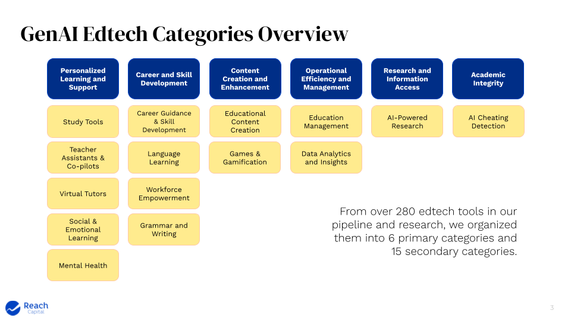
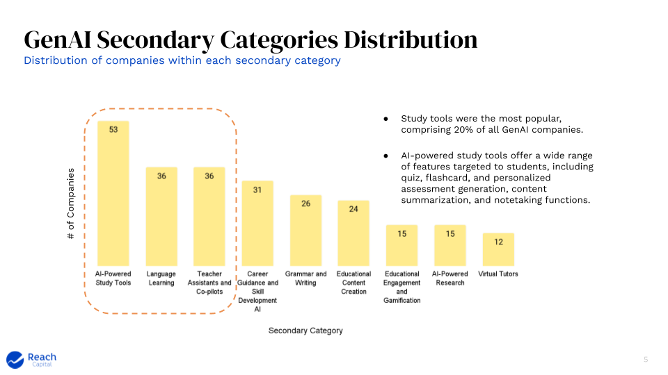
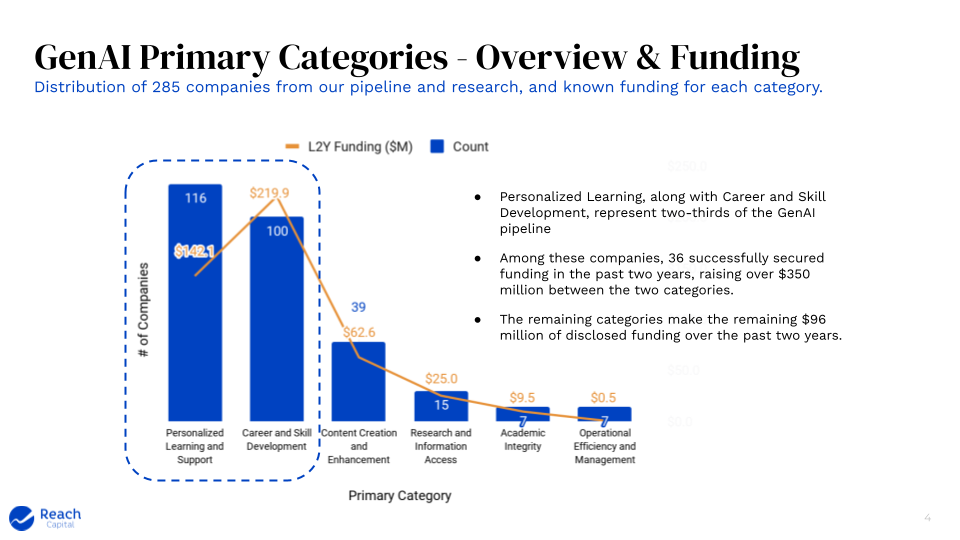
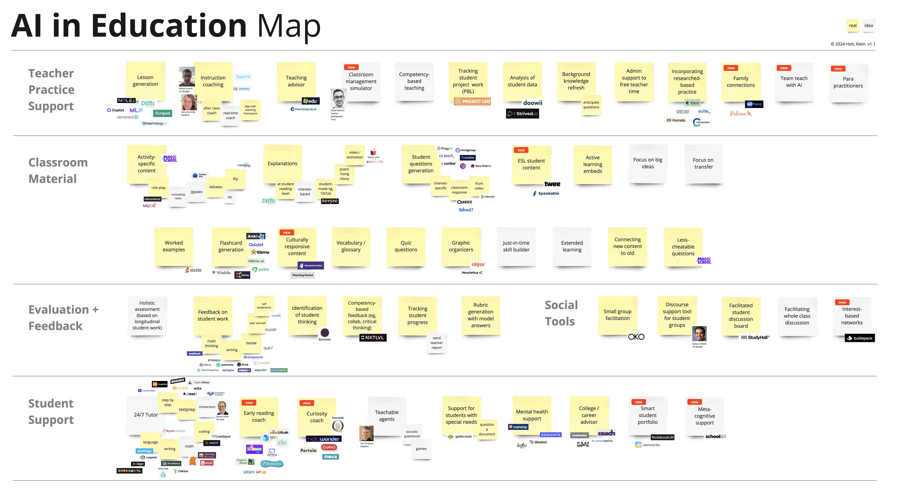
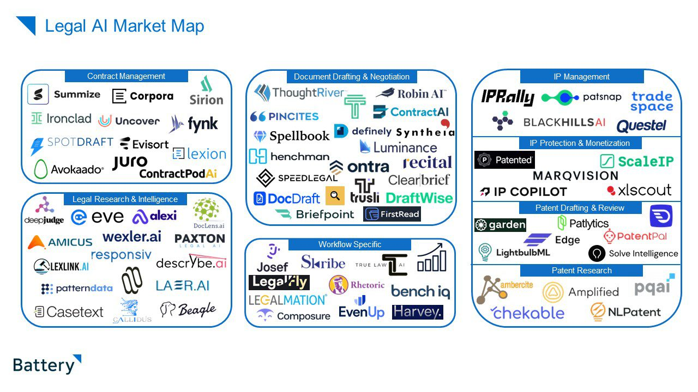

## Market Value

AI narrows the gap between ideas and execution. It lowers skill requirements and barriers to entry, and promises value creation that is faster, cheaper and better. This will impact labour and capital allocation in SMBs, large enterprises and technology vendors.

While value creation is accelerating, it remains unclear which layer of the stack will benefit the most from value capture.

However, there is an emerging set of beliefs in the market that AI infrastructure (foundation models, inference, observability, etc.) is very capital intensive, rapidly being commoditised as a low-margin utility, and converging to an oligopoly. Outside the hyperscalers and early adopters, it is also seen as the precursor to the real value waiting to be unlocked in mature applications over the next decade.

!!! tip "Hypothesis 1"

    The bulk of the Total Addressable Market for generative AI will reside in the **application layer**

## Market Segment

The current AI landscape can be split into B2C and B2B segments, each tackling different challenges.

| Segments        | B2C                                   | B2B                                                  |
| --------------- | ------------------------------------- | ---------------------------------------------------- |
| **Value**       | Personalised, multimodal interactions | Reduces time and costs through workflow automation   |
| **Metaphors**   | Products as dynamic conversations     | Digital assembly line: tireless and highly efficient |
| **Opportunity** | Instant, adaptive consumer interfaces | Domain specialised vertical solutions                |
| **Focus**       | User experience                       | Operational efficiency                               |

B2B2C applications straddle both segments. Established products in this category should follow the money, prioritising efficiency over experience because automation benefits usually compound faster and have a more direct impact on revenue and cost.

## Emerging Opportunities

### Workflow Patterns

The following workflow patterns and timescales are emerging as trends in the market, with extremely compressed iteration cycles becoming the norm:

| No. | Timescale | Trend                        | Description                                                                  |
| --- | --------- | ---------------------------- | ---------------------------------------------------------------------------- |
| 1   | Now       | Speeding up user journeys    | Enhances efficiency of operations                                            |
| 2   | Now       | Expanding user journey reach | End-to-end vertical solutions for niche domains                              |
| 3   | Next      | Deep multi-step workflows    | Transforms siloed, light tasks to comprehensive solutions                    |
| 4   | Next      | Proactive automation         | Anticipates and automates needs and new workflows                            |
| 5   | Next      | Voice-first interactions     | Improves accessibility and simplifies user interface                         |
| 6   | Later     | AI-native solutions          | Integrates seamless, multimodal experiences in consumer and business domains |
| 7   | Later     | Autonomy                     | Enables operations without human intervention                                |
| 8   | Later     | Personalised interfaces      | Adapts workflows to individual user preferences, improving user experience   |
| 9   | Later     | Agent economies              | Creates networks of interacting, automated agents                            |

!!! tip "Hypothesis 2"

    Vertical expansion with AI augmented, domain specific workflows is a scalable and durable competitive advantage for B2B and B2B2C

### Workflow Startups

The workflow startup sector is booming with AI-first players:

| Company                                     | Category            | Notes                                                                                | Interesting |
| ------------------------------------------- | ------------------- | ------------------------------------------------------------------------------------ | ----------- |
| [Artisan](https://artisan.co/)              | Workflow automation | Sales                                                                                |             |
| [Automaited](https://www.automaited.com/)   | Workflow automation | Workflow factory to build automations with no code visually                          | \*          |
| [Automat](https://www.runautomat.com/)      | Workflow automation | Similar idea of record a process and automate it                                     |             |
| [Keyflow](https://www.keyflow.space/)       | Workflow automation | Canvas builder                                                                       |             |
| [Innkeeper AI](https://www.innkeeper.ai/)   | Workflow automation | Hotel management automation. Domain specific                                         | \*\*        |
| [Questflow](https://www.questflow.ai/)      | Workflow automation | Something about blockchain and agent orchestration                                   |             |
| [Orby AI](https://www.orby.ai/platform)     | Workflow automation | Auto generates automations                                                           | \*          |
| [Respell](https://www.respell.ai/)          | Workflow automation | Canvas builder for automations with AI. Interesting but we can do better.            |             |
| [Tennr](https://www.tennr.com/)             | Workflow automation | Medical practice specific. Nice initial screens                                      | \*\*        |
| [Gumloop](https://www.gumloop.com/)         | Workflow automation | Components built out.                                                                |             |
| [Lutra](https://lutra.ai/)                  | Workflow automation | Seems weakly conceived with no strong vision                                         |             |
| [Warpdrive](https://www.warpdrive.co/)      | Workflow automation | Desktop focused, well implemented and interesting auto workflow creation             | \*\*        |
| [Luminai](https://www.luminai.com/)         | Workflow automation | Decent user interface                                                                | \*          |
| [Paradigm](https://www.tryparadigm.ai/)     | Workflow automation | Just a landing page                                                                  |             |
| [BrainBase](https://usebrainbase.xyz/)      | Workflow automation | Just a landing page                                                                  |             |
| [Tika.ai](https://tika.ai/)                 | Workflow automation | Just a landing page                                                                  |             |
| [Delpha](https://delpha.io/)                | Workflow automation | Interesting bit on deduplication                                                     |             |
| [Genius Voice](https://geniusvoice.ai/)     | Workflow automation | Boring chatbot                                                                       |             |
| [Timely](https://timelyapp.com/)            | Workflow automation | Time tracking and assignment is interesting                                          |             |
| [Spoke](https://www.spoke.ai/)              | Workflow automation | Just summarises slack only. A feature not a product.                                 |             |
| [Super](https://super.ai/)                  | Data Extraction     | Nice on page demo. Overall solid extraction capabilities                             | \*          |
| [Bardeen](https://www.bardeen.ai/)          | Workflow Automation | Magic box converting words into flows                                                | \*          |
| [Browse AI](https://www.bardeen.ai/)        | Data Extraction     | Webscraping and monitoring without code                                              |             |
| [Kadoa](https://www.kadoa.com/)             | Data Extraction     | Web scraping and monitoring                                                          |             |
| [Layup](https://layuplabs.ai/)              | Workflow Automation | Boring interface and demo                                                            |             |
| [Extend](https://www.extend.app/)           | Data Extraction     | Very basic                                                                           |             |
| [Myko](https://www.myko.ai/)                | Workflow Automation | Sales copilot                                                                        |             |
| [Weld](https://weld.app/)                   | Data Extraction     | SQL relevant AI data extraction                                                      |             |
| [Minds](https://minds.ai/)                  | Agent Assistants    | Semiconductor domain specific. But just a landing page with no explanation of how    |             |
| [Impel](https://impel.ai/)                  | Agent Assistants    | Automative vertical solution end=to-end around AI                                    | \*\*        |
| [Hyperwrite](https://www.hyperwriteai.com/) | Agent Assistants    | Writing specific tools. Quite nice and granular. Pricing is ctoo high.               | \*          |
| [Xembly](https://www.xembly.com/)           | Agent Assistants    | Good marketing. Average value assistants for meetings, tasks, calendar               |             |
| [Adept](https://www.adept.ai/)              | Agent Assistants    | Shitty landing page but huge funding round and technical blog hints so one to watch. |             |
| [Embra](https://embra.app/)                 | Agent Assistants    | Basic low level task automation. Just a landing page really.                         |             |
| [Lindy](https://www.lindy.ai/)              | Agent Assistants    | No code combo of ChatGPT and Zapier.                                                 |             |
| [Cognosys](https://www.cognosys.ai/)        | Agent Assistants    | Simplify workflows, Zapier-like                                                      |             |
| [Taxy](https://taxy.ai/)                    | Agent Assistants    | Browser Based task planning and execution                                            |             |
| [Parcha](https://www.parcha.com/)           | Agent Assistants    | Fintech compliance focused. Very interesting and granular use cases.                 | \*\*        |
| [Induced](https://www.induced.ai/)          | Agent Assistants    | Some interesting ideas but horrible website. Variables.                              | \*          |
| [Reworkd](https://reworkd.ai/)              | Agent Assistants    | Zapier with agents                                                                   |             |
| [Simular](https://www.simular.ai/)          | Agent Assistants    | Terrible website                                                                     |             |
| [Zeta labs](https://www.zetalabs.ai/)       | Agent Assistants    | Browser based agent. interesting marketing video. registered company autonomously    |             |
| [Autotab](https://www.autotab.com/)         | Agent Assistants    | Show a task and have it automated. Good marketing tiles for differetn sites          |             |
| [Multion](https://www.multion.ai/)          | Agent Assistants    | General purpose assistants                                                           |             |
| [Quivr](https://www.quivr.com/)             | Agent Assistants    | Chat powered second brain                                                            |             |
| [Jamix](https://www.jamix.ai/)              | Agent Assistants    | Chat, search, etc. with AI assistance                                                |             |
| [AICogni](https://aicogni.com/)             | Agent Assistants    | Voice first. Smartwatch App as well.                                                 |             |
| [AISideKik](https://www.aisidekik.com/)     | Agent Assistants    | Personalised AI Agent marketplace                                                    |             |
| [Poly](https://poly.ai/)                    | Agent Assistants    | Very impressive voice first agents                                                   | \*\*        |

## Education Management

Education management is a small category in today's edtech AI landscape, with learning and student experience innovation dominating market maps.

### Education Market Map 1

In a survey of 285 companies, only a negligible number fell in this area, with relatively minor investments to date.

[Source](https://www.reachcapital.com/2023/09/11/pipeline-perspectives-trends-from-280-generative-ai-edtech-tools/)

### Education Market Map 2

[Source](https://medium.com/@LaurenceHolt/a-map-of-generative-ai-for-education-6598e85a172e)

### Legal Market Map

While the focus on automation has been limited - and therein lies the opportunity - looking at related and slightly more mature domains such as AI in legal tech demonstrate that all kinds of automation and workflow improvements dominate the sector :

[Source](https://www.battery.com/blog/the-new-code-of-law/)

The maturity of AI in legaltech space is clear especially when considering that even established players like [LexisNexis](https://www.lexisnexis.com/en-us/products/lexis-plus-ai.page) have advanced automation features in production already. IT Compliance is also an area of advanced, domain specific AI automation in which alot of opportunity is emerging: [6clicks](https://www.6clicks.com/)

### Edtech Opportunity

!!! tip "Hypothesis 3"

    The opportunity for automation related AI value creation and capture in edtech far outstrips its current footprint, with legal tech and IT compliance as reference models

## Competitors

- **[IN PROGRESS]**
  - smaller, local players like Accelerate, Wisenet
  - Medium domain competitors like Tribal, Techone
  - Larger global encroachers like Salesforce
  - international startups in the space?

## Workflow Engines

Building and maintaining workflow engines from scratch requires substantial time and labour costs, measured in years not months. This is a deal-breaker in any competitive market, compounded in the generative AI space where iteration speed is orders of magnitude faster than traditional software engineering.

### Workflow Automation Vendor Evaluation Criteria

Buying workflow automation tools, should start with the following set of evaluation criteria :

| No. | Criteria          | Definition                                                 |
| --- | ----------------- | ---------------------------------------------------------- |
| 1   | **Velocity**      | Quick to set up, fast to iterate                           |
| 2   | **Flexibility**   | Handles current (if-then) and future (AI) automation needs |
| 3   | **Customisation** | Offers deep customisation and control for developers       |
| 4   | **Ownership**     | Retains intellectual property within the company           |
| 5   | **Reliability**   | Proven enterprise deployments and extensive support        |
| 6   | **Cost**          | Affordable in setup and maintenance                        |

### Types of Workflow Vendors

| No. | Category                              | Description                                                                     |
| --- | ------------------------------------- | ------------------------------------------------------------------------------- |
| 1   | **Orchestration**                     | Manages complex workflows and automates tasks across systems                    |
| 2   | **ETL Specialised**                   | Focuses on Extract, Transform, Load processes for data integration              |
| 3   | **No Code Automation**                | Allows automation without the need for coding, suitable for non-technical users |
| 4   | **AI-Native**                         | Built with AI capabilities at the core to enhance automation                    |
| 5   | **Business Process Management (BPM)** | ERP designed to improve corporate performance by managing business processes    |

### Vendor Evaluation

**[EVALUATION IS IN PROGRESS]**

| Category                              | Vendor                       | Velocity | Flexibility | Customization | Ownership | Reliability | Cost |
| ------------------------------------- | ---------------------------- | -------- | ----------- | ------------- | --------- | ----------- | ---- |
| **Orchestration**                     | **Apache Airflow**           |          |             |               |           |             |      |
|                                       | **Dagster**                  |          |             |               |           |             |      |
|                                       | **Prefect**                  |          |             |               |           |             |      |
|                                       | **Kestra**                   |          |             |               |           |             |      |
| **ETL Specialised**                   | **AWS Glue**                 |          |             |               |           |             |      |
|                                       | **Azure Data Factory**       |          |             |               |           |             |      |
| **No Code Automation**                | **Microsoft Power Automate** |          |             |               |           |             |      |
|                                       | **Zapier**                   |          |             |               |           |             |      |
| **AI-Native**                         | **UiPath**                   |          |             |               |           |             |      |
|                                       | **Relevance AI**             |          |             |               |           |             |      |
| **Business Process Management (BPM)** | **Appian**                   |          |             |               |           |             |      |
|                                       | **Pega**                     |          |             |               |           |             |      |

!!! tip "Recommendation"

    Adopt an orchestration framework as the foundation for automation and workflows

## Sources

1. [Consumer abundance agenda](https://gamma.app/docs/a16z-Consumer-Abundance-Agenda-ieotbnzbxj81biu?mode=doc)
2. [Agent AI Infrastructure](https://www.madrona.com/the-rise-of-ai-agent-infrastructure/)
3. [Market Map of productivity tools](https://x.com/omooretweets/status/1760000618557735289)
4. [B2B AI Apps Part 1](https://a16z.com/for-b2b-generative-ai-apps-is-less-more/)
5. [AI Voice Agents](https://gamma.app/embed/a16z-Real-Time-Conversational-Voice-AI--m3v486p98gt7jol?mode=doc)
6. [Prosumer Workflows](https://a16z.com/the-future-of-prosumer-the-rise-of-ai-native-workflows/)
7. [Top 100 Consumer Gen AI Apps](https://a16z.com/100-gen-ai-apps/)
8. [Future of Edtech](https://a16z.com/the-future-of-learning-education-knowledge-in-the-age-of-ai/)
9. [A map of generative AI for education](https://medium.com/@LaurenceHolt/a-map-of-generative-ai-for-education-6598e85a172e)
10. [AI Marketing Automation](https://a16z.com/ai-marketer-how-gen-ai-based-software-is-advancing-marketing-and-sales/)
11. [AI Productivity for SMBs](https://www.instagram.com/a16z/p/C4LvPb_vN8r/?img_index=2)
12. [AI Legal Map](https://www.battery.com/blog/the-new-code-of-law/)
13. [Creative Content](https://www.linkedin.com/posts/a16z_ai-content-generation-editing-activity-7164000853127802880-jdck?utm_source=share&utm_medium=member_desktop)
14. [AI Agent Design Pattern Catalogue](https://arxiv.org/abs/2405.10467)
15. [AI Education Map](https://www.linkedin.com/posts/ann-education_andreessen-horowitz-has-developed-a-market-activity-7165339048004239360-puCR?utm_source=share&utm_medium=member_desktop)
16. [AI Companionship](https://x.com/venturetwins/status/1760702016089993345)
17. [B2B AI Apps Part 2](https://a16z.com/owning-the-workflow-in-b2b-ai-apps/)
